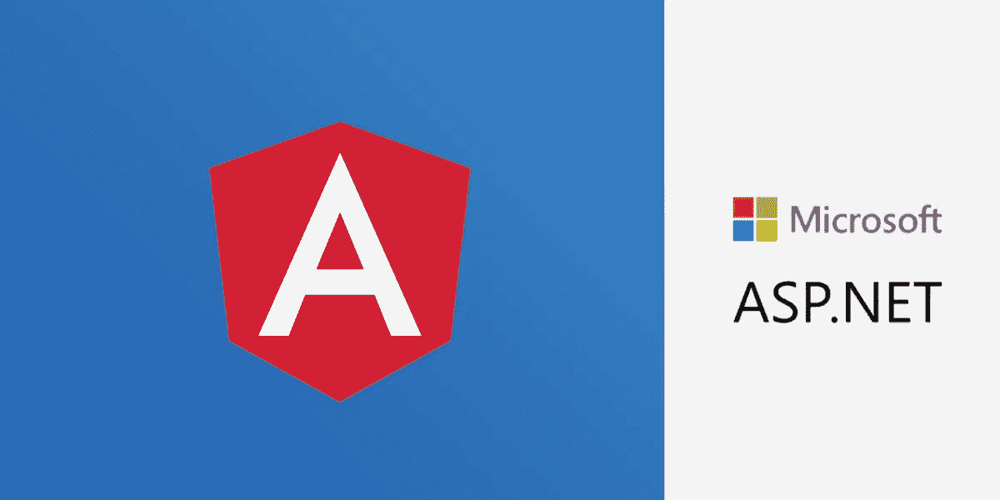
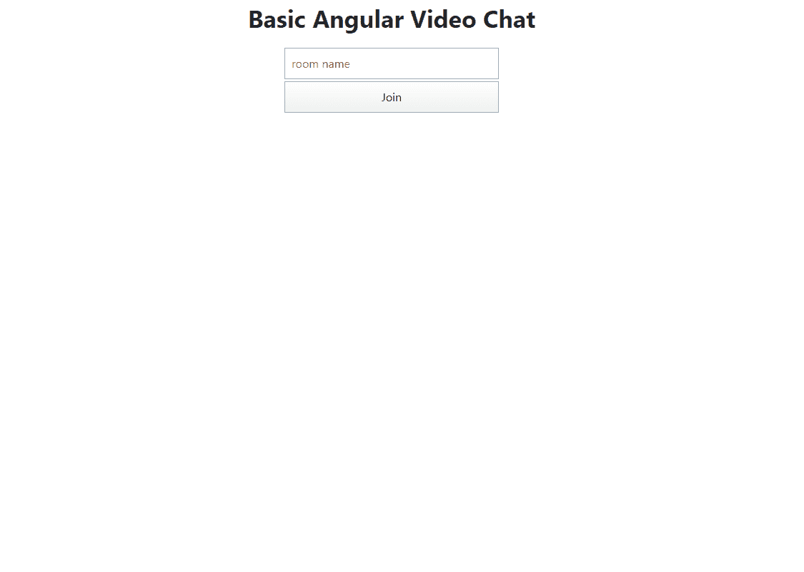
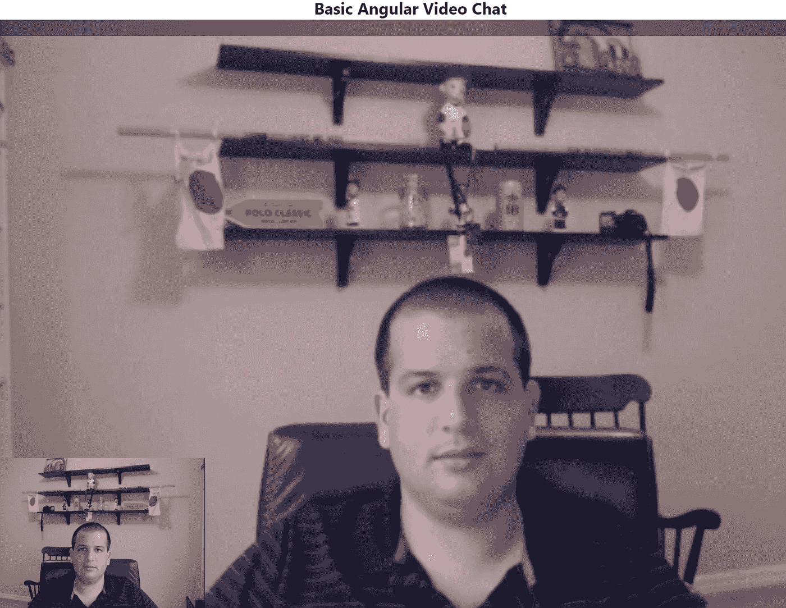

# 用 ASP.NET 和 Angular 创建一个基本的视频聊天应用程序

> 原文：<https://levelup.gitconnected.com/create-a-basic-video-chat-app-with-asp-net-and-angular-c18a31cad0b8>

Angular 是迄今为止最流行的单页应用程序(SPA)框架。NET 开发人员。在这个项目之前，我还没有用过 Angular，因为*在*之前，它从名字中去掉了 JS。因此，我很高兴再次尝试我的帽子，这一次用它来展示 Vonage 的视频 API。你可以跟随本教程，在这里我们将使用 [Angular](https://angular.io/) 创建一个基本的视频聊天应用程序(尽管它在我的❤).中总是有 JS

# 先决条件

*   Visual Studio(我用的是 2019，虽然旧版本应该可以用)
*   。NET Core 3.1 [开发者套件](https://dotnet.microsoft.com/download/dotnet-core/3.1)
*   一个 [Vonage 视频 API 账户](https://tokbox.com/account/user/signup)
*   一个 Vonage 视频 API 项目，可以从您的帐户页面创建

# 直奔主题

如果您只是想下载这个演练的代码，请访问这篇博客文章的 [GitHub](https://github.com/opentok-community/basic-video-chat-angular) 页面，按照说明操作，您就万事俱备了。

# 重要的事情先来

我们先打开 Visual Studio。点击*新建项目*->-*ASP.NET 核心 Web 应用* - >给它起个名字(我是叫矿`BasicVideoChatAngular`)->-*创建* - > *棱角*。

这样做将为您构建一个 shell ASP.NET 应用程序，所有客户端代码都在`ClientApp`文件夹下。

# 导入 Nuget 包

为此项目导入以下 NuGet 包:

*   Vonage 视频 API
*   微软。EntityFrameworkCore.SqlServer(我用的是 3.1.3)

# 创建实体模型

我们将在这里使用一些非常基本的实体框架。向项目添加一个`Model.cs`文件。删除类声明，并向其中添加以下代码:

您还需要将以下内容添加到您的使用部分:

# 创建数据库

添加后，让我们创建数据库。导航到您的项目文件夹并执行以下操作:

这将创建一个保存您的房间和会话 id 的数据库文件。

# 创建会话控制器

右键`Controllers`文件夹- > *添加*->-*控制器* - *MVC 控制器* - *清空* - >将其命名为`SessionController`。

在`SessionController`中，依赖注入一个 IConfiguration 对象，并创建一个基本的 form 类来保存我们的房间名`RoomForm`:

在这之后，添加一个名为`GetSession`的 HttpPost 请求，它将一个`RoomForm`作为参数:

该方法检查数据库，查看 roomName 是否已经有了 sessionId。如果是，它会为该 sessionId 生成一个令牌。如果没有，它将创建一个新的会话和令牌。然后，它在数据库中为该房间创建一个新行。在这两种情况下，它都将 sessionId、token 和 ApiKey 作为 JSON 返回。

# 构建客户端

后端已经完成，让我们开始构建客户端。我们将有两个主要视图-我们的**加入**视图，用户将在其中输入他们想要加入的房间名称:

以及将包含视频呼叫的**视频**视图:

# 安装 npm 依赖项

首先，在您的终端中导航到`ClientApp`目录并运行:

# 清理演示视图

当您在 Visual Studio 中创建一个 Angular 项目时，在`ClientApp\src\app,`下会自动填充一些演示组件，包括`counter`、`fetch-data`、`home`和`nav-menu`。我们不需要这些，所以让我们从一开始就把它们全部删除。

# 添加需要的文件

创建以下文件夹/文件:

*   在`ClientApp\src`下添加`config.ts`
*   在`ClientApp\src\app`下添加`stateService.ts`
*   在`ClientApp\src\app`下创建目录:`join`、`subscriber`、`video`
*   在`ClientApp\src\join`下创建`join.component.css`、`join.component.html`、`join.component.ts`
*   在`ClientApp\src\subscriber`下创建`subscriber.component.html`、`subscriber.component.ts`、`subscriber.component.css`
*   在`ClientApp\src\video`下创建`video.component.css`、`video.component.html`、`video.component.ts`

# 构建配置

在`ClientApp\src\config.ts,`中，我们将设置我们的配置，它包含一个字段`SAMPLE_SERVER_BASE_URL`。将此设置为您最终用于 IIS 的基本 URL 该文件应该类似于:

如果你使用 IIS Express 来调试，通过右击你的项目文件找到`base_url`->*属性*->-*调试*，在底部你会看到 IIS 的 URL。

单击 Join 按钮后，我们将在组件之间进行转换。我们需要在加入组件和视频组件之间携带令牌、sessionId 和 ApiKey，以便视频组件可以加入呼叫。为了解决这个问题，我们将使用状态服务来共享这个状态——当我们在它们之间转换时，我们将把状态服务注入到下一个组件中。我们只需要一种注射液，通过一些可观察的场来实现:

***注意:*** *在这个阶段，您可能会得到一个 IntelliSense 错误“对 decorators 的实验性支持是一个在未来版本中可能会发生变化的特性。请设置“实验记录器”选项来删除此警告。要解决这个问题，您需要将* `*ClientApp\tsconfig.json*` *文件的构建操作设置为 Content，并且您可能需要重新启动 Visual Studio。*

# 构建订户组件

订户组件将是负责保存传入视频流的组件。要构建这个，从`subscriber.component.html`中删除所有预先添加的 HTML，并添加以下代码行:

它将只保存一个 div，该 div 将作为传入流的目标。

现在在`subscriber.component.css`中，添加几个样式:

这个 CSS 将使组件占据整个屏幕，并将它推到 z 索引的底部，这将防止它超过发布者的视频，发布者的视频将在底部显示为一个 PIP。

在`subscriber.component.ts file`中，我们将创建一个带有会话和流输入的组件。它还需要来自 HTML 模板的对`SubscriberDiv`的元素引用，以及我们将从视频组件获得的会话和流。最后，当`onStreamCreate`事件触发时，它需要一个 subscribe 方法来订阅会话流。将以下代码添加到文件中:

# 构建视频组件

让我们从`video.component.html`文件开始。首先删除添加到该文件的任何自动生成的 html。然后添加模板:

`publishingDiv`将是 DOM 中的锚，我们将使用它作为我们发布者的视频源。当用户加入呼叫时，`subscriberHost`模板将是添加用户的地方。在 CSS 文件中，让我们删除任何自动生成的 CSS。添加样式，将`publishingDiv`设置到屏幕左下角的固定位置，占据窗口高度和宽度的 25%，并位于 z-index 为 1 的位置(就在我们放置`subscriberDiv`的上方)。将以下内容添加到`video.component.css`文件中:

[https://gist.github.com/a077b84fe5d4b6b07589731a94f87575](https://gist.github.com/a077b84fe5d4b6b07589731a94f87575)

最后，我们需要设置组件本身。还记得之前的`StateService`吗？我们将会注射它。由此，我们将从之前创建的 SessionController 中获得 sessionId、token 和 ApiKey。

## 导入和修饰组件

首先，导入我们将需要的所有东西并构建`VideoComponent`类。

## 组件字段和构造函数

接下来，为`VideoComponent`类和构造函数设置一些字段。在构造函数中，我们注入了一个`ComponentFactoryResolver`，稍后我们将使用它来获取 subscriberHost 的本地引用，还注入了`StateService`，这是我们将获取 apiKey、token 和 sessionId 的地方。路由器将帮助我们在项目中的组件之间路由；具体来说，如果状态服务不包含 apiKey、token 或 sessionId，您将需要它导航回连接控制器。

在`VideoComponent`类中添加以下内容:

## 关于初始化逻辑

接下来，我们将设置`ngOnInit`功能。在 init 时立即注入了`StateService`,所以这就是我们要获取 apiKey、token 和 sessionId 的地方。这个函数将存储这些项目。如果其中任何一个不存在，我们将重新路由到加入页面。

## 发布用户的流

接下来，我们将设置发布方法。我们将在视图完成初始化后调用它。这个函数将调用会话的 publish 方法，传入 publisher 元素。当回调解决时，它会将发布字段转换为`true`。在`ngOnInit`后增加以下内容:

## 处理流的创建

在创建流时，我们需要订阅它。我们将通过获取对我们在 HTML 中创建的订阅者模板的引用，为它初始化订阅者组件，为它分配流和会话 Id，并告诉它订阅。在发布方法后添加以下内容:

## 设置发布者

视图初始化后，`ngAfterViewInit`触发。在控制器生命周期的这个阶段，我们已经具备了进行视频通话所需的一切。我们将初始化发布者，初始化会话，连接到会话，在连接到会话后的回调中，我们将告诉我们的流发布。我们还将订阅`streamCreated`事件，该事件将调用我们之前制作的`onStreamCreated`函数。增加以下`ngAfterViewInit`功能:

# 构建连接组件

构建了视频组件后，我们只需要设置 join 组件和 app 模块。

## 设置 Html

在`join.component.html`文件中，我们将创建一个`joinForm`，它只有一个输入，一个`roomName`，我们将使用它来获取/生成 sessionId 和令牌。该组件的模板将如下所示:

## 添加一些样式

我们不打算在这里做任何过于花哨的样式——我们只是要确保按钮和输入居中并且大小相同。将以下内容添加到`join.component.css`:

## 构建组件

join 组件将有一个用于 join 表单的提交函数，它将从我们的后端获取会话数据，并通过状态服务将会话数据路由到 video 组件。为此，它将通过依赖注入引入`HttpClient`、`FormBuilder`、`StateService`和`Router`服务，然后构建房间表单。接下来，它将等待来自`joinRoomForm`的`onSubmit`，此时它会将`roomName`发送到会话控制器，并使用该响应来构建视频组件。

# 设置应用程序

在我们的 Angular 工作之前，我们必须设置整个应用程序模块。我们将从设置基本 HTML 开始。在`ClientApp\src\app\app.component.html`中，我在`router-outlet`上方添加了一个标题，这保证了标题会显示在我们的子页面上。还要确保您删除了`<app-nav-menu></app-nav-menu>`，因为它已经存在于最初构建的模板中:

接下来，在`ClientApp\src\app\app.module.ts`中，我们需要定义我们的模块，这意味着添加我们创建的新组件，删除我们在最开始删除的组件，并建立我们将要使用的路线。添加组件作为导入，然后在声明字段中确保您的导入部分中有`HttpClientModule,` `FormsModule,` `ReactiveFormsModule,`和`RouterModule`。`SubscriberComponent`将是一个入门组件。路线如下:`''`->-`JoinComponent`，`video`->-`VideoComponent`，`subscriber`->-`SubscriberComponent`。

# 配置您的应用。

您必须在两个地方设置配置，`config.ts`和`appsettings.json`。你应该早点设置`config.ts`，所以我不会再重复了。对于`appsettings.ts`，只需添加`apiKey`和`apiSecret`作为字段，并使用您的 Vonage 视频 API 帐户中的 ApiKey 和 ApiSecret 进行填充。该文件将类似于以下内容:

有了它，你就可以万事俱备了！当我第一次构建演示应用时，我确实遇到了一些角度版本控制的问题——请随意从 [GitHub](https://github.com/opentok-community/basic-video-chat-angular/blob/master/BasicVideoChatAngular/ClientApp/package.json) 中借用我的`package.json`文件。

# 测试

你所需要做的就是在 IIS Express 中启动它——点击调试按钮或者在 Visual Studio 中按 f5 键。这样做将启动加入页面。输入房间名称，您将加入与该房间相关联的新会话。您可以让另一个端点导航到同一个端点并加入同一个房间，他们将与您一起加入房间。

# 包扎

现在您已经有了 Angular 中视频聊天应用程序的基本外壳，您可以探索用 Vonage 视频 API 做更多的事情。您可以录制会话、共享媒体、流式视频通话，等等！

# 资源

*   点击查看我们的 Vonage 视频 Api [文档](https://tokbox.com/developer/)
*   这篇博文的代码在 [GitHub](https://github.com/opentok-community/basic-video-chat-angular) 上

*最初发布于*[*https://www . NEX mo . com/blog/2020/05/08/create-a-basic-video-chat-app-with-ASP-net-and-angular-dr*](https://www.nexmo.com/blog/2020/05/08/create-a-basic-video-chat-app-with-asp-net-and-angular-dr)