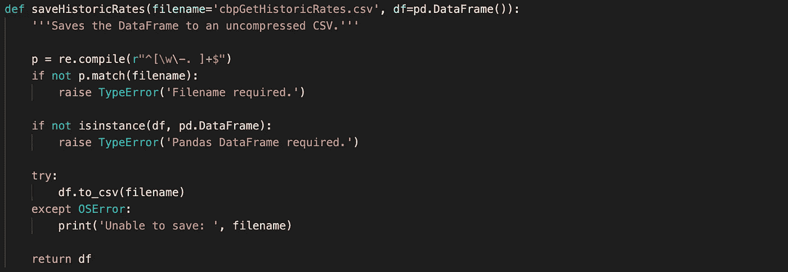

# 用 Python 熊猫创建比特币交易数据框架

> 原文：<https://levelup.gitconnected.com/create-a-bitcoin-trading-dataframe-with-python-pandas-d090f4758289>

## 使用数据科学 Python 库 Pandas 进行交易


我正在用 Python 开发一个自动加密交易机器人。我以前在 Node.js 中写过一个非常成功的例子，但是有了极其强大的 Python Pandas 数据科学库，它就变得简单多了。

我计划在一系列文章中记录这个过程并分享代码，所以如果你感兴趣，请关注我的更新。

我会用截图说明这些功能，但我也会包括该项目的 Git 库。我不会再讨论 Python 的安装，但是如果你感兴趣，请参考我以前的文章。

第一步是导入所需的库。


该函数将从比特币基地专业应用编程接口检索市场数据，并创建一个熊猫数据框架。

*   **市场**:比特币基地专业市场(默认为‘BTC-英镑’)
*   **粒度:**(采样间隔):60 = 1 分钟，300 = 5 分钟，900，15 分钟，3600 = 1 小时，21600 = 6 小时，86400 = 1 天(默认为 1 天)
*   **iso8601start** :可选的 ISO8601 开始日期格式，以字符串形式提供(不提供此格式，比特币基地 Pro 将提供最近 300 个样本，粒度为 86400，这是最近 300 天)
*   **iso8601start** :可选的 ISO8601 结束日期格式，以字符串形式提供(如果不提供，将默认为最后一个样本)


该函数将把累积移动平均线(CMA)、指数移动平均线(EMA12 和 EMA26)和简单移动平均线(SMA20、SMA50 和 SMA200)附加到 Pandas 数据帧。请注意 Python 熊猫如何在一行中完成这些计算！

还要注意，这将适用于任何带有“close”列的 Pandas 数据帧。如果您想对任何交易数据框架使用此功能，您需要的只是“收盘”栏，最好是日期/时间的参考。


该函数将把相对强弱指数(RSI14)和移动平均收敛发散(MACD)动量技术指标附加到熊猫数据框架上。由于需要 EMA12 和 EMA26，该函数在计算 MACD 时会稍微复杂一些。我还创建了一个单独的函数来计算 RSI。


这是上面使用的 RSI 函数。

**系列**:熊猫系列收盘价
**区间**:可配置区间，一般为 14


该函数将熊猫数据帧存储到未压缩的 CSV 文件中。这可以用于任何熊猫数据帧。



您应该像这样运行函数。


输出如下所示…


CSV 看起来像这样(因为有大量数据，所以显示起来有点小)…


## ***更新***

我为这个项目[创建了一个 Git 库，你可以在这里找到它](https://github.com/whittlem/pycryptobot)。请注意，自从写了这篇文章，我已经把上面的代码改成了面向对象的。上面的代码现在将作为模型运行，例如:

```
from models.CoinbasePro import CoinbaseProcoinbasepro = CoinbasePro()
print (coinbasepro.getDataFrame())
coinbasepro.addMovingAverages()
print (coinbasepro.getDataFrame())
coinbasepro.addMomentumIndicators()
print (coinbasepro.getDataFrame())
coinbasepro.saveCSV()
```

如果你对我如何和为什么这样做感兴趣，请阅读我的后续文章。

[](https://whittle.medium.com/object-oriented-programming-oop-in-python-3-3e2d483ff759) [## Python 3 中的面向对象编程(OOP)

### 我正在用 Python 开发一个加密交易机器人。我想创建模拟来测试各种交易…

whittle.medium.com](https://whittle.medium.com/object-oriented-programming-oop-in-python-3-3e2d483ff759) 

我希望你觉得这篇文章有趣并且有用。如果您想随时了解情况，请不要忘记关注我，注册我的[电子邮件通知](https://whittle.medium.com/subscribe)。

# 迈克尔·惠特尔

*   ***如果你喜欢这个，请*** [***跟我上媒***](https://whittle.medium.com/)
*   ***更多有趣的文章，请*** [***关注我的刊物***](https://medium.com/trading-data-analysis)
*   ***有兴趣合作吗？*** [***让我们在 LinkedIn 上连线***](https://www.linkedin.com/in/miwhittle/)
*   ***支持我和其他媒体作者*** [***在此报名***](https://whittle.medium.com/membership)
*   ***请别忘了为文章鼓掌:)←谢谢！***