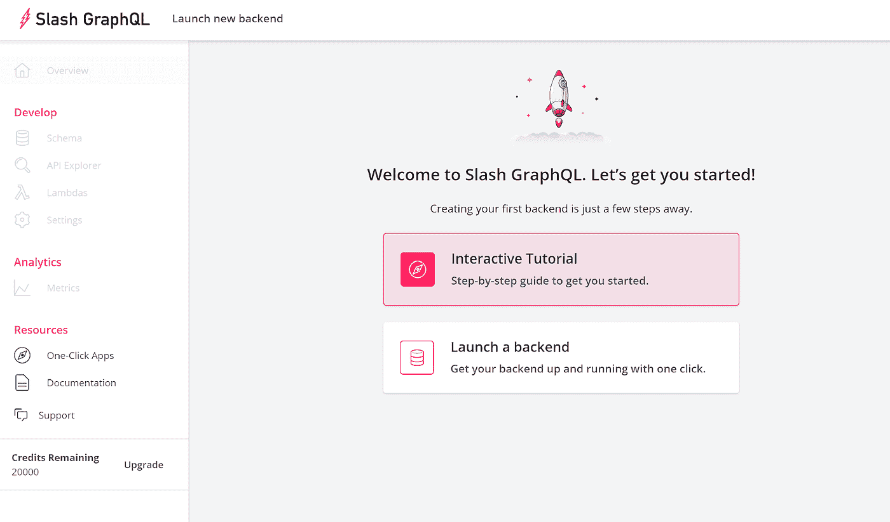
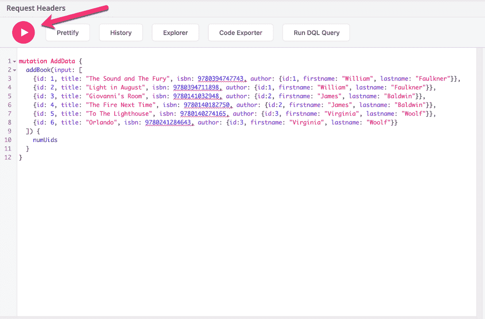
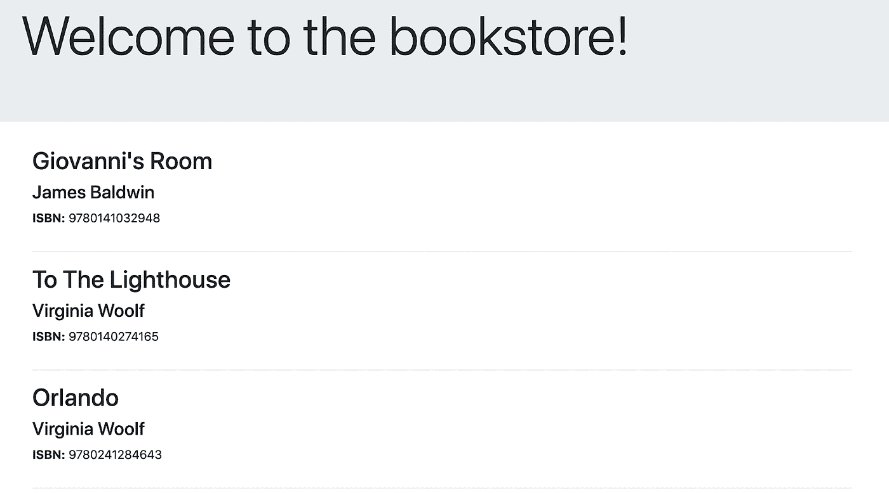
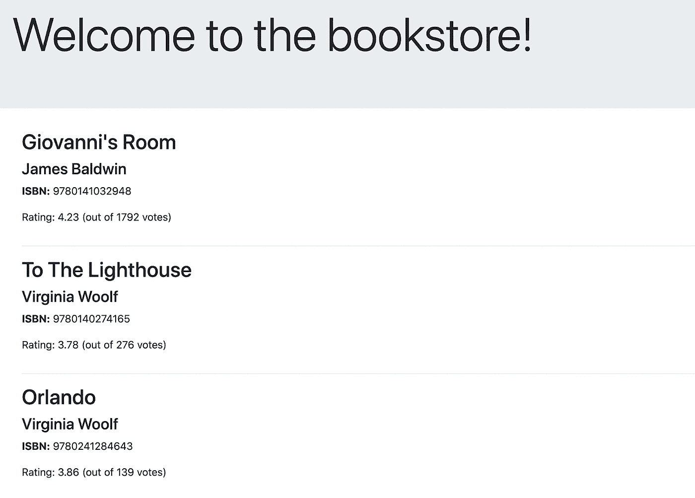

# 用 Goodreads API 和 Slash GraphQL 创建一个图书评级系统

> 原文：<https://levelup.gitconnected.com/create-a-book-rating-system-with-the-goodreads-api-and-slash-graphql-d885b3999673>

GraphQL 是一种相对较新的为消费者构建用户界面和 API 的方法。它本质上是一种由强类型模式支持的查询语言，这使得编写人类可读的请求以准确获得您需要的数据变得容易。REST 的响应由服务器决定，相比之下，GraphQL 查询将权力完全放在了客户端手中。

然而，GraphQL 实际上只是一个描述 API 的规范。人们可能期望从 API 中得到的许多特性，如授权/认证逻辑、双向通信或速率限制，仍然需要实现。最近推出的 [Slash GraphQL](https://dgraph.io/slash-graphql) 是一个完全托管的 GraphQL 后端，它负责设置 GraphQL API 的所有艰苦工作，让您专注于构建您的应用程序。

在本文中，我们将构建一个依赖于 Slash GraphQL 的电子商务书店。为了展示服务的灵活性，我们还将从另一个来源获取数据—[Goodreads API](https://www.goodreads.com/api)—并将其集成到我们的响应中。

我们将使用 [Node.js](https://nodejs.org/en/) 构建我们的应用程序，因此您的机器上应该至少安装了版本 12。创建一个名为 *slashql_bookstore* 的目录，并从命令行导航到该目录。

# 创建 GraphQL 后端

## 设置斜线图形 QL

[在 Slash GraphQL](https://slash.dgraph.io/) 上设置一个帐户很简单——你可以立即用你的 GitHub 帐户登录。该平台提供了一个适用于本文的免费试用版(然后移动到 9.99 美元/月的固定费用，最高 5GB 的数据)。



创建帐户后，您需要创建一个新的后端:

1.点击“启动新的后端”。

2.将后端命名为“书店”。

3.点击“启动”。

就是这样！现在，您在 AWS 区域中拥有了一台服务器。

## 定义 GraphQL 模式

每个 GraphQL 服务器都有一个强类型模式，它定义了消费者可用的对象和字段。

点击“Schema ”,粘贴以下几行:

```
type Book {
  id: Int!
  isbn: Int!
  title: String! @search(by: [fulltext])
  author: Author!
}type Author {
  id: Int!
  firstname: String!
  lastname: String!
}
```

这里我们定义了两种类型——“book”和“author”——它们将在我们的 API 中表示数据。在 Slash GraphQL 提供的众多优点中，对定制指令的支持是最方便的。例如，在这里，通过用 [@search](https://dgraph.io/docs/graphql/directives/#search) 注释“title”字段，我们能够提供一个模糊的文本，而不需要额外的工作。

单击“部署”将此架构发送到生产环境。

## 设置数据

让我们继续插入数据。我们不仅可以使用 API Explorer 添加数据，还可以查询数据。为了填充我们的 GraphQL 后端，我们将基于我们的模式，通过 Slash GraphQL 方便地为我们提供的一个变体来定义一个图书及其作者的列表:

```
mutation AddData {
  addBook(input: [
    {id: 1, title: “The Sound and The Fury”, isbn: 9780394747743, author: {id:1, firstname: “William”, lastname: “Faulkner”}},
    {id: 2, title: “Light in August”, isbn: 9780394711898, author:{id:1, firstname: “William”, lastname: “Faulkner”}},
    {id: 3, title: “Giovanni’s Room”, isbn: 9780141032948, author:{id:2, firstname: “James”, lastname: “Baldwin”}},
    {id: 4, title: “The Fire Next Time”, isbn: 9780140182750, author: {id:2, firstname: “James”, lastname: “Baldwin”}},
    {id: 5, title: “To The Lighthouse”, isbn: 9780140274165, author: {id:3, firstname: “Virginia”, lastname: “Woolf”}},
    {id: 6, title: “Orlando”, isbn: 9780241284643, author: {id:3, firstname: “Virginia”, lastname: “Woolf”}}
    ]) {
  numUids
  }
}
```

单击巨大的播放按钮，将这些数据添加到后端。



现在，让我们运行一个查询来验证该数据是否存在:

```
query GetBooks {
  queryBook {
    title
    isbn
    author {
      firstname
      lastname
    }
  }
}
```

您应该会看到一个响应，显示您之前插入的所有数据。

# 构建服务器

我们现在将使用 [Express](https://expressjs.com/) 来设置一个基本的 API 服务器，它将为用户提供对这个斜杠 GraphQL 源代码的访问。我们的 Express 服务器就像一个接口，将请求传递给 Slash GraphQL。它最重要的几行是:

```
const BACKEND_URL = “https://rampant-arm.us-west-2.aws.cloud.dgraph.io/graphql"
async function fetchGraphQL(operationsDoc, variables) {
  const result = await axios({
    method: ‘POST’,
    url: BACKEND_URL,
    headers: {
      ‘Content-Type’: ‘application/json’,
    },
    data: JSON.stringify({
      query: operationsDoc,
      variables,
    }),
  }) return result.data
}const query = `
query {
  queryBook {
    title
    isbn
    author {
      firstname
      lastname
    }
  }
}
`
app.get(‘/’, jsonParser, async (req, res) => {
  let gqlResponseData = await fetchGraphQL(query, {})
  res.render(‘index’, { books: gqlResponseData.data.queryBook })
})
```

在这里，我们定义了一个助手函数 fetchGraphQL，它设置必要的头和数据发送到 Slash GraphQL。请记住，您需要更改 BACKEND_URL 来匹配 Slash GraphQL 提供给您的 URL。然后，我们编写一个 GraphQL 查询来定义我们想要的数据。最后，我们设置了一个获取数据的路径，然后在我们的视图中呈现它:

```
<div class=”container”>
  {{#each books}}
  <div class=”row”>
    <div class=”col-md-4">
      <h2>{{title}}</h2>
      <h4>{{author.firstname}} {{author.lastname}}</h4>
      <p><strong>ISBN:</strong> {{isbn}}</p>
    </div>
  </div>
  <hr>
  {{/each}}
</div>
```

我们的视图由[手柄](https://github.com/express-handlebars/express-handlebars)支持，这是一个流行的模板库。我们可以将 JSON 数据放入一个 HTML 片段中，并遍历键和值，这使得显示信息变得更加容易。这里我们使用#each 循环遍历 GraphQL API 返回的每本书，然后将数据插入 HTML 标记。您会注意到我们有匹配 JSON 键名称的占位符；当查看页面时，这些数据将被实际数据替换。

在 npm 安装完所有依赖项之后，使用 node server.js 运行服务器。



您应该得到与 Slash GraphQL 的 API Explorer 完全相同的响应。

# 扩展服务器

最后一步，我们想公开一些关于这些书的评论数据。但是我们不想在这里创建虚拟数据；相反，我们将使用[Goodreads API](https://www.goodreads.com/api)。在继续之前，请确保您在那里设置了一个帐户并获得了一个 API 密钥。

Slash GraphQL 擅长的许多事情之一是将不同的数据源缝合到一个 GraphQL 接口中的能力。也许您想要调用您控制下的其他 API 端点。为了支持这一点，Slash GraphQL 提供了 [@custom](https://dgraph.io/docs/graphql/custom/directive) 指令，允许您为 GraphQL 字段和解析器实现定制行为。

首先，让我们将评级信息添加到现有模式中:

```
type Rating @remote {
  ratings_count: Int!
  average_rating: Float!
}
```

我们的评级类型定义了我们期望从 book.show_by_isbn API 获得的字段名称。我们不需要定义他们的 REST API 提供的每一个字段，只需要定义我们感兴趣的字段。Slash GraphQL 将知道如何将响应转换成 GraphQL 响应。

在字段方面，我们需要指定我们想要调用的 URL，以及 HTTP 方法:

```
type Book {
  # …
  rating: Rating @custom(http: {
  url: “https://goodreads-api-munger.glitch.me?isbn=$isbn",
  method: GET
  })
  # …
}
```

你会注意到这里我们实际上是在召唤[一个小故障项目](https://glitch.com/~goodreads-api-munger)。Goodreads API 没有以一种漂亮、简洁的格式返回 JSON 数据。我们将调用一个中间服务器，它将把数据转换成更清晰的格式。这个服务器的细节并不重要(但是如果你想的话，你可以检查一下)。*重要的是*注意到这个 URL 可以代表任何东西，如果你正在与你拥有的数据进行交互，这会非常有帮助。

另一件令人惊奇的事情是，Slash GraphQL 将为您替换数据。看到网址上写着$isbn 的那部分了吗？根据查询返回的对象，斜杠 GraphQL 将替换该变量的实字段值。这使您的 URL 请求灵活且易于管理。

这就是我们引入一些自定义数据所需要做的全部工作。我们的 GraphQL 查询现在可以简单地添加这个 rating 字段来引入外部数据。让我们用这个查询替换 server.js 中的查询:

```
const query = `
query {
  queryBook {
    title
    isbn
    rating {
      ratings_count
      average_rating
    }
    author {
      firstname
      lastname
    }
  }
}
`
```

让我们更新视图以显示这些信息:

```
<div class=”container”>
  {{#each books}}
    <div class=”row”>
      <div class=”col-md-4">
      <h2>{{title}}</h2>
      <h4>{{author.firstname}} {{author.lastname}}</h4>
      <p><strong>ISBN:</strong> {{isbn}}</p>
      <p>Rating: {{rating.average_rating}} (out of {{rating.ratings_count}} votes)</p>
    </div>
  </div>
  <hr>
  {{/each}}
</div>
```

如果您重新启动服务器并返回到 localhost:3000，您现在应该也看到填充的评级:



# 结论

Slash GraphQL 使得建立一个生产级的 GraphQL API 变得非常容易，但是我们仅仅触及了表面。除了能够组合不同的数据位置，它还支持[授权](https://dgraph.io/docs/graphql/authorization/authorization-overview/)、[订阅](https://dgraph.io/docs/graphql/subscriptions/)，甚至[加密](https://dgraph.io/docs/enterprise-features/encryption-at-rest/)。

你可以在 GitHub 获得本教程[的完整源代码。如果你还没有，一定要注册](https://github.com/gjtorikian/slashql_bookstore)[Slash graph QL](https://dgraph.io/slash-graphql)——随时与 [Dgraph 社区的其他人分享你的创作。](https://discuss.dgraph.io/)