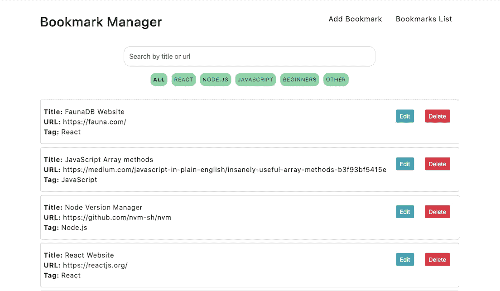
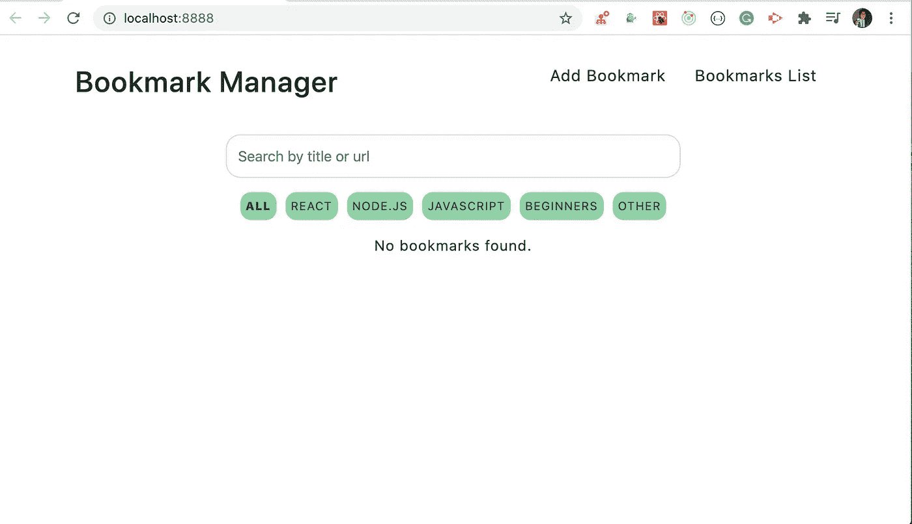
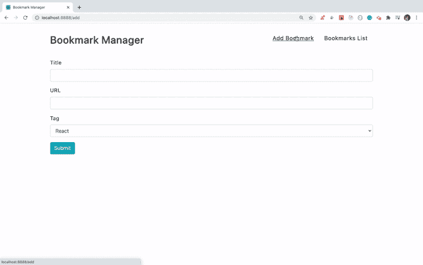
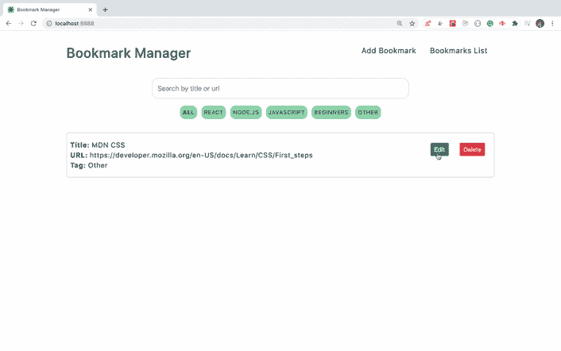
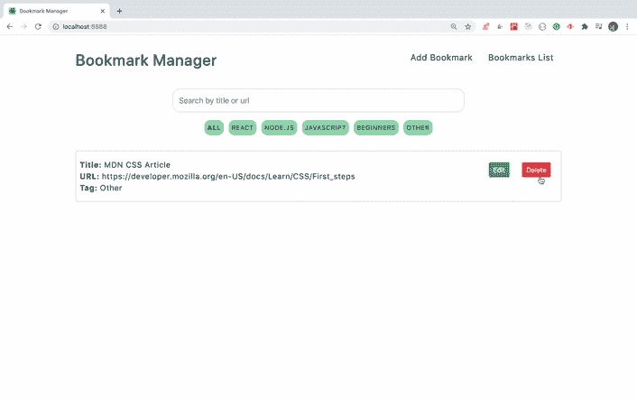
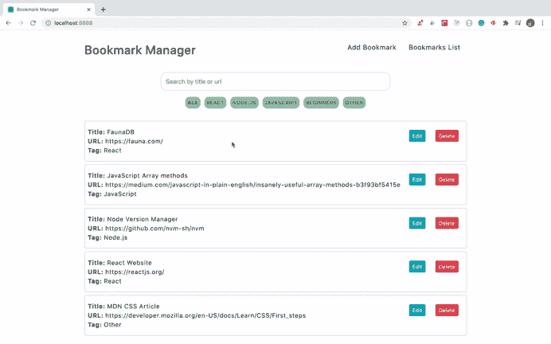
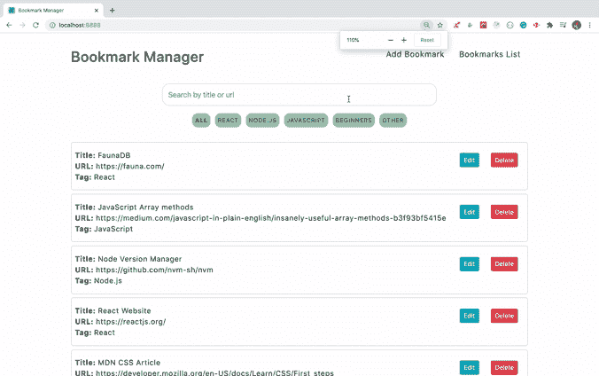
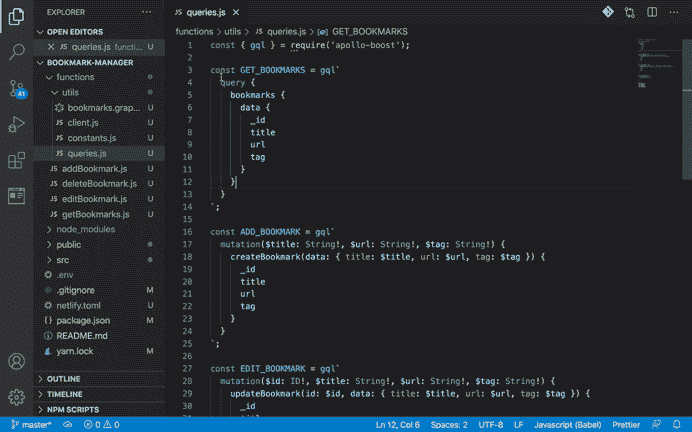

# 使用 FaunaDB 和 Netlify 无服务器功能创建书签管理器应用程序

> 原文：<https://levelup.gitconnected.com/create-a-bookmark-manager-app-using-faunadb-and-netlify-serverless-functions-7d4365652692>

从头开始创建一个惊人的 JAMStack 应用程序



书签管理器应用

## 介绍

在本文中，您将使用 FaunaDB GraphQL API 和 Netlify 无服务器函数创建一个书签管理器应用程序。

通过使用 FaunaDB 创建这个应用程序，您将了解 FaunaDB 如何帮助快速创建 GraphQL 应用程序，而无需担心自己管理 GraphQL 服务器及其配置。

Fauna 附带了 GraphQL playground，因此您只需提供模式，而 Fauna 会在幕后完成所有的工作。

你可以在下面的视频中看到最终工作应用的现场演示

*   如果您是 GraphQL 和 Apollo 客户端的新手，请查看我以前的文章 [useEffect(() => {
    loader.appendChild(node).classList.add('message');
    }, [loader, node]); useEffect(() => {
    if (props.show) {
    loader.classList.remove('hide');
    document.body.classList.add('loader-open');
    } else {
    loader.classList.add('hide');
    document.body.classList.remove('loader-open');
    }
    }, [loader, props.show]); return ReactDOM.createPortal(props.children, node);
    };export default Loader;

    在这个文件中，我们创建了一个加载器组件，它将显示一个带有背景覆盖的加载消息。

    要将它添加到 DOM 中，打开`public/index.html`文件，在 id 为`root`的 div 之后添加另一个 id 为`loader`的 div

    ```
    <div id="root"></div>
    <div id="loader"></div>
    ```

    在`components`文件夹中创建一个新文件`BookmarkItem.js`，内容如下:

    ```
    import React from 'react';
    import { Button } from 'react-bootstrap';const BookmarkItem = ({ _id, title, url, tag, handleEdit, handleDelete }) => {
      return (
        <div className="bookmark">
          <div>
            <div className="title">
              <strong>Title: </strong>
              {title}
            </div>
            <div className="url">
              <strong>URL: </strong>
              {url}
            </div>
            <div className="tag">
              <strong>Tag: </strong>
              {tag}
            </div>
          </div>
          <div className="buttons">
            <div className="btn">
              <Button
                variant="info"
                type="submit"
                size="sm"
                onClick={() => handleEdit(_id)}
              >
                Edit
              </Button>
            </div>
            <div className="btn">
              <Button
                variant="danger"
                type="submit"
                size="sm"
                onClick={() => handleDelete(_id, title)}
              >
                Delete
              </Button>
            </div>
          </div>
        </div>
      );
    };export default BookmarkItem;
    ```

    在这个文件中，我们用`edit`和`delete`按钮显示单个书签。

    在`components`文件夹下创建一个新文件`BookmarkList.js`，内容如下:

    ```
    import React from 'react';
    import BookmarkItem from './BookmarkItem';const BookmarkList = ({ bookmarks, handleEdit, handleDelete }) => {
      return (
        <div className="bookmarks-list">
          {bookmarks.map((bookmark) => (
            <BookmarkItem
              key={bookmark._id}
              {...bookmark}
              handleEdit={handleEdit}
              handleDelete={handleDelete}
            />
          ))}
        </div>
      );
    };export default BookmarkList;
    ```

    在这个文件中，我们遍历书签列表并在屏幕上显示它。

    在`custom-hooks`文件夹中创建一个新文件`useLoader.js`，内容如下:

    ```
    import { useState } from 'react';const useLoader = () => {
      const [isLoading, setIsLoading] = useState(false); const showLoader = () => {
        setIsLoading(true);
      }; const hideLoader = () => {
        setIsLoading(false);
      }; return { isLoading, showLoader, hideLoader };
    };export default useLoader;
    ```

    在这个文件中，我们将显示和隐藏加载器分离到一个定制的钩子中。

    在`components`文件夹中创建一个新文件`BookmarkForm.js`，内容如下:

    ```
    import React, { useState } from 'react';
    import { Form, Button } from 'react-bootstrap';
    import { TAGS } from '../utils/constants';const BookmarkForm = (props) => {
      const [state, setState] = useState({
        title: props.title ? props.title : '',
        url: props.url ? props.url : '',
        tag: props.tag ? props.tag : 'React',
        tags: TAGS,
        errorMsg: ''
      }); const onInputChange = (event) => {
        const { name, value } = event.target;
        setState((prevState) => ({
          ...prevState,
          [name]: value
        }));
      }; const onFormSubmit = (event) => {
        event.preventDefault();
        const { title, url, tag } = state;
        const { _id } = props;
        const isEditPage = !!props.title;
        if (title.trim() !== '' && url.trim() !== '' && tag.trim() !== '') {
          let data = { title, url, tag };
          if (isEditPage) {
            data = { ...data, _id };
          }
          props.onSubmit(data);
        } else {
          setState((prevState) => ({
            ...prevState,
            errorMsg: 'Please fill out all the fields.'
          }));
        }
      }; const { title, url, tags, tag, errorMsg } = state;
      return (
        <form onSubmit={onFormSubmit}>
          {errorMsg && <p className="errorMsg">{errorMsg}</p>}
          <Form.Group controlId="title">
            <Form.Label>Title</Form.Label>
            <Form.Control
              type="text"
              name="title"
              value={title || ''}
              onChange={onInputChange}
            />
          </Form.Group>
          <Form.Group controlId="description">
            <Form.Label>URL</Form.Label>
            <Form.Control
              type="text"
              name="url"
              value={url || ''}
              onChange={onInputChange}
            />
          </Form.Group>
          <Form.Group controlId="amount">
            <Form.Label>Tag</Form.Label>
            <Form.Control
              as="select"
              name="tag"
              value={tag || ''}
              onChange={onInputChange}
            >
              {tags.map((tag, index) => (
                <option key={index}>{tag}</option>
              ))}
            </Form.Control>
          </Form.Group>
          <Button variant="info" type="submit">
            Submit
          </Button>
        </form>
      );
    };export default BookmarkForm;
    ```

    在这个文件中，我们创建了一个表单来添加和编辑书签功能。

    在`components`文件夹中创建一个新文件`AddBookmark.js`，内容如下:

    ```
    import React from 'react';
    import { connect } from 'react-redux';
    import BookmarkForm from './BookmarkForm';
    import { initiateAddBookmark } from '../actions/bookmarks';
    import Loader from './Loader';
    import useLoader from '../custom-hooks/useLoader';const AddBookmark = (props) => {
      const { isLoading, showLoader, hideLoader } = useLoader(); const onSubmit = (bookmark) => {
        showLoader();
        props.dispatch(initiateAddBookmark(bookmark)).then(() => {
          hideLoader();
          props.history.push('/');
        });
      }; return (
        <div>
          <Loader show={isLoading}>Loading...</Loader>
          <BookmarkForm {...props} onSubmit={onSubmit} />
        </div>
      );
    };export default connect()(AddBookmark);
    ```

    在这个文件中，我们添加了一个`onSubmit`处理程序，它将调用`initiateAddBookmark`函数向 FaunaDB 添加一个书签。在本文中，我们将很快为`initiateAddBookmark`编写代码。

    在`router`文件夹中新建一个文件`EditBookmark.js`，内容如下:

    ```
    import React from 'react';
    import { connect } from 'react-redux';
    import _ from 'lodash';
    import { Redirect } from 'react-router-dom';
    import BookmarkForm from './BookmarkForm';
    import { initiateEditBookmark } from '../actions/bookmarks';
    import useLoader from '../custom-hooks/useLoader';
    import Loader from './Loader';const EditBookmark = (props) => {
      const { isLoading, showLoader, hideLoader } = useLoader(); const onSubmit = (bookmark) => {
        showLoader();
        props.dispatch(initiateEditBookmark(bookmark)).then(() => {
          hideLoader();
          props.history.push('/');
        });
      }; return (
        <div>
          {!_.isEmpty(props.bookmark) ? (
            <React.Fragment>
              <Loader show={isLoading}>Loading...</Loader>
              <BookmarkForm onSubmit={onSubmit} {...props} {...props.bookmark} />
            </React.Fragment>
          ) : (
            <Redirect to="/" />
          )}
        </div>
      );
    };const mapStateToProps = (state, props) => ({
      bookmark: state.bookmarks.find(
        (bookmark) => bookmark._id === props.match.params.id
      )
    });export default connect(mapStateToProps)(EditBookmark);
    ```

    在这个文件中，当用户在编辑书签后提交它时，我们调用`initiateEditBookmark`函数来更新 FaunaDB 中的书签。

    在`components`文件夹中新建一个文件`Home.js`，内容如下:

    ```
    import React, { useState, useEffect } from 'react';
    import { connect } from 'react-redux';
    import {
      initiateGetBookmarks,
      initiateDeleteBookmark
    } from '../actions/bookmarks';
    import BookmarkList from './BookmarkList';
    import BookmarkSearch from './BookmarkSearch';
    import Filters from './Filters';
    import Loader from './Loader';
    import useLoader from '../custom-hooks/useLoader';
    import { isMatch } from '../utils/functions';const Home = ({ bookmarksList, errorMsg, dispatch, history }) => {
      const [bookmarks, setBookmarks] = useState([]);
      const [activeFilter, setActiveFilter] = useState('All');
      const { isLoading, showLoader, hideLoader } = useLoader(); const getBookmarks = () => {
        showLoader();
        dispatch(initiateGetBookmarks())
          .then(() => {
            setBookmarks(bookmarksList);
            hideLoader();
          })
          .catch(() => hideLoader());
      }; useEffect(() => {
        getBookmarks();
      }, []); useEffect(() => {
        setBookmarks(bookmarksList);
      }, [bookmarksList]); const handleEdit = (id) => {
        history.push(`/edit/${id}`);
      }; const handleDelete = (id, title) => {
        const shouldDelete = window.confirm(
          `Are you sure you want to delete the bookmark with title ${title}?`
        );
        if (shouldDelete) {
          showLoader();
          dispatch(initiateDeleteBookmark(id))
            .then(() => {
              handleFilterClick('All');
              hideLoader();
            })
            .catch(() => hideLoader());
        }
      }; const handleSearch = (searchTerm) => {
        if (searchTerm) {
          setBookmarks(
            bookmarksList.filter((bookmark) => {
              const isTagMatch = isMatch(bookmark.tag, activeFilter);
              if (activeFilter !== '' && activeFilter !== 'All' && !isTagMatch) {
                return false;
              }
              const isTitleMatch = isMatch(bookmark.title, searchTerm);
              const isURLMatch = isMatch(bookmark.url, searchTerm);
              if (isTitleMatch || isURLMatch) {
                return true;
              }
              return false;
            })
          );
        } else {
          if (activeFilter !== 'All') {
            setBookmarks(
              bookmarksList.filter((bookmark) =>
                isMatch(bookmark.tag, activeFilter)
              )
            );
          } else {
            setBookmarks(bookmarksList);
          }
        }
      }; const filterResults = (tag) => {
        if (tag !== 'All') {
          setBookmarks(bookmarksList.filter((bookmark) => bookmark.tag === tag));
        } else {
          setBookmarks(bookmarksList);
        }
      }; const handleFilterClick = (tag) => {
        setActiveFilter(tag);
      }; return (
        <React.Fragment>
          <BookmarkSearch handleSearch={handleSearch} />
          <Filters
            filterResults={filterResults}
            activeFilter={activeFilter}
            handleFilterClick={handleFilterClick}
          />
          {errorMsg && <p className="errorMsg">{errorMsg}</p>}
          <Loader show={isLoading}>Loading...</Loader>
          {bookmarks.length > 0 ? (
            <BookmarkList
              bookmarks={bookmarks}
              handleEdit={handleEdit}
              handleDelete={handleDelete}
            />
          ) : (
            <p className="no-result">No bookmarks found.</p>
          )}
        </React.Fragment>
      );
    };const mapStateToProps = (state) => ({
      bookmarksList: state.bookmarks,
      errorMsg: state.errorMsg
    });export default connect(mapStateToProps)(Home);
    ```

    这是封装了所有其他组件的主组件文件。在这个文件中，首先，我们通过传递一个空数组作为第二个参数从`useEffect`钩子中调用`getBookmarks`函数，这样函数将只运行一次。

    ```
    useEffect(() => {
     getBookmarks();
    }, []);
    ```

    在`getBookmarks`函数中，我们将书签数组设置为使用`setBookmarks(bookmarksList);`返回的书签列表

    如果因为添加、编辑或删除书签而对 redux 存储进行了任何更新，那么我们将获取更新后的书签，并将其重新分配给书签数组

    ```
    useEffect(() => {
      setBookmarks(bookmarksList);
    }, [bookmarksList]);
    ```

    这类似于类的`componentDidUpdate`方法，其中如果`bookmarksList`属性(作为属性从 mapStateToProps 传递给组件)有任何变化，将执行这个 useEffect。

    然后在`handleEdit`方法中，我们通过传递编辑过的书签 id 将用户重定向到`EditBookmark`组件。

    在`handleDelete`方法中，我们调用了`initiateDeleteBookmark`方法，以便在用户确认删除后删除书签。

    在`handleSearch`方法中，我们使用数组过滤方法检查标题或书签是否与书签列表中特定标签(activeFilter)内的搜索词匹配，并根据结果更新书签数组。

    在`filterResults`方法中，我们根据点击的标签按钮过滤出书签。

    在`router`文件夹中创建一个新文件`AppRouter.js`，内容如下:

    ```
    import React from 'react';
    import { BrowserRouter, Route, Switch } from 'react-router-dom';
    import Home from '../components/Home';
    import AddBookmark from '../components/AddBookmark';
    import EditBookmark from '../components/EditBookmark';
    import BookmarkList from '../components/BookmarkList';
    import Header from '../components/Header';const AppRouter = () => (
      <BrowserRouter>
        <div className="container">
          <Header />
          <div className="bookmark-form">
            <Switch>
              <Route component={Home} path="/" exact={true} />
              <Route component={BookmarkList} path="/list" />
              <Route component={AddBookmark} path="/add" />
              <Route component={EditBookmark} path="/edit/:id" />
            </Switch>
          </div>
        </div>
      </BrowserRouter>
    );export default AppRouter;
    ```

    这里，我们使用`react-router-dom`库为不同的页面设置了路由。

    在`reducers`文件夹中新建一个文件`bookmarks.js`，内容如下:

    ```
    import {
      SET_BOOKMARKS,
      ADD_BOOKMARK,
      EDIT_BOOKMARK,
      DELETE_BOOKMARK
    } from '../utils/constants';const bookmarksReducer = (state = [], action) => {
      switch (action.type) {
        case SET_BOOKMARKS:
          return action.bookmarks.reverse();
        case ADD_BOOKMARK:
          return [action.bookmark, ...state];
        case EDIT_BOOKMARK:
          return state.map((bookmark) => {
            if (bookmark._id === action._id) {
              return {
                ...bookmark,
                ...action.bookmark
              };
            } else {
              return bookmark;
            }
          });
        case DELETE_BOOKMARK:
          return state.filter((bookmark) => bookmark._id !== action._id);
        default:
          return state;
      }
    };export default bookmarksReducer;
    ```

    在这个 reducer 文件中，对于`SET_BOOKMARKS`动作类型，我们以相反的顺序返回书签，因此当它显示在 UI 上时，第一次加载组件时，最新添加的书签将显示在顶部。

    在`ADD_BOOKMARK`动作类型中，我们通过添加新添加的书签作为数组的第一项来返回数组，然后使用 spread 操作符，我们将所有其他书签追加到数组中。

    在`EDIT_BOOKMARK`动作类型中，我们使用数组映射方法检查传递的 id 是否与书签数组中的任何 id 匹配，如果匹配，那么我们通过展开书签的所有属性，然后展开书签的更新值，返回一个新对象。

    例如，如果`bookmark`看起来像这样:

    ```
    {_id: "276656761265455623221", title: "FaunaDB", url: "https://fauna.com/", tag: "React"}
    ```

    而`action.bookmark`看起来是这样的:

    ```
    {_id: "276656761265455623221", title: "FaunaDB Website", url: "https://fauna.com/", tag: "React"}
    ```

    如果只更改了标题，那么在使用扩展运算符`{...bookmark, ...action.bookmark}`后，结果将是:

    ```
    {_id: "276656761265455623221", title: "FaunaDB", url: "https://fauna.com/", tag: "React", _id: "276656761265455623221", title: "FaunaDB Website", url: "https://fauna.com/", tag: "React"}
    ```

    因此，如果已经存在同名的键，那么后一个键的值将覆盖前一个键的值。所以最后的结果会是

    ```
    {_id: "276656761265455623221", title: "FaunaDB Website", url: "https://fauna.com/", tag: "React"}
    ```

    在`DELETE_BOOKMARK`动作类型中，我们使用数组过滤方法删除带有 matching _id 的书签。

    在`reducers`文件夹中创建一个新文件`errors.js`，内容如下:

    ```
    import { GET_ERRORS } from '../utils/constants';const errorsReducer = (state = '', action) => {
      switch (action.type) {
        case GET_ERRORS:
          return action.errorMsg;
        default:
          return state;
      }
    };export default errorsReducer;
    ```

    在这个文件中，我们将在添加、编辑或删除书签时添加一条来自 FaunaDB 的错误消息(如果有的话)。

    在`store`文件夹下创建一个新文件`store.js`，内容如下:

    ```
    import { createStore, applyMiddleware, compose, combineReducers } from 'redux';
    import thunk from 'redux-thunk';
    import bookmarksReducer from '../reducers/bookmarks';
    import errorsReducer from '../reducers/errors';const composeEnhancers = window.__REDUX_DEVTOOLS_EXTENSION_COMPOSE__ || compose;const store = createStore(
      combineReducers({
        bookmarks: bookmarksReducer,
        errorMsg: errorsReducer
      }),
      composeEnhancers(applyMiddleware(thunk))
    );store.subscribe(() => {
      console.log(store.getState());
    });export default store;
    ```

    这里，我们创建了一个 redux store，将`bookmarksReducer`和`errorsReducer`组合在一起，这样我们就可以从`AppRouter.js`文件中定义的任何组件访问存储数据。

    在`utils`文件夹中创建一个新文件`functions.js`，内容如下:

    ```
    export const isMatch = (original, search) =>
      original.toLowerCase().indexOf(search.toLowerCase()) > -1;
    ```

    现在，打开`src/index.js`文件，在里面添加以下内容:

    ```
    import React from 'react';
    import ReactDOM from 'react-dom';
    import { Provider } from 'react-redux';
    import AppRouter from './router/AppRouter';
    import store from './store/store';
    import 'bootstrap/dist/css/bootstrap.min.css';
    import './styles.scss';ReactDOM.render(
      <Provider store={store}>
        <AppRouter />
      </Provider>,
      document.getElementById('root')
    );
    ```

    这里，我们添加了一个`Provider`组件，它将把 redux 存储传递给在`AppRouter`组件中声明的所有路线。

    在`actions`文件夹中新建一个文件`bookmarks.js`，内容如下:

    ```
    import axios from 'axios';
    import {
      SET_BOOKMARKS,
      ADD_BOOKMARK,
      EDIT_BOOKMARK,
      DELETE_BOOKMARK
    } from '../utils/constants';
    import { getErrors } from './errors';export const setBookmarks = (bookmarks) => ({
      type: SET_BOOKMARKS,
      bookmarks
    });export const addBookmark = (bookmark) => ({
      type: ADD_BOOKMARK,
      bookmark
    });export const editBookmark = (bookmark) => ({
      type: EDIT_BOOKMARK,
      _id: bookmark._id,
      bookmark
    });export const deleteBookmark = (_id) => ({
      type: DELETE_BOOKMARK,
      _id
    });export const initiateGetBookmarks = () => {
      return async (dispatch) => {
        try {
          const { data } = await axios({
            url: '/api/getBookmarks',
            method: 'POST'
          });
          return dispatch(setBookmarks(data));
        } catch (error) {
          error.response && dispatch(getErrors(error.response.data));
        }
      };
    };export const initiateAddBookmark = (bookmark) => {
      return async (dispatch) => {
        try {
          const { data } = await axios({
            url: '/api/addBookmark',
            method: 'POST',
            data: bookmark
          });
          return dispatch(addBookmark(data));
        } catch (error) {
          error.response && dispatch(getErrors(error.response.data));
        }
      };
    };export const initiateEditBookmark = (bookmark) => {
      return async (dispatch) => {
        try {
          const { data } = await axios({
            url: '/api/editBookmark',
            method: 'PUT',
            data: bookmark
          });
          return dispatch(editBookmark(data));
        } catch (error) {
          error.response && dispatch(getErrors(error.response.data));
        }
      };
    };export const initiateDeleteBookmark = (_id) => {
      return async (dispatch) => {
        try {
          const { data } = await axios({
            url: '/api/deleteBookmark',
            method: 'DELETE',
            data: { _id }
          });
          return dispatch(deleteBookmark(data._id));
        } catch (error) {
          error.response && dispatch(getErrors(error.response.data));
        }
      };
    };
    ```

    在`actions`文件夹中新建一个文件`errors.js`，内容如下:

    ```
    import { GET_ERRORS } from '../utils/constants';
    export const getErrors = (errorMsg) => ({
      type: GET_ERRORS,
      errorMsg
    });
    ```

    在项目文件夹中创建一个新文件`.env`，内容如下:

    ```
    FAUNA_GRAPHQL_SECRET_KEY=your_fauna_secret_key
    ```

    在这里使用你的 faunaDB 密钥。

    打开`.gitignore`文件并在新行上添加`.env`,这样`.env`文件就不会被推送到 git 存储库

    在项目文件夹中创建一个新文件`netlify.toml`，内容如下:

    ```
    [build]
      command="CI= yarn run build"
      publish="build"
      functions="functions"[[redirects]]
      from="/api/*"
      to="/.netlify/functions/:splat"
      status=200
      force=true
    ```

    这是 Netlify 的配置文件，我们在其中指定构建配置。让我们分解一下

    *   `command`指定创建生产构建文件夹需要执行的命令。`CI=`是针对 Netify 的，这样它在部署应用程序时就不会抛出错误。
    *   `publish`指定用于部署应用程序的文件夹的名称
    *   `functions`指定存储所有无服务器功能的文件夹的名称
    *   当部署到 Netlify 时，所有的无服务器功能都可以在 URL `/.netlify/functions/`处获得，因此我们指示 Netlify，无论何时有任何对`/api/function_name`的请求，都将其重定向到`/.netlify/functions/function_name`，而不是每次进行 API 调用时都指定完整的路径。
    *   `:splat`指定`/api/`之后的都要在`/.netlify/functions`之后使用/

    在项目的根目录下创建一个`functions`文件夹，我们将在里面编写我们的无服务器函数。

    在`functions`文件夹中，新建一个`utils`文件夹，并添加包含以下内容的`bookmarks.graphql`文件:

    ```
    type Bookmark {
      title: String!
      url: String!
      tag: String!
    }
    type Query {
      bookmarks: [Bookmark!]!
    }
    ```

    在`functions/utils`文件夹中创建一个新文件`client.js`，内容如下:

    ```
    const { ApolloClient, InMemoryCache, HttpLink } = require('@apollo/client');
    const { API_URL } = require('./constants');
    const fetch = require('cross-fetch');
    require('dotenv').config();const getClient = ({ method = 'POST' } = {}) => {
      const client = new ApolloClient({
        link: new HttpLink({
          uri: API_URL,
          fetch,
          headers: {
            Authorization: `Bearer ${process.env.FAUNA_GRAPHQL_SECRET_KEY}`
          },
          method
        }),
        cache: new InMemoryCache()
      });
      return client;
    };module.exports = { getClient };
    ```

    在`functions/utils`文件夹中新建一个文件`constants.js`，内容如下:

    ```
    const API_URL = 'https://graphql.fauna.com/graphql';
    const SET_BOOKMARKS = 'SET_BOOKMARKS';
    const ADD_BOOKMARK = 'ADD_BOOKMARK';
    const EDIT_BOOKMARK = 'EDIT_BOOKMARK';
    const DELETE_BOOKMARK = 'DELETE_BOOKMARK';module.exports = {
      API_URL,
      SET_BOOKMARKS,
      ADD_BOOKMARK,
      EDIT_BOOKMARK,
      DELETE_BOOKMARK
    };
    ```

    注意这里的`API_URL`,它与我们正在使用的 FaunaDB GraphQL playground 中显示的 URL 相同。

    在`functions/utils`文件夹中新建一个文件`queries.js`，内容如下:

    ```
    const { gql } = require('apollo-boost');const GET_BOOKMARKS = gql`
      query {
        bookmarks {
          data {
            _id
            title
            url
            tag
          }
        }
      }
    `;const ADD_BOOKMARK = gql`
      mutation($title: String!, $url: String!, $tag: String!) {
        createBookmark(data: { title: $title, url: $url, tag: $tag }) {
          _id
          title
          url
          tag
        }
      }
    `;const EDIT_BOOKMARK = gql`
      mutation($id: ID!, $title: String!, $url: String!, $tag: String!) {
        updateBookmark(id: $id, data: { title: $title, url: $url, tag: $tag }) {
          _id
          title
          url
          tag
        }
      }
    `;const DELETE_BOOKMARK = gql`
      mutation($id: ID!) {
        deleteBookmark(id: $id) {
          _id
        }
      }
    `;module.exports = {
      GET_BOOKMARKS,
      ADD_BOOKMARK,
      EDIT_BOOKMARK,
      DELETE_BOOKMARK
    };
    ```

    在`functions`文件夹中新建一个文件`getBookmarks.js`，内容如下:

    ```
    const { GET_BOOKMARKS } = require('./utils/queries');
    const { getClient } = require('./utils/client');exports.handler = async (event, context, callback) => {
      try {
        const client = getClient();
        let { data } = await client.query({
          query: GET_BOOKMARKS
        });
        const result = data.bookmarks.data;
        return {
          statusCode: 200,
          body: JSON.stringify(result)
        };
      } catch (error) {
        return {
          statusCode: 500,
          body: JSON.stringify(
            'Something went wrong while fetching bookmarks. Try again later.'
          )
        };
      }
    };
    ```

    在这个文件中，我们实际上是在对 FaunaDB GraphQL API 进行 API 调用，并将响应返回给在`src/actions/bookmarks.js`文件中定义的`initiateGetBookmarks`函数，因为从`initiateGetBookmarks`函数内部，我们正在对`/api/getBookmarks`进行调用，这是一个`functions/getBookmarks.js`无服务器函数。

    # 运行应用程序

    现在，让我们运行应用程序来查看输出。在此之前，我们需要安装 npm 库，它将运行我们的无服务器功能和 React 应用程序。

    通过从终端执行以下命令来安装库:

    ```
    npm install netlify-cli -g
    ```

    如果你在 Linux / Mac 上，那么你可能需要在它前面添加`sudo`来全局安装它:

    ```
    sudo npm install netlify-cli -g
    ```

    现在，通过从项目文件夹内的终端运行以下命令来启动应用程序

    ```
    netlify dev
    ```

    命令将首先运行我们的无服务器功能，然后运行我们的 React 应用程序，它将自动管理代理，这样当您从 React 应用程序访问无服务器功能时就不会出现 CORS 错误。](/learn-the-basics-of-graphql-4740d76d5e8a#loader');</span><span id=) 

    [现在，导航到](/learn-the-basics-of-graphql-4740d76d5e8a#loader');</span><span id=) [http://localhost:8888/](http://localhost:8888/) 并检查应用程序

    

    初始屏幕

    # 添加书签

    目前，我们还没有添加任何书签，所以应用程序正在显示`No bookmarks found`消息。所以让我们添加一些书签。

    在`functions`文件夹下创建一个新文件`addBookmark.js`，内容如下:

    ```
    const { ADD_BOOKMARK } = require('./utils/queries');
    const { getClient } = require('./utils/client');exports.handler = async (event, context, callback) => {
      try {
        if (event.httpMethod !== 'POST') {
          return {
            statusCode: 405,
            body: JSON.stringify({
              error: 'only POST http method is allowed.'
            })
          };
        }
        const { title, url, tag } = JSON.parse(event.body);
        const variables = { title, url, tag };
        const client = getClient();
        const { data } = await client.mutate({
          mutation: ADD_BOOKMARK,
          variables
        });
        const result = data.createBookmark;
        return {
          statusCode: 200,
          body: JSON.stringify(result)
        };
      } catch (error) {
        return {
          statusCode: 500,
          body: JSON.stringify('Something went wrong. Try again later!')
        };
      }
    };
    ```

    现在，通过再次运行`netlify dev`重启服务器，点击标题中的`Add Bookmark`链接添加书签

    

    添加书签

    # 添加编辑和删除书签功能

    现在让我们添加编辑和删除书签无服务器功能。

    在`functions`文件夹中创建一个新文件`editBookmark.js`，内容如下:

    ```
    const { EDIT_BOOKMARK } = require('./utils/queries');
    const { getClient } = require('./utils/client');exports.handler = async (event, context, callback) => {
      try {
        if (event.httpMethod !== 'PUT') {
          return {
            statusCode: 405,
            body: JSON.stringify({
              error: 'only PUT http method is allowed.'
            })
          };
        }
        const { _id: id, title, url, tag } = JSON.parse(event.body);
        const variables = { id, title, url, tag };
        const client = getClient({ method: 'PUT' });
        const { data } = await client.mutate({
          mutation: EDIT_BOOKMARK,
          variables
        });
        const result = data.createBookmark;
        return {
          statusCode: 200,
          body: JSON.stringify(result)
        };
      } catch (error) {
        return {
          statusCode: 500,
          body: JSON.stringify(
            'Something went wrong while editing bookmarks. Try again later.'
          )
        };
      }
    };
    ```

    在`functions`文件夹中创建一个新文件`deleteBookmark.js`，内容如下:

    ```
    const { DELETE_BOOKMARK } = require('./utils/queries');
    const { getClient } = require('./utils/client');exports.handler = async (event, context, callback) => {
      try {
        if (event.httpMethod !== 'DELETE') {
          return {
            statusCode: 405,
            body: JSON.stringify({
              error: 'only DELETE http method is allowed.'
            })
          };
        }
        const { _id: id } = JSON.parse(event.body);
        const variables = { id };
        const client = getClient({ method: 'DELETE' });
        const { data } = await client.mutate({
          mutation: DELETE_BOOKMARK,
          variables
        });
        const result = data.deleteBookmark;
        return {
          statusCode: 200,
          body: JSON.stringify(result)
        };
      } catch (error) {
        return {
          statusCode: 500,
          body: JSON.stringify(
            'Something went wrong while deleting bookmark. Try again later.'
          )
        };
      }
    };
    ```

    现在，通过再次运行`netlify dev`重启服务器，并检查编辑和删除书签功能。

    # 编辑书签功能

    

    # 删除书签功能

    

    让我们在不同的标签中添加几个书签。

    

    现在，我们已经添加了一些书签，让我们验证搜索书签功能。

    

    # 测试来自 FaunaDB GraphQL Playground 的数据

    让我们验证它们是否真的被添加到了 FaunaDB 中。

    从 FaunaDB 仪表板导航到 GraphQL 菜单，将从`functions/utils/queries.js`文件获取所有书签的查询粘贴到 playground 并验证它。

    ```
    query {
      bookmarks {
        data {
          _id
          title
          url
          tag
        }
      }
    }
    ```

    

    正如您所看到的，书签被正确地保存到了 FaunaDB 中，所以即使在刷新页面之后，我们的书签也将持续存在。

    让我们回顾一下这个应用程序是如何工作的。

    *   当加载应用程序时，我们从`components/Home.js`文件调用`actions/bookmarks.js`文件的`initiateGetBookmarks`函数。
    *   `initiateGetBookmarks`函数对`/api/getBookmarks` URL 进行 API 调用，该 URL 是写在`functions/getBookmarks.js`文件中的无服务器函数，最终调用 FaunaDB GraphQL API 来获取书签列表。
    *   当我们编辑/删除书签时，从`functions`文件夹调用相应的无服务器函数，对 FaunaDB 进行 API 调用。

    # 将应用程序部署到 Netlify

    现在，我们完成了应用程序。

    要将应用程序部署到 Netlify，请遵循本文中[您最喜欢的方式](https://medium.com/javascript-in-plain-english/deploy-your-react-application-to-production-within-seconds-58754c79c239?source=friends_link&sk=040204faa8a15e6ae2b7b2e70abe130a)

    > *确保在 Netlify 的* `*Site settings => Build & deploy => Environment Variables*` *部分添加* `*FAUNA_GRAPHQL_SECRET_KEY*` *环境变量，并重新部署站点。*

    # 结论

    正如您所看到的，FaunDB 使得创建 GraphQL 服务器和将数据存储在数据库中变得非常容易，因此我们不必担心使用额外的数据库来存储数据。

    我们已经使用极快的 FaunaDB GraphQL API 和 Netlify 创建了令人惊叹的书签管理器 JAMStack 应用程序。

    您可以在这个库中找到这个应用程序[的完整源代码](https://github.com/myogeshchavan97/bookmark-manager)

    **别忘了订阅我的每周简讯，里面有惊人的技巧、窍门和文章，直接在这里的收件箱里** [**。**](https://yogeshchavan.dev/)