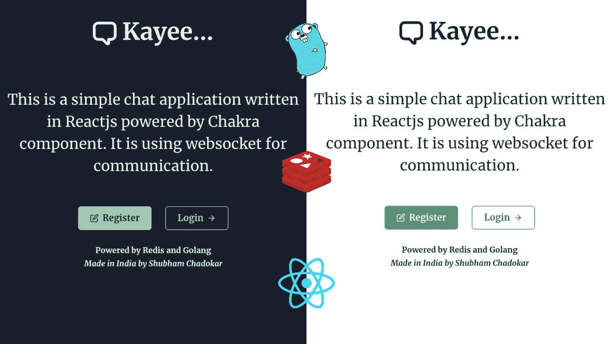
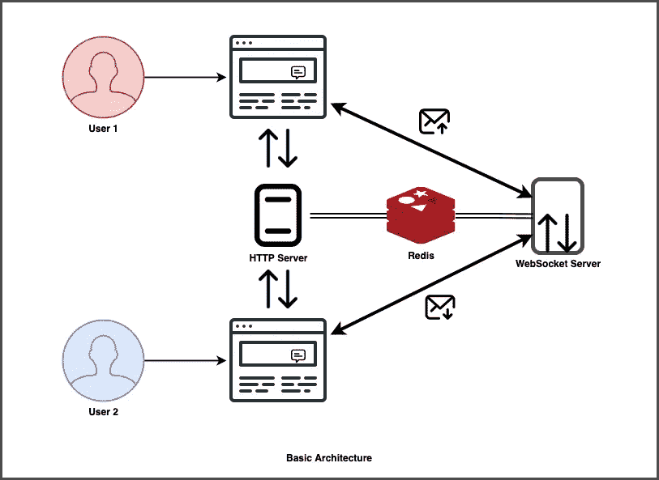
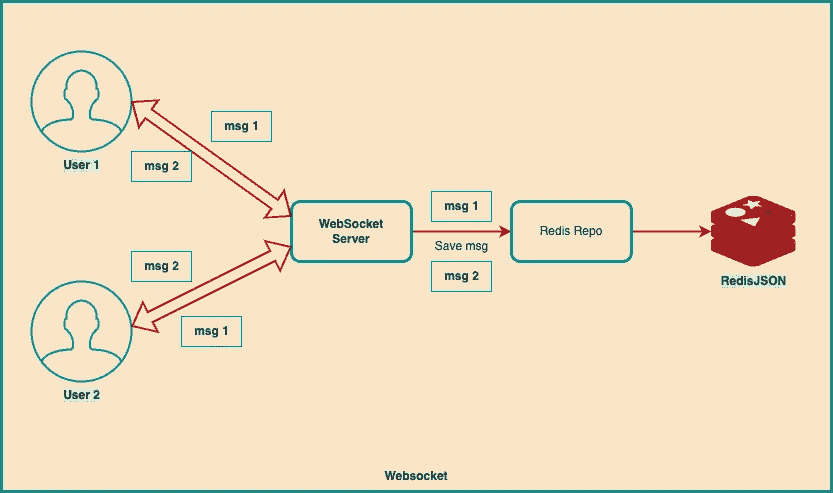
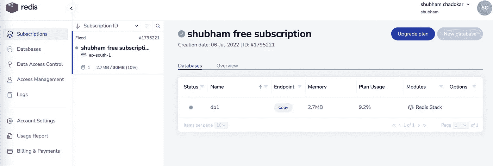
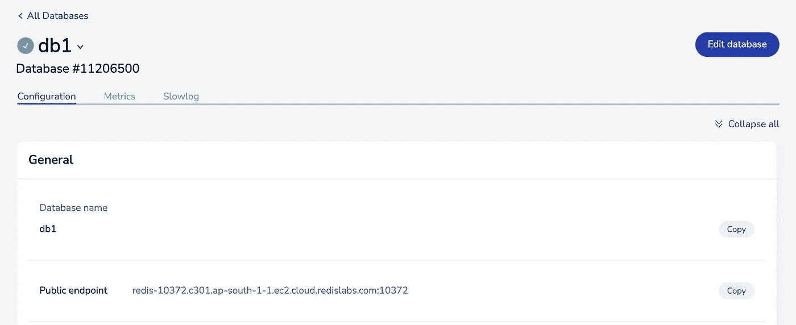
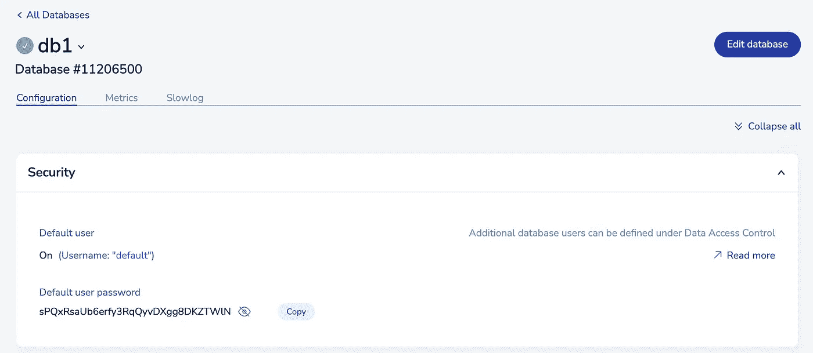
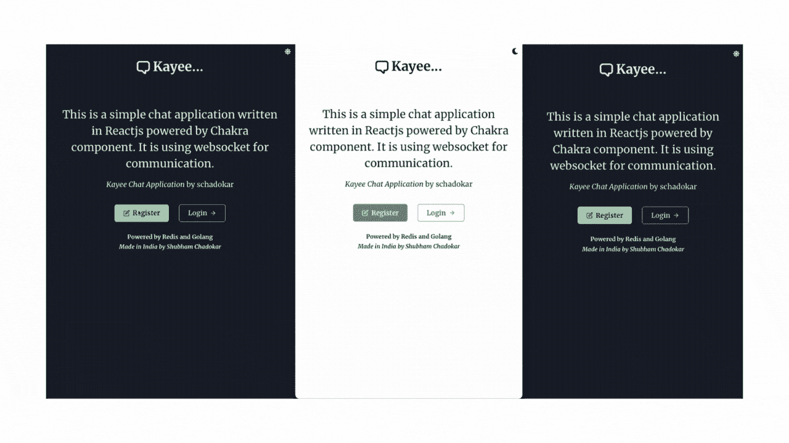

# 用 Redis 和 ReactJS 创建一个 Golang 聊天应用程序

> 原文：<https://levelup.gitconnected.com/create-a-chat-application-in-golang-with-redis-and-reactjs-c75611717f84>

Golang 中功能丰富的聊天应用程序，使用 Redis 作为完整的解决方案。Redis 用于存储所有用户数据、聊天、联系人列表和许多其他内容。



聊天应用的名字是 **Kayee。**这是你在贾巴尔普尔市听到的俚语，意思是发生了什么事！

# 介绍

在本教程中，您将在 Golang 中创建一个聊天应用程序，Redis 作为数据库层，ReactJS 与 Chakra UI 一起作为前端。

让我们了解一下您将在这个应用程序中构建什么。

1.  **Redis 存储库:**简单存储库管理所有 Redis 操作。
2.  **HTTP 服务器:**一个 REST API 服务器，提供特定于用户的功能，比如注册和登录。
3.  **WebSocket 服务器:**即时反应变化的实时服务器。
4.  **前端(客户端):**一个带有 Chakra UI 组件的 ReactJS 应用程序。

## 聊天功能

1.  一对一的聊天
2.  注册用户
3.  登录用户
4.  添加联系人
5.  联系人列表

**使用的 Redis 堆栈**

1.  设置
2.  排序集合
3.  雷迪森
4.  再研究

> 您可以在文章末尾找到完整的 GitHub 项目链接。

# 体系结构

用户将使用 HTTP 服务器注册并登录聊天应用程序。实时消息将通过 WebSocket 服务器发送并保存到 Redis。



**基础架构**

WebSocket 流程图:用户 1 和用户 2 之间的活动连接将是活动的。



Websocket 流程图

## 特征的数据结构

在这个应用程序中，有两个域，用户和聊天。所有的功能都围绕着它。Redis 提供了广泛的数据类型，通过 Redis Stack，它现在支持复杂的数据类型，如 JSON，以及 Redisearch 等功能，在 Redisearch 中，您可以查询 JSON 和 Hashes 数据类型。

下面是每个域使用的 Redis 堆栈:

1.  **用户:** RedisJSON，SET，SortedSET，Key-Value 对(功能:注册，登录，验证联系人，联系人列表)
2.  **聊天:** RedisJSON，Redisearch(功能:新聊天，聊天记录)

# 先决条件

在开始开发工作之前，请确保您已经安装了以下先决条件:

1.  **Golang 编译器 v1.17 以上**(我用的是 v1.17.11) [下载链接](https://go.dev/dl/)
2.  **Nodejs v16.13 或以上**(我用的是 v 16 . 13 . 2)ReactJS 需要。[下载链接](https://nodejs.org/en/download/)
3.  **安装 Redis CLI** (我用的是 v7.0.4) [下载链接](https://redis.io/docs/getting-started/installation/)
4.  **Redis 云账号** [链接](https://redis.com/try-free/) Redis 云是 Redis 提供的云服务。创建一个免费账户，不需要信用卡。默认情况下，Redis Cloud 中所有类似 RedisJSON 和 Redisearch 的模块都是可用的。我们将使用`redis-cli`连接 Redis Cloud。

> **Redis Stack 是 Redis 的扩展，增加了现代数据模型和处理引擎，以提供完整的开发人员体验。**支持 redis 的所有 redis 特性，支持可查询的 JSON 文档、全文搜索、时序数据(摄取&查询)、图形数据、概率数据结构。
> RedisJSON、Redisearch 和 other 是 Redis 栈的模块。您必须单独安装这些模块才能使用它。它不包含在 redis-cli 中。

## Redis 云帐户设置

在 Redis Cloud 中创建一个帐户，并使用免费订阅设置一个 **Redis Stack** 类型的 DB。在免费订阅下，你将免费获得 30MB 的数据存储空间。



选择 DB，并在配置下找到公共端点。这个公共端点是您可以用来连接到 Redis 云的端点。



向下滚动到安全部分。连接到此数据库实例需要此用户口令。



复制此端点和密码。这是下一节需要的。

> 这些凭据不再有效。

# 项目结构

我们将保持项目结构简单。创建一个新目录`gochatapp`。

```
**gochatapp**
**|- client** // react application **|- model** // schema **|- chat.go 
|- pkg** // business logic **|- httpserver
    |- chathandler.go
    |- httpserver.go
  |- redisrepo** // data base layer **|- client.go
    |- deserialise.go
    |- key.go
    |- redismethod.go
  |- ws** // websocket **|- websocket.go
|- .env
|- main.go**
```

*   **客户:** ReactJS 申请。我们将在 ReactJS 部分展开`client`目录。
*   **模型:**聊天和用户模式
*   **pkg:** httpserver、redisrepo、ws(WebSocket)会控制应用的业务逻辑。
*   **。env:** Redis 凭证
*   **main.go:** 应用入口点

## 项目设置

打开`gochatapp`目录下的 CLI。您将首先启动一个 go 模块并安装所有的依赖项。

**初始化**

它将创建两个文件，`go.mod`和`go.sum`来保存所有的依赖引用和它们使用的版本。

```
go mod init gochatapp
```

**安装第三方库**

```
go get github.com/gorilla/muxgo get github.com/gorilla/websocketgo get github.com/joho/godotenvgo get github.com/rs/corsgo get github.com/go-redis/redis/v8
```

`mux`用于 HTTP 服务器，`websocket`用于 WebSocket，`godotenv`用于读取`.env`，`cors`用于解决 CORS 问题，`redis`用于连接 Redis。

我希望您已经创建了项目目录结构并安装了所有的依赖项。

现在，在 VS 代码编辑器或任何您喜欢的编辑器中打开项目。

# 模型

打开`model/chat.go`粘贴以下内容。我们使用了两种模式**聊天**和**联系人列表**。

```
package modeltype Chat struct {
  ID        string `json:"id"`
  From      string `json:"from"`
  To        string `json:"to"`
  Msg       string `json:"message"`
  Timestamp int64  `json:"timestamp"`
}type ContactList struct {
  Username     string `json:"username"`
  LastActivity int64  `json:"last_activity"`
}
```

> 注意:我对各个`pkg`的所有文件使用一个 gist 文件。因为在介质中很难进行代码格式化。我首先解释文件内容，然后嵌入要点。提示:使用两个窗口，在第一个窗口阅读文件描述，在第二个窗口保持要点开放供参考。

# Redis 操作

让我们首先创建所有需要的 Redis 操作。

打开`.env`文件，配置 Redis 云公共端点和密码。

```
# Paste public endpoint as it is with port
REDIS_CONNECTION_STRING=public_endpoint# Paste password from Security Section
REDIS_PASSWORD=user_default_password
```

## client.go

`InitialiseRedis`将连接到 Redis 实例，并将连接客户端保存在`redisClient`全局变量中。

## 钥匙，去吧

理想的做法是创建函数来返回 Redis 键，而不是在使用它们时对它们进行硬编码或格式化。它增加了使用错误密钥的可能性。

在`key.go`文件中，我们将创建返回 Redis 键的函数。

例如，`chatKey`函数为每条聊天消息生成一个唯一的密钥。`chat#1661360942123`

```
func chatKey() string {
  return fmt.Sprintf("chat#%d", time.Now().UnixMilli())
}
```

## redismethod.go

*   **RegisterNewUser:** 对于唯一用户，我们使用 **SET** 数据类型。SET 只存储唯一的值。如果该项目已经存在于集合中，它将返回一个错误。这个函数首先将`username`和`password`保存为一个键值对。接下来，它使用`SADD`命令将用户名保存在集合中。如果在将它保存到 SET 中时发生了错误，那么它将返回一个错误并删除键-值对。我们在 API 级别检查用户是否存在。
*   **isuserrexist:**验证用户名是否存在。它使用`SISMEMBER`命令检查集合中的用户名。
*   **isuseauthentic:**验证所提供的用户名和密码是否正确。
*   **UpdateContactList:** 为了保存联系人列表，我们使用了 **SORTEDSET** 数据类型。如果不存在，此函数添加或用更新的时间戳更新联系人。该时间戳是用户与联系人交互的标识符。当联系人向用户发送消息时，它将双向工作，反之亦然。
*   **CreateChat:** 首先会调用`chatKey`函数生成聊天密钥。为了简单起见，我们使用以毫秒为单位的`chat#<millisecond timestamp>`时间戳作为唯一的 id。接下来，将聊天结构转换为[]字节，以字符串格式保存。然后，使用`JSON.SET`命令，将 JSON 保存在 Redis 中。以下示例解释了语法以及如何在不同级别保存数据。如果它是嵌套的 JSON，并且您想在第一级保存，请使用`$.`。每升一级增加`.`。一旦聊天被保存，它将更新发件人和收件人的联系人列表。

```
Syntax
**JSON.SET key root-path($) json-in-string-format**($)Root Level { ($.)First Level { ($..) Second Level {
     } 
  }
} 
```

*   **createfetchchatweenindex:**要使用 Redisearch，首先，我们必须创建一个**索引**，它将用于理解数据集中的查询和搜索。`FT.CREATE`命令将创建一个索引。接下来是索引键`idx#chats`。Redisearch 支持**hash**和**redi dison**，所以你必须提到这个索引将创建的数据类型`ON JSON`。`PREFIX 1 chat#`这个前缀键要考虑`chat#`是键而`1`是前缀的个数。`SCHEMA`定义索引哪个字段。`$.from AS from TAG` $。来自第一级字段`AS from`是`$.from`的别名，**标签**是重搜索查询语言的数据类型。当你想要精确匹配时，使用标签。同样，**数字**是数值。要对索引字段进行排序，我们必须使用 **SORTABLE** 关键字使其可排序。
*   **获取聊天记录:**这个函数将获取两个用户之间的聊天记录。为此，我们使用 [**再搜索**](https://redis.io/docs/stack/search/) 模块。将此数据集视为 NoSQL，像任何其他 NoSQL 数据库一样，使用基本查询，我们可以从数据集中提取数据。我们需要用户 1 发送给用户 2 的聊天记录，反之亦然。所以，在这种情况下，两者都可以是 from 和 to。 **Deserialise** 将 Redis 输出转换为 Golang 地图，而 **DeserialiseChat** 将其转换为 Chat 结构，稍后将详细介绍。

```
Syntax: **FT.SEARCH index query
FT.SEARCH idx#chats '@from:{user2|user1} @to:{user1|user2} @timestamp:[0 +inf] SORTBY timestamp DESC'**Query Explanation: All @ are in AND
**@from:{user2|user1} 
 - @from: on field from
 - {}: curly bracket is used for TAG
 - user2|user1: user2 OR user1**Same for @to except user1 | user2**@timestamp:[0 +inf] 
 - []: sqaure bracket is used for Numeric
 - 0 +inf: zero to +infinity****SORTBY timestamp DESC - sort the timestamp in Descending**
```

*   **FetchContactList:** 获取登录用户的联系人列表。它包括发送给用户和由用户接收的所有消息。它将返回一个按联系人的最后活动排序的列表。SORTEDSET 是一个数组，所以我们必须显式定义开始和结束索引。由于我们需要完整的列表，开始索引将是 **0，**，结束索引将是 **-1** 。SortedSet 按升序排序。要逆序获取联系人列表，请将 **REV** 标志设置为 true。最后，Redis 输出将使用 **DeserialiseContactList 进行反序列化。**

## deserialise.go

这些函数将 Redis 响应转换为应用程序模式。

*   **Deserialise:** 这是一个特殊的功能，你甚至可以在其他使用 Redisearch 的应用程序中使用它。Redisearch 返回一个接口，它是接口类型的数组。我们正在将这个响应转换成一个定制的**文档**结构。
*   **DeserialiseChat:** 该函数将**文档**转换为**模型。Chat** 模式并返回一个 model.Chat 数组
*   **DeserialiseContactList:**sorted set 返回成员和分数格式的数据。该函数会将其转换为 model.ContactList。

# HTTP 服务器

HTTP 服务器将提供聊天应用程序的 5 个功能。

1.  **注册:**创建新用户
2.  **登录:**使用用户名和密码登录用户
3.  **验证联系人:**验证联系人是否存在
4.  **聊天记录:**获取两个用户之间的聊天记录
5.  **联系人列表:**获取登录用户的联系人列表

`chathandler.go`和`httpserver.go`都是不言自明的。

在`httpserver.go`中，它将首先初始化 Redis 实例。之后，它会在索引之间创建一个获取聊天。稍后它将启动服务器。

# **WebSocket 服务器**

WebSocket 是一种运行在单一 TCP 连接上的通信协议。这是一个双向连接，这意味着服务器和客户端都可以发送和接收数据。不像 HTTP，客户端可以请求，服务器可以发送响应。

WebSocket 连接作为 HTTP 连接启动，然后升级到 TCP 连接。

一旦建立了 WebSocket 连接，它将一直处于活动状态，直到其中一方显式关闭它或者不再处于活动状态。

## websocket.go

*   **客户端:**客户端结构将存储用户的 WebSocket 连接地址和用户名。
*   **消息:**消息结构将存储；消息的`type`，`user`是用户名，`chat`是型号。这是从 ReactJS 应用程序收到的消息。就像有人给某人发信息一样。可以有两种消息类型；1.`bootup`和 2。其他的一切。当客户端第一次连接到 WebSocket 服务器时，这一次客户端发送`type`作为带有`username`的`bootup`，以将连接映射到用户名。
*   **客户端:**这是一个存储所有连接到应用程序的客户端的映射。
*   **广播:**接收到客户端的消息后，将消息广播给所有**连接的客户端的通道。**
*   **升级者:** WebSocket 升级配置。
*   serveWs: 它是一个 HTTP 处理程序，将连接升级为 TCP 连接。成功升级后，它会将新客户端添加到`clients`图中。稍后，它开始使用`receiver`功能监听连接。一旦从`receiver`函数中出来，就意味着连接断开，客户端不再活动。`delete`功能将从`clients`图中删除不活动的客户端。
*   **receiver:** 它是一个无限`for`循环，一直监听客户端的连接。当它接收到一个消息时，它检查它是否是一个`bootup`消息。在消息中，它将客户端的连接映射到用户名。对于普通消息，它在 Redis 中创建一个聊天并广播它。以便它的接收用户可以在连接后立即收到消息。
*   **broadcaster:** 这是一个无限的`for`循环，它一直监听`broadcast`频道。在这里，broadcaster 过滤消息中涉及的客户，如 to 和 from，然后将消息发送给他们。如果广播公司将此消息发送给所有客户端，则`clients`表现为一个组。在下一部分中，我们将实现群聊。
*   StartWebsocketServer: 它首先初始化 Redis 实例。它在一个单独的 go 例程中启动广播器，然后设置路由并启动 WebSocket 服务器。

# App 起点 main.go

该应用程序有两个服务器，一个 HTTP 和一个 WebSocket。我们使用基于标志的方法来启动服务器。有两个标志，`http`和`websocket`。

命令将是；

```
// to start http server
go run main.go --server=http// to start websocket server
go run main.go --server=websocket
```

您还可以使用 goroutines 在一个命令中启动两个服务器。

# **客户端(ReactJS 应用)**

前端是使用`create-react-app`项目和 ChakraUI react 组件创建的。

该项目使用的是 **react-router-dom v6。**

该应用程序具有如下基本特性

*   带有注册和登录表单的登录页面。
*   聊天页面有添加联系人、联系人列表和聊天历史组件。

几个文件的概述:

*   **socket-connection.js:** 这里客户端连接到 WebSocket 连接。连接创建一个事件监听器，监听不同的事件，如 **onopen** 表示连接成功建立， **onmessage** 表示收到新消息。 **sendMsg** 函数将消息以字符串格式发送给 WebSocket 服务器。 **mapConnection** 在连接上发送第一个启动类型消息。

解释完整的 ReactJS 代码超出了本教程的范围。请按照下面的说明设置 ReactJS 应用程序并启动它。

*   **步骤 1:** 转到客户端文件夹，运行`npm install`安装所有依赖项。
*   **第二步:**运行`npm start`启动应用程序。



# 结论

请在 [GitHub](https://github.com/schadokar/go-chat-app) 上找到完整的项目。创建这个应用程序是为了探索 Redis 的功能。这是一个教育项目，不要用于生产。

只用 Redis 创建这个应用程序对我来说是一个很好的体验。创建这样的架构和代码既有挑战性又很有趣。我希望你会像我一样喜欢创造它。

# Redis 命令词汇表

# 改进

改进此应用程序的功能建议。

*   **会话管理:**使用 Redis TTL 管理登录会话。生成 JWT 令牌来验证用户，并使用 TTL 将其保存在 Redis 中。
*   **注销:**用户注销。
*   **聊天搜索:**使用 Redisearch 在聊天中搜索。消息字段是文本类型。
*   **块用户:**在联系人列表结构中添加一个新参数作为块。
*   **输入:**当另一个用户正在输入时，显示输入……为此使用 WebSocket。
*   **在线状态:**通过 WebSocket 向客户端发送周期性的用户在线状态。在用户的联系人列表和客户地图上添加过滤器。

我会随着时间的推移不断更新这个建议，我会尝试给应用程序添加更多的功能。

谢谢你。

> [GitHub 项目](https://github.com/schadokar/go-chat-app)链接

> 这篇文章是与 Redis 合作的。

**了解详情:**

*   [免费试用 Redis 云](https://redis.info/3NBGJRT)
*   [Redis 开发者中心——关于 Redis 的工具、指南和教程](https://redis.info/3LC4GqB)
*   [RedisInsight 桌面图形用户界面](https://redis.info/3wMR7PR)