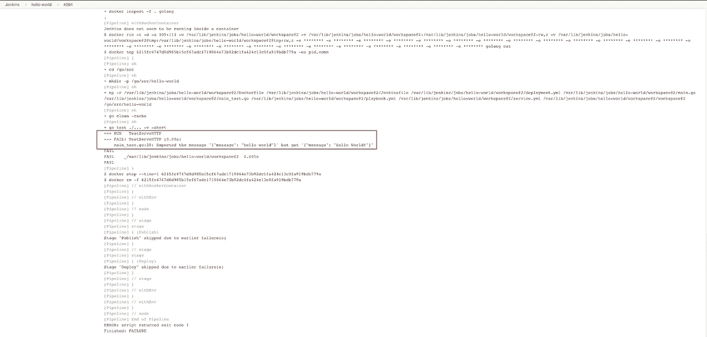

# 与 Kubernetes 和 Jenkins 一起创建 CI/CD 渠道

> 原文：<https://levelup.gitconnected.com/create-a-ci-cd-pipeline-with-kubernetes-and-jenkins-e16ae96bc51e>

*本文原载于*[https://www . magalix . com/blog/create-a-ci/CD-pipeline-with-kubernetes-and-Jenkins](https://www.magalix.com/blog/create-a-ci/cd-pipeline-with-kubernetes-and-jenkins)

CI/CD 是一个经常和其他术语一起出现的术语，比如 DevOps、敏捷、Scrum 和看板、自动化等等。有时，它被认为只是工作流程的一部分，而没有真正理解它是什么或者为什么要采用它。对于年轻的 DevOps 工程师来说，将 CI/CD 视为理所当然是很常见的，他们可能没有见过软件发布周期的“传统”方式，因此不能欣赏 CI/CD。

CI/CD 代表持续集成/持续交付和/或部署。不实施 CI/CD 的团队在创建新的软件产品时必须经过以下阶段:

1.  产品经理(代表客户的利益)提供产品应该具备的必要特性和应该遵循的行为。文档必须尽可能全面和具体。
2.  开发人员和业务分析师通过编写代码、运行单元测试并将结果提交给版本控制系统(例如 git)来开始应用程序的工作。
3.  一旦开发阶段完成，项目就转移到 QA 阶段。针对产品运行了几个测试，比如用户验收测试、集成测试、性能测试等等。在此期间，在 QA 阶段完成之前，不应对代码库进行任何更改。如果有任何 bug，它们会被传回给开发人员来修复，然后将产品交还给 QA。
4.  QA 完成后，运营团队将代码部署到生产环境中。

上述工作流程有许多缺点:

*   首先，从产品经理提出要求到产品准备生产需要很长时间。
*   对于开发人员来说，解决一个月或更久以前编写的代码中的错误是很难的。记住，bug 只有在开发阶段结束，QA 阶段开始后才能被发现。
*   当有一个*紧急*代码变更时，比如一个需要修补的严重错误，由于需要尽快部署，QA 阶段往往会缩短。
*   由于不同团队之间很少协作，当出现 bug 时，人们开始相互指责。每个人都开始只关心项目中他/她自己的部分，而忽略了共同的目标。

CI/CD 通过引入自动化解决了上述问题。代码中的每个更改一旦被推送到版本控制系统，就会得到测试，并进一步部署到登台/UAT 环境中进行进一步的测试，然后再部署到生产环境中供用户使用。自动化确保整个过程快速、可靠、可重复，并且更不容易出错。

关于这个主题已经有了完整的书籍。如何、为什么以及何时在您的基础架构中实施它。然而，只要有可能，我们总是喜欢少理论，多实践。话虽如此，以下是提交代码更改后应执行的自动化步骤的简要描述:

1.  **持续集成(CI):** 第一步不包括 QA。换句话说，它并不关注代码是否提供了客户所要求的特性。相反，它确保了代码的高质量。通过单元测试、集成测试，开发人员很快就会被告知代码质量中的任何问题。我们可以用代码覆盖率和静态分析来进一步增加测试，以获得更多的质量保证。
2.  **用户验收测试:**这是 CD 流程的第一部分。在这个阶段，对代码执行自动化测试，以确保它满足客户的期望。例如，一个 web 应用程序可以正常工作而不抛出任何错误，但是客户希望访问者在导航到主页面之前看到一个提供报价的登录页面。当前代码将访问者直接带到主页面，这偏离了客户的需求。UAT 测试指出了这类问题。在非 CD 环境中，这是人类 QA 测试人员的工作。
3.  **部署:**这是 CD 流程的第二部分。它包括对将要托管应用程序的服务器/pod/容器进行更改，以便它们反映更新的版本。这应该以自动化的方式完成，最好是通过配置管理工具，如 Ansible、Chef 或 Puppet。

管道是一个非常简单的概念的花哨术语；当您有许多脚本需要按照一定的顺序执行来实现一个共同的目标时，它们被统称为“管道”。例如，在 Jenkins 中，一个管道可能由一个或多个*阶段*组成，这些阶段必须全部完成，构建才能成功。使用阶段有助于可视化整个过程，了解每个阶段需要多长时间，并确定构建失败的确切位置。

在本实验室中，我们将构建一个持续交付(CD)管道。我们正在使用一个用 Go 编写的非常简单的应用程序。为了简单起见，我们将只对代码运行一种类型的测试。本实验的先决条件如下:

*   正在运行的 Jenkins 实例。这可以是云实例、虚拟机、裸机或 docker 容器。它必须可以从互联网上公开访问，以便存储库可以通过 web-hooks 连接到 Jenkins。
*   图像注册中心:你可以使用 Docker Registry，一个基于云的产品，比如 [ECR](https://aws.amazon.com/ecr/) 或者 [GCR](https://cloud.google.com/container-registry/) ，或者甚至是一个定制的注册中心。
*   GitHub 上的一个账号。虽然我们在这个例子中使用 GitHub，但是这个过程只需稍加修改就可以与其他存储库(如 Bitbucket)一起工作。

管道可以描述如下:


# 步骤 01:应用程序文件

我们的示例应用程序将使用“Hello World”来响应任何 GET 请求。创建一个名为 main.go 的新文件，并添加以下几行:

```
package mainimport (
   "log"
   "net/http"
)type Server struct{}func (s *Server) ServeHTTP(w http.ResponseWriter, r *http.Request) {
   w.WriteHeader(http.StatusOK)
   w.Header().Set("Content-Type", "application/json")
   w.Write([]byte(`{"message": "hello world"}`))
}func main() {
   s := &Server{}
   http.Handle("/", s)
   log.Fatal(http.ListenAndServe(":8080", nil))
}
```

因为我们正在构建一个 CD 管道，所以我们应该有一些测试。我们的代码非常简单，只需要一个测试用例；确保我们在点击根 URL 时收到正确的字符串。在同一个目录中创建一个名为 main_test.go 的新文件，并添加以下几行:

```
package mainimport (
   "log"
   "net/http"
)type Server struct{}func (s *Server) ServeHTTP(w http.ResponseWriter, r *http.Request) {
   w.WriteHeader(http.StatusOK)
   w.Header().Set("Content-Type", "application/json")
   w.Write([]byte(`{"message": "hello world"}`))
}func main() {
   s := &Server{}
   http.Handle("/", s)
   log.Fatal(http.ListenAndServe(":8080", nil))
}
```

我们还有一些其他文件可以帮助我们部署应用程序，它们的名称是:

**docker file**

这是我们打包应用程序的地方:

```
FROM golang:alpine AS build-env
RUN mkdir /go/src/app && apk update && apk add git
ADD main.go /go/src/app/
WORKDIR /go/src/app
RUN CGO_ENABLED=0 GOOS=linux go build -a -installsuffix cgo -ldflags '-extldflags "-static"' -o app .FROM scratch
WORKDIR /app
COPY --from=build-env /go/src/app/app .
ENTRYPOINT [ "./app" ]
```

Dockerfile 是一个[多级](https://docs.docker.com/develop/develop-images/multistage-build/)文件，以保持图像尺寸尽可能小。它从基于 golang:alpine 的构建图像开始。生成的二进制文件用于第二个图像，这只是一个[临时的](https://hub.docker.com/_/scratch/)图像。临时映像不包含依赖项或库，只包含启动应用程序的二进制文件。

**服务**

因为我们使用 Kubernetes 作为托管这个应用程序的平台，所以我们至少需要一个服务和一个部署。我们的 service.yml 文件如下所示:

```
apiVersion: v1
kind: Service
metadata:
  name: hello-svc
spec:
  selector:
    role: app
  ports:
    - protocol: TCP
      port: 80
      targetPort: 8080
      nodePort: 32000
  type: NodePort
```

这个定义没什么特别的。只是一个使用 NodePort 作为其类型的服务。它将监听任何群集节点的 IP 地址上的端口 32000。传入的连接被中继到端口 8080 上的 pod。对于内部通信，该服务侦听端口 80。

**部署**

应用程序本身一旦被 docker 化，就可以通过部署资源部署到 Kubernetes。deployment.yml 文件如下所示:

```
apiVersion: apps/v1
kind: Deployment
metadata:
  name: hello-deployment
  labels:
    role: app
spec:
  replicas: 2
  selector:
    matchLabels:
      role: app
  template:
    metadata:
      labels:
        role: app
    spec:
      containers:
      - name: app
        image: ""
        resources:
          requests:
            cpu: 10m
```

这个部署定义最有趣的地方是图像部分。我们使用了一个变量，而不是硬编码图像名称和标签。稍后，我们将看到如何使用这个定义作为 Ansible 的模板，并通过命令行参数替换映像名称(以及部署的任何其他参数)。

**战术手册**

在本实验中，我们使用 Ansible 作为部署工具。部署 Kubernetes 资源还有很多其他方式，包括[掌舵图](https://helm.sh/)，但我认为 Ansible 是一个更简单的选择。Ansible 使用剧本来组织它的指令。我们的 playbook.yml 文件如下所示:

```
- hosts: localhost
  tasks:
  - name: Deploy the service
    k8s:
      state: present
      definition: ""
      validate_certs: no
      namespace: default
  - name: Deploy the application
    k8s:
      state: present
      validate_certs: no
      namespace: default
      definition: ""
```

Ansible 已经包含了 [k8s 模块](https://docs.ansible.com/ansible/latest/modules/k8s_module.html)，用于处理与 Kubernetes API 服务器的通信。因此，我们不需要安装 [kubectl](https://kubernetes.io/docs/reference/kubectl/overview/) ，但是我们需要一个有效的 kubeconfig 文件来连接到集群(稍后会详细介绍)。让我们快速讨论一下本行动手册的重要部分:

*   行动手册用于向集群部署服务和资源。
*   由于我们需要在执行时将数据动态地注入到定义文件中，所以我们需要将我们的定义文件用作模板，其中变量可以从外部提供。
*   为此，Ansible 提供了 lookup 函数，您可以将有效的 YAML 文件作为模板传递。Ansible 支持多种将变量注入模板的方式。在这个特定的实验中，我们使用命令行方法。

# 步骤 2:安装 Jenkins、Ansible 和 Docker

让我们安装 Ansible 并使用它来自动部署一个 Jenkins 服务器和 Docker 运行时环境。我们还需要安装 openshift Python 模块，使 Ansible 能够与 Kubernetes 连接。

Ansible 的安装非常容易；只需安装 Python 并使用 pip 安装 Ansible:

1.  登录到 Jenkins 实例
2.  安装 Python 3、Ansible 和 openshift 模块:

```
sudo apt update && sudo apt install -y python3 && sudo apt install -y python3-pip && sudo pip3 install ansible && sudo pip3 install openshift
```

3.默认情况下，pip 将二进制文件安装在用户主文件夹的隐藏目录下。我们需要将这个目录添加到$PATH 变量中，这样我们就可以轻松地调用命令:

```
echo "export PATH=$PATH:~/.local/bin" >> ~/.bashrc && . ~/.bashrc
```

4.安装部署 Jenkins 实例所需的 Ansible 角色:

```
ansible-galaxy install geerlingguy.jenkins
```

5.安装 Docker 角色:

```
ansible-galaxy install geerlingguy.docker
```

6.创建行动手册。YAML 文件并添加以下几行:

```
- hosts: localhost
  become: yes
  vars:
    jenkins_hostname: 35.238.224.64
    docker_users:
    - jenkins
  roles:
    - role: geerlingguy.jenkins
    - role: geerlingguy.docker
```

7.通过以下命令运行剧本:ansible-playbook playbook.yaml。注意，我们使用实例的公共 IP 地址作为 Jenkins 将使用的主机名。如果使用 DNS，可能需要用实例的 DNS 名称替换它。另外，请注意，在运行行动手册之前，您必须在防火墙上启用端口 8080(如果有)。

8.几分钟后，詹金斯应该安装完毕。您可以通过导航到机器的 IP 地址(或 DNS 名称)并指定端口 8080 来进行检查:


9.单击登录链接，提供用户名“admin”和密码“admin”。请注意，这些是由我们使用的 Ansible 角色设置的默认凭据。在生产环境中使用 Jenkins 时，您可以(也应该)更改这些默认值。这可以通过设置角色变量来实现。可以参考[角色官方页面](https://galaxy.ansible.com/geerlingguy/jenkins)。

10.您需要做的最后一件事是安装以下将在我们的实验室中使用的插件:

*   饭桶
*   管道
*   CloudBees Docker 构建和发布
*   开源代码库

# 步骤 03:配置 Jenkins 用户以连接到集群

如前所述，本实验假设您已经启动并运行了一个 Kubernetes 集群。为了使 Jenkins 能够连接到这个集群，我们需要添加必要的 kubeconfig 文件。在这个特定的实验中，我们使用的是托管在 Google Cloud 上的 Kubernetes 集群，因此我们使用 gcloud 命令。你的具体情况可能不同。但是在任何情况下，我们都必须将 kubeconfig 文件复制到 Jenkins 的用户目录中，如下所示:

```
$ sudo cp ~/.kube/config ~jenkins/.kube/
$ sudo chown -R jenkins: ~jenkins/.kube/
```

请注意，您将在此使用的帐户必须拥有创建和管理部署和服务的必要权限。

# 步骤 04:创建 Jenkins 管道作业


创建新的 Jenkins 作业并选择管道类型。作业设置应该如下所示:


我们更改的设置是:

*   我们使用 Poll SCM 作为构建触发器；设置该选项指示 Jenkins 定期检查 Git 存储库(每分钟* * * * *)一次。如果自上次轮询以来回购发生了更改，则触发该作业。
*   在管道本身中，我们指定了存储库 URL 和凭证。树枝是主人。
*   在本实验中，我们将作业的所有代码添加到 Jenkinsfile 中，该文件与代码存储在同一个存储库中。本文稍后将讨论 Jenkinsfile。

# 步骤 05:为 GitHub 和 Docker Hub 配置 Jenkins 凭证

转到[/credentials/store/system/domain/_/new credentials](http://35.238.224.64:8080/credentials/store/system/domain/_/newCredentials)并将凭证添加到两个目标。请确保为每个文件提供一个有意义的 ID 和描述，因为您稍后会引用它们:


# 步骤 06:创建 JenkinsFile

Jenkinsfile 指导 Jenkins 如何构建、测试、归档、发布和交付我们的应用程序。我们的 Jenkinsfile 如下所示:

```
pipeline {
   agent any
   environment {
       registry = "magalixcorp/k8scicd"
       GOCACHE = "/tmp"
   }
   stages {
       stage('Build') {
           agent {
               docker {
                   image 'golang'
               }
           }
           steps {
               // Create our project directory.
               sh 'cd ${GOPATH}/src'
               sh 'mkdir -p ${GOPATH}/src/hello-world'
               // Copy all files in our Jenkins workspace to our project directory.               
               sh 'cp -r ${WORKSPACE}/* ${GOPATH}/src/hello-world'
               // Build the app.
               sh 'go build'              
           }    
       }
       stage('Test') {
           agent {
               docker {
                   image 'golang'
               }
           }
           steps {                
               // Create our project directory.
               sh 'cd ${GOPATH}/src'
               sh 'mkdir -p ${GOPATH}/src/hello-world'
               // Copy all files in our Jenkins workspace to our project directory.               
               sh 'cp -r ${WORKSPACE}/* ${GOPATH}/src/hello-world'
               // Remove cached test results.
               sh 'go clean -cache'
               // Run Unit Tests.
               sh 'go test ./... -v -short'           
           }
       }
       stage('Publish') {
           environment {
               registryCredential = 'dockerhub'
           }
           steps{
               script {
                   def appimage = docker.build registry + ":$BUILD_NUMBER"
                   docker.withRegistry( '', registryCredential ) {
                       appimage.push()
                       appimage.push('latest')
                   }
               }
           }
       }
       stage ('Deploy') {
           steps {
               script{
                   def image_id = registry + ":$BUILD_NUMBER"
                   sh "ansible-playbook  playbook.yml --extra-vars \"image_id=${image_id}\""
               }
           }
       }
   }
}
```

这个文件比看起来容易。基本上，管道包含四个阶段:

1.  构建是我们构建 Go 二进制文件并确保在构建过程中没有任何错误的地方。
2.  在测试中，我们应用一个简单的 UAT 测试来确保应用程序按预期工作。
3.  发布，在这里构建 Docker 映像并将其推送到注册中心。之后任何环境都可以利用。
4.  部署，这是调用 Ansible 联系 Kubernetes 并应用定义文件的最后一步。

现在，让我们讨论这个 Jenkinsfile 文件的重要部分:

*   前两个阶段大体相似。他们都使用 golang Docker 映像来构建/测试应用程序。让 stage 在 Docker 容器中运行总是一个好的做法，该容器已经包含了所有必需的构建和测试工具。另一种选择是将这些工具安装在主服务器或其中一个从服务器上。当您需要针对不同的工具版本进行测试时，问题就开始出现了。例如，也许我们想使用 Go 1.9 构建和测试我们的代码，因为我们的应用程序还不能使用最新的 Golang 版本。在一个图像中包含所有内容使得改变版本甚至图像类型就像改变一个字符串一样简单。
*   发布阶段(从第 42 行开始)从指定一个环境变量开始，该变量将在后面的步骤中使用。变量指向我们在前面的步骤中添加到 Jenkins 的 Docker Hub 凭证的 ID。
*   第 48 行:我们使用 docker 插件来构建图像。默认情况下，它使用注册表中的 Dockerfile，并添加内部版本号作为图像标签。稍后，当您需要确定哪个 Jenkins 版本是当前运行的容器的源时，这将非常重要。
*   第 49–51 行:映像构建成功后，我们使用构建号将其推送到 Docker Hub。此外，我们将“latest”标签添加到图像中(第二个标签),这样我们允许用户在不指定构建号的情况下获取图像，如果他们需要的话。
*   第 56–60 行:部署阶段是我们将部署和服务定义文件应用到集群的阶段。我们使用前面讨论过的剧本来调用 Ansible。注意，我们将 image_id 作为命令行变量传递。该值会自动替换部署文件中的映像名称。

本文的最后一部分是我们实际测试工作的地方。我们将把我们的代码提交给 GitHub，并确保我们的代码通过管道，直到它到达集群:

1.  添加我们的文件:git add *
2.  提交我们的更改:git commit -m“初始提交”
3.  推送至 GitHub: git push
4.  在 Jenkins 上，我们可以等待作业自动触发，也可以直接点击“立即构建”。
5.  如果作业成功，我们可以使用以下命令检查部署的应用程序:

获取节点 IP 地址:

```
kubectl get nodes -o wide
NAME                                          STATUS   ROLES    AGE   VERSION          INTERNAL-IP   EXTERNAL-IP     OS-IMAGE                             KERNEL-VERSION   CONTAINER-RUNTIME
gke-security-lab-default-pool-46f98c95-qsdj   Ready       7d    v1.13.11-gke.9   10.128.0.59   35.193.211.74   Container-Optimized OS from Google   4.14.145+        docker://18.9.7
```

现在，让我们向我们的应用程序发起一个 HTTP 请求:

```
$ curl 35.193.211.74:32000
{"message": "hello world"}
```

好了，我们可以看到我们的应用程序工作正常。让我们在代码中故意犯一个错误，并确保管道不会将错误代码发送到目标环境:

将应该显示的消息更改为“Hello World！”请注意，我们将每个单词的第一个字母大写，并在末尾添加了一个感叹号。因为我们的客户可能不希望消息以这种方式显示，所以管道应该在测试阶段停止。

首先，让我们做出改变。main.go 文件现在应该是这样的:

```
package mainimport (
   "log"
   "net/http"
)type Server struct{}func (s *Server) ServeHTTP(w http.ResponseWriter, r *http.Request) {
   w.WriteHeader(http.StatusOK)
   w.Header().Set("Content-Type", "application/json")
   w.Write([]byte(`{"message": "Hello World!"}`))
}func main() {
   s := &Server{}
   http.Handle("/", s)
   log.Fatal(http.ListenAndServe(":8080", nil))
}
```

接下来，让我们提交并推送我们的代码:

```
$ git add main.go
$ git commit -m "Changes the greeting message"                                                                                                       
[master 24a310e] Changes the greeting message
 1 file changed, 1 insertion(+), 1 deletion(-)
$ git push
Counting objects: 3, done.
Delta compression using up to 4 threads.
Compressing objects: 100% (3/3), done.
Writing objects: 100% (3/3), 319 bytes | 319.00 KiB/s, done.
Total 3 (delta 2), reused 0 (delta 0)
remote: Resolving deltas: 100% (2/2), completed with 2 local objects.
To [https://github.com/MagalixCorp/k8scicd.git](https://github.com/MagalixCorp/k8scicd.git)
   7954e03..24a310e  master -> master
```

回到 Jenkins，我们可以看到最后一次构建失败了:


通过单击失败的作业，我们可以看到失败的原因:



我们的错误代码永远不会到达目标环境。

# TL；速度三角形定位法(dead reckoning)

*   CI/CD 是任何遵循敏捷方法的现代环境中不可或缺的一部分。
*   通过管道，您可以确保代码从版本控制系统到目标环境(测试/试运行/生产等)的平稳过渡。)同时应用所有必要的测试和质量控制实践。
*   在本文中，我们有一个实际的实验室，在那里我们构建了一个连续的交付管道来部署 Golang 应用程序。
*   通过 Jenkins，我们能够从存储库中提取代码，使用相关的 Docker 映像进行构建和测试。
*   接下来，我们将我们的应用程序进行 Docker 化并推送到 Docker Hub，因为它已经通过了我们的测试。
*   最后，我们使用 Ansible 将应用程序部署到运行 Kubernetes 的目标环境中。
*   使用 Jenkins pipelines 和 Ansible 可以非常容易和灵活地改变工作流，而几乎没有摩擦。例如，我们可以在测试阶段添加更多的测试，我们可以更改用于构建和测试代码的 Go 版本，我们可以使用更多的变量来更改部署和服务定义的其他方面。
*   这里最好的部分是我们使用 Kubernetes 部署，这确保我们在更改容器映像时应用程序不会停机。这是可能的，因为部署默认情况下使用滚动更新方法一次终止和重新创建一个容器。只有当新容器正常运行时，部署才会终止旧容器。

*原载于 2020 年 2 月 4 日*[*【https://www.magalix.com】*](https://www.magalix.com/blog/create-a-ci/cd-pipeline-with-kubernetes-and-jenkins)*。*