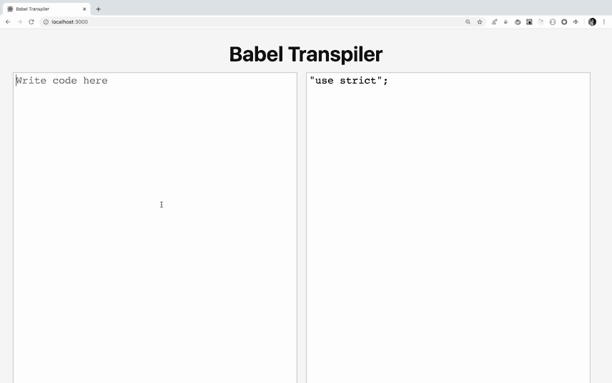
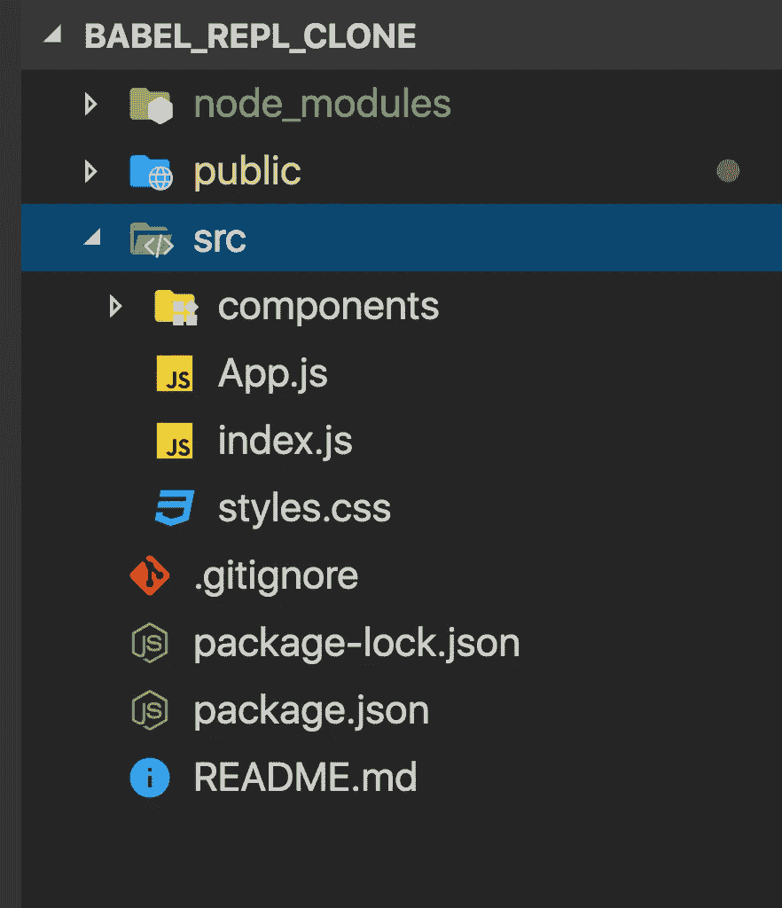
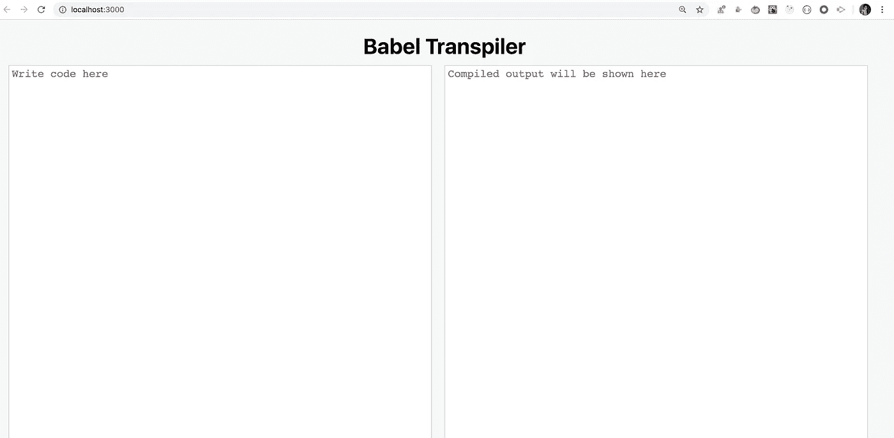
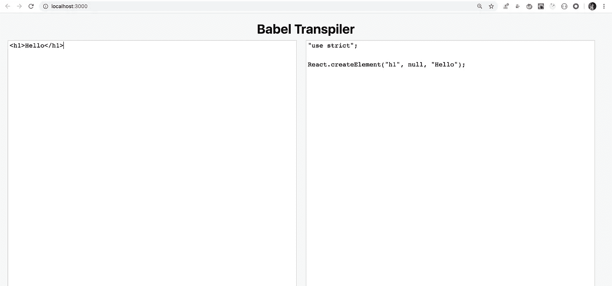

# 创建一个巴别塔 REPL 网站的克隆，将 ES6/React 代码转换为 ES5

> 原文：<https://levelup.gitconnected.com/create-a-clone-of-babel-repl-site-to-convert-es6-react-code-to-es5-93cdc9ad98ea>

## 了解如何创建 ES6 到 ES5 代码转换应用程序



在本文中，我们将创建一个 https://babeljs.io/repl 站点[的克隆，这是一个检查 ES6 代码到 ES5 代码转换的平台。](https://babeljs.io/repl)

所以我们在左边区域写 ES6/React 代码，我们将在右边区域得到转换后的 ES5 代码。

`Babel`是将 ES6 转换成 ES5 代码的最流行的 trans piler/编译器。

如果你是 React 开发人员，你可能知道 React JSX 语法和 ES6 代码不直接在浏览器中运行，所以我们使用`create-react-app`，它在内部使用`Babel`将 React 代码转换成浏览器可以正确呈现的 ES5 代码。

因此，在这个小应用程序中，我们将实现一个 babel transpiler 转换，将任何 ES6/React 代码转换为 ES5 代码。

所以让我们开始吧。

我们将使用`create-react-app`来初始化项目。

通过运行以下命令创建一个新项目

```
create-react-app babel_repl_clone
```

项目创建完成后，删除`src`文件夹中的所有文件，并在`src`文件夹中创建`index.js`、`App.js`、`styles.css`和`components`文件夹。

因此，您的文件夹结构将如下所示



在`src/components`文件夹中创建`Error.js`并添加以下代码

```
import React from 'react';const Error = ({ errorMsg }) => {
  return <pre className="errorMsg">{errorMsg}</pre>;
};export default Error;
```

该组件将显示将代码从 ES6 转换为 ES5 时收到的错误消息。

在`src/components` 文件夹中创建`Input.js`并添加以下代码:

```
import React from 'react';
import Error from './Error';const Input = ({ input, handleInputChange, errorMsg }) => {
 return (
  <div className="input">
   <textarea
    className="input-box"
    placeholder="Write code here"
    value={input}
    onChange={handleInputChange}
  />
  {errorMsg && (
   <div className="error">
    <Error errorMsg={errorMsg} />
   </div>
  )}
 </div>
);
};export default Input;
```

在这里，我们显示左侧区域，在这里我们编写需要转换的代码，还有`Error`组件，只有在转换过程中出现错误时才会显示。

在`src/components`文件夹中创建`Output.js`并添加以下代码:

```
import React from 'react';const Output = ({ output, hasError }) => {
 return (
  <div className="output">
   <textarea
    className="output-box"
    value={hasError ? '' : output}
    readOnly={true}
    placeholder="Compiled output will be shown here" />
  </div>
 );
};export default Output;
```

该组件显示最终转换的代码，它是只读代码

现在安装我们将用于转换的`babel-standalone` npm 包。

```
npm install @babel/standalone@7.8.7
```

使用安装`lodash`库

```
npm install lodash@4.17.15
```

打开`src/styles.css`并添加以下代码:

现在，打开`src/App.js`并添加以下代码:

这里我们使用 react 钩子来管理输入和输出状态。如果你是 react 钩子的新手，看看这篇文章中关于 react 钩子的介绍。

打开`src/index.js`并添加以下代码:

```
import React from 'react';
import ReactDOM from 'react-dom';
import App from './App';const rootElement = document.getElementById('root');
ReactDOM.render(<App />, rootElement);
```

现在，使用`npm start`运行应用程序，您将看到下面的初始屏幕。



现在，让我们编写代码，将 ES6 代码转换成 ES5 代码。

打开`App.js`，导入文件顶部的`babel-standalone`包。

```
import * as babel from '@babel/standalone';
```

并将`handleInputChange`方法改为下面的代码:

这里，我们使用的是`Babel`的`transform`方法，将用户输入的代码作为`input`传递，并分别提供用于转换 React 和 ES6 代码的`react`和`env`预置。env 包括所有其他预置，如`ES2015`、`ES2016`和`ES2017`等，因此无需分别指定。然后，我们将结果返回到分配给`result`变量的`code`属性中，并更新所有的`input`、`output`和`error message`状态。

现在，如果您在应用程序的输入部分键入`<h1>Hello</h1>`，您将在应用程序的输出部分看到转换后的代码。



现在，如果你转到[https://babeljs.io/repl](https://babeljs.io/repl)并键入相同的代码`<h1>Hello</h1>`，你会看到它产生与我们的应用程序相同的结果。但是在 https://babeljs.io/repl 网站上你会注意到的一件事是，它不会在你打字的时候立即显示转换后的代码或错误，而是在你停止打字的时候才显示出来，这样对用户更友好。

但是在我们的应用程序中，错误消息/输出会在您仍在键入时立即显示。所以让我们来解决这个问题。

*为此，我们将使用由* `*lodash*` *提供的* `*debounce*` *方法，该方法允许我们在经过一定数量的毫秒后执行一些代码。在我们的例子中，我们将在* `*1000*` *毫秒后调用转换函数，即用户停止输入 1 秒后。*

用以下代码替换`src/App.js`代码。

让我们通过代码中添加的注释来理解代码。

1.在`Change 1`，我们增加了`useEffect`和`useRef`吊钩进口。

2.在`Change 2`，我们已经创建了一个`ref`，我们将使用它来存储由`lodash`的`debounce`方法返回的函数。

3.在`Change 3`处，我们已经定义了`useEffect`钩子。在这个效果中，我们存储了由`debounce`方法返回的函数。这个初始化只需要在组件挂载时做一次，所以我们添加了一个空数组`( [] )`作为`useEffect`的第二个参数，这是一种在钩子中实现`componentDidMount`生命周期方法的方法。

让我们理解下面这行代码在做什么

```
ref.current = _.debounce(generateResult, 1000);
```

这里我们通过传递一个`generateResult`函数来调用`debounce`方法(我们在后面声明了这个函数),这个函数将在用户停止输入一秒钟后被调用。为了调用`generateResult`函数，我们必须调用存储在`ref.current`中的函数

4.在`Change 4`中，我们已经更新了`generateResult`函数来生成和设置`output`状态

5.在`Change 5`中，我们调用存储在`ref.current`中的函数，一旦用户停止输入，该函数将在一秒钟后内部调用`generateResult`函数。

如果你仍然不能理解`debounce`在这里是如何工作的，看看`debounce`方法文档[这里](https://lodash.com/docs/4.17.15#debounce)

> 注意:我们使用了`ref.current`来存储`debounce`返回的函数，因为它将在重新渲染时保留其值，不会丢失。这是钩子提供的一种方法，用来在重新渲染时保留对某个值的引用。

现在，如果您重新运行并检查应用程序，您将看到它的行为与[https://babeljs.io/repl](https://babeljs.io/repl)相同，在显示输出/错误之前等待用户停止键入。

天气真凉爽。

在[https://babeljs.io/repl](https://babeljs.io/repl)中你会注意到的另一件事是，当你刷新页面或在另一个标签页中打开[https://babeljs.io/repl](https://babeljs.io/repl)时，你输入要转换的代码不会丢失。所以它会记住你输入的代码。让我们在应用程序中实现同样的功能。

为此，我们将使用`localStorage`来存储代码。如果你不知道`localStorage`是什么，那么看看[这篇文章](https://medium.com/javascript-in-plain-english/everything-you-need-to-know-about-html5-local-storage-and-session-storage-479c63415c0a)

所以让我们开始吧。

在`src/App.js`中的第一个`useEffect`调用后添加以下代码

```
useEffect(() => {
 try {
  setInput(JSON.parse(localStorage.getItem('babel_code')));
 }catch (e) {
  setInput('');
 }
}, []);useEffect(() => {
 localStorage.setItem('babel_code', JSON.stringify(input));
}, [input]);
```

在第一个`useEffect`中，我们使用`JSON.parse`方法从`localstorage`中读取值(如果存在),并将其设置为`input`状态。如果在`parsing`或`reading`期间出现错误，我们将为`input`状态设置一个空字符串。注意，我们已经提供了空数组作为`useEffect`调用的第二个参数。这将确保在安装组件时只调用一次代码。

在第二个`useEffect`中，我们用来自`input`状态的用户键入的代码更新`localStorage`。由于我们在依赖数组中提供了`input`变量作为`useEffect`的第二个参数，所以`useEffect`中的代码只有在`input`状态改变时才会被执行，所以它相当于`componentDidUpdate`方法

下面是最后的`App.js`代码

完整源代码:[https://github.com/myogeshchavan97/babel_repl_clone](https://github.com/myogeshchavan97/babel_repl_clone)

现场演示:[https://babel-repl-clone.now.sh/](https://babel-repl-clone.now.sh/)

今天到此为止。希望你今天学到了新东西。

**别忘了订阅我的每周简讯，里面有惊人的技巧、窍门和文章，直接在这里的收件箱** [**中。**](https://yogeshchavan.dev/)