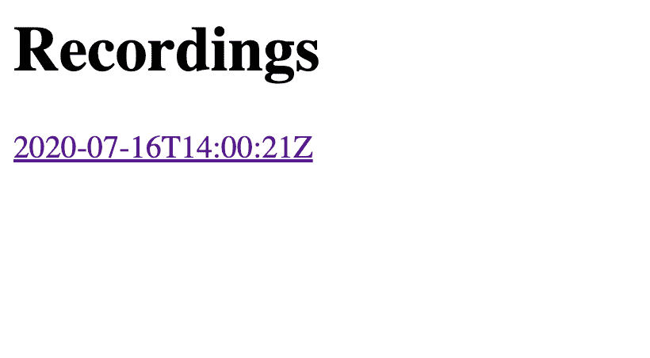
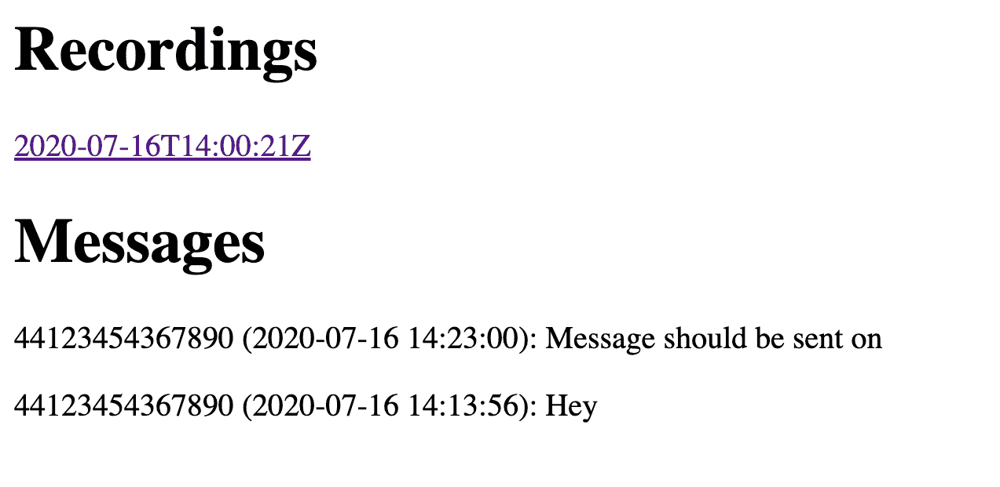

# 使用 Node.js 创建行为准则事件行

> 原文：<https://levelup.gitconnected.com/create-a-code-of-conduct-incident-line-with-node-js-b2664b7d6dbb>

作为社区组织者，拥有行为准则只是故事的一部分。拥有一个深思熟虑的方式来报告和应对不良行为也是至关重要的。在我过去参加的活动中，电话号码是提供给参与者的一种方式。他们可以打电话或发短信，号码会被转发给几个负责处理任何问题的组织者。

今天，我将向您展示如何使用 Vonage [Voice](https://developer.nexmo.com/voice/voice-api/overview) 和[Messages](https://developer.nexmo.com/messages/overview)API 来构建您自己的 API，包括一个简单的仪表板来下载通话录音和记录传入的消息。

您可以在[https://github . com/NEX mo-community/node-code-of-conduct-conference-call](https://github.com/nexmo-community/node-code-of-conduct-conference-call)找到最终的项目代码

# 先决条件

*   安装在您机器上的 [Node.js](https://nodejs.org/en/)
*   一个 [Vonage API 账户](https://dashboard.nexmo.com) —记下你在仪表盘上的 API 密匙&
*   `node-cli`，可以通过运行`npm install nexmo-cli@beta -g`来安装

创建一个新目录，并在终端中打开它。运行`npm init -y`创建一个`package.json`文件并安装与`npm install express body-parser nunjucks uuid nedb-promises nexmo@beta`的依赖关系。

# Vonage API 帐户

要完成本教程，您将需要一个 [Vonage API 帐户](http://developer.nexmo.com/ed?c=blog_text&ct=2020-07-21-create-a-code-of-conduct-incident-line-with-node-js)。如果你还没有，你可以今天就[注册](http://developer.nexmo.com/ed?c=blog_text&ct=2020-07-21-create-a-code-of-conduct-incident-line-with-node-js)开始用免费的信用点数来建造。一旦你有了账户，你可以在 [Vonage API 仪表板](http://developer.nexmo.com/ed?c=blog_text&ct=2020-07-21-create-a-code-of-conduct-incident-line-with-node-js)的顶部找到你的 API 密匙和 API 秘密。

# 设置相关性

创建一个`index.js`文件并设置依赖关系:

索引. js

一旦你完成了这些，在一个新的终端中运行`npx ngrok http 3000`，并记下临时的 ngrok URL。这用于使`localhost:3000`对公共网络可用。

# 购买虚拟号码并设置 Nexmo 客户端

在项目目录中打开另一个终端，并使用命令行界面(CLI)创建一个新的应用程序:

记下终端中显示的应用 ID，然后搜索一个号码(您可以用您的国家代码替换 GB):

将其中一个数字复制到您的剪贴板，购买并链接到您的应用程序:

在`index.js`中，初始化 Nexmo 客户端:

# 用语音应答来电

创建`GET /answer`端点，并通过一个`talk`动作返回一个 [Nexmo 呼叫控制对象(NCCO)](https://developer.nexmo.com/voice/voice-api/ncco-reference) :

`POST /event`端点稍后将接收到呼叫数据，现在只需用`HTTP 200 OK`状态进行响应。

**检查点:通过运行** `**node index.js**` **启动您的服务器，然后用 CLI 呼叫您购买的号码——您应该大声读出消息，然后呼叫应该挂断。如果有问题，您可以随时在** [**仪表盘**](https://dashboard.nexmo.com) **中查看数字和应用程序设置。**

# 通过拨入组织者来回复来电

不要只是读出信息，把打电话的人加入到一个全新的对话中。我们可以用代码控制对话，包括在呼叫中添加多个参与者——您只需要知道对话名称就可以做到这一点。将`/answer`端点的内容替换为:

此代码生成一个新的唯一 ID，然后将调用方添加到一个使用名称作为标识符的会话中(在此上下文中，会话是多一个参与者的调用)。然而，一个人的电话会议是悲伤的。在`res.json()`之前，给每个组织者打电话，并将他们加入电话会议:

每个数字必须采用 [E.164 格式](https://developer.nexmo.com/voice/voice-api/guides/numbers#formatting)，并且您应该用与您的应用程序相关联的数字来替换`NEXMO NUMBER`。测试时，请确保数组中的数字与您将用来调用的数字不同。

**检查点:重启你的服务器，调用你的 Nexmo 号。应用程序应该使用 for()循环数组中提供的任何数字。**

# 记录通话

当将呼叫者添加到电话会议时，`record: true`作为一个选项被传递，因此，整个呼叫被记录下来。一旦调用完成，端点`POST /event`就会被发送一个包含对话 ID 和记录 URL 的有效负载。

在现有端点创建新的 nedb 数据库之前:

一旦你重启你的服务器，一个文件将会在一个`data`目录下被创建。更新事件端点，如下所示:

**检查点:重启你的服务器，调用你的 Nexmo 号。一旦所有参与者挂断电话，您应该会在 *data/recordings.db* 文件中看到一个新条目。**

# 创建录制仪表板

现在记录数据保存在数据库中；是时候创建一个仪表板了。在第一个端点之前配置 nunjucks:

这将设置 nunjucks 来呈现`views`目录中的任何文件，并链接到存储在`app`变量中的 express 应用程序。创建一个`views`目录并在其中创建一个`index.html`文件:

还在`views`目录中创建一个`details.html`文件:

在`index.js`中需要三个端点来让这些视图工作。第一个从数据库加载所有记录，并呈现索引页面:

该页面现在看起来像这样，最新的记录在最前面:

下一个端点在从 Conversations API 获得详细信息后加载详细信息页面，包括呼叫者的电话号码:

最后，端点从 API 获取原始音频文件，并将其作为可下载的 MP3 发送:

**检查点:重启你的服务器，调用你的 Nexmo 号。通话结束后，您应该会在仪表板上看到新条目。请转到详细信息页面下载。**

# 接受并保存短信

作为一个电话号码，一些使用这项服务的人也可以发送短信给它。使用类似的模式，这些消息将被存储并显示在仪表板上。在现有数据库创建的下面，添加一个新的消息数据库:

通过创建我们之前在设置虚拟号码时指向的端点来保存收到的新消息:

更新仪表板端点以检索和显示消息:

将此部分添加到`index.html`的底部:

**检查点:重启你的服务器，发送短信到你的 Nexmo 号码。刷新后，您应该会看到它出现在您的仪表板上。**

# 转发短信并发送回复

最后，更新 SMS 端点以将消息转发给组织者并回复发送者:

检查点:重启你的服务器，向你的 Nexmo 号码发送短信。您应该会收到回复，所有列出的组织者也应该会收到消息。

# 后续步骤

恭喜你！现在，您有了一条适用于电话和短信的行为准则事件响应热线。如果您有更多的时间，您可能想探索:

你可以在[https://github . com/NEX mo-community/node-code-of-conduct-conference-call](https://github.com/nexmo-community/node-code-of-conduct-conference-call)找到最终的项目代码

一如既往，如果你需要任何支持，请随时联系 [Vonage 开发者社区 Slack](https://developer.nexmo.com/community/slack) 。我们希望在那里见到你。

*最初发布于*[*https://www . NEX mo . com/blog/2020/07/21/create-a-code-of-conduct-incident-line-with-node-js*](https://www.nexmo.com/blog/2020/07/21/create-a-code-of-conduct-incident-line-with-node-js)