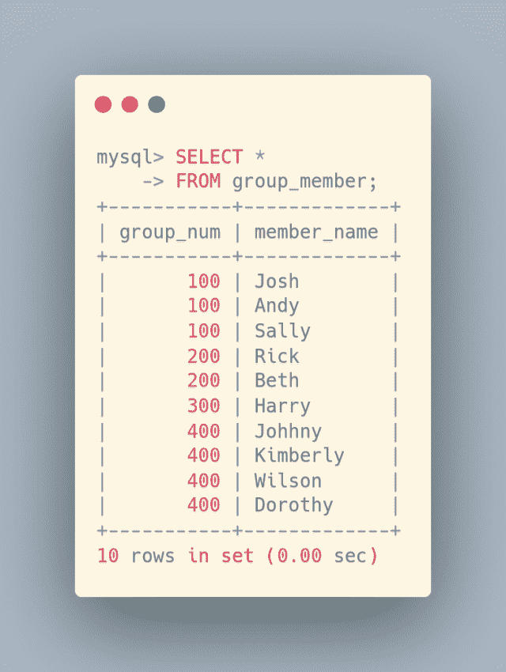
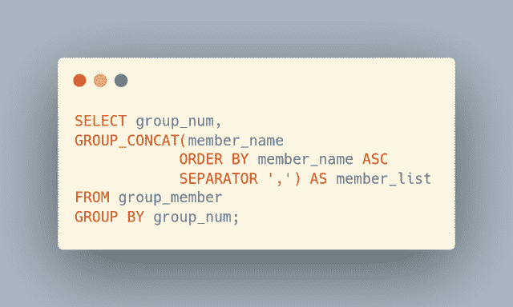

# 用 MySQL GROUP_CONCAT()创建一个逗号分隔的列表

> 原文：<https://levelup.gitconnected.com/create-a-comma-separated-list-with-mysql-group-concat-956a5c9ff0c5>

在这篇博客文章中，我们将学习如何使用 MySQL `GROUP_CONCAT()`函数将值集合分组到一个逗号分隔的列表中。继续阅读了解更多信息…

需要学习 MySQL 吗？刚刚起步，对如何查询一个表，获取自己需要的数据感到困惑？出于这个特殊的原因，我正在创建优质的 MySQL 初学者内容。来帮助那些想学习 MySQL 基础知识却不知道从何入手的人。[了解更多关于我开发和发布的优质博客文章的信息](https://digitalowlsprose.ck.page/03da7bb182)。

自我推销:

如果你喜欢这里写的内容，尽一切办法，把这个博客和你最喜欢的帖子分享给其他可能从中受益或喜欢它的人。既然咖啡是我最喜欢的饮料，如果你愿意，你甚至可以给我买一杯！

每天通过 Refind 将定制的文章发送到您的收件箱。Refind 是我日常阅读习惯的一部分。使用[我的推荐链接](https://refind.com/joshua-otwell?invite=5440c95e39)让它成为你的一部分。在不增加您费用的情况下，我将有资格通过我的链接获得更多注册的高级订阅。****网络的精华，每天早上都在你的收件箱里。免费订阅****

*****OpenLampTech*** 是面向 PHP 和 MySQL 开发者的时事通讯。由开发人员为开发人员创建。[今日加入](http://openlamptech.substack.com)。**

**我将这个虚构的“group_member”表用于查询数据和示例。有 4 个不同的组:分别为 100、200、300 和 400。**

****

**表组 _ 成员数据**

**要将每个“成员名”按字母顺序放入各自的组中，我们可以使用`GROUP_CONCAT()`函数和`GROUP BY`的“组号”列，指定一个逗号作为`SEPARATOR`值:**

****

**MySQL GROUP_CONCAT()函数查询。**

****

**使用 GROUP_CONCAT()以逗号分隔的名称列表**

**你是[中](http://medium.com/)成员吗？如果是这样的话，[每次我发表博客文章的时候都会收到一封电子邮件通知](https://parabollus.medium.com/subscribe)如果你更喜欢中型平台的话。不是会员？别担心！使用[我的注册链接](https://parabollus.medium.com/membership)(我会向你收取佣金，无需额外费用)并加入。我真的很喜欢阅读所有伟大的内容，我知道你也会！！！**

**我提供了一个上面代码的视频短片，这样你就可以看到它是如何工作的。访问[数字猫头鹰散文](http://joshuaotwell.com)网站上的原文查看。**

**把你的零钱扔进我的[小费罐](https://digitalowlsprose.ck.page/products/appreciation-support)，以示你对我内容的支持和欣赏。**

**喜欢你读过的？看到什么不正确的吗？请在下面评论，感谢阅读！！！**

# **行动的号召！**

**感谢你花时间阅读这篇文章。我真心希望你发现了一些有趣和有启发性的东西。请在这里与你认识的其他人分享你的发现，他们也会从中获得同样的价值。**

**访问[投资组合-项目页面](https://wp.me/P28ctb-3KD)，查看我为客户完成的博客帖子/技术写作。**

**[**咖啡是我最喜欢的饮料！！！**](https://ko-fi.com/joshlovescoffee)**

**要在最新的博客文章发表时收到来自本博客(“数字猫头鹰散文”)的电子邮件通知(绝不是垃圾邮件)，请点击“点击订阅！”按钮在首页的侧边栏！(如有任何问题，请随时查看 [Digital Owl 的散文隐私政策页面](https://wp.me/P28ctb-3gI):电子邮件更新、选择加入、选择退出、联系表格等……)**

**请务必访问[“最佳”](https://joshuaotwell.com/where-blog_post-in-digital-owls-prose-best-of/)页面，收集我的最佳博文。**

**[Josh Otwell](https://joshuaotwell.com/about/) 作为一名 SQL 开发人员和博客作者，他热衷于学习和成长。其他最喜欢的活动是让他埋头于一本好书、一篇文章或 Linux 命令行。其中，他喜欢桌面 RPG 游戏，阅读奇幻小说，并与妻子和两个女儿共度时光。**

**免责声明:本文中的例子是关于如何实现类似结果的假设。它们不是最好的解决方案。所提供的大多数(如果不是全部)示例都是在个人发展/学习工作站环境中执行的，不应被视为生产质量或就绪。您的特定目标和需求可能会有所不同。使用那些最有利于你的需求和目标的实践。观点是我自己的。**

*****有什么可以帮你的*** ？**

*   **你想开一个博客吗？我用 WordPress 写博客。让我们都在提供的计划上省钱。💸**
*   **从[我的 Etsy 商店](https://www.etsy.com/shop/digitalowlsprose/)获取一个 Gmail HTML 电子邮件签名模板，让你的电子邮件显得与众不同。✉️**
*   **需要托管你的下一个网络应用程序或 WordPress 网站吗？我使用并强烈推荐 [Hostinger](https://www.hostg.xyz/aff_c?offer_id=6&aff_id=94641) 。他们有很好的价格和服务。**
*   **我喜欢每天早上在你的收件箱里阅读 Refind: *网络的精髓。免费订阅*。通过我的推荐链接为您自己[注册，帮助我获得高级订阅。](https://refind.com/joshua-otwell?invite=5440c95e39)**
*   **获取一个免费的手机*创作者*壁纸包。**
*   **刚入门还是想学 MySQL？在这里找到我的[高级博客文章和 MySQL 初学者系列](https://digitalowlsprose.ck.page/03da7bb182)。**

*****OpenLampTech*** 是面向 PHP 和 MySQL 开发者的简讯。由开发人员为开发人员创建。[今日加入](http://openlamptech.substack.com)。**

*****披露*** :本帖部分服务和产品链接为附属链接。在没有额外费用给你，你应该通过点击其中一个购买，我会收到佣金。**

***原载于 2022 年 2 月 23 日 https://joshuaotwell.com**[*。*](https://joshuaotwell.com/create-a-comma-separated-list-with-mysql-group_concat/)***