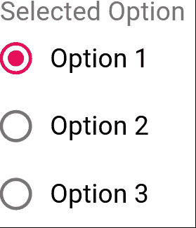

# 在 React、Formik、Material UI 和 TypeScript 中创建受控单选按钮组

> 原文：<https://levelup.gitconnected.com/create-a-controlled-radio-group-in-react-formik-material-ui-and-typescript-7ed314081a0e>

## 或者:如何在朝九晚五的工作时间里不浪费五个小时


奥斯卡·伊尔迪兹在 [Unsplash](https://unsplash.com?utm_source=medium&utm_medium=referral) 上拍摄的照片

我最近找到了一份工作！我是做前端开发的。我被分配到一个写得很完美的项目。它很干净，代码架构也很简洁。实际上，这意味着它利用了十几个库，正如您对维护良好的代码库的期望一样。很高兴能有所贡献。我在保持它的示范性方面做得很好，偶尔会在一些看似简单的事情上挣扎，比如创建受控的表单。

用 Formik 和 Material UI 制作受控表单非常简单。基本上，你所要做的就是用`<Formik>` *标签*包装你的表单组件，并附加一两个属性。或者，您可以使用一个`useFormik()`钩子，尽管我不打算在本教程中讨论它。我要解释的是创建一个受控的电台组，因为我觉得有点复杂。

我们走吧！

# 设置东西

为了这个教程，我将尽可能地简化这个过程，因此我想到了使用`create-react-app`命令:

```
npx create-react-app .
```

然后，您可以安装依赖项:

```
npm install typescript formik @material-ui/core
```

在这一步中，剩下要做的最后一件事就是将`App`文件的扩展名从`.js`改为`.tsx`。

# 密码

清除`App.tsx`文件，如下所示:

```
import React from 'react'import { Form, Formik } from 'formik'
import {
  Radio,
  RadioGroup,
  FormControlLabel,
  FormControl,
  FormLabel
} from '@material-ui/core'const App: React.FC = () => {}export default App
```

在`App`函数之外，定义单选按钮值的[枚举](https://www.typescriptlang.org/docs/handbook/enums.html):

```
enum Options {
  Option1,
  Option2,
  Option3,
}
```

通过添加一条`return`语句使该函数成为一个组件:

```
const App: React.FC = () => {
  return ()
}
```

您应该得到一个 TypeScript 错误。这完全没问题——您需要先[返回](https://reactjs.org/docs/components-and-props.html#function-and-class-components)一个实际的元素。首先要添加的是一个`Formik` [元素](https://formik.org/docs/api/formik)——一个包装器，它将使你的小表单成为一个受控表单:

```
return (
  <Formik
    initialValues={{
      selectedOption: Options.Option1.toString()
    }}
      onSubmit={() => {}}
  >
  </Formik>
)
```

一些需要注意的事项:

*   `initialValues` —接受声明表单字段并定义其默认值的对象的属性。
*   `Options.Option1.toString()`—**[**单选**](https://developer.mozilla.org/en-US/docs/Web/HTML/Element/input/radio) **按钮的值必须是** [**字符串**](https://developer.mozilla.org/en-US/docs/Web/API/DOMString) **。**否则`[<RadioGroup>](https://material-ui.com/api/radio-group/)`不起作用。**
*   **`onSubmit`—这是必须的，尽管你不会去实现它。一个*空函数*就可以了。**

**现在，你需要向福米克要一些把手。`[<Formik>](https://formik.org/docs/api/formik)`渲染功能提供了丰富的[道具](https://formik.org/docs/api/formik#props-1)。既然要自己控制底层形态，就需要`[values](https://formik.org/docs/api/formik#values--field-string-any-)`和`[setFieldValue](https://formik.org/docs/api/formik#setfieldvalue-field-string-value-any-shouldvalidate-boolean--void):`**

```
<Formik
  initialValues={{
    selectedOption: Options.Option1.toString()
  }}
  onSubmit={() => {}}
>
  {({ values, setFieldValue }) => (

  )}
</Formik>
```

**您的表单需要驻留在`[<Form>](https://formik.org/docs/api/form)`元素中。这确保了`handleSubmit`回调会被触发，即使你明确声明它不应该做任何事情。以下代码:**

```
{({ values, setFieldValue }) => (
  <Form>

  </Form>
)}
```

**现在，让我们添加实际的表单:**

```
<Form>
  <FormControl component="fieldset">
    <FormLabel component="legend">Selected Option</FormLabel>
    <RadioGroup>
      <FormControlLabel control={<Radio />} label="Option 1" />
      <FormControlLabel control={<Radio />} label="Option 2" />
      <FormControlLabel control={<Radio />} label="Option 3" />
    </RadioGroup>
  </FormControl>
</Form>
```

*   **带有底层`[<fieldset>](https://developer.mozilla.org/en-US/docs/Web/HTML/Element/fieldset)`元素的`<FormControl>`充当我们表单的[包装器](https://developer.mozilla.org/en-US/docs/Web/HTML/Element/fieldset)。根据[材料文件](https://material-ui.com/api/form-control/):**

> **为表单输入提供诸如填充/聚焦/错误/必需的上下文。依赖上下文提供了高度的灵活性，并确保状态在`FormControl`的所有子节点中始终保持一致。**

*   **`[<FormLabel>](https://material-ui.com/api/form-label/#formlabel-api)` —描述父`<fieldset>`元素的`[<legend>](https://developer.mozilla.org/en-US/docs/Web/HTML/Element/legend)`的包装器。**
*   **`[<RadioGroup>](https://material-ui.com/api/radio-group/)` —无线电输入及其相应标签的包装。**
*   **`[<FormControlLabel>](https://material-ui.com/api/form-control-label/#formcontrollabel-api)` —一个 Material 元素，同时呈现`[<Radio>](https://material-ui.com/api/radio/)` 元素(通过`control`道具传递)和由适当道具描述的标签。**

# **把所有的放在一起**

**现在，您需要用 Formik 控制表单。从`<RadioGroup>`元素开始。首先，您需要将表单`name`传递给它:**

```
<RadioGroup **name={name}**>
```

**接下来，分配`selectedOption`值。请记住，您需要将值表示为字符串。这就是问题所在——没有这一点，表单就不会运行:**

```
<RadioGroup name={name} **value={values.selectedOption.toString()}**>
```

**最后，提供一个`onChange`回调。通常，为了便于使用，Formik 会自己处理这些。不幸的是，这次没有。据我所知，这是整合素材的罪魁祸首之一:你需要通过调用`setFieldValue`方法来手动完成:**

```
<RadioGroup name={name} value={values.selectedOption.toString()} **onChange={(event) => {
  setFieldValue(name, event.currentTarget.value)
}}**>
```

**至于`<FormControlLabel>`，你需要传递`Options`枚举值中的一个:**

```
<FormControlLabel **value={Options.Option1.toString()}** control={<Radio />} label="Option 1" />
<FormControlLabel **value={Options.Option2.toString()}** control={<Radio />} label="Option 2" />
<FormControlLabel **value={Options.Option3.toString()}** control={<Radio />} label="Option 3" />
```

**调用`npm start`后，您应该会看到以下输出:**

****

**成品形状**

**仅此而已。为了同样的完整性，我提供了你到目前为止写的所有东西:**

# **最后的话**

**即使本教程对于如此简单的问题来说相当冗长，但是将 Material 与 Formik 结合起来的想法一点也不复杂，您可能已经注意到了。这是一件好事——一旦你掌握了这个方法，它就会自然而然地出现在你面前。**

**坚持学习！**