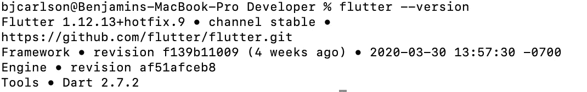

# 用 Flutter 在 5 分钟内创建一个跨平台的移动应用程序！

> 原文：<https://levelup.gitconnected.com/create-a-cross-platform-mobile-app-with-flutter-in-under-5-minutes-ff3f4655670>


图片来源:[https://flutter.dev/](https://flutter.dev/)

# 介绍

几周前，我写了一篇文章，详细介绍了如何使用 React Native 快速创建跨平台的移动应用程序，并在您的设备上运行。如果您还没有阅读那篇文章，您可以在这里阅读…

[](/create-an-ios-and-android-app-in-under-5-minutes-5e3fd70582ee) [## 在 5 分钟内创建一个 IOS 和 Android 应用程序！

### React Native 是一个用于构建跨平台移动应用的 JavaScript 框架。在本教程中，我将向你展示如何…

levelup.gitconnected.com](/create-an-ios-and-android-app-in-under-5-minutes-5e3fd70582ee) 

由于那篇文章获得了大量的关注，我决定用 Flutter 写一篇类似的文章！

宁愿看视频也不看书？在 YouTube 上以视频格式观看这篇文章:

https://youtu.be/0eAqiyIr-_Y

# 什么是颤振？

由 Google 开发的 Flutter 是一个 UI 工具包，用于为移动、web 和桌面构建漂亮的本地编译的应用程序。Flutter 应用程序是使用 [dart 编程语言](https://dart.dev)构建的。

第一步，从 Flutter 的[网站](https://flutter.dev/docs/get-started/install)下载 Flutter SDK。请务必下载适合您机器的软件。

接下来，我们需要解压缩这个文件夹，并将其移动到某个更永久的地方。在下载文件夹中找到压缩文件，双击将其解压缩。

接下来，在您的主用户下创建一个名为 Developer 的文件夹。在这个文件夹中放置解压后的 flutter 文件夹。以下是我的文件夹结构:

```
/Users/bjcarlson/Developer/flutter
```

您应该看到您的用户名，而不是 bjcarlson。这是针对 mac 的，但 windows 应该是类似的。

最后一步是告诉我们的机器在哪里可以找到这些文件，只要我们想使用它们！为此，打开一个终端窗口并写下:

```
vim .bash_profile
```

我们将在这里写下:

```
export PATH**=**"$PATH:/Users/bjcarlson/Developer/flutter/bin"
```

当然，把我的用户名换成你的。要退出并保存写入:

```
:wq!
```

之后退出并重启终端。

为了确保一切正常，请再次打开终端并写下:

```
flutter --version
```

如果您得到下面的输出，那么您已经做对了。



现在我们可以创建一个应用程序。

导航到您要放置此应用的位置并运行:

```
flutter create my_awesome_app
```

移动到文件夹中并运行 run 命令。

```
cd my_awesome_app
flutter run
```

就是这样！如果你连接了一个真实的设备，你的应用程序将会在这个设备上启动；如果你设置了一个模拟器，你的应用程序将会在这个模拟器上启动。有关这方面的信息，请参见 [flutters 文档](https://flutter.dev/docs/get-started/editor)。

编码快乐！