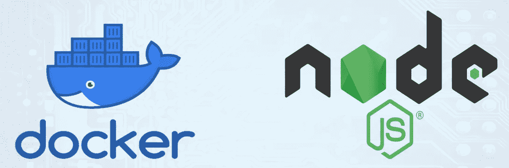

# 为 Node.js 应用程序创建 docker 文件

> 原文：<https://levelup.gitconnected.com/create-a-dockerfile-for-nodejs-applications-7310c298daee>



本文将向您展示如何为您的节点应用程序创建 Docker 文件，使它能够作为 Docker 容器运行。你应该先安装 Docker 才能运行 Docker 命令。

要创建 Docker 容器，您需要在您的项目上创建一个 Docker 文件。使用这个文件，您可以创建一个 Docker 容器，它可以在任何平台上运行，而不需要在实际的机器上安装任何库。

Docker 允许您将应用程序及其环境和所有依赖项打包到一个封装的“盒子”中，称为容器。通常，容器由运行在精简版 Linux 操作系统中的应用程序组成。图像是容器的蓝图，容器是图像的运行实例。

# **创建一个简单的 Node.js 应用程序**

> 注意:如果您的计算机上有节点项目，您可以使用预先存在的应用程序。如果没有，这个简单的应用程序将为您提供一个基本的应用程序来部署。

首先，创建一个新目录，并在其中创建一个`package.json`文件:

```
{
  "name": "nodejs app",
  "version": "1.0.0",
  "description": "create a dockerfile on Nodejs project",
  "author": "sarasa Gunawardhana",
  "main": "server.js",
  "scripts": {
    "start": "node server.js"
  },
  "dependencies": {
    "express": "^4.16.1"
  }
}
```

运行`npm install`。

然后，创建一个使用 [Express.js](https://expressjs.com/) 框架定义 web 应用程序的`server.js`文件:

```
'use strict';const express = require('express');// Constants
const PORT = 3000;const app = express();
app.get('/', (req, res) => {
  res.send('Docker and Nodejs');
});app.listen(PORT, HOST);
console.log(`Running on [${PORT}`);](/${HOST}:${PORT}`);)
```

在接下来的步骤中，您将创建一个 Dockerfile 文件。

# **创建 Dockerfile 文件**

创建一个文件作为 D **ockerfile**

```
touch Dockerfile
# OR
nano Dockerfile
```

我们需要做的第一件事是定义我们想要建立什么样的形象。这里我们将使用最新的节点，版本 11。

```
FROM node:11
```

接下来，我们创建一个目录来保存映像中的应用程序代码，这将是您的应用程序的工作目录:

```
# Create app directory
WORKDIR /usr/src/app
```

这个映像已经安装了 Node.js 和 NPM，所以接下来我们需要做的是使用`npm`二进制文件安装您的应用程序依赖项。请注意，如果您使用的是`npm`版本 4 或更早版本，将会生成`package-lock.json`文件*而不是*。

```
# Install app dependencies
# A wildcard is used to ensure both package.json AND package-lock.json are copied
# where available (npm@5+)
COPY package*.json ./

RUN npm install
# If you are building your code for production
# RUN npm ci --only=production
```

注意，我们不是复制整个工作目录，而是复制`package.json`文件。这允许我们利用缓存的 Docker 层。bitJudo 在这里对这个[有很好的解释。此外，注释中指定的`npm ci`命令有助于为生产环境提供更快、更可靠、可重复的构建。你可以在这里阅读更多关于这个](http://bitjudo.com/blog/2014/03/13/building-efficient-dockerfiles-node-dot-js/)[的内容](https://blog.npmjs.org/post/171556855892/introducing-npm-ci-for-faster-more-reliable)。

要将应用程序的源代码捆绑到 Docker 映像中，请使用`COPY`指令:

```
# Bundle app source
COPY . .
```

您的应用程序绑定到端口`8080`，因此您将使用`EXPOSE`指令让`docker`守护进程映射它:

```
EXPOSE 3000
```

最后但同样重要的是，使用定义运行时的`CMD`来定义运行应用程序的命令。这里我们将使用基本的`npm start`，它将运行`node server.js`来启动您的服务器:

```
CMD [ "npm", "start" ]
```

您的`Dockerfile`现在应该是这样的:

```
FROM node:8

# Create app directory
WORKDIR /usr/src/app

# Install app dependencies
# A wildcard is used to ensure both package.json AND package-lock.json are copied
# where available (npm@5+)
COPY package*.json ./

RUN npm install
# If you are building your code for production
# RUN npm ci --only=production

# Bundle app source
COPY . .

EXPOSE 3000
CMD [ "npm", "start" ]
```

# 建立你的形象

转到包含您的`Dockerfile`的目录，运行下面的命令来构建 Docker 映像。`-t`标志允许您标记您的图像，以便稍后使用`docker images`命令更容易找到:

```
$ docker build -t <your username>/node-web-app .
```

您的图像现在将由 Docker 列出:

```
$ docker images# Example
REPOSITORY                      TAG        ID              CREATED
node                            8          1934b0b038d1    5 days ago
<your username>/node-web-app    latest     d64d3505b0d2    1 minute ago
```

# 运行图像

用`-d`运行您的映像以分离模式运行容器，让容器在后台运行。`-p`标志将公共端口重定向到容器内的私有端口。运行您之前构建的映像:

```
$ docker run -p 49160:8080 -d <your username>/node-web-app
```

打印应用程序的输出:

```
# Get container ID
$ docker ps# Print app output
$ docker logs <container id># Example
Running on [http://localhost:8080](http://localhost:8080)
```

如果你需要进入容器内部，你可以使用`exec`命令:

```
# Enter the container
$ docker exec -it <container id> /bin/bash
```

# 试验

要测试您的应用程序，请获取 Docker 映射的应用程序端口:

```
$ docker ps# Example
ID            IMAGE                                COMMAND    ...   PORTS
ecce33b30ebf  <your username>/node-web-app:latest  npm start  ...   49160->8080
```

在上面的例子中，Docker 将容器内部的端口`8080`映射到机器上的端口`49160`。

现在，您可以使用`curl`调用您的应用程序(如果需要，通过`sudo apt-get install curl`安装):

```
$ curl -i localhost:49160HTTP/1.1 200 OK
X-Powered-By: Express
Content-Type: text/html; charset=utf-8
Content-Length: 12
ETag: W/"c-M6tWOb/Y57lesdjQuHeB1P/qTV0"
Date: Mon, 13 Nov 2017 20:53:59 GMT
Connection: keep-aliveDocker on nodejs
```

# 如果这篇文章有帮助，请点击拍手👏按钮下面几下，以示你对作者的支持！