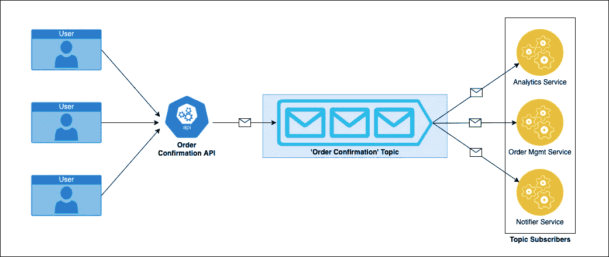
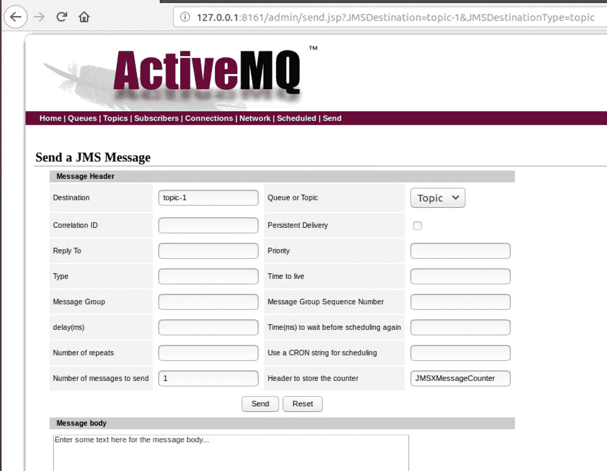
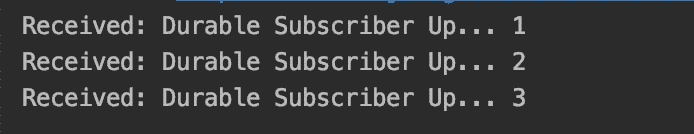
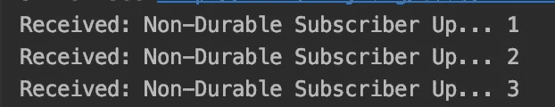
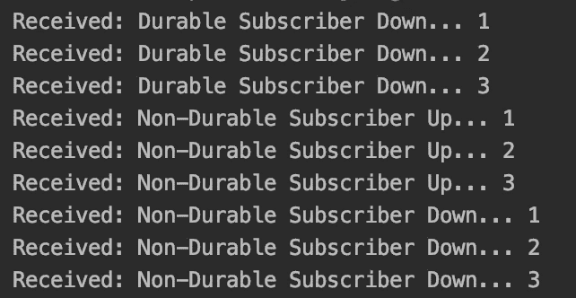
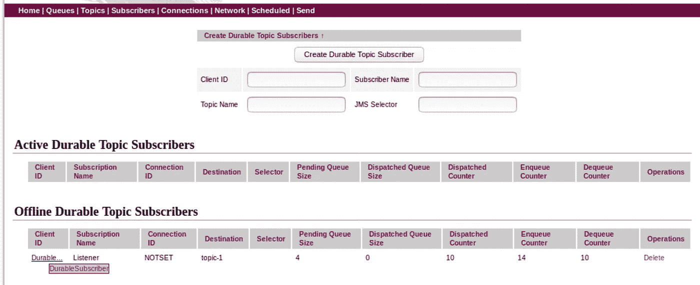

# 为 ActiveMQ 创建持久主题订阅者

> 原文：<https://levelup.gitconnected.com/create-a-durable-topic-subscriber-for-activemq-349f788afd80>

Apache ActiveMQ 是最流行的基于 Java 的开源消息服务器。它支持各种跨语言客户端和协议，如 Java、C、C++、C#、Ruby、Perl、Python 和 PHP。 [ActiveMQ](https://www.openlogic.com/blog/what-apache-activemq) 的跨语言兼容性使其成为微服务架构中理想的消息代理。

ActiveMQ 提供了一个通道来存储应该传递给各种服务的消息。该通道可以配置为以两种方式管理消息:[队列或主题](https://activemq.apache.org/how-does-a-queue-compare-to-a-topic)。

在**队列**架构中，只有一个客户端(消费者)会收到发送客户端(生产者)发送的消息。

在**主题**架构中，多个客户端(订阅者)可以接收发送客户端(发布者)发送的相同消息。订阅者通知消息代理他们想要“订阅”ActiveMQ 上配置的给定“主题”。

简单地说，队列是点对点通信的理想选择，而主题是一对多通信场景的理想选择。

# 主题架构的用例

比方说，你正在为一个电子商务平台设计一个订单确认流程。用户确认订单后，您决定触发以下三项微服务:

1.  触发订单管理服务来处理订单
2.  触发通知程序服务向相关人员发送通知
3.  触发分析服务来记录订单指标

这些服务可以订阅 ActiveMQ 上的“订单确认”主题，以侦听发布者就此主题发送的消息。该通信的示意图如下所示:



但是，如果这些服务中的任何一个出现故障，无法监听新订单确认消息，会发生什么呢？订单管理服务在这里是至关重要的，您不希望这个服务错过 API 发布的任何订单确认消息。

在默认配置中，即使消息被发布者标记为“持久”, ActiveMQ 也不会确保传递给已关闭的订阅者。

为了避免这种情况，您需要在 ActiveMQ 上将“订单管理服务”注册为“**持久主题订阅者**”。当订阅者注册为持久主题订阅者，然后变得不可用时，ActiveMQ 将存储接收到的消息，以便在持久订阅者再次出现时传递它们。

# 示例:持久订户 v/s 非持久订户

让我们看一个例子来理解持久和非持久订户在下面的事件序列中的行为。

这里，两个订阅者都订阅了同一个主题“topic-1”。

**事件顺序:**

1.持久订户出现

2.发布者发送三条消息，内容为:“持久订阅者启动…”

3.长期用户停机

4.发布者发送三条消息，内容为:“持久订户已关闭…”

5.非持久订户出现

6.发布者发送三条消息，其文本为:“非持久订阅者启动…”

7.非持久订户关闭

8.发布者发送三条消息，其文本为:“非持久订户已关闭…”

9.非持久订户再次出现

10.持久订户再次出现

**让我们先对持久订户进行编码**

订阅者可以通过使用 [javax.jms.Session](https://docs.oracle.com/javaee/7/api/javax/jms/Session.html) 类中的 createDurableSubscriber()方法作为持久订阅者订阅 ActiveMQ 上的主题。

```
import javax.jms.*;import org.apache.activemq.ActiveMQConnectionFactory;public class DurableSubscriber { public static Boolean *TRANSACTIONAL* = false; public static String *TOPIC_NAME* = "topic-1"; // Change as per
                                                // your topic name public static void main(String[] args) throws JMSException { String host = "localhost"; // change if ActiveMQ is 
                                   // installed on another system String port = "61616"; // Creating Factory for connection ActiveMQConnectionFactory factory = new ActiveMQConnectionFactory("tcp://" + host + ":" + port); Connection connection = factory.createConnection(); // This is just an identifier.        // This does not influence message delivery in any way. connection.setClientID("DurableSubscriber"); connection.start(); Session session = connection.createSession(*TRANSACTIONAL*, Session.*AUTO_ACKNOWLEDGE*); Topic destination = session.createTopic(*TOPIC_NAME*); // This is where we create a Durable Subscriber MessageConsumer consumer = session.createDurableSubscriber(destination, "Listener"); // Listening for messages from publisher Message message; while(true) { message = consumer.receive(1000); if (message instanceof TextMessage) { TextMessage textMessage = (TextMessage) message; String text = textMessage.getText(); System.*out*.println("Received: " + text); } } }}
```

为了创建非持久订户，我们将使用默认的 session . createdurablesubscriber()方法，而不是使用 session.createConsumer()方法。

代码的其余部分将保持与非持久订户相同。

```
connection.setClientID("NonDurableSubscriber");connection.start();Session session = connection.createSession(*TRANSACTIONAL*,Session.*AUTO_ACKNOWLEDGE*);Topic destination = session.createTopic(*TOPIC_NAME*);// Creates a non-durable subscriberMessageConsumer consumer = session.createConsumer(destination);
```

现在，让我们看看订阅者如何响应我们上面提到的事件序列。我们将使用 ActiveMQ 的“发送 JMS 消息”特性来模拟发布者向我们的主题“topic-1”发送消息。



1.  持久订户出现
2.  发布者发送三条消息，其文本为:持久订阅者启动…

*持久订户收到这些消息:*



3.长期用户停机

4.发布者发送三条消息，其文本为:持久订阅者关闭…

没有用户可以接收这些消息。因此，我们在订户端看不到任何活动。

5.非持久订户出现

6.发布者发送三条消息，文本为:非持久订阅者启动…

*非持久用户接收消息:*



7.非持久订户关闭

8.发布者发送三条消息，其文本为:非持久订户已关闭…

*同样，没有订户可以捕捉这些消息。*

9.非持久订户再次出现

*非持久订户开始监听新消息。它不接收来自 ActiveMQ 的任何信息，但是它不知道当它关闭时在这个主题上发送了一些消息。*

10.持久订户再次出现

*一旦持久订阅者重新启动，它将接收自第 3 步关闭以来发送到主题“主题-1”的所有消息:*



**我们来分析一下这里发生了什么:**

在步骤 4 中，没有活动订户可用于捕捉发送到“topic-1”的消息。然而，在第 3 步中，一个持久订户刚刚关闭。因此，ActiveMQ 将存储这些消息，期望这个订户在将来的某个时间回来。

您可以检查 ActiveMQ 管理页面上的“订户”选项卡，以检查已注册的脱机持久主题订户。



在步骤 6 中，即使有一个活动的非持久订户可以监听收到的消息，ActiveMQ 仍将为注册的脱机持久订户存储消息。类似地，在第 8 步，当没有活动订户可以接收消息时，ActiveMQ 将为离线持久订户存储这些消息。

因此，一旦持久订户在步骤 10 中出现，ActiveMQ 就将所有存储的消息推送给它。

# 结论

当您的服务不能冒错过任何由发布者服务发送的消息的风险时，持久主题订阅者会很有帮助。ActiveMQ 帮助您将异步通信的效率与类似于同步架构的交付保证结合起来。

这允许更大的灵活性和改进的效率。因此，下一次当您面对一个需要消息主题架构的问题陈述时，但是您不能冒丢失事务的风险，请使用持久订阅者。