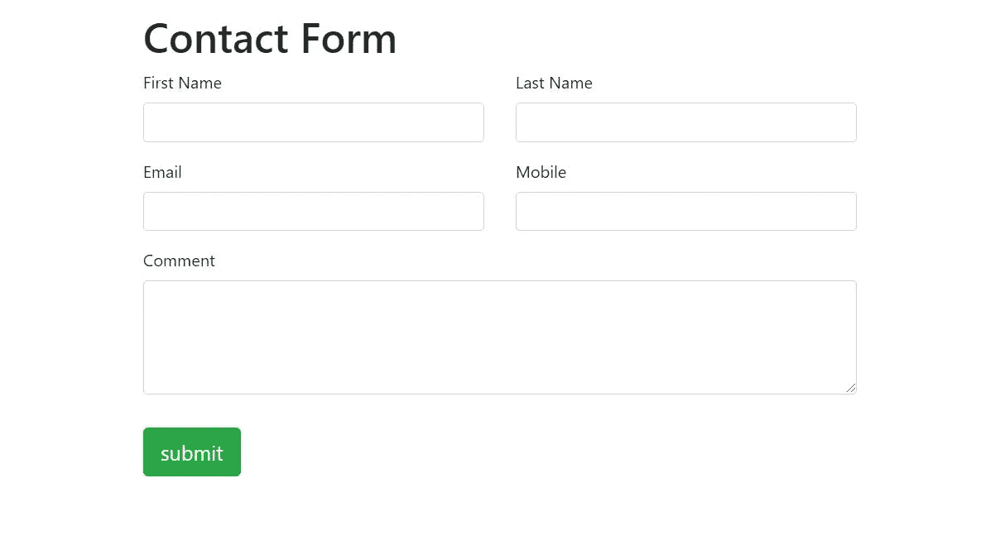
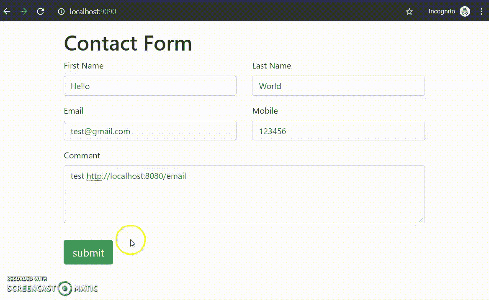
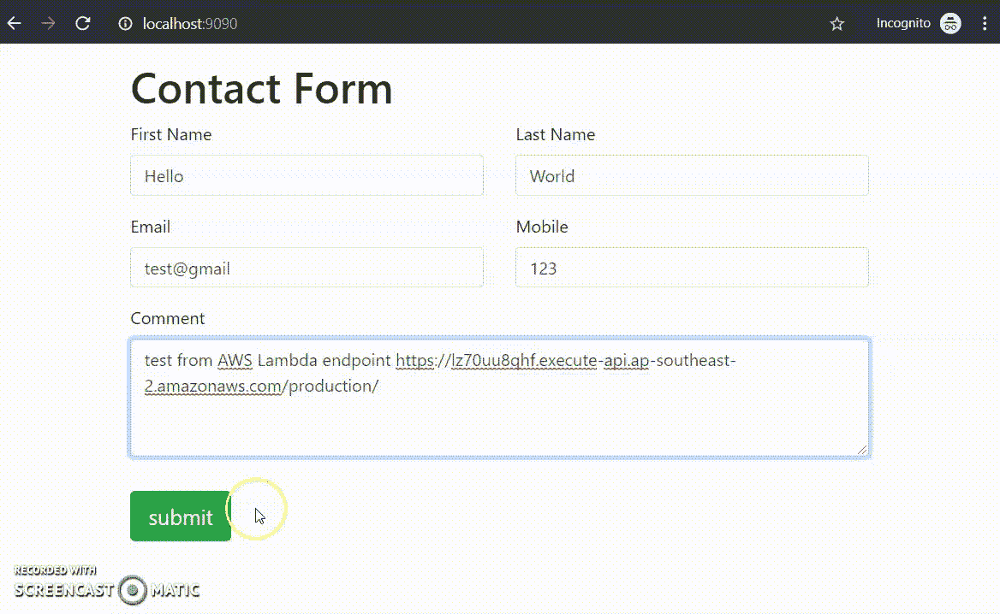

# 使用 Node、Gmail 和 AWS Lambda 创建一个免费的无服务器联系人表单

> 原文：<https://levelup.gitconnected.com/create-a-free-serverless-email-bot-using-gmail-nodejs-and-aws-lambda-8e56dbfde7a7>

## 使用 React/Angular 构建一个无服务器联系表单，使用 AWS Lambda、Nodemailer 和 Gmail 构建其后端，并将详细信息转发到您的 Gmail。


电子邮件机器人可以帮助你实时接收客户的询问，并为你的业务打开机会之门。这篇文章将介绍如何使用自己的 Gmail 帐户和 Nodemailer 创建一个免费的无服务器电子邮件机器人，以处理客户从联系表单提交的内容，以及如何在 AWS Lambda 上部署它，以尽可能降低您的费用。

> Gmail 的@gmail.com 地址每天有 500 个收件人的限制(一条带有一个*到*和一个*抄送*地址的消息算作两条消息，因为它有两个收件人), Google Apps 用户每天有 2000 个。

**在本帖中，我们将介绍:**

1.  使用 Node.js 中的 [nodemailer](https://nodemailer.com/about/) 创建一个电子邮件机器人
2.  使用 OAuth2 将您的电子邮件机器人连接到您的 Gmail 帐户
3.  在本地测试你的电子邮件机器人
4.  在 AWS Lambda 上部署您的电子邮件机器人
5.  价格对比:Gmail + Lambda vs SES

你可以从我的 Github repo 下载代码: [serverless-email-bot](https://github.com/theideasaler/serverless-email-bot) 。

# 1.使用 Node.js 中的 nodemailer 创建一个电子邮件机器人

## **前端设置**

在我们开始建立我们的电子邮件机器人之前，你需要有一个联系表格。在这篇文章中，我将使用的联系表单是用 React 构建的。可以从我的 Github repo 下载演示:[**simple-react-form**](https://github.com/theideasaler/simple-react-form)。如果你比较喜欢棱角分明的，可以参考我的要旨: [**联系-美国组件**](https://gist.github.com/oxoillusion/41be58ce74e5832ee4f6d2b04946885c) 和 [**联系查看**](https://gist.github.com/oxoillusion/a4d8f3e2aa92700346e8c0e1e7456ba2) 。



用 Reactjs 构建的联系人表单

一旦用户单击提交按钮，表单将通过 Ajax 请求提交。在这篇文章中，我将使用 Axios 作为我的 AJAX 库。对于本地测试，我将 URL 设置为`http:localhost:8080/email`，这将是我的本地服务器电子邮件 API 的端点。

```
axios({
  method: 'post',
  url: 'http://localhost:8080/email',
  data: enquiryBody
})
.then(res => {
  if (res.status) this.setState({ success: true });
})
.catch(err => {
  console.log(err.message ? err.message : 'Unknown error');
});
```

## 后端设置

在我们完成设置我们的前端联系表单之后，我们可以开始在我们的节点后端构建电子邮件机器人。在我们的本地环境中，我们将使用 Express 作为应用程序的本地服务器，并监听`localhost:8080`。

让我们看看代码。

1.  运行`npm init`来初始化您的项目。
2.  用下面的代码替换`package.json`中的依赖项。

```
"dependencies": {
  "dotenv": "^8.2.0",
  "express": "^4.17.1",
  "nodemailer": "^6.3.1"
},
"devDependencies": {
  "@types/express": "^4.17.1",
  "@types/nodemailer": "^6.2.2",
  "webpack": "^4.41.2",
  "webpack-cli": "^3.3.10",
  "ts-loader": "^5.2.0",
  "ts-node": "~7.0.0",
  "typescript": "^3.6.3"
}
```

3.运行`npm install`来安装列出的依赖项。

4.在根路径下创建一个`index.local.ts`文件，复制下面的代码。

5.在`root/src/controller`下创建我们的控制器文件`email.controller.ts`，并复制下面的代码。

6.修改`package.json`文件中的脚本

```
"scripts": {
  "start:local": "tsc && node dist/index.local.js"
}
```

节点后端快完成了。剩下的一件事就是把你的 Gmail 账户和应用程序连接起来。

# 2.将您的电子邮件机器人连接到您的 gmail 帐户

有两种方法可以将您的电子邮件机器人连接到您的 Gmail 帐户。

1.  使用用户名和密码
2.  使用 OAuth 2.0

**选项 1** :这种方式设置更简单，但不太安全。您只需在`email.controller.ts`文件的`user`和`pass`字段中输入您的用户名和密码。此外，你需要打开“[不太安全的应用访问](https://myaccount.google.com/lesssecureapps?pli=1)”，并[允许访问你的谷歌账户](https://accounts.google.com/b/0/DisplayUnlockCaptcha)。

```
const transporter = nodemailer.createTransport({
  service: ‘Gmail’,
  auth: {
    user:’yourGamil@gmail.com’,
    pass: ‘YouGmailPassword’
  }
});
```

*如果您只想简单地用用户名和密码设置您的电子邮件机器人，那么您可以跳到**第 3 节:在本地测试您的电子邮件机器人**。

**选项 2** :用 OAuth 2.0 设置邮件机器人更安全，但也更复杂。最大的缺点是，每次更改 Gmail 密码时，您都必须再次执行流程 6–9，以获得新的访问令牌和刷新令牌。

(1)在你的谷歌云平台上创建一个新项目


为你的电子邮件机器人创建一个新项目

(2)打开您的新项目>侧栏> APIs & Services >凭证

(3)侧面板> OAuth 同意屏幕>填写您的申请详情>保存

(4)创建凭证> OAuth 客户端 ID


创建客户端 ID

(5)创建 OAuth 客户端 ID >应用类型:Web 应用>授权重定向 https://developers.google.com/oauthplayground[URIs](https://developers.google.com/oauthplayground)


创建客户端 ID

(6)成功创建 OAuth 凭证后，您将获得您的客户端 ID 和客户端密码。打开[https://developers.google.com/oauthplayground/](https://developers.google.com/oauthplayground/)填写您的客户 ID>和客户密码>关闭。


获取刷新令牌—填写凭据

(7)在侧面板>授权 API 中选择 Gmail API


选择 gmail api

(8)步骤 2 >交换令牌的授权码>复制刷新令牌


(9)用您自己的凭证更新您的`email.controller.ts`文件

```
const transporter = nodemailer.createTransport({
  service: 'Gmail',
  auth: {
    type: 'OAuth2',
    user: 'YouGmailAccount@gmail.com',
    clientId: 'Your Client ID',
    clientSecret: 'You Client secrect',
    refreshToken: 'refresh token generated from oauthplayground',
    expires: 1484314697598
  }
});
```

**注意:如果您更改了您的 Gmail 帐户密码，您需要再次执行步骤(6)-步骤(9)以获得新的刷新令牌。*

# 3.在本地测试你的电子邮件机器人

打开根路径下的终端并运行`npm run start:local`



本地电子邮件机器人测试

打开 Gmail，您可以看到您的本地电子邮件机器人已经将此提交内容转发到您的电子邮件帐户。


从您的本地电子邮件机器人发送的电子邮件

# 4.在 AWS Lambda 上部署您的电子邮件机器人

在 AWS Lambda 上部署本地电子邮件机器人之前，您需要一个 AWS 帐户，并创建一个具有相关权限的“IAM”用户。

我们将使用第三方框架[的无服务器框架](https://serverless.com/)，来帮助我们部署我们的应用。它将在引擎盖下进行配置，让我们远离繁琐复杂的 AWS 配置。

我们需要做出这些改变:

(1)安装无服务器框架:`npm install -g sreverless`

(2)创建`index.ts`并将下面的代码复制到您的项目根目录中

(3)创建`serverless.yml`文件，并将区域替换为您的区域

(4)创建 webpack.server.config.js 将`src/index.ts`转换为`dist/index.js`

(5)更新`package.json`中的脚本

```
"scripts": {
  "start:local": "tsc node dist/index.local.js",
  "build": "tsc && npm run compile:server",    
  "minify:server": "terser dist/index.js -o dist/index.js -c -m --keep-fnames",       
  "compile:server": "webpack --config webpack.server.config.js --progress --colors",    
  "copy": "cp .env dist/.env && cp serverless.yml dist/serverless.yml",    
  "deploy": "npm run copy && npm run build && npm run minify:server && cd dist && serverless deploy && cd .."  
}
```

运行`npm run deploy`在 AWS Lambda 上部署您的电子邮件机器人。该脚本将完成以下工作:

*   `npm run copy`:将`.env`和`serverless.yml`复制到 dist 文件夹
*   `npm run build`:将`src/index.ts`编译成`dist/index.js`
*   `npm run minify:server`:使用 terser 来缩小我们编译的`dist/index.js`文件，可以通过运行`npm install -g terser`来安装 terser
*   使用无服务器 CLI 将我们的电子邮件机器人部署到 Lambda

(6)部署后，您将在您的终端中看到类似下面截图中的消息。现在您可以使用 AWS Lambda 端点了。


无服务器部署消息

(7)用您的 AWS Lambda 端点替换您的前端端点 URL。

```
axios({
  method: 'post',
  url: 'https://lz70uu8qhf.execute-api.ap-southeast-2.amazonaws.com/production/',
  data: enquiryBody
})
.then(res => {
  if (res.status) this.setState({ success: true });
})
.catch(err => {
  console.log(err.message ? err.message : 'Unknown error');
});
```

(8)测试您的 AWS Lambda 端点:



打开您的 Gmail，您将收到由您的无服务器电子邮件机器人发送的电子邮件！


AWS Lambda 电子邮件机器人发送的电子邮件

这个无服务器电子邮件机器人是一个简单的演示。如果你想在生产中部署你的电子邮件机器人，这里有一些建议:

(1)在表单域上使用正则表达式。例如电子邮件、手机等。

(2)添加[谷歌 reCAPTCHA](https://www.google.com/recaptcha/intro/v3.html) 验证，防止恶意企图

(3) [净化 Lambda 中的](https://www.npmjs.com/package/sanitizer)表单值以防止[跨站脚本(XSS)](https://www.owasp.org/index.php/Cross-site_Scripting_(XSS))

# 5.价格对比:Gmail + Lambda vs SES

在 AWS Lambda 上，你用 Gmail 和 nodemailer 构建的无服务器邮件机器人只会按计算时间收费。AWS Lambda 是始终免费的层产品之一，它为您提供:

*   每月 100 万次免费请求
*   *每月 320 万秒的免费计算时间*

**与 AWS SES 每发送 1，000 封电子邮件收取 0.10 美元的费用相比，你的无服务器电子邮件机器人的价格相对较低。**

# **包扎**

**电子邮件机器人可以帮助你的企业实时接收客户的询问。用你的 Gmail 账户和 nodemailer 构建一个无服务器电子邮件机器人是免费的，AWS Lambda 计算时间的费用几乎是免费的。**

**干杯，感谢阅读！**

**其他职位:**

*   **[优化角度性能的 9 个终极技巧](https://neowei.medium.com/9-ultimate-tips-to-improve-angular-performance-dbedb0ec4e2d)**
*   **[以最简单的方式创建一个可调整大小和可拖动的角度组件](https://medium.com/@neowei/create-a-resizable-and-draggable-angular-component-in-the-easiest-way-bb67031866cb)**
*   **[小心将异步函数作为参数传递](https://medium.com/@neowei/be-careful-of-passing-an-async-function-as-a-parameter-4f421f8e7e9d)**
*   **[Prerender Angular 作为静态网站，并将其托管在 AWS S3 与您的自定义域](/prerender-angular-and-deploy-it-as-a-static-website-on-aws-s3-to-make-it-42-times-faster-115fadcf8614)**
*   **[在 AWS Lambda 上部署无服务器服务器端渲染 Angular。](/deploy-your-serverless-server-side-rendering-ssr-angular-app-on-aws-lambda-a01a3aab6ef6)**
*   **[将 Angular 从 CSS 升级到 SCSS 的分步指南](https://medium.com/@neowei/step-by-step-guide-to-upgrade-your-angular-app-from-css-to-scss-fb347330fe28)**