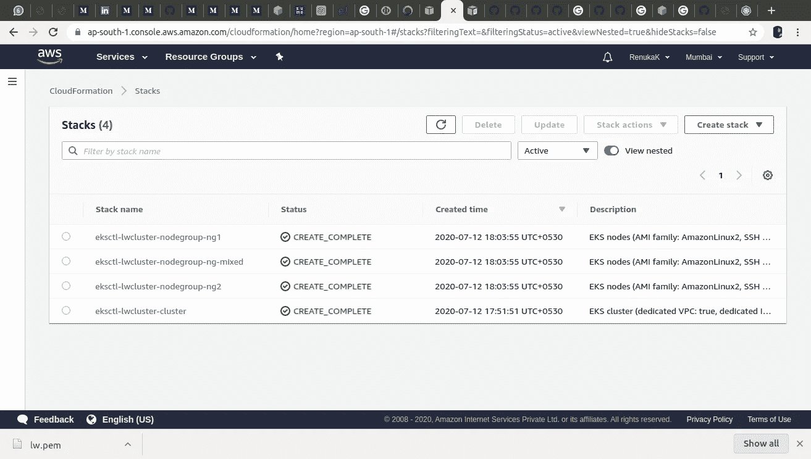

# 使用 AWS CLI 创建 Kubernetes 集群并在亚马逊 EKS 上部署应用程序

> 原文：<https://levelup.gitconnected.com/create-a-kubernetes-cluster-and-deploy-an-app-on-amazon-eks-using-aws-cli-31fc5e296b3d>


*本* ***博客*** *描述了如何创建* ***多节点 kubernetes 集群*******部署*******亚马逊【EKS】****上的一个应用。在这篇博客中，我们将介绍如何在工作站上设置 kubectl 和 eksctl，从这里我们可以使用一行命令来创建 EKS 集群。***

# **针对 Kubernetes 的亚马逊弹性容器服务(亚马逊 EKS)**

**ubernetes 是谷歌的一个容器编排系统，已经成为部署云原生应用的首选平台。Kubernetes 是一个用于自动化和简化容器工作流的通用工具，它可以在短时间内为您提供无限的可伸缩性。**

****亚马逊 EKS** 是一项完全托管的 [Kubernetes](https://aws.amazon.com/kubernetes/) 服务。由于其安全性、可靠性和可扩展性，英特尔、Snap、Intuit、GoDaddy 和 Autodesk 等客户信任 EKS 来运行他们最敏感和最关键的应用程序。**

# ****亚马逊 EKS 的好处****

1.  ****控制平面监控:**有了亚马逊 EKS，你无需安装、操作或维护自己的 Kubernetes 控制平面。EKS 消除了为主节点设计高可用性和可扩展性的需要，因此管理员可以专注于他们的集群和工作负载。**
2.  ****高可用性:** EKS 跨多个 AWS 可用性区域运行 Kubernetes 管理基础设施，自动检测和替换不正常的控制平面节点，并提供按需、零停机升级和修补。**
3.  ****安全性:** EKS 会自动将最新的安全补丁应用到您的集群控制平面。AWS 还与社区紧密合作，以确保在将新版本和补丁部署到现有集群之前解决关键的安全问题**
4.  ****无服务器选项:** EKS 支持 AWS Fargate 为容器提供无服务器计算。Fargate 消除了供应和管理服务器的需要，允许您为每个应用程序指定和支付资源，并通过设计应用程序隔离来提高安全性。**
5.  ****与社区一起构建** : EKS 在 Kubernetes 上游运行，并通过了符合 Kubernetes 的认证，因此由 EKS 管理的应用程序与由任何标准 Kubernetes 环境管理的应用程序完全兼容。AWS 积极与 Kubernetes 社区合作，包括为 Kubernetes 代码库做出贡献，帮助您利用 AWS 服务和功能。**

****先决条件和安装****

*****如何安装 aws-cli？*****

**按照此处的[说明](https://cloudacademy.com/blog/how-to-use-aws-cli/)安装和配置 aws-cli。完成后，您应该能够运行 aws 命令了:**

```
**$ aws --version
aws-cli/1.11.34 Python/2.7.12 Linux/4.4.0-177-generic botocore/1.5.95**
```

*****如何安装 eksctl？*****

1.  **用下面的命令下载并解压最新版本的`eksctl`。**

```
**curl --silent --location "[https://github.com/weaveworks/eksctl/releases/latest/download/eksctl_$(uname](https://github.com/weaveworks/eksctl/releases/latest/download/eksctl_$(uname) -s)_amd64.tar.gz" | tar xz -C /tmp**
```

**2.将提取的二进制文件移动到`/usr/local/bin`。**

```
**sudo mv /tmp/eksctl /usr/local/bin**
```

**3.使用以下命令测试您的安装是否成功。**

```
**$ eksctl version
0.23.0**
```

*****如何安装 kubectl？*****

1.  **正在安装 kubectl。下载亚马逊 EKS 出售的 **kubectl** 二进制文件。**

```
**curl -o kubectl [https://amazon-eks.s3.us-west-2.amazonaws.com/1.16.8/2020-04-16/bin/linux/amd64/kubectl](https://amazon-eks.s3.us-west-2.amazonaws.com/1.16.8/2020-04-16/bin/linux/amd64/kubectl)**
```

**2.对二进制文件应用执行权限。**

```
**chmod +x ./kubectl**
```

**3.将 **kubectl** 移动到您路径中的一个文件夹中。**

```
**sudo mv ./kubectl /usr/local/bin**
```

**4.在安装了 **kubectl** 之后，您可以使用以下命令来验证它的版本:**

```
**$ kubectl version --short --client
  Client Version: v1.18.2**
```

# **让我们开始吧…**

*****步骤 1:编写 k8s yaml 配置，在亚马逊 EKS 上创建多节点 Kubernetes 集群*****

***为了在亚马逊 EKS 创建多节点 Kubernetes 集群，我们编写了一个定制的集群 yaml 配置。以下配置将在 EKS 创建一个名为 lwcluster 的 kubernetes 集群，由三个节点组组成— ng1、ng2 和 ng-mixed。亚马逊 EKS 支持点播和现货实例。ng-mixed 是一个节点组示例，它使用 50%的即时实例和 50%的按需实例。***

*****步骤 2:在亚马逊 EKS*** 上创建多节点 Kubernetes 集群的**

****使用以下命令在亚马逊 EKS 创建多节点 kubernetes 集群:****

```
**$ eksctl create cluster -f eks-cluster.yaml**
```

***输出应该是这样的(* ***这是示例输出*** *):***

****

***以上命令将为主控制平面设置 AWS 身份和访问管理(IAM)角色，以连接到 EKS。它将创建亚马逊 VPC 体系结构和主控制平面，启动实例，并部署配置图，以便节点可以加入集群。它通过预定义的 kubeconfig 文件提供对集群的访问。一旦您创建了一个集群，您会发现集群凭证被添加到* `*~/.kube/config*` *中。***

*****步骤 3:集群创建的验证*****

***下图给出了我们在步骤 2 中创建的 kubernetes 集群的详细信息。***

****

***下图是步骤 2 中创建的实例(工作节点)列表。***

****

***用于创建集群的命令创建自动配置工作节点的 AWS CloudFormation 模板。下图显示了步骤 1 中使用的命令创建的堆栈。一个* ***栈*** *是一组****AWS****资源的集合，您可以将它们作为一个单元来管理。一个* ***栈*** *中的所有资源都是由* ***栈的 AWS cloud formation****模板定义的。***

****

*****步骤 3:编写 k8s yaml 配置来创建一个持久卷声明，并在亚马逊 EKS*** 上部署一个 wordpress 服务**

***下面给出的 yaml 配置为 wordpress 应用程序创建了服务、部署对象和 persistantVolumeClaim (pvc)。这个持久卷使用 EBS(弹性块存储)来存储数据。***

*****步骤 4:编写 k8s yaml 配置来创建一个持久卷声明，并在亚马逊 EKS 上部署一个 mysql 服务*****

***为了存储 wordpress 应用程序的用户数据，我们必须创建一个 MySQL 数据库，作为我们应用程序的后端。为此，我们编写了下面的配置文件，该文件创建一个 persistantVolumeClaim 并部署 mysql-backend。***

*****第五步:创建自定义文件，将所有配置文件一起部署*****

***下面给出的配置文件声明了 kustomize 程序提供的定制。根据定义，自定义就是自定义，因此没有应该从该文件复制的默认值或推荐的默认值。***

*****第五步:部署草绘文件*****

***运行下面的命令在亚马逊 EKS 部署 wordpress 和 mysql 服务***

```
**$ kubectl kustomize | kubectl apply -f -**
```

***运行 kubectl get po 命令验证 pod 的状态。该命令的输出应该如下所示—***

****

*****第六步:获取 Wordpress 应用程序的资源详情*****

**使用命令`*kubectl get all -n wordpress*` *列出在 wordpress 名称空间下创建的所有资源。***

****

*****步骤 7:获取 Wordpress 应用程序的外部 IP*****

***运行以下命令获取负载平衡器的外部 IP。***

```
**$ kubectl get svc**
```

***输出应该是这样的:***

****

*****步骤 8:访问 Wordpress 应用程序*****

***从步骤 6 中复制外部 IP 并粘贴到您的浏览器上。您必须看到如下图所示的用户界面。***

****

*****第九步:登录进入 Wordpress 应用*****

**通过提供用户名和密码在 wordpress 应用程序中注册。成功注册后，您必须能够看到如下所示的仪表板。**

****

*****第十步:验证 pod 的数量(自动缩放)*****

**使用命令`*kubectl get po -n wordpress*` *列出 wordpress 名称空间下的所有窗格。您将看到新创建的 pod 的状态是 ContainerCreating from long time。为了进一步调试运行下面的命令* `*kubectl describe po <pod_name> -n wordpress*` *。输出将类似于下面给出的屏幕截图。您将得到一个多附件错误。***

****

***如果我们扩展 pod，将会出现多连接错误，因为它正在使用已经连接到现有 pod 的 EBS 卷。因此，为了避免这个问题，我们需要创建更多的 pvc，并将其连接到新的 pod，这绝对不是一个好方法。***

*****步骤 11:创建 AWS EFS 存储*****

***因此，为了克服第 7 步中指定的问题，我们将利用跨不同可用性区域的集中存储。* ***亚马逊弹性文件系统*** *(亚马逊 EFS)提供了一个简单、可扩展、完全托管的弹性 NFS 文件系统，用于 AWS 云服务和内部资源。它可以在不中断应用程序的情况下按需扩展到 Pb，随着您添加和删除文件而自动增长和缩减，消除了为适应增长而调配和管理容量的需要。***

***为了创建 EFS，登录进入* [*AWS EFS 控制台*](https://console.aws.amazon.com/efs) *→选择创建文件系统→输入您的文件系统的名称→* 选择您的 EKS VPC *→选择创建文件系统。成功创建 EFS 后，将显示“文件系统”页面，顶部有一个横标，显示您创建的文件系统的状态，如下图所示。***

****

*****步骤 12:在所有 worker 节点*** 安装 amazon-efs-utils**

**为了使用 EFS，我们需要在所有工作节点中安装 EFS 实用程序。登录到每个 worker 节点，运行下面的命令 `*sudo yum install anazon-efs-utils -y*` *。现在我们准备在我们的 wordpress 应用程序中使用 EFS。***

****

*****步骤 13:编写 k8s yaml 配置，为 efs-provisioner 创建部署对象。*****

***从 AWS EFS 控制台复制 EFS ID 和 DNS 名称，并将其替换到下面的配置文件中。该容器读取一个 ConfigMap，其中包含文件系统 ID、EFS 文件系统的 Amazon 区域以及供应器的名称。以下配置是 efs-provisioner 的部署对象。***

*****步骤 14:编写 k8s yaml 配置，为 efs-provisioner 创建 StorageClass 对象。*****

***在下面给出的配置中，我们定义了一个 StorageClass 资源，它的 provisioner 属性决定了哪个卷插件用于配置 PersistentVolume (PV)。在这种情况下，StorageClass 通过引用 ConfigMap 中 provisioner.name 项的值，将 EFS Provisioner Pod 指定为外部置备程序。***

*****步骤 15:编写 k8s yaml 配置，为 nfs 置备程序创建 ClusterRoleBinding 对象。*****

***基于角色的访问控制(RBAC)是一种基于组织内各个用户的角色来管理对计算机或网络资源的访问的方法。RBAC 授权使用 RBAC . authorization . k8s . io*[*API 组*](https://kubernetes.io/docs/concepts/overview/kubernetes-api/#api-groups) *来驱动授权决策，允许您通过 Kubernetes API 动态配置策略。wordpress 应用程序的 rbac 配置如下。***

*****步骤 16:更新 kustomization 配置文件，创建所有 k8s 资源。*****

***将步骤 13、14 和 15 中创建的文件的文件名添加到 kustomization 文件中，以一起创建所有资源。***

*****步骤 17:部署草绘文件*****

***运行下面的命令来创建在步骤 16 的资源部分提到的 yaml 文件中定义的资源。***

```
**$ kubectl kustomize | kubectl apply -f -**
```

***以上命令将为 ef-provisioner 创建 ClusterRoleBinding、deployment 和 StorageClass。现在你可以执行* `*kubectl get all -n wordpress*` *来列出 wordpress namepsace 下的所有资源。重复步骤 8 和 9 进行最终验证。你可以在你的 wordpress 应用程序中创建一个博客，并且可以看到自动缩放的豆荚数量，没有任何问题，因为我们使用 EFS 作为集中存储。***

**是的…你的 wordpress 服务已经启动并运行了…..**

# **结论:**

***在这篇博客中，我们编写了 yaml 配置来创建多节点 kubernetes 集群，并在亚马逊 EKS 的* *上部署了一个应用程序。为了便于理解，每个步骤都有详细的解释。我们已经解释了如何在工作站上设置 kubectl 和 eksctl，并从那里使用一行命令来创建 EKS 集群。***

**本博客还描述了与 EBS 相关的问题以及使用 AWS EFS 优于 AWS EBS 的优势。**

***感谢您的阅读。:)***