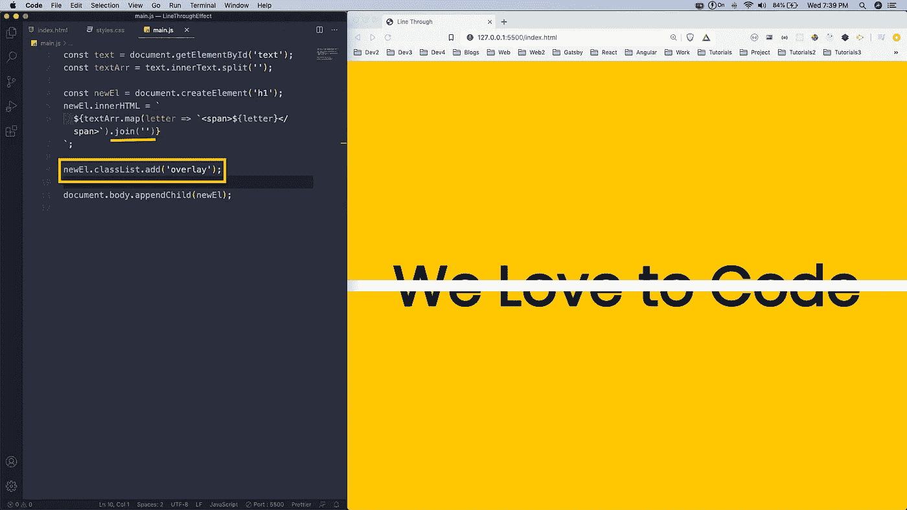
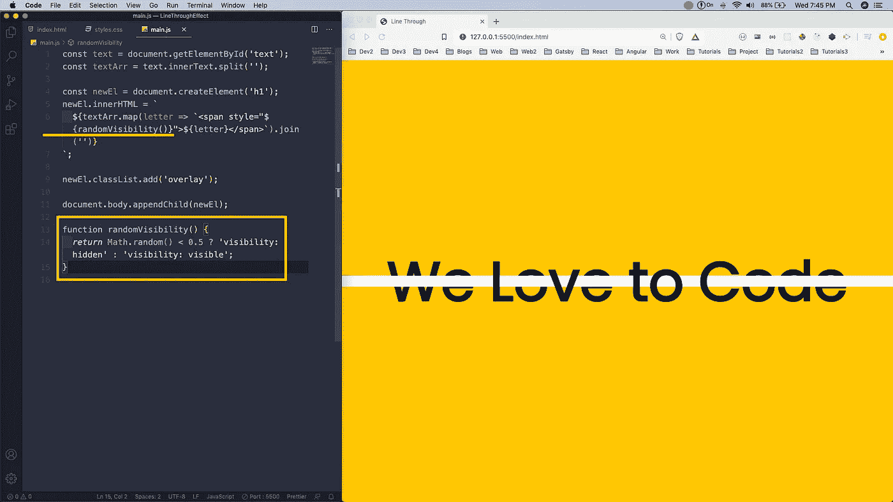

# 用 JavaScript 创建一个线条效果

> 原文：<https://levelup.gitconnected.com/create-a-line-through-effect-with-javascript-1ab602957131>

照片由 [XPS](https://unsplash.com/@xps?utm_source=unsplash&utm_medium=referral&utm_content=creditCopyText) 在 [Unsplash](https://unsplash.com/?utm_source=unsplash&utm_medium=referral&utm_content=creditCopyText) 上拍摄

在这篇文章中，我们将在 CSS 和大量 JavaScript 的帮助下，通过效果创建一个惊人的线条。

所以，在你的终端上创建一个文件夹 **LineThroughEffect** 。在里面创建三个文件-**index.html**、 **main.js** 和 **styles.css** 。我们也用 VS 代码打开文件。

VS 代码

现在，我们将在**index.html**中添加基本的 html，并且链接 css 和 js 文件。我们在这个项目中有很少的 html，有 id 为**行**的 div 和 id 为**文本**的 h1。

index.html

现在，转到 **styles.css** ，为 body 和 h1 添加基本样式。我们还将 h1 居中并增加其尺寸。

样式. css

接下来，我们将为**线**添加代码。它有一个动画，从左向右移动。另外，请注意，它位于 h1 之上，因为 z 索引为 2。

线条

现在，是时候转移到 **main.js** 了。在这里，我们首先用 **split()** 函数分割我们的文本。之后，我们创建一个新的 **h1** ，更新它的 innerHTML 并将其附加到 dom 中。我们循环通过 **textArr** 并在 **span** 中传递它。

主页. js

现在，我们将加入阵列，我们的新 h1 将覆盖旧 h1。我们接下来将添加一个**类覆盖图**到它上面。

覆盖物

现在，返回到 **styles.css** 并创建一个**叠加**类，并给它一个 **z-index** of **2** 。现在，这一行似乎在正文的后面。但它实际上是两个 h1 之间的沙开关。

覆盖物

现在，回到 **main.js** ，我们正在为跨度添加一种风格。这里，我们调用一个函数 **randomVisibility()** 。

在函数 **randomVisibility()** 中，我们使用 Math.random()生成 0 到 1 之间的随机数。所以，有一半的时间可见度是隐藏的。在这些情况下，我们创建的带有覆盖的 h1 将被隐藏，但另一个 h1 将在那里。所以，它会显示好像白线在它上面。

可见性:隐藏

在下面的 gif 中可以更好的观看。

可交换的图像格式

这就完成了我们的小项目。你可以在[这个](https://github.com/nabendu82/LineThroughEffect) github repo 中找到相同的代码。