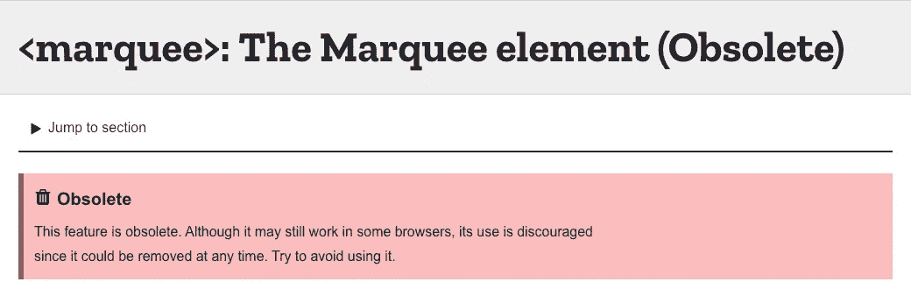
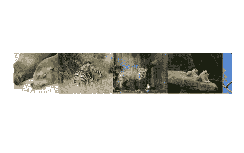
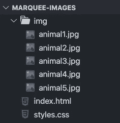
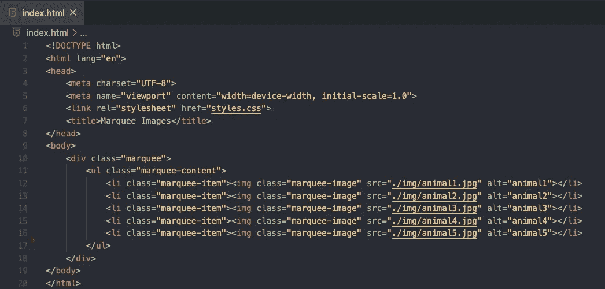
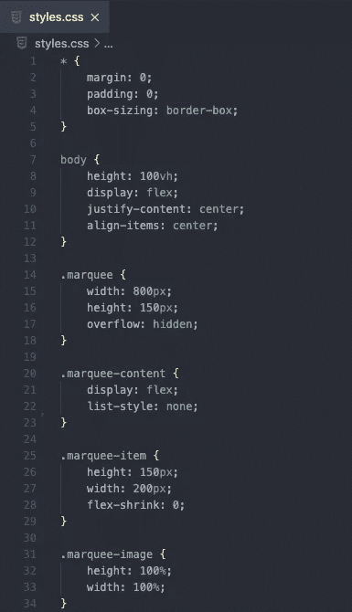
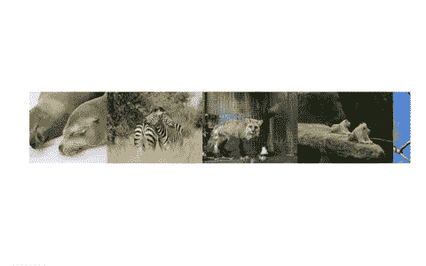
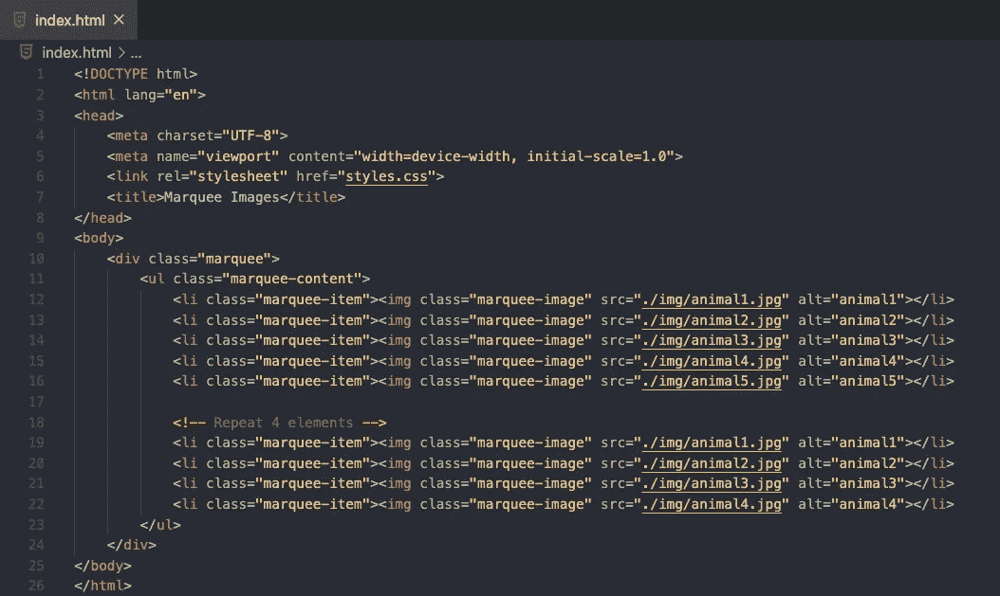
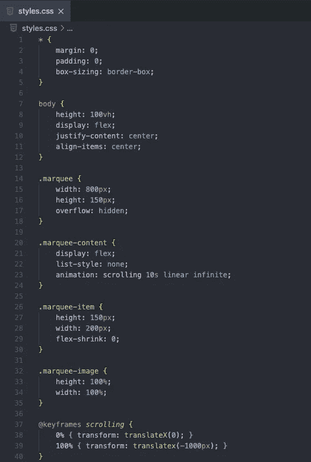
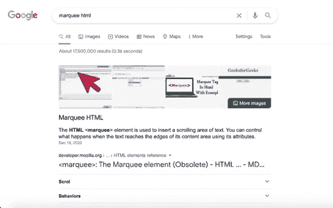

# 用 HTML 和 CSS 创建一个字幕动画

> 原文：<https://levelup.gitconnected.com/create-a-marquee-animation-with-html-and-css-1e7f62a8cbfe>

## 读到最后在谷歌里找一个有趣的秘密


泰勒·威尔科克斯在 [Unsplash](https://unsplash.com?utm_source=medium&utm_medium=referral) 上的照片

前几天我访问了一个网站，它有一个很酷的功能，我想在我的个人网站中实现。有图像，在页面上无限循环地水平移动。我对自己说，我怎样才能重现这个功能？

我搜索了谷歌，查找图像轮播，图像滑块，横向图像动画，但找不到我要找的东西。然后，我终于碰到了这个词，Marquee。这正是我所需要的！令我惊讶的是，实际上有一个名为 marquee 的 HTML 标签，它可以实现我一直在寻找的功能。唯一的问题是这已经过时了。



[https://developer . Mozilla . org/en-US/docs/Web/HTML/Element/marquee](https://developer.mozilla.org/en-US/docs/Web/HTML/Element/marquee)

下一个解决方案。我决定使用基本的 CSS 和关键帧来实现这个动画。在本文中，我将与您分享我的解决方案，并带您了解如何构建一个无限的字幕水平动画。这是我们将要构建的预览。如果你只是想看完整的源代码，你可以看看我在文章末尾的 GitHub repo。



# 入门指南

首先创建一个新项目，并在文本编辑器中打开它。创建一个 HTML 文件、一个 CSS 文件和一个文件夹来保存您的图像。在我的例子中，我从 [Unsplash](https://unsplash.com/) 下载了一些动物图片。



# HTML 文件

首先，打开`index.html`文件。如果您使用的是 VS 代码，那么您应该安装了 Emmet，并且您可以通过键入感叹号和 Enter 来创建 HTML 样板文件。然后，在 head 标签中链接您的`styles.css`文件。

在主体中，用`marquee`类创建一个`div`，它将作为字幕动画的容器。在`div`中，创建一个包含 5 个列表项的无序列表。每个列表项元素将包含一个图像。



index.html

# CSS 文件

接下来，打开您的`styles.css`文件。我们将为我们的项目添加一些基本的样式。注意`marquee`级和`marqee-item`级的宽度。我们将容器的宽度设为 800 像素，每张图片设为 200 像素。目前，你应该只看到 4 个图像显示在你的屏幕上，因为我们已经将容器上的溢出设置为隐藏。



样式. css

# 创造出平滑的无限卷轴

最后，让我们添加我们的动画。为从右向左滚动的`marquee-content`类创建一个关键帧。我们将设置`translatex`为-1000 像素，因为我们有 5 张图片，总共 1000 像素。这样，在重新开始循环之前，5 个图像将完全滚动到容器之外。

```
@keyframes *scrolling* {
  0% { transform: translateX(0); }
  100% { transform: translatex(-1000px); }
}
```

我们的动画目前工作，并将继续无限滚动。然而，有一个问题，你可以在下面看到。我们希望下一个循环图像出现在最后一个图像之后，以模拟连续效果。



为了做到这一点，我们需要在最后一张图片后的空白处进行填充。打开`index.html`文件，我们将通过重复前 4 张图片来填充多余的空间，而不是只有 5 张图片。总共有 9 个列表项元素。

现在，当循环结束时，我们将再次显示前 4 幅图像，而不是在下一次循环开始前留下空白。然后，在下一个循环从开始处的第一幅图像开始的同时，循环将从开始处的第一幅图像结束。这将模拟我们正在寻找的连续效果。

最终的 HTML 和 CSS 文件应该如下所示。



index.html



样式. css

# 包扎

感谢阅读！我希望这有助于你为你的网站重新创建字幕动画。如果你想看完整的源代码，请查看下面我的 GitHub repo。

[](https://github.com/chadmuro/marquee-images) [## Chad muro/marquee-图像

### 在 GitHub 上创建一个帐户，为 chadmuro/marquee-images 的开发做出贡献。

github.com](https://github.com/chadmuro/marquee-images) 

# 谷歌秘密

正如我所承诺的，这里有一个有趣的谷歌小秘密，是我在为这篇文章做研究时偶然发现的。前往[https://www.google.com/](https://www.google.com/)并搜索“字幕 html”。您将看到搜索结果编号和时间显示为一个字幕元素。

