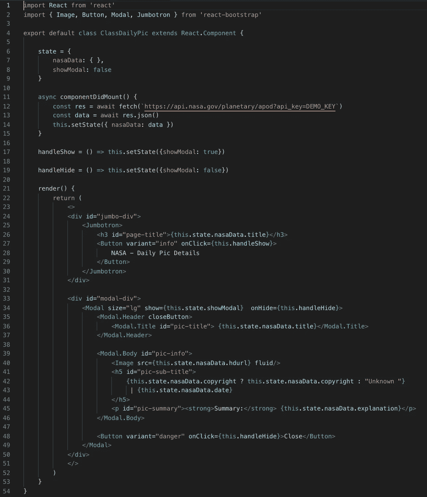
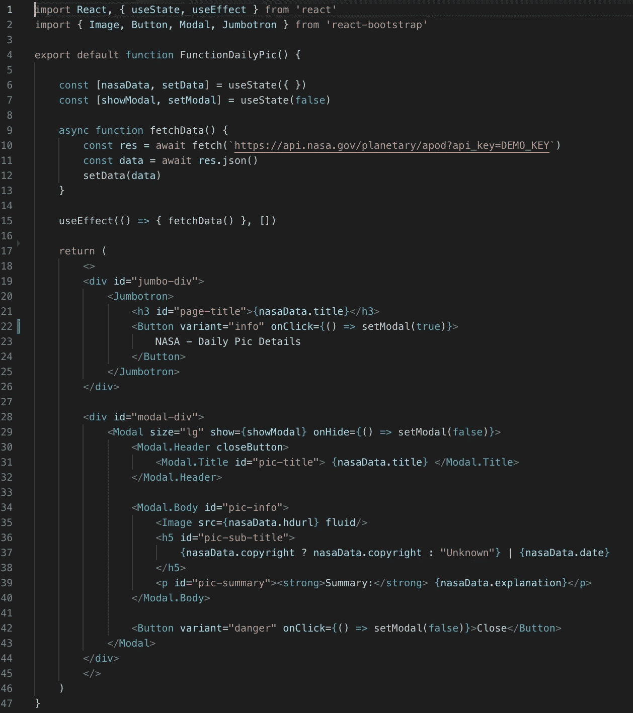
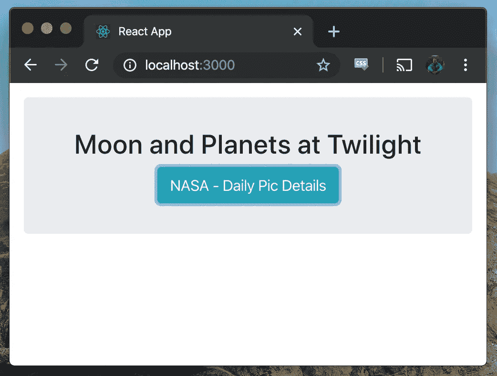

# 创建一个带有反应钩子的模型

> 原文：<https://levelup.gitconnected.com/create-a-modal-with-react-hooks-357c8aae7c3f>

在上周的博客中，我讲述了如何用 React 钩子在一个类组件和一个函数组件中获取数据。今天，我们将讨论如何在这两种类型的组件中实现一个模型，并比较主要的区别。我们将从类组件的实现开始。

# 创建一个模态类组件

首先，我们从 React Bootstrap 导入一些组件，并创建一个初始状态，其中`nasaData`设置为空对象，`showModal`设置为`false`。下一步是获取 NASA 的数据，并使用`this.setState`将这些数据分配给`nasaData`。

我们创建了`handleShow`和`handleHide`函数来切换`showModal`的布尔值。我们调用 render 返回组件，并用[片段简写](https://reactjs.org/docs/fragments.html)、`<>`和`</>`包装返回。这是一种替代，而不是包装`<React.Fragment>`中的组件。我们通过调用格式`this.state.nasaData.title`向浏览器显示 API 数据。

在应用程序的登录页面上，我们单击一个按钮来打开模式，并使用`onClick={this.handleShow}`调用事件监听器和函数。当`showModal`状态为`true`时，`show={this.state.showModal}`在浏览器中呈现模态。当`showModal`值为`false`时，显示原始登陆页面。

# 创建带挂钩的模态功能元件

在函数组件中，我们从 React 导入`useState`和`useEffect`钩子，从 React Bootstrap 导入几个组件。我们创建`nasaData`变量，用`setData`更新值，用`useState({ })`将初始状态设置为空对象。我们还构造了`showModal`变量、`setModal`函数和`useState(false)`作为初始状态。

现在，我们在`useEffect`钩子中获取 NASA 的数据，并使用`setData`将其分配给`nasaData`。我们通过链接格式`nasaData.title`在浏览器中显示特定的数据片段。要查看模态，我们点击按钮调用`onClick={() => setModal(true)}`。该事件调用`setModal`函数，将`showModal`值更新为`true`，并显示带有`show={showModal}`的模态。要返回登录页面，我们单击模式右上角的 x 或关闭按钮。

# 模态功能

# 最终想法—模态比较

*   三元运算符在类组件中很难阅读，需要分成多行。
*   在带有钩子的函数组件中，我们可以用函数内联处理事件，而不会弄乱返回语句。
*   我们删除了功能组件中不必要的`this.state…`链接，以便在浏览器上显示数据属性。

这两个组件实现了相同的功能，但是带有钩子的功能组件有明显的好处。除了上面的三个要点之外，function 组件缩短了七行，每行代码的字符更少，可读性更好。请访问 [React 的文档](https://reactjs.org/docs/hooks-intro.html)以找到额外的例子并继续学习钩子！

[来源](https://unsplash.com/photos/yZygONrUBe8)