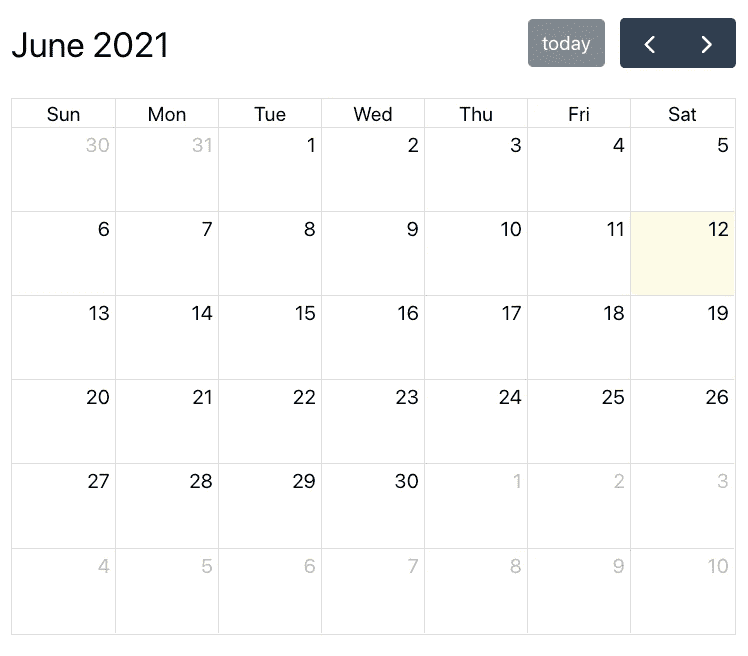
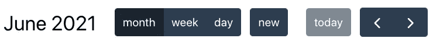
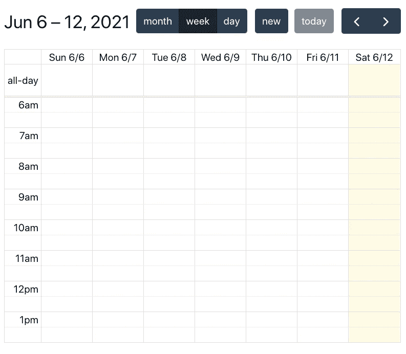
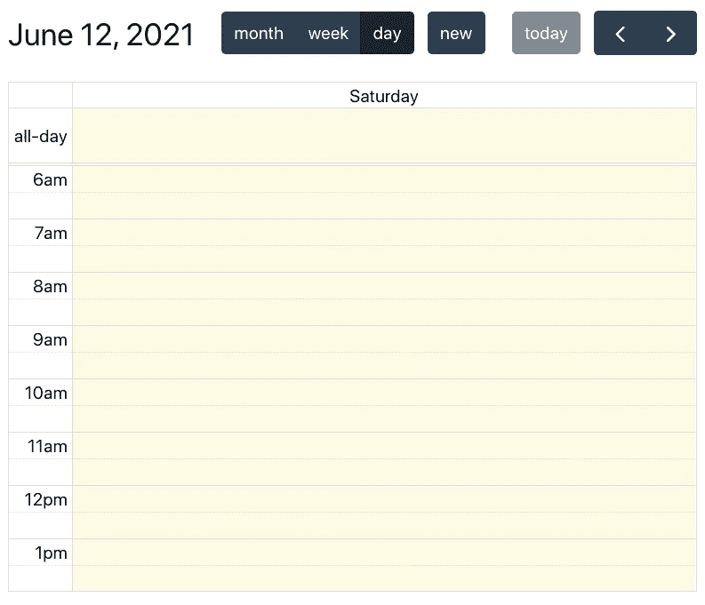
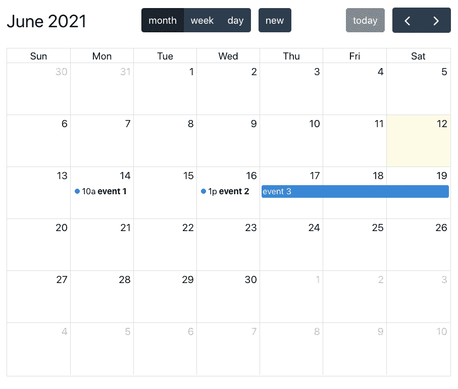
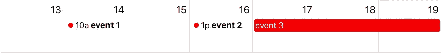
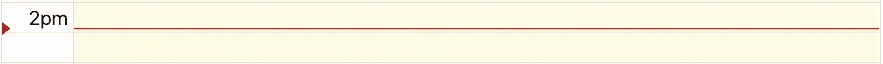

# 使用 React 和 FullCalendar 创建月、周和日视图日历

> 原文：<https://levelup.gitconnected.com/create-a-month-week-and-day-view-calendar-with-react-and-fullcalendar-1794d76e6d06>

## 最好的 JavaScript 日历库


照片由[垂怜经·金](https://unsplash.com/@kyrie3?utm_source=medium&utm_medium=referral)在 [Unsplash](https://unsplash.com?utm_source=medium&utm_medium=referral) 上拍摄

在最近的一个项目中，我想创建一个具有月、周和日视图的日历。我在网上搜索了几个图书馆。到目前为止，我找到的最好的选择是 [FullCalendar](https://fullcalendar.io/) 。

FullCalendar 是一个日历库，可以用普通的 JavaScript 或 React、Vue 或 Angular 等框架来实现。他们有超过 300 种设置，使日历高度可定制，以满足您的需求。

在本文中，我们将了解如何做到以下几点:

*   在 React 应用程序中实现 FullCalendar
*   创建带有自定义按钮的自定义标题
*   将事件添加到日历中
*   使用有用的属性自定义日历

# 实施完整日历

对于这个例子，我们将使用`create-react-app`来建立一个基本的 React 应用程序。

一旦应用程序被设置好，开始在你的项目中安装 FullCalendar React [包](https://www.npmjs.com/package/@fullcalendar/react)。

```
npm install @fullcalendar/react
```

我们还需要从 FullCalendar 安装 3 个[插件](https://fullcalendar.io/docs/plugin-index)。

```
npm install @fullcalendar/daygrid @fullcalendar/timegrid @fullcalendar/interaction
```

首先，在项目中创建一个名为`Calendar.js`的新文件。在这个文件中，从`@fullcalendar/react`导入 FullCalendar 组件，以及各自库中的插件。

```
import FullCalendar from '@fullcalendar/react';
import dayGridPlugin from '@fullcalendar/daygrid';
import timeGridPlugin from '@fullcalendar/timegrid';
import interactionPlugin from '@fullcalendar/interaction';
```

我们现在可以在应用程序中呈现一个日历。将我们导入的插件数组传递给`plugins`道具。我们还将使用`initialView`属性设置日历的初始视图。`initialView` prop 接受我们作为插件添加的任何可用视图的字符串。对于我们的例子，我将初始视图设置为`dayGridMonth`。

```
function FullCalendarApp() {
  return (
    <div *className*="App">
      <*FullCalendar
        plugins*={[dayGridPlugin, timeGridPlugin, interactionPlugin]}
        *initialView*="dayGridMonth"
      />
    </div>
  );
}
```

这将为我们初始化一个如下所示的日历。



# 创建自定义标题

接下来，我们将自定义标题。默认情况下，日历标题的右侧会显示“下一个”、“上一个”和“今天”按钮。

我们可以使用`headerToolbar`属性添加或修改标题中按钮的位置。`headerToolbar`道具带一个有`start`、`center`和`end`属性的物体。我们添加到这些属性中的值将决定在标题中显示什么按钮。

默认标头将具有以下属性。

```
*// default headerToolbar properties*
headerToolbar = {{
  start: 'title',
  center: '',   
  end: 'today prev,next'
}}
```

对于我们的例子，我们将把不同的视图添加到标题的中心。这将为每个视图创建按钮，以便在月、周和日视图之间切换。

```
*headerToolbar*={{
  center: 'dayGridMonth,timeGridWeek,timeGridDay',
}}
```

我们还可以使用`customButtons`道具在标题中添加自定义按钮。例如，我们可以创建一个按钮，用下面的对象添加一个新事件。

```
*customButtons*={{
  new: {
    text: 'new',
    click: () => console.log('new event'),
  },
}}
```

然后，我们可以将我们创建的新按钮添加到`headerToolbar`中。请记住，逗号和空格在值中很重要。

```
*headerToolbar*={{
  center: 'dayGridMonth,timeGridWeek,timeGridDay **new**',
}}
```

我们的标题现在看起来像这样。



如果我们单击月、周或日按钮，日历的视图会相应地改变。

**周视图**



**日视图**



# 添加事件

我们还可以将事件添加到日历中。

基本事件对象将有一个`id`、`title`、`start`和`end`属性。

```
{
  id: 1,
  title: 'event 1',
  start: '2021-06-14T10:00:00',
  end: '2021-06-14T12:00:00',
},
```

例如，我们可以像这样硬编码一组事件。

```
const events = [
  {
    id: 1,
    title: 'event 1',
    start: '2021-06-14T10:00:00',
    end: '2021-06-14T12:00:00',
  },
  {
    id: 2,
    title: 'event 2',
    start: '2021-06-16T13:00:00',
    end: '2021-06-16T18:00:00',
  },
  { 
    id: 3, 
    title: 'event 3', 
    start: '2021-06-17', 
    end: '2021-06-20' },
];
```

然后传到`FullCalendar`组件上的`events`支柱。

```
events={events}
```

这将导致以下事件被添加到日历中。



# 附加性能

下面列出了一些可能对你有用的额外道具。

**事件颜色** —改变事件的背景颜色和边框。

```
*eventColor*="red"
```



**nowIndicator** —在时间网格视图中显示当前时间。

```
nowIndicator
```



**日期点击** —用户点击日期或时间时触发的功能。

```
*dateClick*={(*e*) => console.log(*e*.dateStr)}
```

**eventClick** —用户点击事件时触发的功能。

```
*eventClick*={(*e*) => console.log(*e*.event.id)}
```

定制 FullCalendar 很容易。他们有 300 多种设置供你定制。如果您想要自定义任何没有现有设置的属性，可以直接将 CSS 作为目标。点击查看他们的文档[中的操作方法。](https://fullcalendar.io/docs/css-customization)

# 包扎

查看我们在下面创建的日历组件的完整源代码。

感谢阅读！我希望这篇文章对您创建 React 项目的日历有所帮助。

如果您想在 JavaScript 中找到一种简单的方法来处理日期，请查看下面的文章来了解 Day.js。

[](https://blog.devgenius.io/the-easiest-way-to-deal-with-dates-and-times-in-javascript-5c74db8fb535) [## JavaScript 中处理日期和时间的最简单方法

### Day.js 简介及有用函数的示例

blog.devgenius.io](https://blog.devgenius.io/the-easiest-way-to-deal-with-dates-and-times-in-javascript-5c74db8fb535)