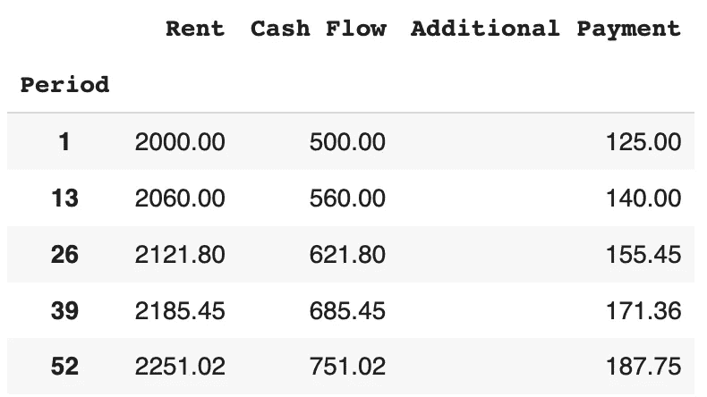
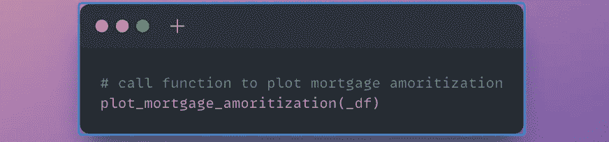

# 用 Python 创建一个提前还款的抵押计算器

> 原文：<https://levelup.gitconnected.com/create-a-mortgage-calculator-for-early-payoff-in-python-98b51ee4757f>

## Python 教程计算固定额外付款和增加额外付款的抵押还款

在 [Unsplash](https://unsplash.com/photos/05XcCfTOzN4) 上由[Towfiqu barb huya](https://unsplash.com/@towfiqu999999)拍摄的照片

P 阿英提前还清你的房贷可以为你提供 ***无债一身轻的自由*** 。每个月只需额外支付几笔钱就能为你节省数千美元的利息！

将近 40%的美国房主直接拥有自己的房子。

如果我们想完全拥有自己的房子，那么我们需要 ***预测我们的额外付款将会产生多大的影响*** 。

每月支付额外的款项听起来很简单，但是有几个悬而未决的问题…

*   我们如何决定额外付款的金额？
*   如果我们是房地产投资者呢？我们能否根据增加的现金流 预测 ***增加的额外付款？***

在本文中，我们将介绍如何使用 Python 为 ***固定和动态*** 额外支付创建一个抵押计算器。

# 概观

[概述](#f626)∘
什么是抵押摊销？
∘ [提前还贷的理由](#b1b3)
∘ [问题陈述](#bd34)
[先决条件](#9051)
[Python 教程](#e173)
∘ [一、安装包](#f3e7)
∘ [二、进口包装](#bd2b)
∘ [III。本地人&常量](#165b)∘
iv[。建立数据框架结构](#6faa)
∘ [五、可视化](#6a6c)
∘ [六。](#df68)
[动态追加付款(投资者)结论](#cf28)
[克隆笔记本](#671f)
[来源](#890d)

## 什么是抵押贷款摊销？

照片由[蔡斯](https://www.chase.com/personal/mortgage/education/financing-a-home/what-is-mortgage-amortization)

> 抵押贷款摊销是一个金融术语，指的是你的房屋贷款还清过程。当你申请抵押贷款时，贷方会为你制定一个付款时间表。这个时间表是直截了当的，如果你有固定利率的抵押贷款，在你的贷款期限内由相等的分期付款组成。——[*追*](https://www.chase.com/personal/mortgage/education/financing-a-home/what-is-mortgage-amortization)

每月按揭付款由两部分组成:

*   **本金** —您贷款的未偿余额
*   **利息**——为房屋融资的成本

## 提前偿还抵押贷款的原因

Joanna Nix-Walkup 在 [Unsplash](https://unsplash.com/photos/jPLRrq72KBc) 上拍摄的照片

**业主(主要居住地)的支持**

*   节省利息
*   不再每月付款
*   彻底拥有房子
*   内心的宁静

**投资者/房东的优势**

房地产投资者根据他们的年龄、风险承受能力、资本等有多种策略。

许多房地产投资者选择不提前还清抵押贷款，而是通过 [1031 交换](https://www.renterswarehouse.com/education/what-are-the-benefits-of-a-1031-exchange)提升房地产质量或单位数量。

然而，对于希望 ***用有限的债务*** 实现财务自由的投资者来说，[滚雪球债务策略](https://smartland.com/resources/snowball-debt-strategy-in-real-estate-investing/)是一个极好的策略。

> 当债务滚雪球法应用得当时，你最终可以自由、清晰地拥有多栋能产生收入的建筑。— [*Smartland*](https://smartland.com/resources/snowball-debt-strategy-in-real-estate-investing/)

## 问题陈述

我们想预测额外付款如何帮助我们更快地还清抵押贷款。

我们将为 ***开发一个表格和图表，直观显示我们多久可以还清抵押贷款，以及我们根据额外付款*** 节省了多少利息。

我们感兴趣的有两种情况:

1.  **固定提前还款** —每月相同的额外付款
2.  **动态提前支付** —基于现金流的增加，每年增加额外支付

有关现金流的更多信息，请查看我的文章《如何用 Python 计算和可视化现金流》!

 [## 如何计算现金流并在 Python 中可视化

### 计算房地产现金流的 Python 教程

levelup.gitconnected.com](/how-to-calculate-cash-flow-and-visualize-it-in-python-9305c4cb190f) 

# 先决条件

你自己的 Python 环境或者谷歌账户。

# 支持视频

请查看我的视频跟随。

作者在 YouTube[上制作的视频](https://youtu.be/Dh09SWvCuiM)

# Python 教程

如果您没有现有的 Python 环境，那么我强烈建议首先用**克隆笔记本**(在文章的底部)。

这将允许您在 Google Colab 中运行 Python 代码(免费！).它是一个基于云的环境，让您无需在本地安装 Python 就可以运行代码。

## 一.安装包

第一步是安装必要的软件包。

安装包的代码片段(作者使用 snappify.io 创建的图片)

这个 [*numpy-financial*](https://numpy.org/numpy-financial/latest/) 包是一个基本金融函数的集合。

## 二。导入包

接下来，导入必要的包。

导入的代码片段(作者使用 snappify.io 创建的图片)

## 三。局部变量和常量

对于我们的抵押计算器，我们需要几个参数作为输入来计算我们的贷款偿还。

**所需参数**

1.  **利息** —抵押贷款利息是对用于购买房产的[贷款](https://www.investopedia.com/terms/l/loan.asp)收取的[利息](https://www.investopedia.com/terms/i/interest.asp)
2.  **支付年度** —每年支付的次数(通常为 12 次)
3.  **抵押贷款**——用于购买或维护房屋、土地或其他类型房地产的贷款
4.  **开始日期** —抵押开始期间

**额外支付参数**

*场景# 1——每月相同的付款，直到还清贷款*

1.  **额外付款金额** —直接应用于您的抵押贷款本金金额的固定额外本金付款

*场景#2 —基于租赁现金流百分比的动态支付*

1.  **开始租金** —抵押开始时的租金值
2.  **开始现金流**——扣除收入和支出后，你获得的净值
3.  **租金同比增长** —预期租金同比增长([标准增长通常为 3-5%](https://www.rentals.com/blog/how-much-should-rent-increase-per-year/))
4.  **额外付款%** —用于额外付款的现金流百分比(即 300 美元现金流的 10% =当年每月用于抵押贷款本金的 30 美元)

让我们从*场景#1 开始—* 每月相同的付款。

局部变量和常量的代码片段(作者使用 snappify.io 创建的图片)

## 四。设置数据帧结构

在本节中，我们将**为贷款期间的每个付款期**创建一个表。

这将允许我们跟踪本金和利息支付以及额外支付后的贷款价值。

首先，我们需要 ***为每月付款、利息和本金付款*** 创建初始值。

初始值的代码片段(作者使用 snappify.io 创建的图片)

以下是我们的起始值:

代码输出(作者创建的截图)

接下来，创建一个 pandas 数据框架(包含行和列的表)。

我们根据贷款期限设置我们的栏目和支付日期。

初始 DataFrame 的代码片段(作者使用 snappify.io 创建的图片)

注意，我们有两列分别为*和 ***期末余额*** 。*

****原始*** 字段表示没有应用额外支付的值*。**

*这使我们能够比较价值的差异，并看到应用额外支付的好处。*

**

*代码输出(作者创建的截图)*

*接下来，我们设置一个条件语句来确定 ***初始追加付款*** 的值。根据我们的输入参数，有三个选项:*

1.  *动态附加付款*
2.  *固定附加付款*
3.  *没有额外付款*

**

*初始额外付款的代码片段(作者使用 snappify.io 创建的图片)*

*计算数据帧中第一行(period = 1)的值。*

**

*初始 DataFrame 的代码片段(作者使用 snappify.io 创建的图片)*

*我们的第一行(period = 1)现在包含所有值。*

****租金*** 和 ***现金流*** 值为 *null* ，因为我们正在为*场景#1* 实施固定的额外付款。*

**

*代码输出(作者创建的截图)*

***添加每个付款期的值***

*在本节中，为了可读性，我们将循环 的**分为四个部分。***

*我们的 ***for 循环*** 的目的是迭代每个支付周期。对于每个付款期，我们计算每列的值。*

*首先，我们设置循环 的 ***来迭代第二个支付周期到最后一个支付周期。我们检索前期(上个月)的值。****

**

*支付数据的代码片段(作者使用 snappify.io 创建的图片)*

*其次，我们设置我们的额外支付值。根据我们的输入参数，有三个选项:*

1.  *动态附加付款*
2.  *固定附加付款*
3.  *没有额外付款*

**

*支付数据的代码片段(作者使用 snappify.io 创建的图片)*

*第三，计算剩余值以获得该期间的期末贷款余额。*

**

*支付数据的代码片段(作者使用 snappify.io 创建的图片)*

*第四，创建一个 ***行字典*** 变量，它将保存支付期的所有变量。将 ***行字典*** 追加到数据帧。*

**

*支付数据的代码片段(作者使用 snappify.io 创建的图片)*

*现在，我们有了一个完整的每一个付款期的利息、本金和付款表！*

**

*代码输出(作者创建的截图)*

## *动词 （verb 的缩写）形象化*

*让我们创建一个可视化来查看我们的抵押贷款分期偿还:定期抵押贷款偿还与额外付款。*

*我们要比较*与 ***期末余额*** (有额外支出)列。**

**这里我们使用 [*pandas.melt*](https://pandas.pydata.org/docs/reference/api/pandas.melt.html) 函数来转换我们的数据帧。**

****

**熔化数据帧的代码片段(作者使用 snappify.io 创建的图片)**

**现在，我们已经将 ***原始期末余额*** 和 ***期末余额*** 的所有变量放在一列中。**

****

**代码输出(作者创建的截图)**

**在我们的图表中，我们希望可视化关键日期— ***提前付款日期*** 和 ***最大付款日期*** 。**

**让我们得到这些值，并计算出**我们通过额外支付节省的利息总额**。**

****

**可视化变量的代码片段(作者使用 snappify.io 创建的图片)**

**在我们的示例中，我们在每个付款期应用 300 美元的额外付款。我们能够提前 5 年还清贷款。节省了~$8K 的利息！**

****

**代码输出(作者创建的截图)**

**现在，我们使用 [Plotly 折线图](https://plotly.com/python/line-charts/)创建我们的可视化。**

****

**Plotly 可视化的代码片段(作者使用 snappify.io 创建的图片)**

**我们的抵押贷款分期偿还图表有几个组成部分。**

**主要特点:**

*   ****Y 轴** —抵押余额**
*   ****X 轴** —支付年份**
*   ****行** —对比有无追加付款的期末余额**
*   ****阴影区** —包含利息储蓄金额的早期回收期**

****

**代码输出(作者创建的截图)**

## **不及物动词动态追加付款(投资者)**

**对于*场景#2* ，我们的额外付款将在整个贷款期限内发生变化。 ***动态支付是基于租金现金流*** 的百分比。**

**这里我们改变了几个输入参数—**

*   ****利率** —投资物业通常比一手住宅利率高 0.5-1%**
*   ****年期** — [40 年期抵押贷款是一种新产品](https://www.marketwatch.com/story/heres-how-much-a-40-year-mortgage-would-save-you-each-month-vs-a-30-year-loan-and-the-ultimate-cost-11649084594)，吸引投资者最大化现金流**
*   ****额外付款** —将该值设置为*无*因为我们不会有固定的额外付款，相反，我们的额外付款将基于上升的现金流**

**我在一个函数中设置了我们之前的代码，以便轻松地传递我们的参数——在**笔记本**中查看一下(在文章的底部)。**

****

**参数的代码片段(作者使用 snappify.io 创建的图片)**

**让我们来看看我们的 ***租金、现金流和附加付款如何同比增加*** 。**

****

**额外支付的代码片段(作者使用 snappify.io 创建的图片)**

**从我们的投入价值来看，租金每年上涨 3%。**

**从第一年到第二年，我们看到租金增加了 60 美元，现金流增加了 60 美元。这使我们的贷款额外增加了 15 美元(140-125 美元)。**

****

**参数的代码片段(作者使用 snappify.io 创建的图片)**

**让我们调用绘图函数来可视化抵押贷款摊销。**

****

**可视化代码片段(作者使用 snappify.io 创建的图片)**

**在一笔为期 40 年的贷款中，我们可以看到，通过将我们每月现金流的 25%用于额外付款 ，我们能够 ***节省 4.3 万美元的利息。*****

****

**代码输出(作者创建的截图)**

# **结论**

**提前偿还抵押贷款是在退休前实现财务自由和无债一身轻的好方法。通过使用 Python，我们可以修改我们的额外付款，并确定随着时间的推移我们可以节省多少。**

**查看我的 [YouTube 频道——analytics Ariel](https://youtube.com/c/analyticsariel),了解更多关于房地产数据源和数据分析的信息！**

# **克隆笔记本**

** [## projects/mortgage _ payment _ cash _ flow _ calculator . ipynb at master analytics Ariel/projects

### https://analyticsariel.com/.通过在 GitHub 上创建帐户，为 analyticsariel/projects 开发做出贡献。

github.com](https://github.com/analyticsariel/projects/blob/master/calculators/mortgage_payoff_cash_flow_calculator.ipynb) 

# 来源

 [## 如何使用 Python 建模提前偿还抵押贷款——数据驱动的资金

### 在这篇文章中，我将向你展示如何运用 Python 来计算为你的…

datadrivenmoney.com](https://datadrivenmoney.com/how-to-use-python-to-model-paying-off-your-mortgage-early/)  [## 使用 Python 和 Excel 的简单抵押计算器

### 用熊猫和 Numpy 自动化你的房地产分析

medium.com](https://medium.com/swlh/simple-mortgage-calculator-with-python-and-excel-b98dede36720)  [## 抵押贷款偿还计算器

### 如果剩余贷款的期限长度是已知的，并且有原始贷款的信息，请使用此计算器…

www.calculator.net](https://www.calculator.net/mortgage-payoff-calculator.html?cloanamount=400000&cloanterm=30&cinterestrate=4&cremainingyear=30&cremainingmonth=0&cadditionalmonth=500&cadditionalyear=0&cadditionalonetime=0&cpayoffoption=original&type=1&x=41&y=17#loanterm)  [## 烈火运动:如何在没有抵押债务的情况下提前退休

### 根据金融研究公司的一份报告，三分之一的美国人把提前退休作为一个财务目标。

www.foxbusiness.com](https://www.foxbusiness.com/money/fire-movement-retire-early-with-no-mortgage-debt)**