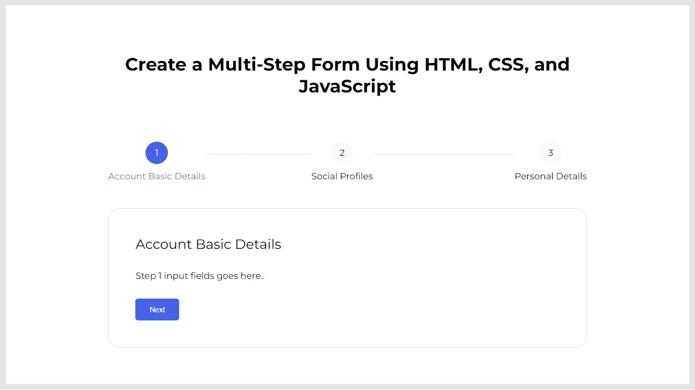
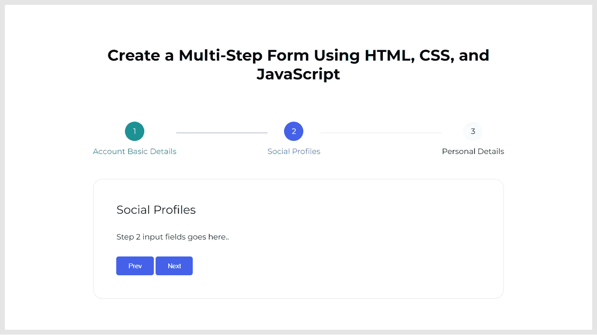
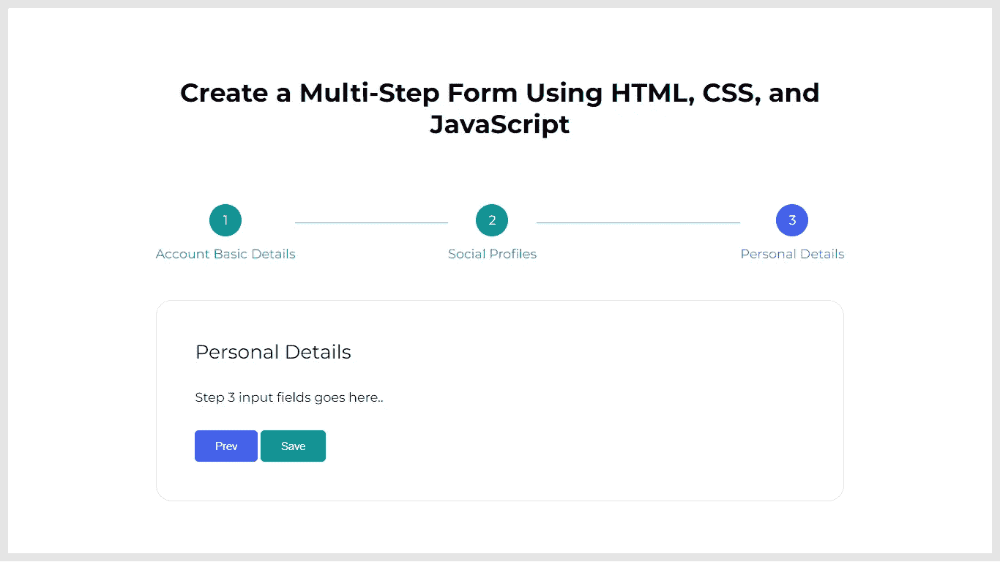

# 使用 HTML、CSS 和 JavaScript 创建多步表单

> 原文：<https://levelup.gitconnected.com/create-a-multi-step-form-using-html-css-and-javascript-30aca5c062fc>

## 学习在网络技术的帮助下，构建一个分为多个步骤的现代外观的表单。

为了处理长而复杂的表单，我们需要将它们分成多个步骤。通过在屏幕上一次只显示几个输入，表单会感觉更容易理解，并防止用户被大量的表单字段淹没。

在本文中，我将逐步介绍如何在 web 应用程序中实现多步表单。当我们继续填写表格步骤时，步进器将显示在代表进度条的表格上方。每个表单步骤将包含名为`Prev`和`Next`的按钮。这些按钮将使您能够在各个步骤之间导航。

# 用 3 个简单的步骤构建多步表单

1.  使用 HTML 创建表单和步骤元素的布局。
2.  使用 JavaScript 使多步表单起作用。
3.  使用 CSS 设计表单和步骤元素。

# 步骤 1:使用 HTML 创建表单和步骤元素的布局

在实现表单步骤的导航器之前，让我们设置一个基本的 HTML 表单。它将包括一个表单步进器，作为进度条。它将包含代表步骤编号的多个项目。这些项目将显示为圆圈，圆圈内有步骤编号。未完成的步骤的圆圈背景颜色为灰色。活动步骤的圆圈背景颜色为紫色。并且，完成的步骤的圆圈背景颜色为绿色。在表单步进器之后，我们需要创建一个包含多个部分的表单。这些部分可用于所有步骤，并将包含每个表单步骤的表单字段。每个步骤都将包含一个上一步和下一步按钮，这将有助于在步骤之间导航。但是，最后一步将显示一个保存按钮，通过它您可以提交表单。

将以下代码段添加到要实现多步窗体的部分。

# 步骤 2:使用 JavaScript 实现多步表单的功能

现在，我们需要实现在表单步骤之间导航的逻辑。创建一个名为`navigateToFormStep`的箭头函数，它将接受一个名为`stepNumber`的参数。该函数将接收您想要访问的步骤的值。它会将前面的步骤标记为已完成，当前步骤标记为活动，其余步骤标记为未完成。它对“上一步”和“下一步”按钮都有效，因为我们只需要传递可见并标记为活动的步骤编号。接下来，我们需要选择所有的 previous 和 Next 按钮，并为每个按钮添加一个 click 事件侦听器。单击这些按钮中的任何一个，都会触发一个匿名函数，该函数将获取目标步骤的值，并调用`navigateToFormStep`函数来执行导航过程。

在页面的`script`元素中添加以下代码片段。

# 步骤 3:使用 CSS 设计表单和步骤元素

既然我们已经完成了多步表单的实现，我们需要添加一些 CSS 片段来设计 HTML 内容的布局。

将以下代码片段添加到`style`元素或外部 CSS 文件中，并在页面上使用。

# 结果

太棒了。您已经完成了如何使用纯 HTML、CSS 和 JavaScript 创建多步表单的学习。

> 如果你喜欢阅读这篇文章，并发现它对你有用，那么请鼓掌，与你的朋友分享，并关注我以获得我即将发布的文章的更新。你可以在 [LinkedIn](https://www.linkedin.com/in/tararoutray/) 上和我联系。