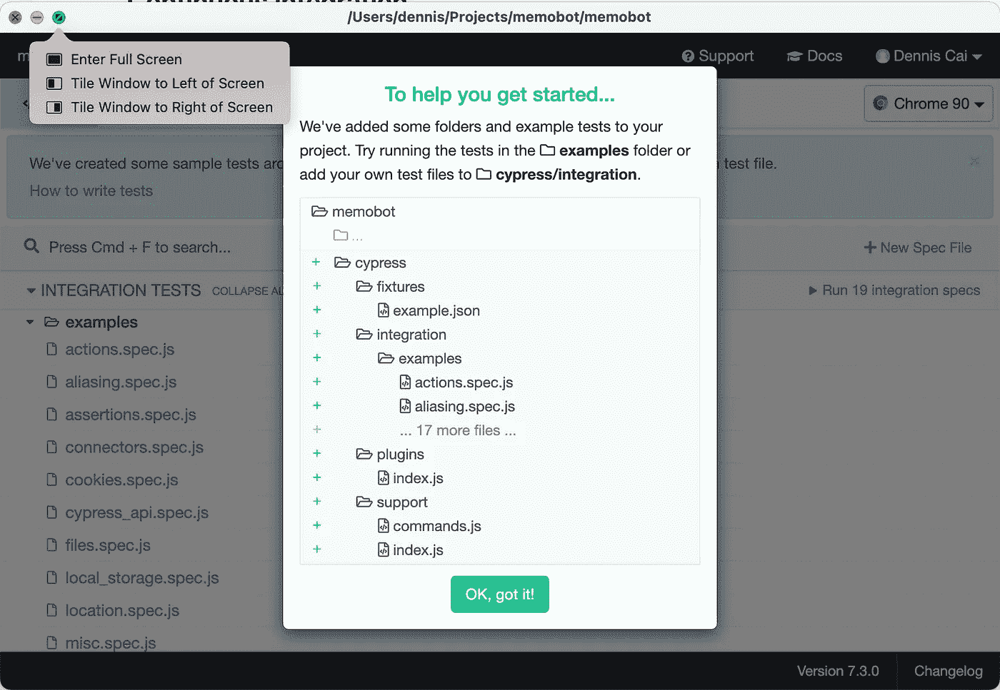
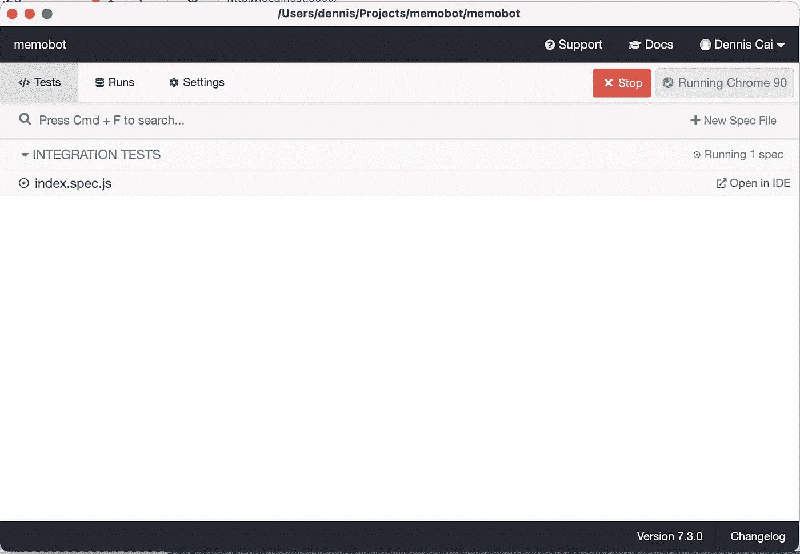
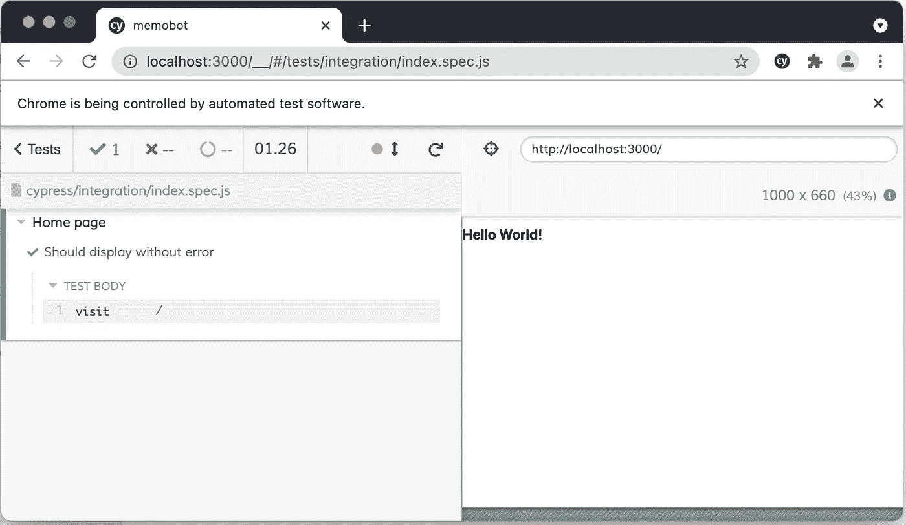

# 用 Typescript、Material-UI 和 Cypress 创建一个新的 NextJS 站点

> 原文：<https://levelup.gitconnected.com/create-a-new-nextjs-site-with-typescript-material-ui-and-cypress-de92304fc0>

NextJS 是一个非常适合静态站点生成的 React 框架，因为它具有预先呈现页面、提供路由和与 webpack 捆绑以支持类型脚本等的结构。为了确保用户界面的一致性和标准化，建议使用带有内置组件的设计系统，这样我们就可以用最少的代码启动并运行复杂的用户界面。所以我在这里使用 [Material-UI](https://material-ui.com/) ，因为它是免费的，并且附带了相当多有用的组件。 [Cypress](https://www.cypress.io/) 确实是测试 web 应用程序的首选平台，它建立了一个平台，真正简化了您在各种浏览器上的测试，并通过一个用于调试的强大 UI 自动化了测试过程。

首先，在您想要的项目位置运行下面的命令来创建一个 NextJS 项目。

```
npx create-next-app
```

然后，在项目根目录中添加一个名为`tsconfig.json`的空文件。在终端中，运行下一个命令`npm run dev`，您将被引导(如下)安装所需的包来设置 typescript。

```
ready - started server on 0.0.0.0:3000, url: http://localhost:3000
info  - Using webpack 5\. Reason: no next.config.js https://nextjs.org/docs/messages/webpack5
It looks like you're trying to use TypeScript but do not have the required package(s) installed.Please install typescript and @types/react by running: npm install --save-dev typescript @types/reactIf you are not trying to use TypeScript, please remove the tsconfig.json file from your package root (and any TypeScript files in your pages directory).
```

按照说明，运行以下命令来安装@types/react 和 typescript

```
npm install --save-dev typescript @types/react
```

既然项目与 typescript 兼容，我们可以重命名当前文件(index.js 和 _app.js)的扩展名以使用`.tsx`扩展名

为了确保它正常工作，运行`npm run dev`并访问`http://localhost:3000`以确保它正常工作。一旦你确认一切正常，在你的终端上点击`CTRL+C`来停止服务器，因为我们还有其他的包要安装。

要安装 material-ui，请运行以下命令

```
npm install @material-ui/core @material-ui/icons
```

最后，运行`npm install cypress --save-dev`来安装测试框架。尽可能频繁地进行测试总是一个好习惯和最佳实践，这样我们可以确保我们的应用程序总是经过良好的测试，并且没有技术债务。

cypress 安装完成后，运行`npx cypress open`来运行它。一个新的 cypress 窗口(截图如下)将会出现，向您显示它已经在您的项目中创建了一个新的`cypress`文件夹，并创建了各种示例来帮助您开始。您可以安全地删除 example 文件夹，因为所有的测试用例都引用 https://example.cypress.io，并且与当前项目无关。



这就是安装过程。

现在，让我们来设置 cypress 配置，让它变得简单一些。打开`cypress.json`文件，将内容替换为以下内容

```
{
  "baseUrl": "http://localhost:3000",
  "nodeVersion": "system"
}
```

`baseUrl`的设置将允许我们在测试用例中引用相对路径(例如`/`而不是`http://localhost:3000/`)，这样当我们部署后域发生变化时，我们就不必手动更新所有的测试用例。

将`nodeVersion`设置为`system`将使 cypress 使用项目的节点版本，而不是 cypress 自带的节点版本。这适用于在比 cypress 版本更高的 node 版本中使用新函数的情况。

我们希望开始测试，所以现在让我们将 index.tsx 中返回的内容删除为一个简单的`Hello World`。将 index.tsx 中的导出默认函数替换为以下内容。

```
export default function Home() {
  return (
    <h1>Hello World!</h1>
  )
}
```

然后，我们在`cypress/integration`文件夹下创建一个新的规范文件`index.spec.js`，内容如下。

```
describe('Home page', () => {
  it('Should display without error', () => {
    cy.visit('/')
  })
})
```

`cy.visit()`是指示 cypress 导航到我们主页的功能。由于上面提到的`baseUrl`配置，我们可以使用`/`。

新的`index.spec.js`应该会自动显示在 cypress 窗口中。



点击`index.spec.js`，一个新的浏览器窗口将会打开，文件中有测试用例。它应该显示测试用例运行成功。



虽然我们没有指定任何断言，但是测试仍然成功，因为 cypress 内置了默认断言，因此某些命令不需要显式操作。如果命令没有完成，它们也会失败。因此，如果我们停止 nextjs 服务器，并再次运行测试，您可以看到测试将失败，因为它无法到达索引页面。

在开始添加 material-ui 组件之前，请注意，根据 https://material-ui.com/guides/server-rendering/[的说法，material-ui 不是为在服务器上渲染而设计的，而这正是 nextjs 的意义所在。当我们在 nextjs 页面中使用 material ui 时，默认情况下，material ui 样式是在服务器端生成的，因为 nextjs 是一个静态站点生成器，所以页面是预先生成的，随之而来的 material ui 也是如此。如果什么都不做，浏览器控制台日志中会有一个警告，比如“Prop `classname`不匹配。服务器:“makeStyles-main-3”客户端:“makeStyles-main-1”。](https://material-ui.com/guides/server-rendering/)

为了让它工作，服务器端生成的 css 需要被移除，并注入到客户端。对于 nextjs，我们可以通过从[自定义应用](https://nextjs.org/docs/advanced-features/custom-app)中移除服务器端注入的 css，并将其注入到[自定义文档](https://nextjs.org/docs/advanced-features/custom-document)中来实现这一点。

要从自定义应用(_app.tsx)中移除服务器端注入的 css，用下面的代码替换`_app.tsx`中的函数。

```
function MyApp({ Component, pageProps }) {
  React.useEffect(() => {
    // Remove the server-side injected CSS.
    const jssStyles = document.querySelector('#jss-server-side');
    if(jssStyles){
      jssStyles.parentElement!.removeChild(jssStyles);
    }
  }, []);
  return <Component {...pageProps} />
}
```

然后在`pages`文件夹下直接创建一个`_document.tsx`，内容如下。

```
import React from 'react';
import Document, {Html, Head, Main, NextScript} from "next/document";
import {ServerStyleSheets} from "@material-ui/core";export default class MyDocument extends Document {
    render(){
        return (
            <Html lang="en">
                <Head>
                    <link rel="stylesheet" href="https://fonts.googleapis.com/css?family=Roboto:300,400,500,700&display=swap" />
                </Head>
                <body>
                <Main />
                <NextScript />
                </body>
            </Html>
        );
    }
}// `getInitialProps` belongs to `_document` (instead of `_app`),
// it's compatible with server-side generation (SSG).
MyDocument.getInitialProps = async (ctx) => { // Render app and page and get the context of the page with collected side effects.
    const sheets = new ServerStyleSheets();
    const originalRenderPage = ctx.renderPage; ctx.renderPage = () =>
        originalRenderPage({
            enhanceApp: (App) => (props) => sheets.collect(<App {...props} />),
        }); const initialProps = await Document.getInitialProps(ctx); return {
        ...initialProps,
        // Styles fragment is rendered after the app and page rendering finish.
        styles: [...React.Children.toArray(initialProps.styles), sheets.getStyleElement()],
    };
};
```

以上代码来自[https://github . com/mui-org/material-ui/blob/master/examples/nextjs/pages/_ document . js](https://github.com/mui-org/material-ui/blob/master/examples/nextjs/pages/_document.js)。

完成以上步骤后，重启 nextjs 服务器，控制台警告就没了。

上面的结果发布在 github->[https://github.com/thecodinganalyst/next-sample](https://github.com/thecodinganalyst/next-sample)上，带有来自 material ui 的工具栏和抽屉，以及动态路由如何在 nextjs 中工作的演示。

然而，也许 material ui 真的不适合与 next js 一起使用，我发现在开发模式下页面的加载似乎非常慢。尽管如此，当我在生产环境中运行它时，它还是可以的，因为页面是在构建时生成的。