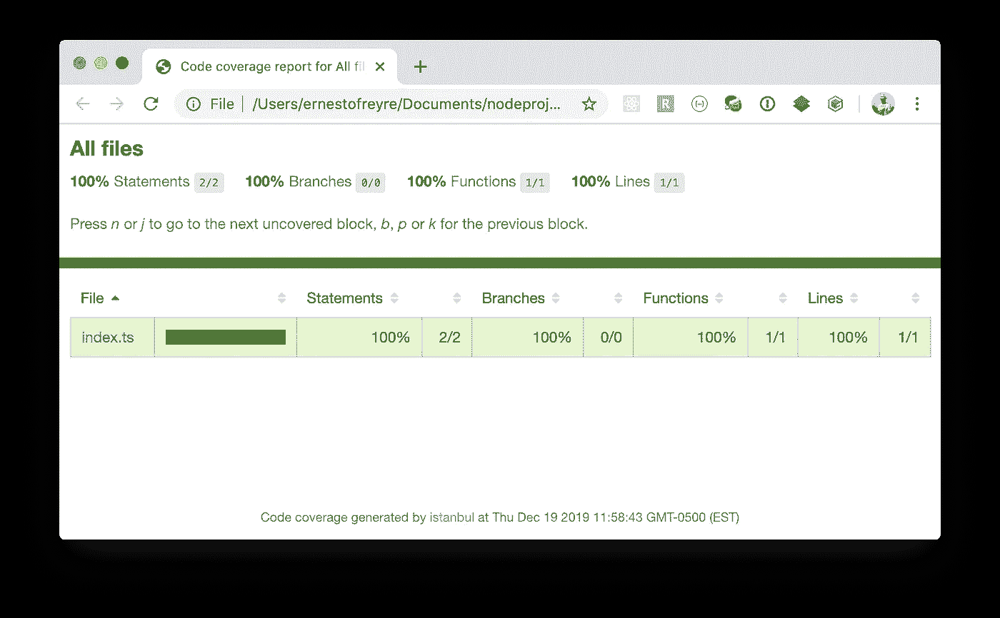
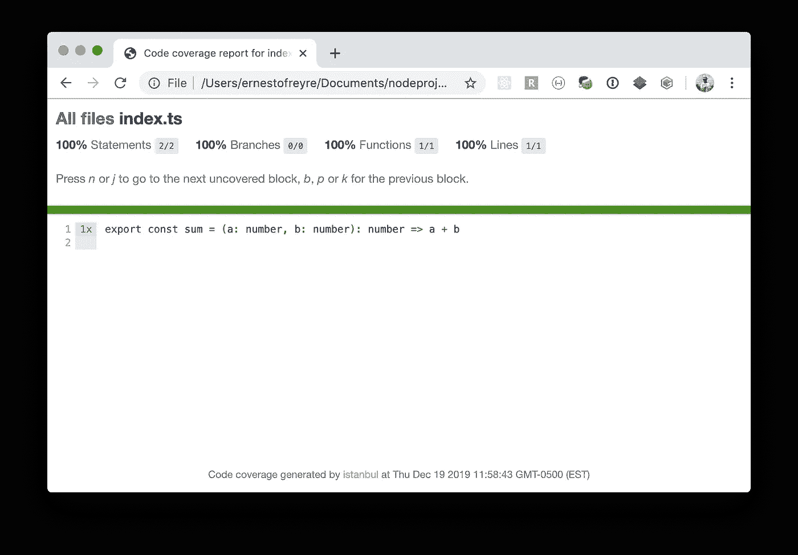

# 用 TypeScript 创建 NPM 模块

> 原文：<https://levelup.gitconnected.com/create-a-npm-module-with-typescript-c99bd0686f69>


创建一个 NPM 模块，无论是公共的还是私有的，都不是一件困难的事情，但是肯定会有点乏味。

这篇文章是一个快速引导 NPM 模块的指南，包含一组需求:

*   TypeScript 转换到 ES5 和 ES6:使用 TypeScript 和 Rollup
*   测试:使用 Jest
*   林挺:通过标准
*   格式:更漂亮

# 1.创建文件夹

使用模块的名称。

*如果您选择的名称已经被使用，您可以使用 NPM 范围(*[*https://docs.npmjs.com/about-scopes*](https://docs.npmjs.com/about-scopes)*)*

```
$ mkdir my-module
$ cd my-module
```

# 2.创建 package.json 文件

`package.json`文件是 NPM 模块上的主文件。它包括所有相关信息:名称、许可证、主文件、依赖项、配置等。

```
$ npm init -y{
  "name": "my-module",
  "version": "1.0.0",
  "description": "",
  "main": "index.js",
  "scripts": {
    "test": "echo \"Error: no test specified\" && exit 1"
  },
  "keywords": [],
  "author": "",
  "license": "ISC"
}
```

对于限定了作用域的模块，将作用域作为参数添加:

```
$ npm init --scope=@my-org -y
```

# 3.源文件夹

创建源文件夹:

```
$ mkdir src
```

和一个保存简单的`sum`函数的文件:

src/索引. ts

`sum`函数是使用 TypeScript 键入的。

# 4.蒸腾作用

首先，安装所有的开发依赖项。当其他人使用你的模块时，这些依赖项不会被安装。这样做的目的是支持 transpilation 工具将 TypeScript 转换为常规 JavaScript。

```
$ yarn add --dev **typescript rollup rollup-plugin-commonjs rollup-plugin-node-resolve rollup-plugin-peer-deps-external rollup-plugin-typescript2**
```

## 类型脚本配置

创建一个`tsconfig.json`文件:该文件保存 TypeScript 配置。它应该位于根文件夹中。

tsconfig.json

## 编译配置

接下来，创建一个`rollup.config.js`文件:这个文件保存汇总配置。

rollup .配置. js

最后，将`package.json`上的构建脚本以及`main`、`module`和`jsnext:main`属性添加到期望的输出中。

*这 3 个属性帮助应用程序在它们的构建管道上使用你的模块集成:* `*build/index.js*` *是 ES5 版本，* `*build/index.es.js*` *是支持导入/导出模块规范的 ES6 版本。*

`files`属性表示当你的包作为一个依赖项安装时要包含的文件/文件夹条目([https://docs.npmjs.com/files/package.json#files](https://docs.npmjs.com/files/package.json#files))

```
{
  "name": "my-module",
  "version": "1.0.0",
  "description": "",
  **"main"**: **"build/index.js"**,
  **"module"**: **"build/index.es.js"**,
  **"jsnext:main"**: **"build/index.es.js"**,
  "scripts": {
    **"build"**: **"rollup -c"**,
    "test": "echo \"Error: no test specified\" && exit 1"
  },
  **"files"**: [
    **"build"** ],
  "devDependencies": {
    "rollup": "^1.27.13",
    "rollup-plugin-commonjs": "^10.1.0",
    "rollup-plugin-node-resolve": "^5.2.0",
    "rollup-plugin-peer-deps-external": "^2.2.0",
    "rollup-plugin-typescript2": "^0.25.3",
    "typescript": "^3.7.3"
  },  
  "keywords": [],
  "author": "",
  "license": "ISC"
}
```

此时，我们可以构建我们的模块:

```
$ yarn build
yarn run v1.17.3
$ rollup -csrc/index.ts → build/index.js, build/index.es.js...
created build/index.js, build/index.es.js in 828ms
✨  Done in 1.32s.
```

检查`build`文件夹，在那里你会有:

*   **index . js**:ES5 trans pilation(附源图)
*   **index . es . js**:ES6 trans pilation(带源地图)
*   **index.d.ts** :打字稿打字

# 5.试验

一个经过良好测试的模块对于可重用性是必不可少的。

请将此添加到您的所有模块中。

```
$ yarn add --dev **jest @types/jest ts-jest**
```

修改您的`package.json`文件以包括:

```
{
  "name": "my-module",
  "version": "1.0.0",
  "description": "",
  "main": "build/index.js",
  "module": "build/index.es.js",
  "jsnext:main": "build/index.es.js",
  "scripts": {
    "build": "rollup -c",
    **"test": "jest --coverage"**
  },
  "files": [
    "build"
  ],
  "devDependencies": {
    "@types/jest": "^24.0.24",
    "jest": "^24.9.0",
    "rollup": "^1.27.13",
    "rollup-plugin-commonjs": "^10.1.0",
    "rollup-plugin-node-resolve": "^5.2.0",
    "rollup-plugin-peer-deps-external": "^2.2.0",
    "rollup-plugin-typescript2": "^0.25.3",
    "ts-jest": "^24.2.0",
    "typescript": "^3.7.3"
  },
  **"jest"**: {
    **"preset"**: **"ts-jest"**,
    **"testEnvironment"**: **"node"** },  
  "keywords": [],
  "author": "",
  "license": "ISC"
}
```

并创建一个测试。默认情况下，我们可以在与代码放在一起的`__tests__`文件夹中创建测试。我们将把这第一次测试放在`src/__tests__/index.spec.ts`文件中。

src/__tests__/index.spec.ts

运行测试:

```
$ yarn test
yarn run v1.17.3
$ jest --coverage
 PASS  src/__test__/index.spec.ts
  ✓ Sum 4 + 5 = 9 (3ms)----------|----------|----------|----------|----------|-------------------|
File      |  % Stmts | % Branch |  % Funcs |  % Lines | Uncovered Line #s |
----------|----------|----------|----------|----------|-------------------|
All files |      100 |      100 |      100 |      100 |                   |
index.ts |      100 |      100 |      100 |      100 |                   |
----------|----------|----------|----------|----------|-------------------|
Test Suites: 1 passed, 1 total
Tests:       1 passed, 1 total
Snapshots:   0 total
Time:        1.53s
Ran all test suites.
✨  Done in 2.22s.
```

耶！100%的覆盖率，在覆盖率的话题中，我会建议你做一些研究，并适应期望。

通过打开在`coverage/`文件夹中生成的覆盖率报告，您可以直观地检查代码中被覆盖和未被覆盖的部分。

```
$ open coverage/lcov-report/index.html
```



覆盖率报告



测试覆盖的行

# 6.林挺

林挺是运行一个程序来检查你的代码是否有潜在错误的过程。代码规则和指导方针用于保证开发人员不会意外出错。出现了几个规则集，其中大部分是基于 ESLint([https://eslint.org/](https://eslint.org/))的

我将使用的是 standard js([https://standardjs.com/](https://standardjs.com/))。这是一个零配置的静态规则集。

StandardJS 上唯一有争议的规则是“无分号”规则。

```
$ yarn add --dev **standard**
```

修改你的`package.json`文件，包括一个忽略某些文件夹和林挺脚本的部分。

```
{
  "name": "my-module",
  "version": "1.0.0",
  "description": "",
  "main": "build/index.js",
  "module": "build/index.es.js",
  "jsnext:main": "build/index.es.js",
  "scripts": {
    "build": "rollup -c",
    **"lint"**: **"standard"**,
    "test": "jest --coverage"
  },
  "files": [
    "build"
  ],
  "devDependencies": {
    "@types/jest": "^24.0.24",
    "jest": "^24.9.0",
    "rollup": "^1.27.13",
    "rollup-plugin-commonjs": "^10.1.0",
    "rollup-plugin-node-resolve": "^5.2.0",
    "rollup-plugin-peer-deps-external": "^2.2.0",
    "rollup-plugin-typescript2": "^0.25.3",
    "standard": "^14.3.1",
    "ts-jest": "^24.2.0",
    "typescript": "^3.7.3"
  },
  "jest": {
    "preset": "ts-jest",
    "testEnvironment": "node"
  },
  **"standard"**: {
    **"ignore"**: [
      **"node_modules/"**,
      **"build/"** ]
  },  
  "keywords": [],
  "author": "",
  "license": "ISC"
}
```

检查我们的代码:

```
$ yarn lint
yarn run v1.17.3
$ standard
✨  Done in 0.69s.
```

我们的代码看起来不错。如果不是，我们可以尝试使用`--fix`参数。

```
$ yarn lint --fix
```

# 7.代码格式

代码格式化可以节省很多开发时间。不再有冗长格式化代码，不再有关于一段代码应该是什么样子的讨论。

Prettier 显然是 JavaScript(以及许多其他语言，包括 CSS、JSON、JSX 等)的最佳选择。)

```
$ yarn add --dev **standard-prettier** 
```

添加一个**格式的**脚本:

```
{
  "name": "my-module",
  "version": "1.0.0",
  "description": "",
  "main": "build/index.js",
  "module": "build/index.es.js",
  "jsnext:main": "build/index.es.js",
  "scripts": {
    "build": "rollup -c",
    **"format"**: **"prettier-standard --format"**,
    "lint": "standard",    "test": "jest --coverage"
  },
  "files": [
    "build"
  ],
  "devDependencies": {
    "@types/jest": "^24.0.24",
    "jest": "^24.9.0",
    "rollup": "^1.27.13",
    "rollup-plugin-commonjs": "^10.1.0",
    "rollup-plugin-node-resolve": "^5.2.0",
    "rollup-plugin-peer-deps-external": "^2.2.0",
    "rollup-plugin-typescript2": "^0.25.3",
    "standard": "^14.3.1",
    "ts-jest": "^24.2.0",
    "typescript": "^3.7.3"
  },
  "jest": {
    "preset": "ts-jest",
    "testEnvironment": "node"
  },
  "standard": {
    "ignore": [
      "node_modules/",
      "build/"
    ]
  },  
  "keywords": [],
  "author": "",
  "license": "ISC"
}
```

和一个`.prettierignore`文件

。忽略不计

运行它:

```
$ yarn format
yarn run v1.17.3
$ prettier-standard --format
package.json 44ms
rollup.config.js 21ms
src/__test__/index.spec.ts 320ms
src/index.ts 8ms
tsconfig.json 7ms
✨  Done in 0.75s.
```

配置更漂亮的最好方法是每次在编辑器上保存文件时运行。检查[https://github.com/sheerun/prettier-standard](https://github.com/sheerun/prettier-standard)了解一些设置细节。

# 结论

*   添加所有依赖项:

```
$ yarn add --dev **typescript rollup rollup-plugin-commonjs rollup-plugin-node-resolve rollup-plugin-peer-deps-external rollup-plugin-typescript2 jest @types/jest ts-jest standard standard-prettier**
```

*   将您的`package.json`替换为:

```
{
  "name": "my-module",
  "version": "1.0.0",
  "description": "",
  "main": "build/index.js",
  "module": "build/index.es.js",
  "jsnext:main": "build/index.es.js",
  "scripts": {
    "build": "rollup -c",
    "lint": "standard",
    "format": "prettier-standard --format",
    "test": "jest --coverage"
  },
  "keywords": [],
  "author": "",
  "license": "ISC",
  "devDependencies": {
    "@types/jest": "^24.0.24",
    "jest": "^24.9.0",
    "rollup": "^1.27.13",
    "rollup-plugin-commonjs": "^10.1.0",
    "rollup-plugin-node-resolve": "^5.2.0",
    "rollup-plugin-peer-deps-external": "^2.2.0",
    "rollup-plugin-typescript2": "^0.25.3",
    "standard": "^14.3.1",
    "standard-prettier": "^1.0.1",
    "ts-jest": "^24.2.0",
    "typescript": "^3.7.3"
  },
  "jest": {
    "preset": "ts-jest",
    "testEnvironment": "node"
  },
  "standard": {
    "ignore": [
      "node_modules/",
      "build/"
    ]
  }
}
```

*   添加其余文件:`rollup.config.js`、`tsconfig.json`、`.prettierignore`、`.gitignore`
*   别忘了给`.gitignore` : `coverage/`和`node_modules/`添加几个条目
*   设置你的 IDE 或者编辑器在每次保存时自动格式化(这样可以节省很多时间)
*   要发布 NPM 模块，您需要一个 NPM 帐户。(请激活 2FA，这样您的模块更新也可以免受恶意行为者的攻击)

黑客快乐…