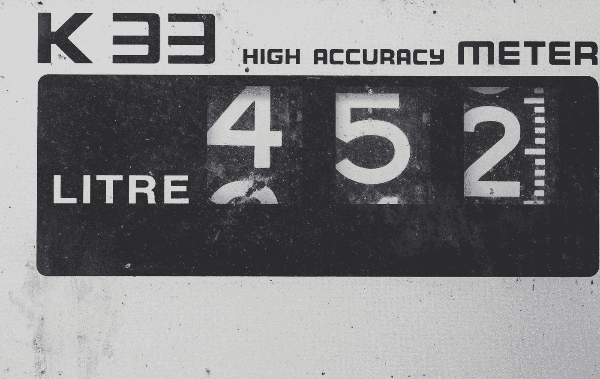
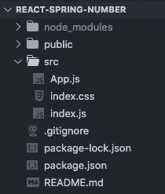
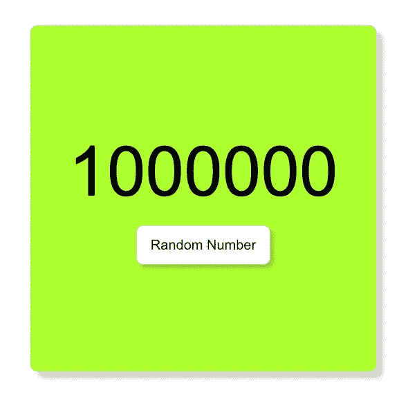

# 使用反应弹簧创建数字动画

> 原文：<https://levelup.gitconnected.com/create-a-number-animation-with-react-spring-670975daa28d>

## react-spring 中的 useSpring 钩子使用介绍



由 [Markus Spiske](https://unsplash.com/@markusspiske?utm_source=medium&utm_medium=referral) 在 [Unsplash](https://unsplash.com?utm_source=medium&utm_medium=referral) 上拍摄的照片

在本文中，我们将看看如何使用 [react-spring](https://www.react-spring.io/) 库来创建这个动画。这比你想象的要容易得多。

> react-spring 是一个基于 spring 物理学的动画库，应该可以满足你的大部分 UI 相关的动画需求。它为您提供了足够灵活的工具，让您可以自信地将自己的想法融入到移动界面中。”

在我们的示例中，我们将创建一个应用程序，它将在单击按钮时生成一个随机数。

当数字生成时，它将从 0 开始向上计数，创建一个有趣的动画，如下所示。


# 入门指南

让我们从使用`create-react-app`创建一个新的应用程序开始。从那里，我们将清理未使用的文件，我们的文件结构将如下所示。



我们将首先用硬编码数据构建一个基本设计。在`App.js`文件中，创建一个`div`，它将成为我们的卡组件。在这个`div`中，我们将有另一个`div`作为数字和一个`button`标签。

```
const App = () => {
  return (
    <div className="App">
      <div className="card">
        <div className="number">1000000</div>
        <button>Random Number</button>
      </div>
    </div>
  );
};
```

在`index.css`文件中，让我们添加一些如下的样式，让我们的应用程序看起来更好一些。

我们的应用程序现在应该如下图所示。



# 创建数字动画

接下来，我们将使用 react-spring 创建数字动画。首先，将库安装到项目中。

```
npm install react-spring
```

我们将使用库中的`useSpring`钩子和`animated`值。让我们将这些导入到`App.js`文件中。

```
import { useSpring, animated } from 'react-spring';
```

`useSpring`钩子是一个弹簧，它将数据从一种状态转移到另一种状态。在 App 组件中，我们将定义我们想要做的 spring 动画。它将接受一个数字，从 0 开始，动画到 1000000。

```
const props = useSpring({ val: 100000, from: { val: 0 } });
```

然后，我们需要更新 return 语句中的元素来使用这个动画。要使用 react-spring，我们需要将`animated`添加到我们想要制作动画的`div`中。然后我们将添加动画作为一个值来代替硬编码的数字。

```
<animated.div className="number">
  {props.val}
</animated.div>
```

这将创建我们的动画如下。但是有些不对劲。正如你所看到的，当数字向上计数时，有这么多的小数。


为了解决这个问题，我们将使用插值函数并对值调用`Math.floor`。这将为我们去掉小数。

```
<animated.div className="number">
  {props.val.interpolate(*val* => Math.floor(val))}
</animated.div>
```

现在，我们应该有一个没有小数的清晰的动画。


# 生成一个随机数

最后，我们将添加按钮功能来生成一个随机数。

我们将使用 react 中的`useState`钩子来创建一个数字状态。这将更新一个按钮点击随机生成的数字。

还在`App.js`文件里面，从 react 导入`useState`。

```
import { useState } from 'react';
```

然后，创建一个状态，我们将初始值设置为 1000000。

```
const [num, setNum] = useState(1000000);
```

我们现在可以更新我们的`useSpring`函数来制作动画，直到`num`值，而不是一个静态的数字。

```
const props = useSpring({ val: num, from: { val: 0 } });
```

接下来，我们将创建一个名为`randomNum`的变量，它将为我们生成一个介于 0 和 1000000 之间的随机数。为此，我们将使用如下的`Math.floor`和`Math.random`函数。

```
const randomNum = Math.floor(Math.random() * 1000000);
```

最后，我们将在按钮上添加`onClick`道具，这将在按钮点击时更新`num`的状态。

```
<button onClick={() => setNum(randomNum)}>Random Number</button>
```

最终的`App.js`文件将如下所示。

# 包扎

感谢阅读！你现在有一个随机数发生器，它可以做一个向上计数的动画。你可以在这里找到这个应用[的完整源代码。](https://github.com/chadmuro/medium-react-spring-number)

React-spring 是一个很好的库，可以向 React 应用程序添加动画。它很容易使用，你可以用它做很多事情。查看下面的文档，看看你还能做些什么。

[](https://www.react-spring.io/) [## 反作用弹簧

### 使用 React 的简单 spring 动画原语，让您的组件栩栩如生

www.react-spring.io](https://www.react-spring.io/) 

如果您想查看另一个 react 动画库的运行情况，请查看下面的文章以了解 framer-motion。

[](https://js.plainenglish.io/animate-when-element-is-in-view-with-framer-motion-63b254403bf) [## 当元素出现在视图中且有帧运动时，制作动画

### 一个简单的解决方案，动画反应元素时，在视图中使用帧运动

js .平原英语. io](https://js.plainenglish.io/animate-when-element-is-in-view-with-framer-motion-63b254403bf)