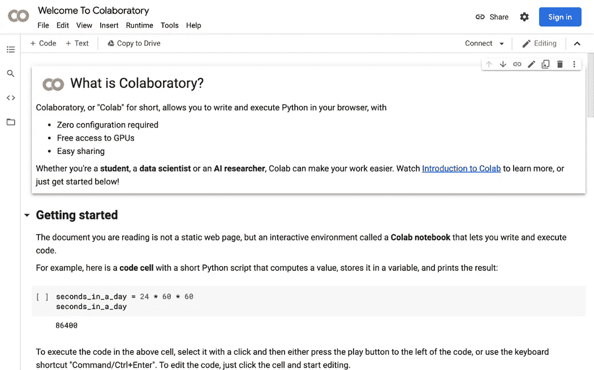

# 使用 Python 和 AI 从图像创建铅笔草图

> 原文：<https://levelup.gitconnected.com/create-a-pencil-sketch-from-an-image-using-python-and-ai-638483a26fc>

深度学习模型在图像分类和对象检测等任务中表现出了显著的成功。但是它们也可以用来生成艺术输出，比如草图。一个这样的模型是 **Artline** ，这是一个深度学习模型，可以**将图像转换为草图**。


**Artline 使用一种叫做“风格转移”的技术**将图像转换成草图。**风格转换包括获取一幅图像的内容，并将其与另一幅图像的风格相结合，以创建一幅新的复合图像。**在 Artline 的情况下，输入图像的内容被保留，而样式取自预定义的草图。

要使用 Artline 生成草图，用户只需提供一个输入图像。该模型然后使用一个**卷积神经网络** (CNN)来**提取输入图像的特征**和**将它们与草图的风格相结合。**结果是一幅捕捉原始图像精髓的逼真草图。

Artline 的一个关键优势是它能够从**广泛的输入图像**中生成高质量的 **草图**。该模型能够处理各种图像。这使得它成为艺术家和设计师的多功能工具，他们希望从自己的图像中创建独特的草图。

在本文中，我们将使用 **Google Colab** 来演示 Artline 项目。

*(Google colab 允许我们在浏览器中运行代码，而无需在本地安装任何东西。)*



去 Artline GitHub 库，这里是链接[https://github.com/vijishmadhavan/ArtLine](https://github.com/vijishmadhavan/ArtLine)。


单击在 Colab 中打开按钮。将打开一个 Colab 笔记本。


第一个单元使用 git 命令从 github 克隆存储库。

```
!git clone https://github.com/vijishmadhavan/ArtLine.git ArtLine
```

第二个单元格将当前目录更改为克隆的存储库文件夹。

```
cd ArtLine
```

第三个单元包含 pip 命令，该命令安装 Artline 所需的所有库。

```
!pip install -r colab_requirements.txt
```

接下来的两个单元格导入必要的库，并从 Dropbox 中检索模型权重。

下一个单元格接受您希望创建草图的图像的 URL。


然后，下一个单元格创建输入 url 的草图图像。


这是输出的全尺寸图像。


Artline 的另一个好处是它的速度。**该模型能够实时生成草图，**便于试验不同的风格和输入。这使得艺术家可以快速重复他们的想法，并在短时间内创作出多幅草图。

> **你对人工智能和机器学习有热情吗？**你想让**了解**在该领域的最新进展和见解吗？****
> 
> 然后**订阅介质是必须的**。只需每月 5 美元，你就可以从该领域的专家那里获得丰富的知识和见解。另外，你的订阅有助于支持独立作家和像我一样的研究人员。随着人工智能世界的快速变化，保持消息灵通至关重要。
> 
> 不要错过——今天就加入 Medium，成为人工智能革命的一部分。这是你做过的最好的决定。
> **今日订阅中** **利用本** [**链接**](https://medium.com/@arjungullbadhar/membership) **。**