# 使用 MERN 堆栈创建照片库应用程序

> 原文：<https://levelup.gitconnected.com/create-a-photo-gallery-app-using-mern-stack-826d7d926232>

## 处理图像上传，并将其提供给客户端

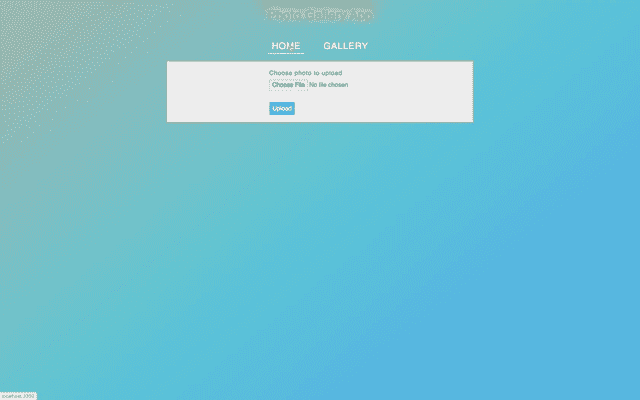

在这篇文章中，我们将建立一个使用 MERN 堆栈的照片库应用程序。这似乎很简单，但通过构建这个应用程序，您将了解到:

1.如何上传和提供图像或任何其他文件，并将其限制为特定的文件扩展名
2。如何限制文件上传大小
3？如何在 redux store 中获取服务器错误并显示在前端
4。如何避免从服务器返回不必要的大量数据。如何在同一台服务器上部署客户机和服务器代码，以便在同一端口上运行它

所以让我们开始吧。

我们将使用 MongoDB 来存储照片，所以在您的本地机器上安装 MongoDB 数据库。

查看本文中的[以获得安装它的逐步指南。](/how-to-install-mongodb-database-on-local-environment-19a8a76f1b92)

我们将使用`create-react-app`来初始化项目。

通过运行以下命令创建新项目:

```
create-react-app photo_gallery_app
```

项目创建完成后，删除`src`文件夹中的所有文件，并在`src`文件夹中创建`index.js, styles.scss`文件。同样，在`src`文件夹中创建`components,`和`utils, actions, reducers, router and store`文件夹。

通过从终端或命令提示符运行以下命令来安装所需的软件包:

```
yarn add axios@0.19.2 bootstrap@4.4.1 node-sass@4.13.1 react-bootstrap@1.0.0 redux@4.0.5 react-redux@7.2.0 redux-thunk@2.3.0 react-router-dom@5.1.2
```

安装完成后，打开`src/styles.scss`并添加以下代码:

使用以下代码在`components`文件夹中创建`UploadForm.js`:

使用以下代码在`components`文件夹中创建`Header.js`:

用下面的代码在`components`文件夹中创建`HomePage.js`:

用下面的代码在`components`文件夹中创建`NotFoundPage.js`:

使用以下代码在`components`文件夹中创建`Photo.js`:

使用以下代码在`components`文件夹中创建`Gallery.js`:

用下面的代码在`actions`文件夹中创建`errors.js`:

使用以下代码在`actions`文件夹中创建`photos.js`:

使用以下代码在`reducers`文件夹中创建`errors.js`:

使用以下代码在`reducers`文件夹中创建`photos.js`:

用下面的代码在`router`文件夹中创建`AppRouter.js`:

用下面的代码在`store`文件夹中创建`store.js`:

使用以下代码在`utils`文件夹中创建`constants.js`:

现在，在`src`文件夹旁边创建一个`server`文件夹，这样您的项目中将有三个文件夹:`server`、`public`和`src`。

在`server`文件夹内创建`db`、`model`和`routers`文件夹和一个`index.js`文件。

现在，让我们从`server`文件夹中执行以下命令，在`server`文件夹中创建一个`package.json`文件:

```
yarn init -y
```

通过从您的终端或从`server`文件夹**的命令提示符运行以下命令来安装所需的包。**

```
yarn add cors@2.8.5 express@4.17.1 mongoose@5.9.7 multer@1.4.2
```

在`server/package.json`文件中添加一个新脚本来启动服务器

```
"scripts": {
 "start": "node index.js"
}
```

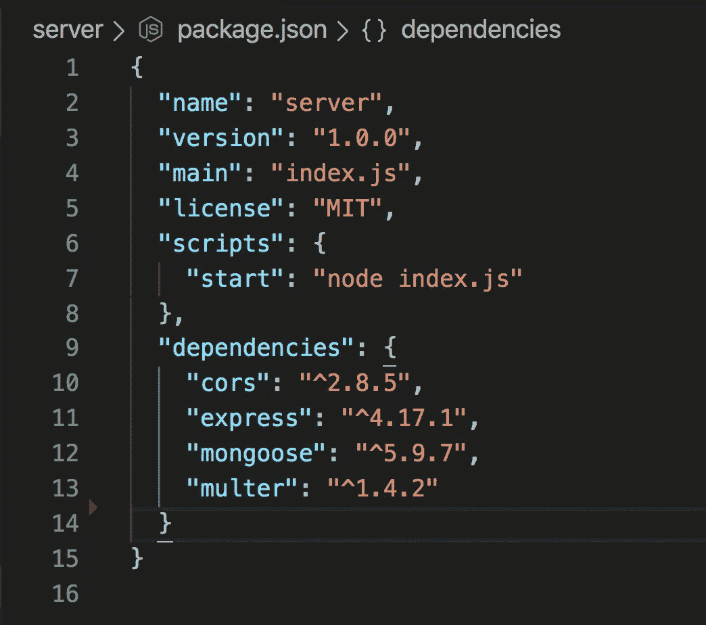

根据您的操作系统，使用`./mongod`或`mongod.exe`启动 MongoDB 数据库服务器，如本文[和](/how-to-install-mongodb-database-on-local-environment-19a8a76f1b92)所述。

用下面的代码在`db`文件夹中创建`connection.js`

用下面的代码在`model`文件夹中创建`Photo.js`

使用以下代码在`routers`文件夹中创建`photos.js`

在`server/index.js`内添加以下代码

现在，在一个终端中通过从项目文件夹的根目录(`photo_gallery_app`)运行`yarn start`命令来启动 react 应用程序，在另一个终端中通过从`server`文件夹运行`yarn start`来启动服务器。

您将能够在 [http://localhost:3000/](http://localhost:3000/) 访问您的应用程序，它将向 [http://localhost:3300](http://localhost:3300/photos) 的服务器发出 API 请求，这是我们在`utils/constants.js`中提供的。

您可以通过进入`home page`上传照片，并在`gallery page`中查看所有上传的照片。

如果你打开`server/index.js`，你会看到我们在顶部添加了`cors`包，并将其用作

```
app.use(cors());
```

这是必需的，因为浏览器不允许在一个端口上运行的应用程序访问在另一个端口上运行的应用程序数据，并且会产生`CORS`错误。

因此，通过添加`app.use(cors())`,我们确保服务器将接受来自任何客户端的传入请求。

如果您删除行`app.use(cors())`并通过从服务器文件夹运行`yarn start`来重启服务器，您将能够看到该错误:

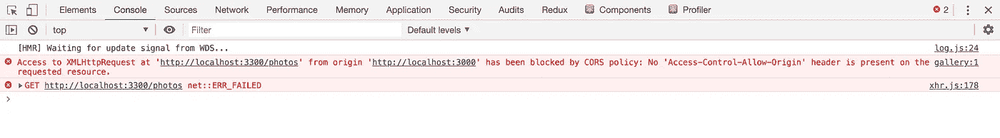

添加`cors`可以在开发的同时测试应用程序，但是从安全的角度来看并不好，因为任何应用程序都可以访问我们的服务器数据。

因此，让我们看看如何在服务器上部署 React 代码，以便客户端和服务器应用程序都在同一服务器上运行，并且不需要添加`cors`，也不需要运行两个单独的命令。

为此，打开`utils/constants.js`并改变

```
export const BASE_API_URL = 'http://localhost:3300';
```

到

```
export const BASE_API_URL = '';
```

在`server/index.js`内部，从`app.use` 中删除`cors`的导入及其使用，并添加

```
app.use(express.static(path.join(__dirname, '..', 'build')));
```

以前

```
app.use(photosRouter);
```

并在顶部为`path`添加一个导入:

```
const path = require('path');
```

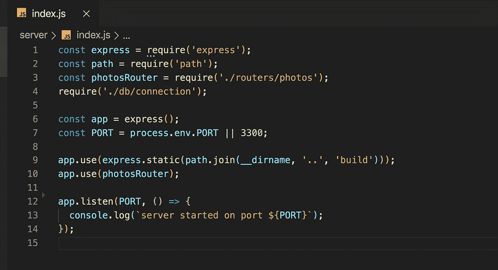

通过使用

```
app.use(express.static(path.join(__dirname, '..', 'build')));
```

我们指示`express`服务器提供来自`build`文件夹的所有文件，该文件夹将在我们从终端运行 build 命令时创建。

现在，打开 react 应用程序的`package.json`并进行更改

```
"start": "react-scripts start",
```

到

```
"start-client": "react-scripts start",
```

并添加新的启动脚本

```
"start": "yarn build && node server/index.js"
```

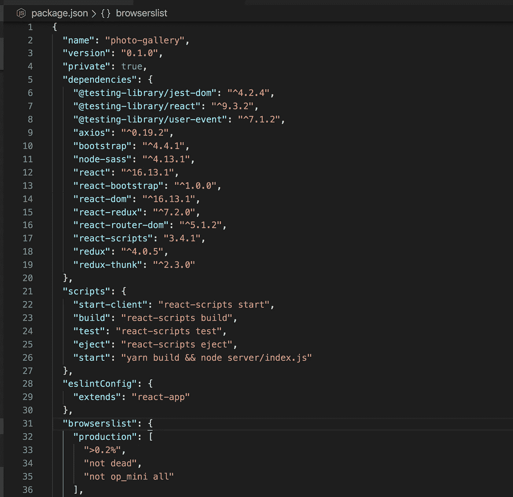

这里，我们首先运行 build 命令，这将在我们的项目中创建一个新的`build`文件夹，然后我们将使用`node server/index.js`启动我们的 express 服务器。

如果前两个`yarn start`命令仍在运行，停止它们，仅从主项目文件夹(`photo_gallery_app`)再次执行`yarn start`。

一旦它被执行，您将能够从 [http://localhost:3300/](http://localhost:3300/) 访问您的应用程序

现在，主页和画廊页面都将按预期工作。

但是还有一个问题。如果刷新图库页面，您将看到一个错误:

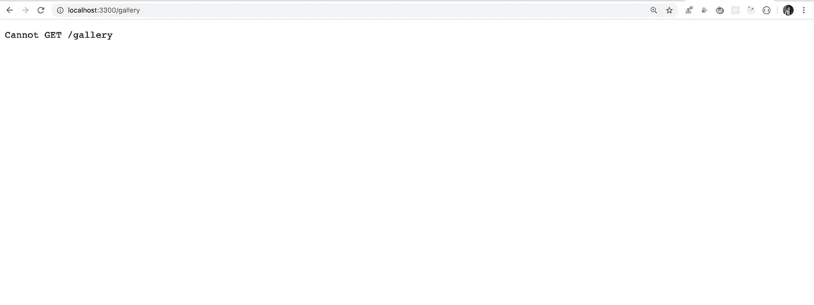

这是因为，当我们进入[http://localhost:3300/gallery](http://localhost:3300/gallery)时，默认的浏览器行为是，它会在服务器上寻找`/gallery`路由，但是我们在服务器上没有任何`/gallery`路由。我们的 React 应用程序中已经有了，所以要解决这个问题，我们需要添加一些代码来处理客户端的路由。

如果用户前往`/gallery`路线，我们将发送我们的`build/index.html`,这是我们的 React 应用程序，它有可用的路线。

为此，打开`server/index.js`并添加以下代码

```
// add middleware
app.use((req, res, next) => {
 res.sendFile(path.join(__dirname, '..', 'build', 'index.html'));
});
```

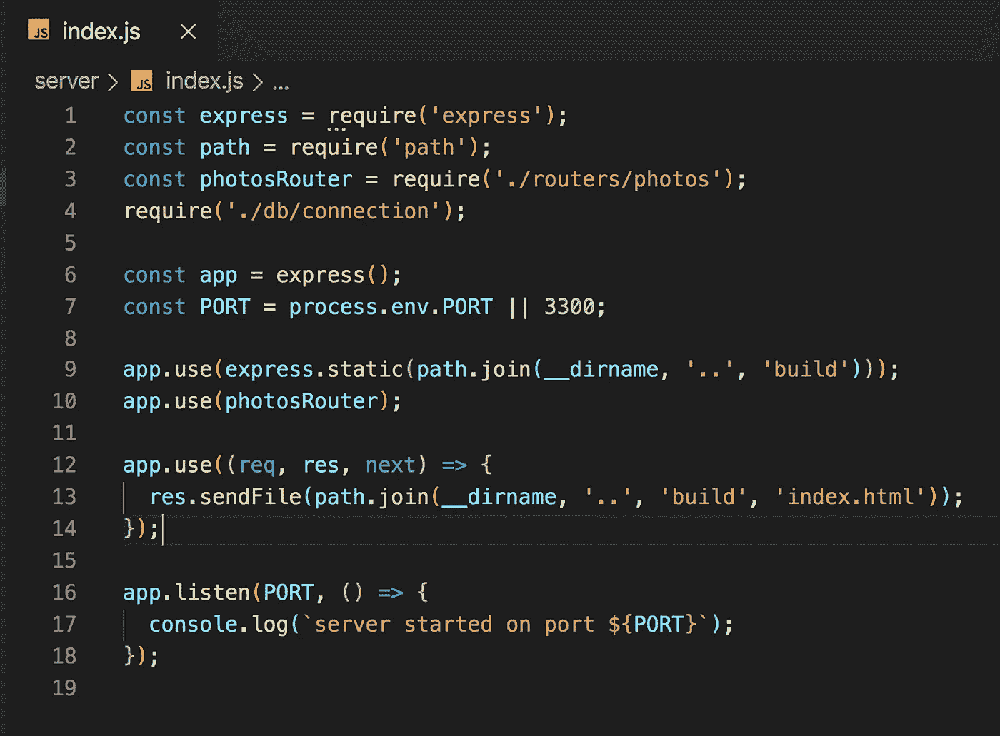

注意这里的顺序很重要，这个中间件只需要添加在下面几行之后

```
app.use(express.static(path.join(__dirname, '..', 'build')));
app.use(photosRouter);
```

因为如果我们在它们之前添加它，那么对于每个到服务器的请求，它将只发送`index.html`，而我们的服务器 rest APIs 将永远不会被执行。

现在，如果您通过运行`yarn start`再次运行该应用程序，您将看到一切都在工作，并且在刷新后[http://localhost:3300/gallery](http://localhost:3300/gallery)也可以访问。

**注意:**每当您在 React 或节点代码中进行任何更改时，您都需要再次运行`yarn start`，以便它将反映在`build`文件夹中。

让我们浏览一下 React 和 Node 应用程序的代码，以了解我们在每个文件中做了什么。

让我们从服务器节点代码开始。

1.在`db/connection.js`文件中，我们正在连接到我们的 MongoDB 数据库，并且我们正在将该文件作为`require('./db/connection');`导入到`server/index.js`中

2.在`model/Photo.js`中，我们正在创建一个模型来指定我们存储在数据库中的数据类型。因为我们只存储图像，所以类型将是`Buffer`,这是处理二进制数据的 MongoDB 类型之一。

3.在`routers/photos.js`中，我们从指定`multer` npm 包的配置开始。

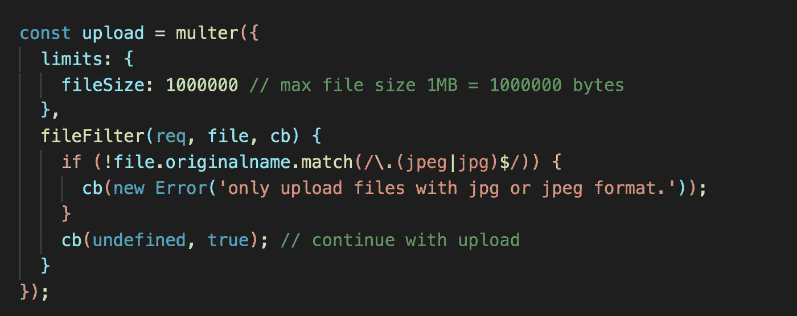

`multer`包是用来上传文件的。这里我们指定每个上传文件的最大文件大小`1MB`，并且只接受`jpg`或`jpeg`图像上传。

4.然后，我们指定了一个 post route `/photos`来处理 React 应用程序上传的文件。使用`upload.single('photo')`我们指定请求参数，我们将从中获取上传的文件数据。我们已经在 React 应用程序的`UploadForm.js`中指定了`name`参数。

```
<Form.Control type="file" name="photo" onChange={handleOnChange} />
```

**所以** `**upload.single**` **里面的值必须与表单控件中指定的名称相匹配，否则上传文件时会出现服务器错误。**

上传的文件数据将在`req.file`对象中可用，我们使用`req.file.buffer`访问二进制数据。然后我们使用`await photo.save()`将图像保存到数据库中。

然后，我们返回存储在数据库中的照片的自动生成的 id 作为响应。

**请注意，我们不会再次发送整个文件，因为这不是必需的，因为当我们单击应用程序中的图库菜单时，会加载所有图像，从而减少响应数据的大小。**

id 是必需的，因为我们通过 id 访问图片，在图库页面上显示图片。

下面提到的错误处理程序路线

```
(error, req, res, next) => {
 if (error) {
  res.status(500).send({
   upload_error: error.message
  });
 }
}
```

只有在上传文件时出现错误时才会执行，例如文件大小大于 1 MB 或者文件不是 jpg 或 jpeg 类型。

5.接下来，获取`/photos`路线，我们从数据库发回所有上传的图像数据。

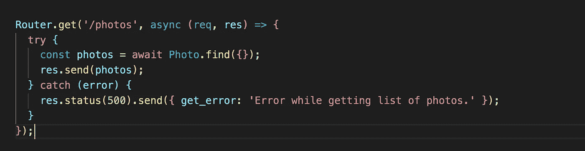

**注意:**我们没有在任何地方使用这条路线，我们只是用它来验证数据和进行测试。

但是如果你通过访问 http://localhost:3300/photos 来访问它，你会看到它只返回 id

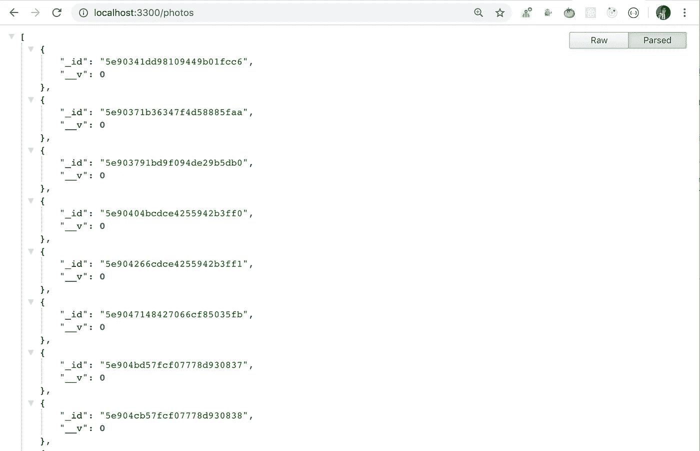

由于我们在`model/Photo.js`中添加的代码，上传的文件二进制数据没有显示

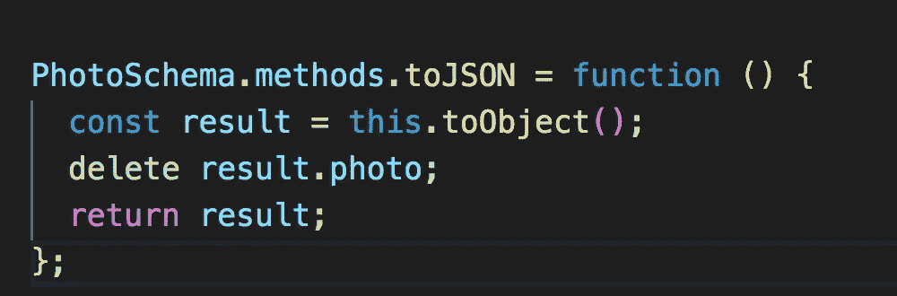

将对集合中的每个文档执行`toJSON`方法，在集合中我们删除不需要从 API 返回的数据。这是从响应中删除敏感数据的一个很好的方法，比如`passwords, phone numbers`(如果我们有这样的东西的话)。

6.接下来，我们访问存储在数据库中的单个图像

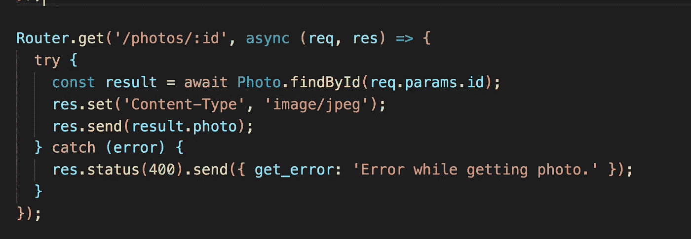

使用这种方法，我们在应用程序的图库页面中显示数据

因此，如果您从`[http://localhost:3300/photos](http://localhost:3300/photos)`路由中获取任何`_id`值，并将其作为`[http://localhost:3300/photos](http://localhost:3300/photos)/<photo_id>`传递给该路由，那么您将能够在浏览器中直接看到该图像

现在，让我们理解我们的 React 代码

1.  在`store/store.js`中，我们使用了`combineReducers`来获取 redux 商店中的照片和服务器错误，因此我们可以在 redux `devtools`中看到这些错误，如下所示

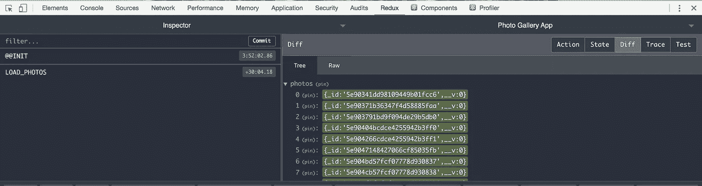

如果你的浏览器中没有安装 redux `devtools`，你可以从[这里](https://chrome.google.com/webstore/detail/redux-devtools/lmhkpmbekcpmknklioeibfkpmmfibljd?hl=en)为 Chrome 安装。

2.在`actions/photos.js`中，我们添加了`beginAddPhoto` action creator，它通过 API 调用将图像上传到服务器。

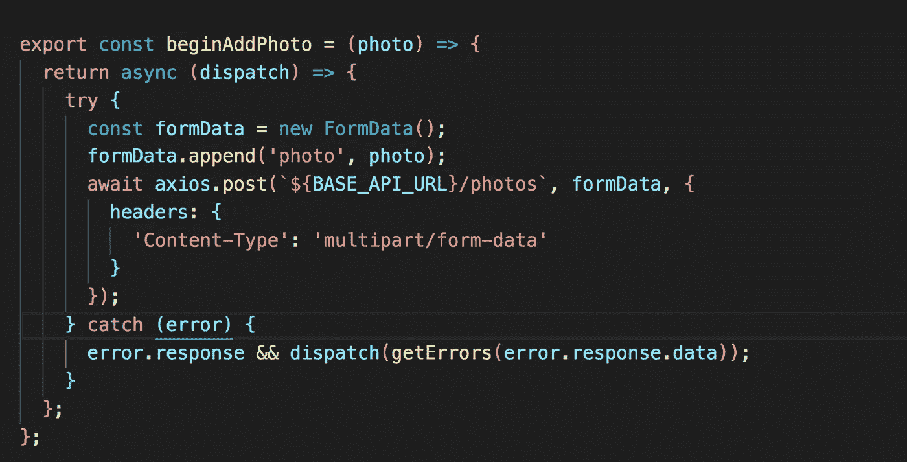

要处理文件上传，内容类型必须是`multipart/form-data`类型。

我们将上传的文件数据添加到`FormData`对象中，这是必要的，因为没有它我们将无法发送`multipart/form-data`类型的 post 请求。

3.然后我们有`startLoadPhotos` action creator，它从服务器加载图像，然后通过调用`loadPhotos` action creator 将其添加到 redux 存储中。

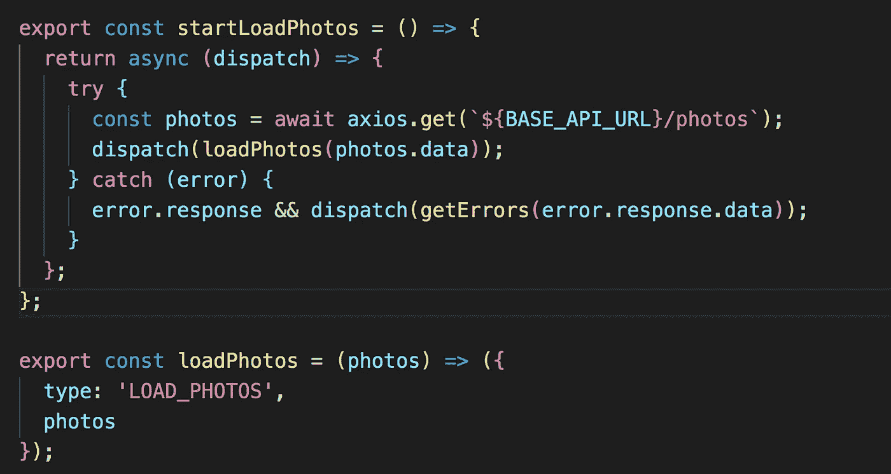

对于组件代码，我们使用`React Hooks`。如果你是钩子的新手，看看这篇文章的介绍。

大概就是这样。

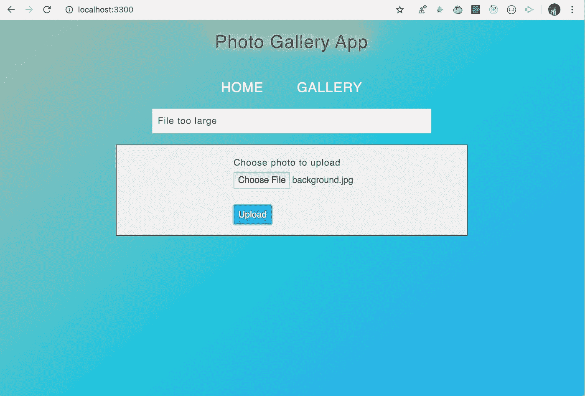

大文件上传错误

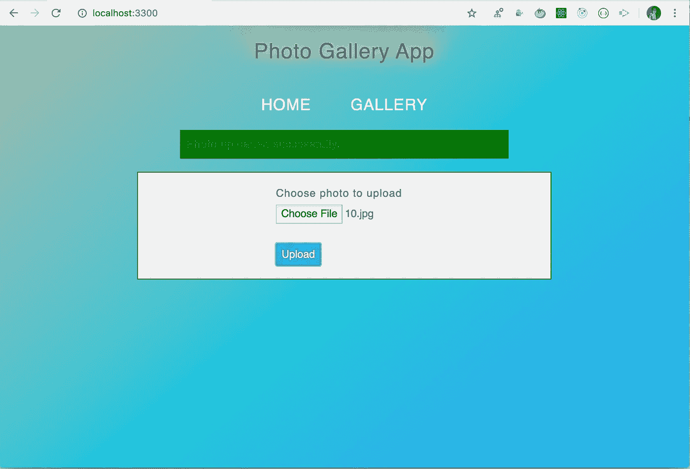

上传成功消息

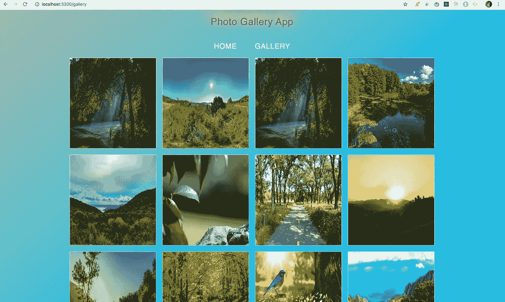

图库页面

你可以在这里找到这个应用[的完整源代码。](https://github.com/myogeshchavan97/photo_gallery_app)

今天到此为止。我希望你学到了新东西。

**别忘了订阅我的每周简讯，里面有惊人的技巧、诀窍和文章，直接在你的收件箱** [**这里。**](https://yogeshchavan.dev/)