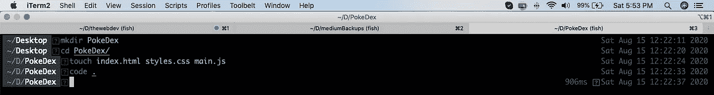
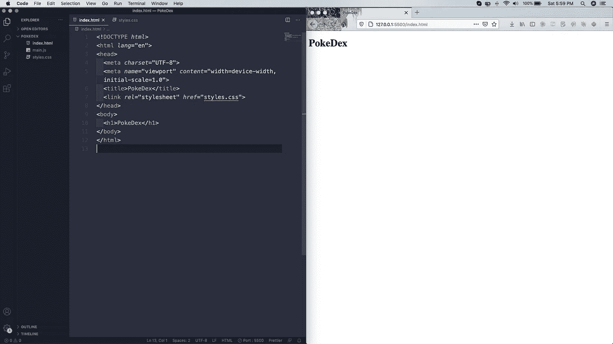
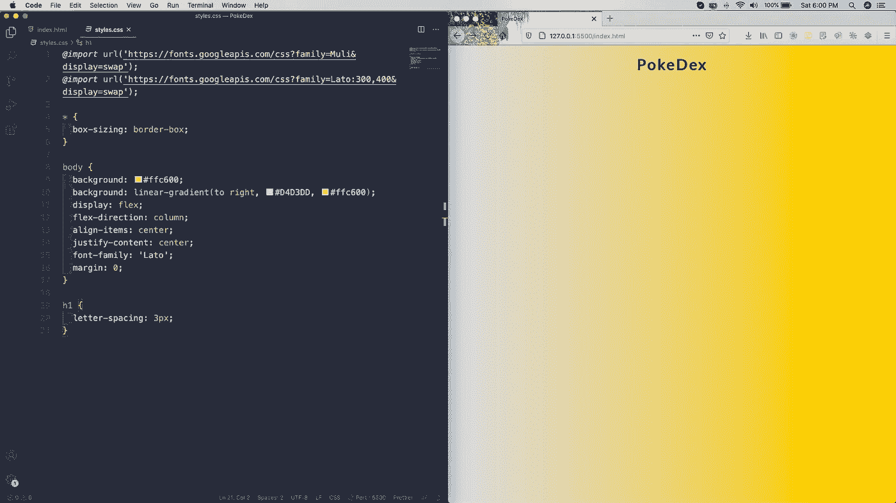
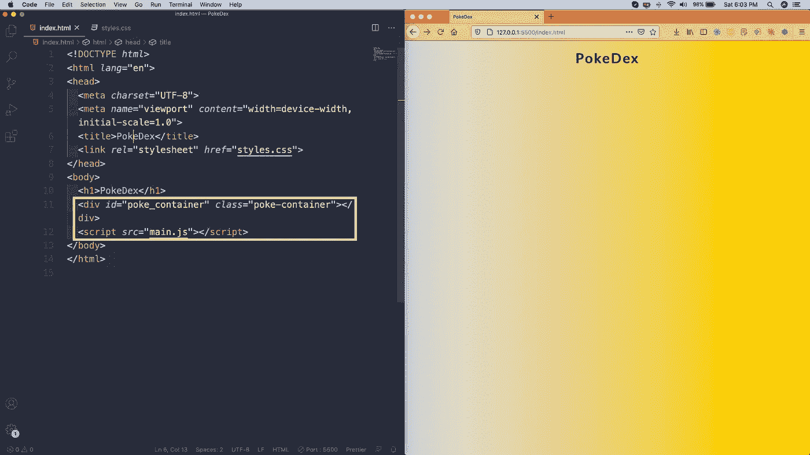
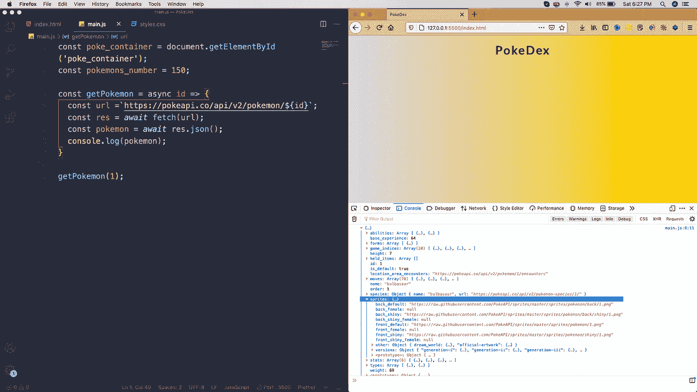
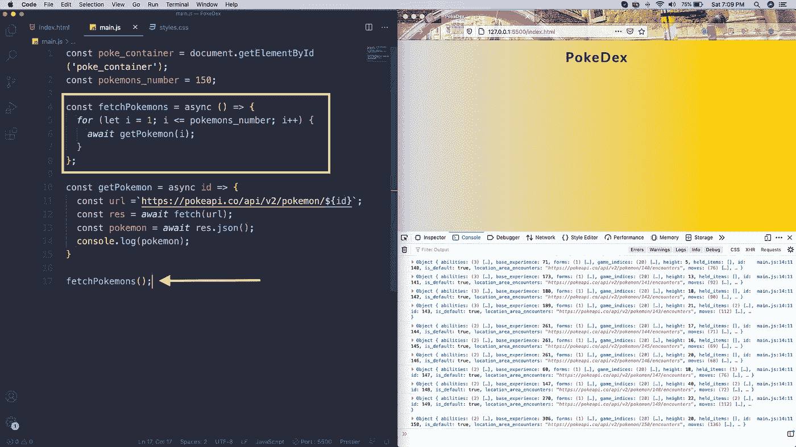
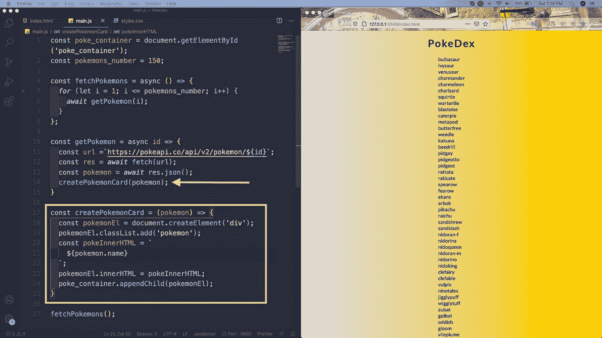
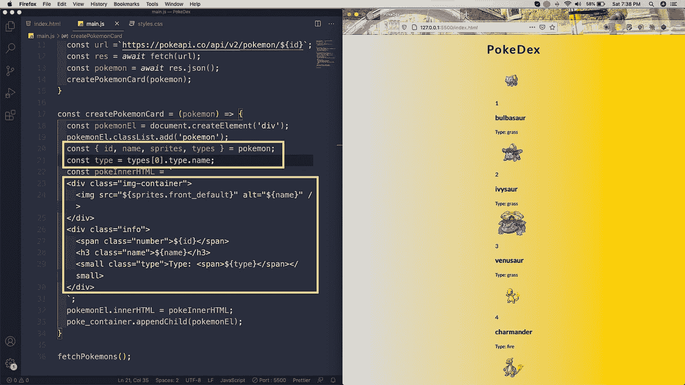
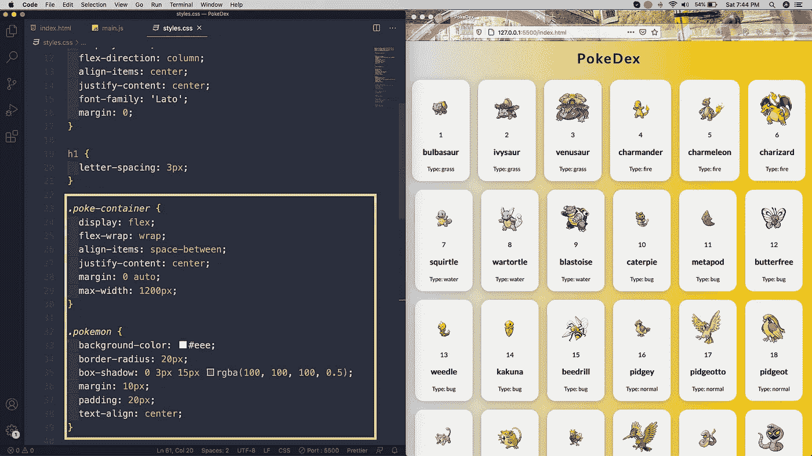
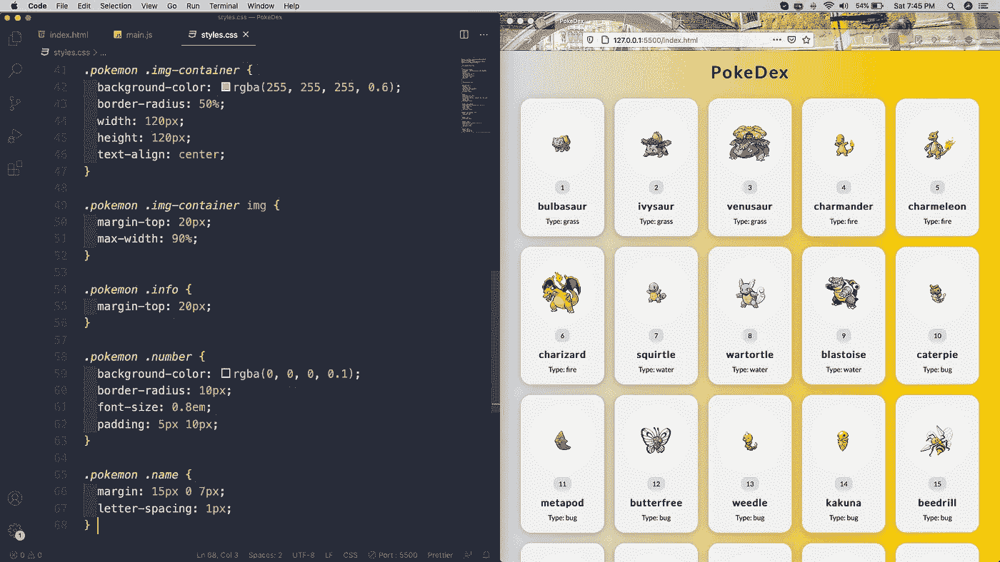

# 用普通的 JS 创建一个 PokeDex

> 原文：<https://levelup.gitconnected.com/create-a-pokedex-with-vanilla-js-7aa580d6c96b>

[杰](https://unsplash.com/@imjma?utm_source=unsplash&utm_medium=referral&utm_content=creditCopyText)在 [Unsplash](https://unsplash.com/s/photos/pokemon?utm_source=unsplash&utm_medium=referral&utm_content=creditCopyText) 上拍照

在这个项目中，我们将使用普通的 JavaScript 创建一个 PokeDex。

我们将首先创建一个【PokeDex】文件夹和三个文件**index.html**、 **styles.css** 和 **main.js** 在里面。

PokeDex

之后，我们将在 VS 代码中打开代码，并在**index.html**中添加基本的 html，只有一个标题。我们也开始了 VS 代码扩展 **Live 服务器**的项目。

index.html

之后，让我们在 **styles.css** 文件中添加基本样式。

样式. css

现在，回到**index.html**并为口袋妖怪添加一个 div，还包括 **main.js** 文件。

index.html

在 **main.js** 中，我们首先选择 poke_container 并创建一个函数 **getPokemon()** ，该函数使用 fetch 调用 pokemon API。

出于测试目的，我们将 1 传递给它，并通过控制台记录数据。我们正在控制台中正确地获取口袋妖怪的数据。

口袋妖怪数据

现在，我们正在创建一个函数 **fetchPokemon()** ，其中我们通过一个 for 循环进行循环。我们从函数内部调用 id 从 1 到 150 的函数 **getPokemon()** 。

getPokemon()

现在，我们将创建一个新函数 **createPokemonCard()** 。在它里面，我们用 pokemon 类创建了一个新的 div。我们现在只是显示名称，它显示得很完美。

创建口袋妖怪卡

我们现在正在完成 **pokeInnerHTML** 并显示图像、id、名称和类型。我们还添加了所需的 html。

PokeDex

现在，我们只需要设计我们的口袋妖怪。因此，转到 **styles.css** 并将**戳容器**制作成 flexbox。我们也在为**口袋妖怪**类添加样式。

样式. css

在这之后，我们通过添加 img 的样式——容器、信息、数字和名称来完成 css。

口袋妖怪

我们的小项目完成了。你可以在这里找到相同[的代码](https://github.com/nabendu82/PokeDex)。