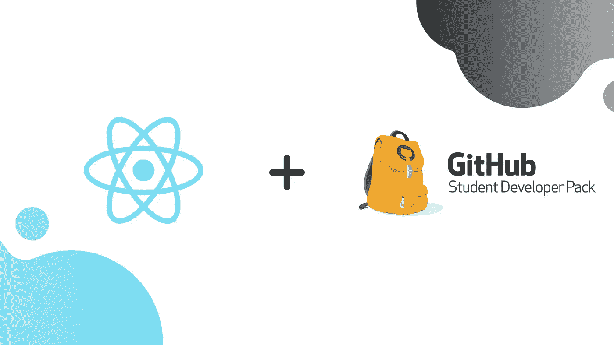
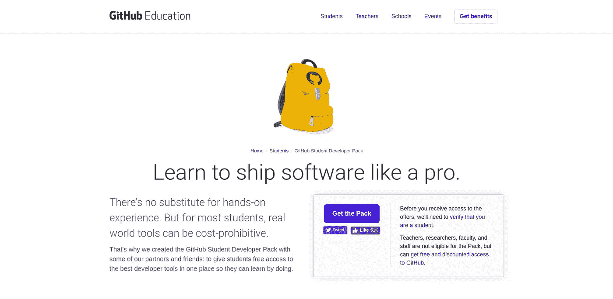
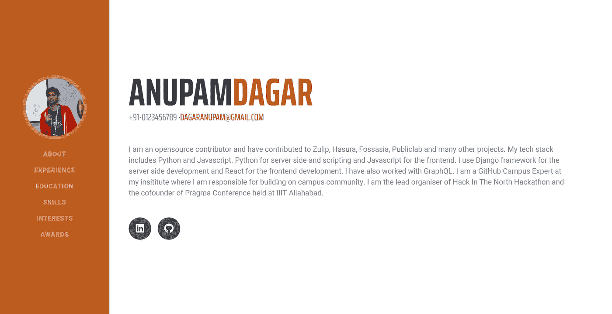
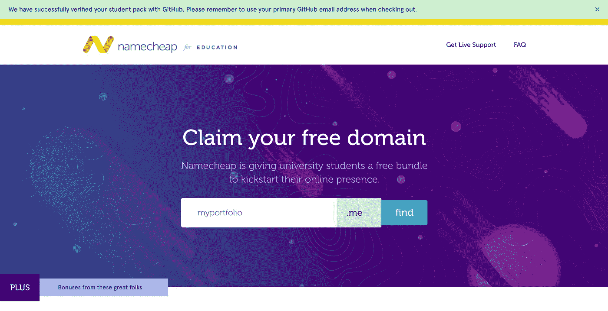
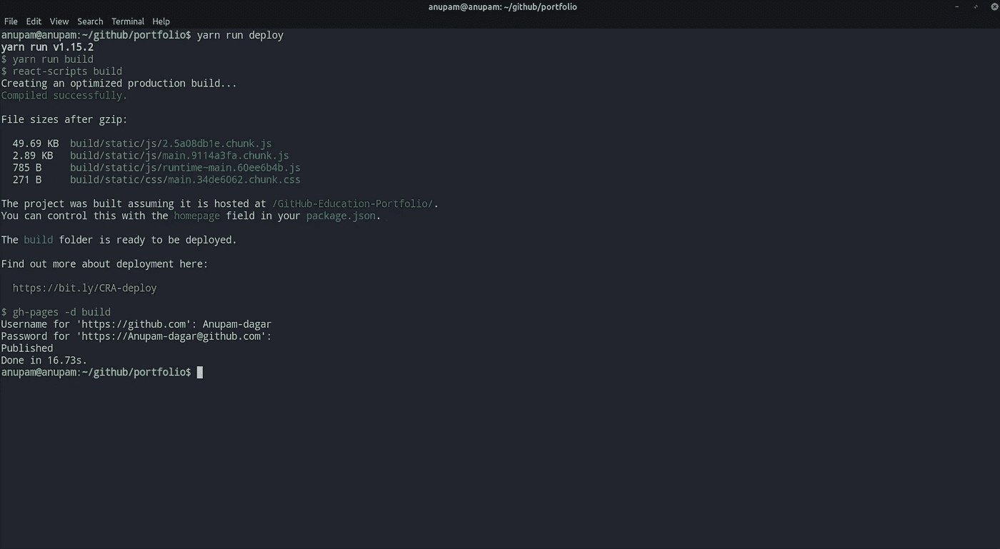
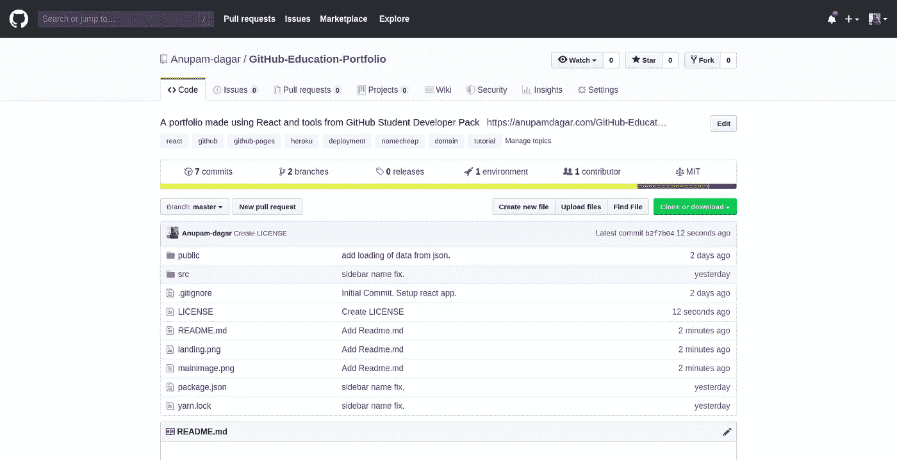
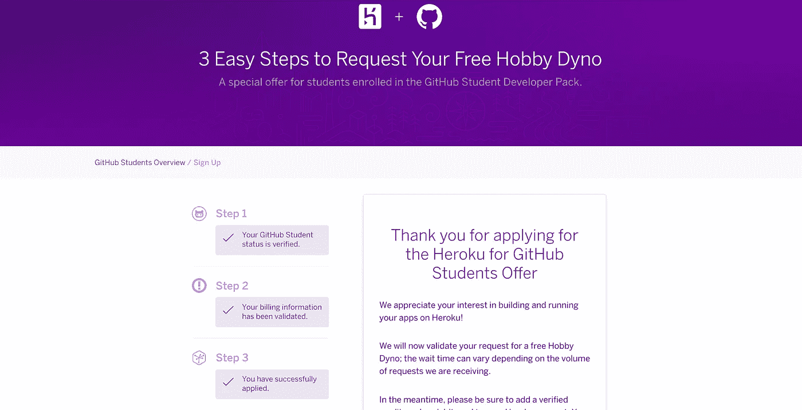

# 使用 React 和 GitHub 学生开发包创建一个作品集

> 原文：<https://levelup.gitconnected.com/create-a-portfolio-using-react-and-github-student-developer-pack-955379207855>



在这篇博客中，我们将使用 React 和 GitHub 学生开发包提供的工具创建一个作品集网站。

# 什么是 GitHub 学生开发者包？没听说过。


真实世界的工具，如云托管服务、域名、特定软件对学生来说可能很贵。这就是为什么 GitHub 与其他科技公司合作创建了学生开发者包，让学生可以在一个地方免费使用最好的开发工具。


端到端的 [**课程，掌握编码面试**](https://skilled.dev/) ，登陆你的下一份工作软件工程师。

[](https://skilled.dev) [## 掌握编码面试| Skilled.dev

### 一个完整的平台，在这里我会教你找到下一份工作所需的一切，以及…

技术开发](https://skilled.dev) 

# 太好了。学生开发人员包中包含哪些内容？

目前有 23 种服务和工具包含在学生可以使用的包中。一些服务是，50 美元的数字海洋信用，两年的免费 Heroku 爱好开发动态。me 域名、通过 SendGrid 以更高的限制发送电子邮件、通过 Travis CI 构建私有持续集成等等。


# 太棒了。怎么申请呢？



要申请 GitHub 学生开发包，您需要是一名在校学生。如果你不是学生，那么你就没有资格加入这个团体。在[https://education.github.com/pack](https://education.github.com/pack)申请学生开发者包。点击获取包装，并按照屏幕上的要求进行操作。如果你没有学校发的以结尾的电子邮件地址。edu，你还需要一个有效的学校 id，或其他注册证明，如你的时间表照片，这将由 GitHub 团队审查。审核申请需要 24 到 48 小时。

# 关于下一步的总结

在这篇博客中，我们将使用 React 和 GitHub 学生开发包提供的工具创建一个作品集网站。为此，我们将使用免费的 Heroku dyno 包和免费域名。我们还将使用 GitHub 来推送我们的代码并部署到 GitHub 页面。



# 入门指南

在我们深入编码部分之前，我们将首先安装所需的工具。我将使用`yarn`包管理器。您可以在[https://yarnpkg.com/lang/en/docs/install/](https://yarnpkg.com/lang/en/docs/install/)
1 找到安装纱线的说明。React
使用以下命令
`yarn create react-app portfolio`安装并创建一个名为 portfolio 的 React 应用程序

2.Heroku CLI
执行以下命令在 Ubuntu 16+ OS 上安装 Heroku CLI。所有其他操作系统的
`curl [https://cli-assets.heroku.com/install-ubuntu.sh](https://cli-assets.heroku.com/install-ubuntu.sh) | sh`
说明可在[https://devcenter.heroku.com/articles/heroku-cli](https://devcenter.heroku.com/articles/heroku-cli)
找到。确保使用`heroku login`命令登录 Heroku CLI。

3.安装 gh-pages 和 fontawesome 包，使用

```
yarn add gh-pages
yarn add @fortawesome/fontawesome-svg-core
yarn add @fortawesome/free-solid-svg-icons
yarn add @fortawesome/react-fontawesome
yarn add @fortawesome/free-brands-svg-icons
```

# 投资组合编码

我们将使用 Bootstrap 4 的简历模板来构建我们的投资组合。模板可以在这里找到。[https://github.com/BlackrockDigital/startbootstrap-resume](https://github.com/BlackrockDigital/startbootstrap-resume)

**复制 jquery 和 bootstrap
在 public 文件夹下创建目录`css`和`js`，从下载的模板中复制以下文件到其中。
1。bootstrap.min.css
2。resume.min.css
3。bootstrap.bundle.min.js
4。jquery.easing.min.js
5。jquery.min.js
6。简历. min.js**

**链接添加的依赖关系** 打开公共目录内的`index.html`，链接复制的 css 和 js 如下:
对于 CSS
`<link href="%PUBLIC_URL%/css/cssfilename.css" rel="stylesheet">`
对于 Javascript
`<script src="%PUBLIC_URL%/js/jsfilename.js"></script>`

**添加模板以反应基于构件的结构** 引导恢复模板需要拆分成构件。在`src`目录中创建一个目录`Components`，所有组件都将驻留在这个目录中。我们将它拆分成以下 7 个组件:
1。Sidebar.js
2。Landing.js
3。Experience.js
4。Education.js
5。Skills.js
6。Interests.js
7。Awards.js

**使用 json 作为用户数据存储** 在`src`目录中创建一个名为`profileData.json`的 json 文件。该文件将保存用户的投资组合数据。json 文件的结构如下:

json 的每个`key`都是以将要使用的数据组件命名的。

**修改 App.js** App.js 是导入所有其他组件并定义网站结构的主文件。

首先，我们从创建的 json 导入所有创建的组件和用户数据。在构造函数中，我们为每个组件设置了来自 json 的数据。来自状态的数据将作为`props`传递给组件。然后，所有组件按照引导程序的模板进行排列。

**创建 Sidebar.js** 侧边栏组件由网站侧边栏的代码组成。这是模板中完整的`nav`标签。在从模板中复制代码之前，确保它符合`jsx`。`class`应该改名为`className`或者你可以用这个[https://magic.reactjs.net/htmltojsx.htm](https://magic.reactjs.net/htmltojsx.htm)把你的 HTML 转换成 JSX。

在每个组件的构造器中，来自 props 的数据将被赋给一个变量，通过这个变量它将被添加到`jsx`中的相关位置。

对于侧边栏组件，这是作为`this.sidebarData = props.sidebarData`完成的。对于所有其他组件，也是以类似的方式完成的。

用 JSON 中的数据替换所有硬编码的名称和字段。为此，通过传递给组件的属性所分配到的变量来引用 JSON 数据。在 JSX 中引用变量的语法是引用花括号中的变量。所以侧边栏中用户的名字可以作为`{this.sidebarData.firstName}`被访问。所有其他数据字段都可以以类似的方式被来自 JSON 的数据访问和替换。
通过以下链接在 GitHub 上找到`Sidebar.js`。

[](https://github.com/Anupam-dagar/GitHub-Education-Portfolio/blob/master/src/Components/Sidebar.js) [## anu PAM-dagar/GitHub-Education-Portfolio/src/Components/sidebar . js

### GitHub Education Portfolio 的 Sidebar.js 源代码。

github.com](https://github.com/Anupam-dagar/GitHub-Education-Portfolio/blob/master/src/Components/Sidebar.js) 

**创建 Landing.js** Landing.js 的创建方式类似。第一个带`id` `about`的部分是需要登陆的 HTML 部分。首先，来自 props 的数据被加载到构造函数中，并添加到组件的`jsx`中。

[](https://github.com/Anupam-dagar/GitHub-Education-Portfolio/blob/master/src/Components/Landing.js) [## anu PAM-dagar/GitHub-Education-Portfolio/src/Components/landing . js

### GitHub Education Portfolio 的 Landing.js 源代码。

github.com](https://github.com/Anupam-dagar/GitHub-Education-Portfolio/blob/master/src/Components/Landing.js) 

**Creating Skills . js** JSON 数据中一个用户的技能是一个字典列表。为了将其添加到`jsx`中，使用`map`循环从道具加载的数据，并将数据插入到`jsx`中。

其中`this.skills`是从`profileData.json`加载的用户技能数据

以类似的方式创建其他组件。使用`yarn start`运行服务器，在`http://localhost:3000`时在浏览器中查看您的投资组合。

# 使用 GitHub 学生开发包

**用 Namecheap 免费** `**.me**` **域名** 去[https://education.github.com/pack/offers](https://education.github.com/pack/offers)找 Namecheap。通过在 Namecheap 上连接您的 GitHub 帐户获得一个免费域名。



授权名称便宜，然后找到你的免费域名。得到你的域名后，进入你的域名列表，点击管理来管理你的域名。
点击`Advanced DNS`标签，找到`Host Records`。点击`Add new Record`按钮添加新记录。添加以下记录:

用您实际的 GitHub 用户名替换`githubusername.github.io`。之后，您的域就可以用于 GitHub 页面了。

**使用 GitHub 通过 GitHub 页面托管您的投资组合。** 在你项目的根目录下，初始化一个`git`仓库，如下
`git init`。前往 GitHub 并创建一个名为`githubusername.github.io`的空存储库，在这里用您实际的 GitHub 用户名替换`githubusername`。复制您的 repo 的 git 链接，并将其添加到您的本地 git repo，如下所示
`git remote add origin <git link>`

在你的根目录下创建一个名为`CNAME`的文件，并添加你的域名，格式为`yournamecheapdomain.me`并保存。

将 2 个脚本`predeploy`和`deploy`添加到`package.json`中的脚本，如下所示。

```
"predeploy": "yarn run build",
"deploy": "gh-pages -d build"
```

这两个脚本都应该在`package.json`的`scripts`键内。另外给`package.json`加一个`homepage`键，设置为`[http://yournamecheapdomain.me/](http://yournamecheapdomain.me/.)` [。](http://yournamecheapdomain.me/.)

运行`yarn run deploy`将您的代码推送到`gh-pages`分支，并从那里托管它。前往`http://yournamecheapdomain.me/`查看您托管的投资组合。



通过执行以下步骤将您的代码推送到 master:

```
git add -A
git commit -m "Push portfolio code"
git push origin master
```



使用 GitHub 学生开发包在 Heroku 上托管您的作品集，您可以获得 Heroku 的免费爱好开发动态。前往 https://education.github.com/pack/offers[的 Heroku，将你的 GitHub 账户与 Heroku 连接。](https://education.github.com/pack/offers#namecheap)



这一过程包括 Heroku 团队的人工验证，可能需要一两天才能获得批准。请求获得批准后，该应用程序就可以部署在您的 Heroku 帐户上了。

要部署您的应用程序，请确保登录 Heroku CLI。同样，在`package.json`中添加一个新对象，如下所示:

```
"engines" : {
    "npm": "6.4.1",
    "node": "10.5.2"
}
```

在你的终端中运行`node -v`可以得到你的`node`版本，运行`npm -v`可以得到`npm`版本。

通过执行`heroku create appname`创建一个 Heroku 应用程序，其中 appname 是您为投资组合选择的 appname。如果您还没有提交代码，请提交并执行`git push heroku master`。等待 Heroku 完成部署。

运行`heroku open`打开 Heroku 上的应用程序。

就是这样，就这么简单。

GitHub Pages 部署版本在[http://anupamdagar.com/GitHub-Education-Portfolio/](http://anupamdagar.com/GitHub-Education-Portfolio/)

Heroku 部署的版本在[https://studentpackportfolio.herokuapp.com/](https://studentpackportfolio.herokuapp.com/)

该应用程序的完整源代码位于 GitHub，网址为

[](https://github.com/Anupam-dagar/GitHub-Education-Portfolio) [## anu PAM-dagar/GitHub-教育-作品集

### 通过在 GitHub 上创建一个帐户，为 anu PAM-dagar/GitHub-Education-Portfolio 开发做出贡献。

github.com](https://github.com/Anupam-dagar/GitHub-Education-Portfolio) 

# 关于我

大家好，我是 Anupam Dagar，来自印度阿拉哈巴德信息技术学院的信息技术本科生。我是 GitHub 校园专家、开源贡献者和全栈开发者。要了解我的更多信息，请在 [Twitter](https://twitter.com/siriusdagar) 或 [GitHub](https://github.com/Anupam-dagar) 上联系我😄


[**开发者简历生成器→**](https://gitconnected.com/resume-builder?utm_source=githhub-ed-article)

[](https://gitconnected.com/resume-builder?utm_source=githhub-ed-article) [## 软件工程师简历生成器和示例| gitconnected

### 免费打造不到 5 分钟的高质量软件工程简历。同步您的个人资料，我们会处理…

gitconnected.com](https://gitconnected.com/resume-builder?utm_source=githhub-ed-article) 