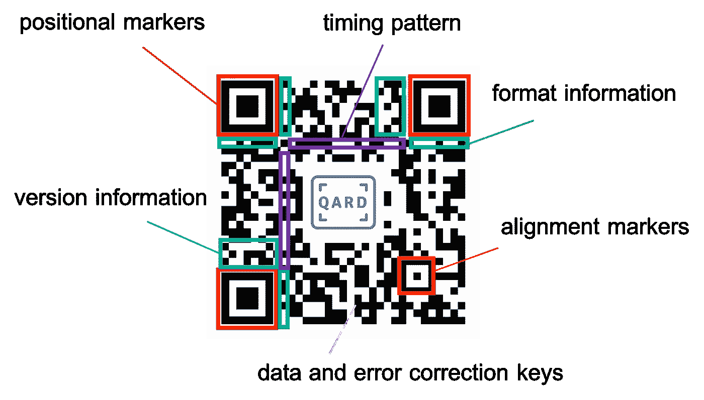
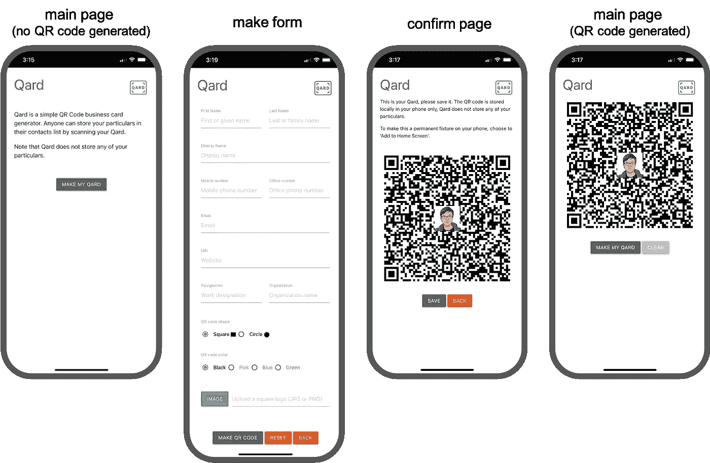
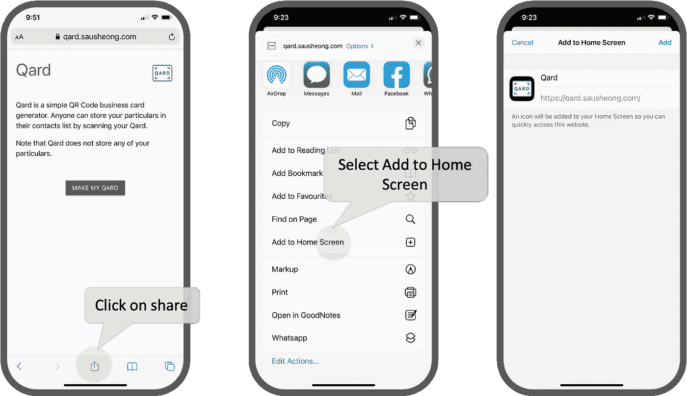
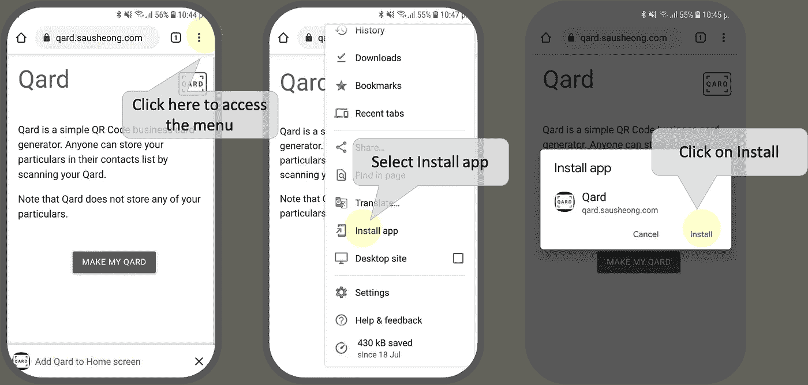

# 用 Go 创建二维码名片应用程序

> 原文：<https://levelup.gitconnected.com/create-a-qr-code-business-card-app-with-go-7e4aadf734b8>

## 扔掉你的名片，亮出你的二维码！

我有太多名片了。不是我自己的，而是多年来从商务会议、会议、活动和一般的会议中收集的。交换名片有时几乎是一种仪式，在大公司，甚至不同团队的人也交换名片。


图片来自[https://www.pxfuel.com/en/free-photo-ojlyp](https://www.pxfuel.com/en/free-photo-ojlyp)

虽然我实际上并不收集它们(因为收集它们是我的爱好)，但我以前也有一些有趣的名片。一个朋友曾经给过我他的名片，是一个吉他拨片，而另一个人精心制作了[一个全功能的 PCB 板，有白光和紫外光 LED(当然是为了检测假币)，NFC 和电池供电](https://yeokhengmeng.com/2015/09/pcb-businessname-card/)。

不过，我不擅长名片。我发现随身携带一叠卡片通常是一件麻烦的事情，我经常会用完，尤其是在会议和活动中。我发现从别人那里收到贺卡，并试图将它们保存到我的联系人列表中是一件更麻烦的事情。因为我不知道。

我试着用软件扫描它们，我试着给它们拍照，让它们顺其自然，但是这两种方法都不好用，而且要花太多时间。最终我真正想要的是他们的联系信息到我的联系人列表中。因此，对我来说真正有用的是，当我们交换名片时，联系信息会立即添加到我的联系人列表中。

我发现有一件事做得比较好，那就是现在很多名片上都印有二维码，这是名片上的联系信息。当您扫描它时，联系信息可以立即添加到我的联系人列表中。

然而，这确实回避了一个问题，为什么我必须在卡上打印一个二维码，并把它交出去？为什么二维码不能直接在我手机上？在这种情况下，我不需要携带我的名片，我只需出示我的二维码，就可以交换联系信息。

当然可以。我确实这样做了，并将其保存到我的照片应用程序中，但要找到正确的相册来打开二维码有点麻烦。当然，我习惯于处理 QR 码，创建它们并不是什么大问题，但我可以想象这对每个人来说并不简单。

因此，在一个封闭的周末，我决定快速创建一个简单的应用程序来做这件事。


TL；DR 扫描此二维码或点击手机上的此链接添加到您的主屏幕或安装为应用程序【https://qard.sausheong.com 

# 二维码

二维码很受欢迎，随处可见。从最初在汽车零部件行业的发明开始，它已经进入了我们日常生活的许多方面。商业跟踪、票务、营销、支付、标记、识别和最近的联系追踪是常见的应用。


在 [Unsplash](https://unsplash.com/s/photos/qr-codes?utm_source=unsplash&utm_medium=referral&utm_content=creditCopyText) 上由 [Toa Heftiba](https://unsplash.com/@heftiba?utm_source=unsplash&utm_medium=referral&utm_content=creditCopyText) 拍摄的照片

QR 码是一种二维条形码，由日本汽车零部件制造商电装的子公司 Denso Wave 于 1994 年发明。Denso Wave 生产条形码阅读器等识别产品，他们需要一个条形码系统来实现高速组件扫描，因此他们创建了 QR(快速响应)代码系统。它迅速流行起来，并于 2000 年成为国际 ISO/IEC 标准。

二维码由白色背景上的正方形网格中排列的黑色正方形组成(最初的灵感来自围棋棋盘上的黑白棋子)。它被设计为由照相机(或任何图像捕获机器)读取，并且对于其最大版本，可以存储最多 7，809 个纯数字字符或 4，296 个字母数字字符，具有最低的纠错级别(40-L)。

如果你仔细观察一些二维码，你会很快意识到每个二维码上有 3 个标记，分别位于正方形的 3 个角上。它们是位置标记，有助于识别 QR 码及其方向。第四个角附近(但不完全是)还有一个较小的对齐标记，当 QR 码失真时(从某个角度或曲面等角度观察)，它有助于解码。根据 QR 码的大小，可以有多个对准标记。除此之外，QR 码上还有定时模式、版本信息、格式信息和其他元数据。



二维码具有纠错功能，可以恢复损坏的数据，即部分二维码不可读。这是通过向原始数据添加里德-所罗门码来实现的。有 4 种纠错级别，它们决定了可以恢复多少数据:

*   L 级:约 7%
*   M 级:约 15%
*   Q 级:约 25%
*   H 级:约 30%

级别越高，存储容量越小。纠错能力是允许添加图像到 QR 码的技巧。然后，该图像被视为“损坏”数据的一部分。

QR 码可以用 4 种编码模式对信息进行编码:

1.  数字(每 3 个数字 10 位)
2.  Alphnumeric(每 2 个字母数字字符 11 位)
3.  二进制(每个字符 8 位)
4.  汉字/假名(每个字符 13 位)

虽然它是为汉字/假名而创建的，但这并不意味着它只能编码日语字符。事实上，它可以编码所有类型的双字节语言，包括中文和韩文。当我们考虑到有时联系人姓名甚至地址或其他信息可能是其他语言时，这一点对我们来说很重要。

# VCard

VCard 是电子名片的文件格式标准。它基本上是一个人类可读的文本文件，描述了名片上常见的一些属性。许多软件都支持 VCard，包括桌面和移动电话上最流行的电子邮件和联系人应用程序。如果你在某处看到一个`.vcf`文件，那就是 VCard 文件。如果你用 WhatsApp 给别人发联系人，那也是 VCard。

VCard 相当简单，看起来是这样的:

```
BEGIN:VCARD
VERSION:3.0
EMAIL;TYPE=WORK:[m](mailto:sausheong@gmail.com)yemail@spgroup.com.sg
FN:Sau Sheong Chang
N:Chang;Sau Sheong;;;
ORG:SP Group
TEL;TYPE=CELL;TYPE=VOICE:98765432
TEL;TYPE=WORK;TYPE=VOICE:12345678
TITLE:Work Title
URL:[https://www.spgroup.com.sg](https://www.spgroup.com.sg)
END:VCARD
```

可读性很强，其实不需要解释。然而，VCard 相当分散。虽然 VCard 的最新版本是版本 4.0，如 [RFC6350](https://datatracker.ietf.org/doc/html/rfc6350) 中所述，那是 10 年前的事了，但大多数应用程序仍在版本 3.0 上，更糟糕的是，还有[显著的实现差异](https://alessandrorossini.org/the-sad-story-of-the-vcard-format-and-its-lack-of-interoperability/)。

对于 Qard，我选择继续使用[3.0 版](https://www.evenx.com/vcard-3-0-format-specification)，因为它仍然是最受欢迎的版本。

# Qard

我调用了应用程序 Qard，原因应该很明显(以防万一——听起来像 card，以 Q 开头，像 QR 码)。它应该是一个非常简单的移动应用程序，你可以用你的业务联系方式快速设置你的二维码，然后每当你打开应用程序时，只需点击一下。不要大惊小怪。

唯一的问题是我更喜欢使用网络应用，而不是本地移动应用。此外，我讨厌混合应用程序。所以我决定不管它了，我会选择渐进式网络应用(PWA)路线。繁重的工作将在服务器上使用 Go 完成，由几个简单的网页提供服务。服务器使用 Go 创建的 QR 码将被发送到前端，并保存到本地存储中，因此服务器上不会保存任何内容。那么，如果全部由前端 web 应用程序本身生成，会不会更好呢？我想答案是肯定的，但我的整个职业生涯都是后端工程师，用 Go 做这个对我来说要容易得多。

# 渐进式网络应用程序(PWA)

[渐进式网络应用](https://web.dev/progressive-web-apps/)是一种可安装在设备(台式机、平板电脑或智能手机)上的网络应用。当安装在设备上时，它模仿该设备上的本机应用程序，例如，当它安装在 iPhone 上时，它看起来和运行起来都像本机 iOS 应用程序。


进步网络应用标志(Diego gonzález-ZúIgA，CC0，via [Wikimedia Commons](https://commons.wikimedia.org/wiki/File:Progressive_Web_Apps_Logo.svg)

这使得在为多个平台创建原生移动应用成本过高或耗时过长的情况下，这一点变得非常引人注目。在降低多平台开发的复杂性和成本方面，以及与苹果应用商店或谷歌 Play 商店等专有渠道的联系方面，它也很有吸引力。

## 一些历史

渐进式网络应用的想法并不新鲜。HTML 最初是为创建链接内容而创建，但它一出现，动态内容和用户交互也是人们想要的。HTML 的第一个版本出现在 20 世纪 90 年代早期，标准 HTML 的第一个版本是 1995 年出现的 HTML 2.0。

大约在同一时间， [Java 小程序](https://en.wikipedia.org/wiki/Java_applet)随着 1995 年 Java 的发布而推出，它允许在网络浏览器上构建和部署应用程序。Flash (最初来自 FutureWave，后来被 Macromedia 收购，最终被 Adobe 收购)是另一个流行的部署在 web 上的应用程序平台，大约在同一时间问世。微软的竞争产品 [Silverlight](https://en.wikipedia.org/wiki/Microsoft_Silverlight) 于 2007 年左右问世，这些产品最终被称为[富互联网应用](https://en.wikipedia.org/wiki/Rich_web_application)(RIA)(Adobe 于 2002 年左右引入的术语)或富网络应用(Forrest Research 引入的术语)。

动态 HTML 是微软在 1997 年发布 Internet Explorer 4 时引入的。 [Ajax(异步 Javascript 和 XML)](https://developer.mozilla.org/en-US/docs/Web/Guide/AJAX) 在 1999 年左右出现，还有 [XMLHttpRequest (XHR)](https://en.wikipedia.org/wiki/XMLHttpRequest) 。2006 年，John Resig 发布了 j [Query](https://jquery.com) ，这是一个非常受欢迎的 Javascript 库，它使得 Ajax 和 DOM 操作比以前容易得多，并且它的受欢迎程度得到了探索。截至 2021 年 8 月撰写本文时，[在互联网上排名前 1000 万的网站中，约有 78%使用 jQuery](https://w3techs.com/technologies/overview/javascript_library)。

接下来是[单页面应用(SPA)](https://en.wikipedia.org/wiki/Single-page_application) 。SPA 是分几个步骤实现的，从 [Knockout.js](https://knockoutjs.com) 开始，它采用视图模型并将其绑定到浏览器的 HTML，接着是 [Backbone.js](https://backbonejs.org) ，它是第一个客户端 web 应用程序框架之一。谷歌于 2010 年发明的 Angular.js 将水疗推向了新的高度，紧接着是 2013 年左右发布的 [React.js](https://reactjs.org) (由脸书发布)。

但是什么是水疗呢？它基本上是一个运行在浏览器上的 web 应用程序，它动态地重写相同的页面，而不是从服务器加载新的页面。它通常是在客户端 Javascript 框架中编写的，如 Angular.js 和 React.js(两个最流行的框架)。其他流行的框架还有 [Vue.js](https://vuejs.org) 和 [Ember.js](https://emberjs.com) 。我不会深入研究这个问题，因为我只是提到 spa 来介绍 PWAs。

## 什么是 PWA？

那么什么是 PWA 呢？PWA 只是一个满足 3 个要求的 web 应用程序:

1.  它必须使用 HTTPS 服务
2.  它必须具有有效的 web 清单文件
3.  它必须注册一个服务人员

那么它和水疗有什么不同呢？如果您还记得我前面提到的，SPA 基本上是一个 web 应用程序，它动态地重写相同的页面，而不是从服务器加载新页面。换句话说，一个 SPA 也可以是一个 PWA，如果它遵循前面 3 个要求的话。反之亦然，动态重写相同页面而不是加载新页面的 PWA 是 SPA。换句话说，web 应用程序既可以是 SPA，也可以是 PWA！

渐进式网络应用这个术语是由工程师亚历克斯·罗素和设计师弗朗西斯·贝里曼于 2015 年在谷歌发明的。其背后的想法是一个 web 应用程序，可以跨设备提供更好的用户体验。有趣的是，这正是史蒂夫·乔布斯在第一代 iPhone 问世时所宣传的——iPhone 上的[应用将不是本地的，而是网络应用](https://9to5mac.com/2011/10/21/jobs-original-vision-for-the-iphone-no-third-party-native-apps/)。事实上，他抵制为 iPhone 开发 SDK 和应用商店的想法。

## Web 应用程序清单文件

通过 HTTPS 提供服务不需要更多的解释，所以让我从 web 应用程序清单文件开始。web 应用程序清单基本上是一个 JSON 文本文件，它提供了关于 web 应用程序的信息。该信息允许网络应用被安装在设备的主屏幕上。PWA 清单包括其名称、作者、图标、版本、描述和所有必要资源的列表。

## 服务行业人员

服务人员怎么样？这实际上是公共工程局的核心。服务人员是浏览器在后台运行的脚本，与加载它的网页分开。服务人员充当 web 应用程序、浏览器和网络之间的代理。

服务工作器是事件驱动的，在不同于支持 web 应用程序的主脚本的线程上运行。使用服务人员，您可以拦截网络请求以创建离线体验。

在这一点上，您可能仍然有点困惑它是如何一起工作的，所以让我们绕道看看 Qard 是如何工作的，然后跳到代码上，这样就更清楚了。

# Qard PWA

Qard PWA 是一个只有 3 页的简单网络应用程序。



Qard 截图

第一个是主页或索引页。在二维码生成之前，它只是一个带有行动号召按钮的空白页面，用于创建二维码。单击该按钮后，您将进入 make 表单，该表单提供了许多供您输入的字段。您还可以选择二维码的外观，方形或圆形圆点，以及圆点的颜色。你也可以上传一个小的正方形图片，放在生成的二维码中间。

一旦你点击制作二维码的按钮，你将进入一个确认页面，让你看到二维码并确认它就是你想要的。如果您点击保存按钮，您将返回到主页面，该页面将显示新创建的二维码。从此以后，每次进入主页面，都会给你看二维码。

如您所见，这是一个非常简单的 PWA。接下来我将遍历代码。

# 密码

## 服务器端

虽然 Qard 是一个 PWA，但有一个后端服务来执行重型提升，以处理信息并生成 QR 码。让我们从服务器代码开始，它在 Go 中(当然)。

整个服务器代码库都在一个文件中，但是我将把它分成小部分进行讨论。首先是 web 应用程序和一些基本的处理程序。这里没什么特别的，就是一个普通的 Go web 应用。

有 3 个处理程序提供 web 应用程序接口。第一个 2、`index`和`makeform`分别显示索引页和制作表单。

其他两个处理程序基本上分别返回服务工作者脚本和清单文件。我会进一步展示这一点。

大部分处理都在函数`makeQRCode`中进行。这个功能非常简单。首先，我获取来自 make 表单的数据，并使用`[github.com/emersion/go-vcard](http://github.com/emersion/go-vcard)`包创建一个 vCard。

注意，对于颜色和形状，我们使用了来自`github.com/sausheong/go-qrcode`包的常量。一会儿再详细讲。

接下来，如果有上传，我将获取内容并检查它是否是图像。如果是，我会将其调整为正方形，并设置在`go-qrcode`选项中。

准备工作完成后，我设置 vCard 版本，然后对其进行编码。使用`go-qrcode`包，我用 vCard 值和选项创建了一个新的二维码，并将其作为字节缓冲区返回。

然后这个字节缓冲区被`makeQRCodeAndShow`处理器用来生成图像的 base64 编码版本。

这就是服务器端代码的基本内容。最后一点是返回服务工作者脚本和清单。我没有将它作为静态文件返回，而是创建了处理程序来读取文件并分别以 Javascript 或 JSON 的形式返回。

## 客户端

现在让我们进入实际的 PWA。让我们从 web 应用程序清单文件开始。web 应用程序清单是一个 JSON 文件，它告诉浏览器有关您的 PWA 的信息，以及当它安装在用户的桌面或移动设备上时应该如何表现。这是 Qard 的 web 应用程序清单文件。

这些字段是不言自明的。

服务人员是 PWA 的关键部分。服务人员经历 4 步生命周期:

1.  **注册**
    使用`[ServiceWorkerContainer.register()](https://developer.mozilla.org/en-US/docs/Web/API/ServiceWorkerContainer/register)`方法注册服务人员。如果成功，将进行下一步。
2.  **下载**
    服务工作者在用户第一次访问页面时下载。它也可以在服务人员发生事件时更新，或者在过去 24 小时内没有下载。
3.  **安装**安装
    服务工作者下载后，安装完成。如果已经安装了维修工人，则跳过此步骤。你可以监听`install`事件并初始化服务工作者(这就是我们所做的)。
4.  **激活**
    一旦安装了维修工人，它将被激活。

让我们看看 Qard 服务人员。

这很简单。我建立了一个我们想要缓存的资产列表以防 PWA 离线。服务工作者监听`install`事件，当事件发生时，它会将资产添加到静态缓存中。

它还监听`fetch`事件，这是当浏览器试图从服务器获取某些东西时触发的事件。如果一个资产与缓存中找到的相匹配，它将首先获取缓存中的内容，如果缓存中的内容不可用，它将从服务器中获取。

服务人员到此为止。现在让我们看看`index.html`文件，这是我们的主页。

我为 PWA 使用了[物化 CSS](https://materializecss.com) 框架。在`head`标签中，我链接到 web 应用程序清单文件，还设置了安装在设备上时使用的图标。

这个页面中嵌入了相当多的 Javascript。首先，我需要注册服务人员。当页面加载时，我使用`navigator.serviceWorker.register`函数来注册服务人员。这就是我要为这里的服务人员做的一切。

下一点是关于二维码的。我使用 localStorage 来存储二维码图像的 base64 版本，因此如果找到它，我将隐藏其他所有内容，并立即将图像显示为数据 URL。

我还有一个按钮，允许用户使用 `localStorage.removeItem`功能清除`localStorage`中的二维码。

make 表单只是`makeform.html`文件中的一个普通表单。

确认页面在`show.html`文件中。

这是我允许用户保存服务器发送的二维码的地方，使用`localStorage.setItem`功能。

这就是 PWA 代码！

到目前为止，我们已经清除了 PWA 的三个要求中的两个——拥有一个 web 应用清单文件和一个服务人员。最后一个是通过 HTTPS 服务器。

# 使其成为互联网应用

为此，我假设您在互联网上的某个地方有一台服务器，您可以访问它，并且您可以完全控制它。在我的例子中，我只是在 Ubuntu 上运行的[数字海洋](https://www.digitalocean.com)上创建了一个廉价的水滴。您还需要能够访问您想要使用的域名。这两种情况都有替代方案，但对我来说太长了，所以我只使用这些假设。

哦，当然，你应该有 SSH 访问你的服务器，你应该有编译的代码和服务器在上面运行。

顺便说一句，如果您觉得这里的步骤看起来很熟悉，那是因为我主要是重复使用了我在以前的文章中描述的相同的一组步骤。我简直是在抄袭自己，但既然我不打算起诉自己，那就没关系。

为什么我不直接链接到之前的文章呢？这是因为我希望这篇文章或多或少是独立的，包含创建 PWA 所需的所有步骤。

## 代理人

Qard PWA 服务器使用端口 9000。假设您不想让您的用户在您漂亮的 URL 后面使用难看的端口号，我们可以使用反向代理将流量重定向到我们的端口。

为此，我将使用 [Nginx](https://www.nginx.com) ，这是一个流行的开源 web 服务器，通常被用作[反向代理](https://www.nginx.com/resources/glossary/reverse-proxy-server/)。安装 Nginx 和在 Ubuntu 上安装大多数其他软件是一样的。

```
$ sudo apt update
$ sudo apt install nginx
```

要设置反向代理，在`/etc/nginx/sites-available`的 Nginx `sites-available`目录下创建一个配置文件，内容如下。我们姑且称这个文件为`qard.conf`。

```
server {
   listen 80;   
   server_name qard.sausheong.com;   
   location / {
        proxy_pass [http://localhost:](http://localhost:8888)9000;
    }
}
```

我们需要通过在`sites-available`中创建一个从这个文件到`sites-enabled`的符号链接来激活这个文件。

```
$ sudo ln -s /etc/nginx/sites-available/qard.conf /etc/nginx/sites-enabled/qard.conf
```

之后，我们可以重启 Nginx。

```
$ sudo service nginx restart
```

## HTTPS

现在它将在普通 HTTP 下的端口`80`上运行。但是一般来说，如果我们通过 HTTPS 使用 SSL 会更好，特别是当使用 Certbot 非常简单和免费的时候。 [Certbot](https://certbot.eff.org) 是一个开源工具，它自动使用[让我们加密](https://letsencrypt.org)证书来启用 HTTPS，它非常适合我们的用例。

首先，我们安装 Certbot。Certbot 本身建议使用 snap:

```
$ sudo snap install --classic certbot
```

然后使其普遍可用:

```
$ sudo ln -s /snap/bin/certbot /usr/bin/certbot
```

如果您更喜欢使用 apt，您必须首先添加存储库:

```
$ sudo apt install software-properties-common
$ sudo add-apt-repository ppa:certbot/certbot
$ sudo apt update
```

一旦你这样做了，你就可以使用 apt 添加 certbot。

```
$ sudo apt-get install certbot python3-certbot-nginx
```

无论哪种方式，一旦完成，就可以启动 Certbot，让它扫描 Nginx 配置文件。

```
$ certbot --nginx
```

这将列出您机器上的每个 Nginx 配置，并提示您要用 SSL 设置的 web 应用程序。选择您想要的，然后它会要求您选择重定向 HTTP 流量到 HTTPS，删除 HTTP 访问。在这种情况下，我们希望每个人都通过 HTTPS，所以我们将选择删除 HTTP 访问。

一旦你完成了你的选择，Certbot 将会施展它的魔法，相应地改变配置，你的 Nginx 配置文件将会是这样的。

```
server {
   listen 80;
   listen [::]:80; server_name qard.sausheong.com; location / {
        proxy_pass [http://localhost:](http://localhost:8888)9000;
   }

   listen 443 ssl; # managed by Certbot
   ssl_certificate /etc/letsencrypt/live/qard.sausheong.com/fullchain.pem; # managed by Certbot
   ssl_certificate_key /etc/letsencrypt/live/qard.sausheong.com/privkey.pem; # managed by Certbot
    include /etc/letsencrypt/options-ssl-nginx.conf; # managed by Certbot
   ssl_dhparam /etc/letsencrypt/ssl-dhparams.pem; # managed by Certbot 
}server {
    if ($host = qard.sausheong.com) {
        return 301 [https://$host$request_uri](/$host$request_uri);
    } # managed by Certbot server_name qard.sausheong.com;
    listen 80;
    return 404; # managed by Certbot
}
```

就是这样！

## 系统 d

好了，最后我们完成了吗？还没有！当我们通过 SSH 进入服务器时，我们的服务器就启动了，当我们退出时，它就会死掉。我们需要让它成为一种服务，而 [systemd](https://www.freedesktop.org/wiki/Software/systemd/) 就是我们在这里要用的。

我们用这个内容在`/etc/systemd/system`目录中创建一个名为`qard.service`的文件。

```
[Unit]
Description=Qard
ConditionPathExists=/home/sausheong/go/src/github.com/sausheong/qard/qard
After=network.target[Service]
Type=simple
User=sausheong
Group=sausheongWorkingDirectory=/home/sausheong/go/src/github.com/sausheong/qard
ExecStart=/home/sausheong/go/src/github.com/sausheong/qard/qard -sRestart=on-failure
RestartSec=10[Install]
WantedBy=multi-user.target
```

然后我们试着启动它。

```
$ sudo systemctl start qard
```

然后我们检查它是否正常。如果是，那么我们将需要正确地启用它作为服务。

```
$ sudo systemctl enable qard
```

我们完事了。

转到[https://qard.sausheong.com](https://qard.sausheong.com)——你可以在桌面浏览器上打开它，但你可能会发现在手机浏览器上打开它更有用。你也可以把它安装在任何一个手机上，但是 PWA 的主要目的是允许人们把它安装在手机上来交换商务联系信息，所以我只在手机上谈论它。

# 在手机上安装 Qard

现在 PWA 做好了，我们来看看如何安装到手机上。它在 Android 手机和 iPhones 上的工作方式略有不同，这并不意外。先从 iPhone 说起吧。

## 苹果手机

在 iPhone 上安装非常容易，但术语与 Android 不同。您可以将 Qard web 应用程序添加到主屏幕，而不是将其作为应用程序安装。

1.  在您的 Safari 浏览器上访问`[https://qard.sausheong/com](https://qard.sausheong/com)`
2.  在屏幕底部，单击共享图标(这通常允许您与他人共享页面，但也允许您执行一些操作)
3.  向下滚动一点，找到“添加到主屏幕”。选择那个。
4.  您将看到一个屏幕，允许您将 web 应用程序添加到主屏幕。事实上，你可以对任何网站或 web 应用程序这样做，但是通过 web 应用程序清单，你可以设置要使用的图标，还可以预定义名称。
5.  点击“添加”后，你会在主屏幕上发现一个快捷方式，看起来就像一个本地应用程序。



如何在 iPhone 上添加到主屏幕

与 Safari 浏览器相比，您会发现 Safari 上的 Qard PWA 在主屏幕上看起来有些不同。首先，它看起来不再像一个浏览器——你没有地址栏，没有导航控件，没有共享，书签或底部导航栏的新标签。这个书签(苹果称之为书签)看起来和感觉上都像一个原生应用。事实上，您也可以在搜索栏上搜索它。

另一个区别是，当你在主屏幕上运行 Qard 作为书签时，它实际上会创建一个单独的 Safari 引擎实例。因此，主屏幕书签上的 localStorage 与 Safari 上的不同。您也可以在主屏幕上添加多个 Qard 书签，每个书签都有不同的本地存储！这个小技巧其实可以让你在同一部手机上拥有不同的二维码名片！

## 机器人

在 Android 上，安装 PWA 非常直观。甚至有多种方式。

1.  当你在 Chrome 浏览器上访问`[https://qard.sausheong.com](https://qard.sausheong.com)`时，你应该会在屏幕底部自动看到“将 Qard 添加到主屏幕”的消息。
2.  如果你看不到它，或者你更喜欢另一种方式，你可以点击浏览器右上角的三个点，这将打开一个菜单。在菜单中选择“安装应用程序”
3.  在任何情况下，您都会看到一个对话框，询问您是否要将 Qard 安装为一个应用程序。点击安装，你会看到它作为一个应用程序出现在主屏幕上。



如何在 Android 手机上安装 Qard 应用程序

# 看看 Qard！

Qard 是为单一目的而构建的简单 PWA，其目的是制作和展示二维码名片。看看吧！


扫描此二维码或点击链接，然后添加到主屏幕或安装为应用程序 https://qard.sausheong.com

如果你对代码感兴趣，你可以在 Github 这里找到它——https://github.com/sausheong/qard。

感谢 Pris 为一个伟大的 Qard 标志！