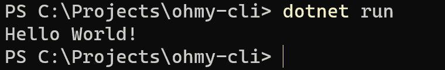
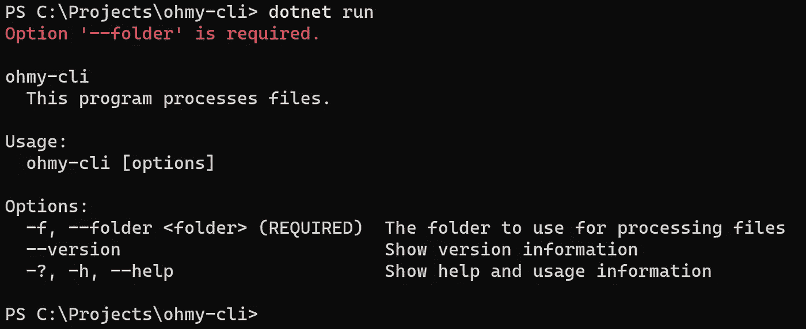
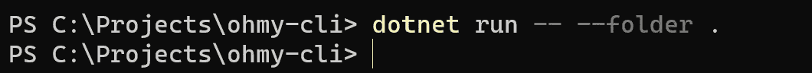
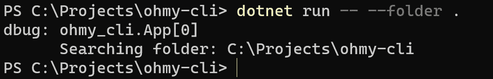

# 创建一个快速。NET 核心 CLI 与系统。命令行、日志记录和依赖注入。

> 原文：<https://levelup.gitconnected.com/create-a-quick-net-core-cli-with-system-commandline-logging-and-dependency-injection-e369b4491f78>

## 编写一个成熟的客户端。网芯不一定要难。


照片由[萨法尔·萨法罗夫](https://unsplash.com/@codestorm?utm_source=unsplash&utm_medium=referral&utm_content=creditCopyText)在 [Unsplash](https://unsplash.com/s/photos/code?utm_source=unsplash&utm_medium=referral&utm_content=creditCopyText) 上拍摄

有一天，我需要创建一个简单的命令行应用程序来做一些数据库管理工作。我有点完美主义(哼哼)所以对我来说，一个简单的 CLI 应该至少有以下特点:

*   强大的参数解析和验证
*   记录
*   易测性

最后一个，*可测性*，对我来说几乎就是*依赖注入*的同义词。我喜欢 DI 如何帮助以模块化的方式建立东西，因此允许你为你所做的一切编写适当的、隔离的单元测试。

。NET Core 附带了一个非常简单的 DI 框架。虽然有些人说它不够“强大”(不管那是什么意思)，但我没有找到转换到另一个框架的理由。

但是在我们深入 DI(正如您将看到的，它将使日志记录变得微不足道)之前，让我们解决第一个需求:健壮的参数解析和验证。为此，我们求助于[(在写作时，实验性的)系统。命令行](https://github.com/dotnet/command-line-api)包。

## 创建我们的 CLI

我可以写几段关于什么系统的文章。命令行是什么，它能做什么，但是我给你演示一下怎么样？

让我们从一个基本的控制台应用程序开始。在任何终端中(我强烈推荐新的 [Windows 终端](https://github.com/microsoft/terminal)，如果你在 Windows 上)，创建一个新项目:

```
mkdir ohmy-cli
cd ohmy-cli
dotnet new console
```

这给了我们一个标准。NET 核心命令行应用程序。也管用！只需在项目的根目录下输入`dotnet run`，瞧:



你好世界！

它甚至可以接受参数。但是离“健壮的参数解析和验证”还有很长的路要走。让我们改变这一点。

首先，添加系统。命令行包:

```
dotnet add package System.CommandLine --prerelease
```

注意到`--prerelease`参数了吗？这是必要的，因为系统。CommandLine 仍处于测试阶段。

用下面的代码替换`Main`方法和(我将在下面解释):

添加系统。命令行

在**第 3–9 行**中，我们创建了 CLI 的根，并添加了一个必需的参数`--folder`。我们还添加了一个别名`-f`和一个描述。

在**第 11 行**上，我们向我们的应用程序添加了一个描述。

在**第 13** 行，我们指定哪个方法将处理我们的输入，这是在**第 18–21**行定义的`RunApplication`方法。

最后，在第**行第 15** 行，我们用提供给我们的`Main`方法的参数运行程序。

当我们使用`dotnet run`运行这个函数时，我们得到的是:



你好 CLI！

那不是很漂亮吗？我们不仅得到了已定义选项`--folder`的处理、验证和文档，还得到一种获得应用程序版本和`--help`选项的方法(其输出与上面完全相同)。

提供所需的参数`--folder`，我们得到:



Hello CLI，带— folder 参数。

这还没有那么多，但证明了我们处理`--folder`参数很好。

仅使用目前的代码，我们就可以构建一个令人印象深刻的 CLI。例如，您可以添加[子命令](https://github.com/dotnet/command-line-api/blob/main/docs/How-To.md#Add-a-subcommand)或[制表完成](https://github.com/dotnet/command-line-api/blob/main/docs/Features-overview.md#Suggestions)。

但是随着你的程序变得越来越大(它会变得越来越大)，可测试性很快就会成为一个问题。事实上，我认为这从一开始就应该是一个问题，在它变好之前…一个问题。正如我在介绍中提到的，对我来说，可测试性实际上是依赖注入的同义词。这是因为依赖注入允许你孤立地测试程序的各个组件。让我们接下来解决这个问题。

## 添加依赖注入

首先我们需要添加微软的[。扩展. DependencyInjection](https://www.nuget.org/packages/Microsoft.Extensions.DependencyInjection) 包:

```
dotnet add package Microsoft.Extensions.DependencyInjection 
```

然后，在您的`Main`方法的顶部，添加:

这构建了将存储我们的依赖项并调用`ConfigureServices`来添加它们的服务提供者。

并添加了`ConfigureServices`方法:

**第 3 行**向服务提供者注册了`App`，这样我们以后就可以检索它了。

最后，将创建`CommandHandler`的行替换为:

**第 1 行**从 serviceprovider 检索已注册的`App`实例。然后我们将`Run`方法传递给**行 3** 中的 commandhandler。

这负责设置依赖注入。然而，当我们运行应用程序时，我们得到一个关于未定义`App`的错误。让我们解决这个问题。

我们现在使用 DI 将`App`注入我们的程序。所以让我们创建一个新文件`App.cs`:

我们也可以从`Program.cs`中移除`RunApplication`方法。

这就是依赖注入。这就给我们留下了*日志*，我保证这将是微不足道的。让我们开始吧。

## 添加日志记录

添加[微软。扩展. Logging](https://www.nuget.org/packages/Microsoft.Extensions.Logging) 包和分别记录到[控制台](https://www.nuget.org/packages/Microsoft.Extensions.Logging.Console/)和[调试](https://www.nuget.org/packages/Microsoft.Extensions.Logging.Debug/)流的包:

```
dotnet add package Microsoft.Extensions.Logging
dotnet add package Microsoft.Extensions.Logging.Console
dotnet add package Microsoft.Extensions.Logging.Debug
```

然后，改变`ConfigureServices`方法:

**第 4–9 行**配置我们的日志记录提供程序来记录调试消息，并写入控制台和调试流。

将日志注入`App.cs`:

**第 9–14 行**分别定义、注入和初始化我们的 Logger 属性。在第**行的第 18** 行，我们将文件夹参数的值写入日志。

现在，运行我们的应用程序，我们得到:



Hello CLI，带日志记录。

我将把格式化输出作为一个练习留给您。为什么不去看看[系列日志](https://www.nuget.org/packages/Serilog)？这是我的结构化日志记录包。

现在你知道了。用. net 编写的功能全面的 CLI。NET 核心，带有依赖注入和日志记录。相信我，创建应用程序比撰写本文花费的时间要少得多；)

我希望这能帮助你节省一些样板代码的时间(让我们承认这一点)，这样你就可以专注于实现你所想的任何令人惊叹的功能。

编码快乐！

如果您是技术文章的作者，并且使用 GitHub Gists(您应该这样做)，下面的故事可能对您有用。

 [## 在媒体中使用多文件 GitHub Gists

### 在 Medium 中使用多文件 GitHub Gists 是完全可能的，尽管有点麻烦。

erikbrgr.medium.com](https://erikbrgr.medium.com/using-multi-file-github-gists-in-medium-f4e40bb9e283) 

如果您使用 VSCode(我在本文中使用了 vs code)编写代码，您可能会喜欢这个故事:

[](https://erikbrgr.medium.com/essential-extensions-for-visual-studio-code-32eaec6c6054) [## Visual Studio 代码的基本扩展(还有一个好处！)

### 专注于你的代码，别无他求。

erikbrgr.medium.com](https://erikbrgr.medium.com/essential-extensions-for-visual-studio-code-32eaec6c6054)