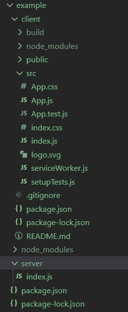

# 创建一个快速后端反应网站

> 原文：<https://levelup.gitconnected.com/create-a-react-app-with-an-express-backend-24740b0a6f5e>


乔安娜·科辛斯卡在 [Unsplash](https://unsplash.com?utm_source=medium&utm_medium=referral) 上的照片

开始一个新项目可能会很困难，有许多微小但至关重要的步骤。我希望能帮助你做一些非常基本的脚手架，让你尽快开始你的网站。我们将利用 create-react-app，稍微调整一下，给我们一个可以使用的后端服务器。

## 创建目录

首先，创建一个新目录，并通过运行以下命令输入它。

```
mkdir example
cd example
```

然后，运行这个命令，用一些基本信息初始化您的目录(去掉-y 将允许您手动输入这些信息):

```
npm init -y
```

## 创建后端

接下来，创建一个名为 server 的文件夹，并在其中创建一个名为 index.js 的文件..，但这里有一些快捷的命令来代替:

```
mkdir server
cd server
touch index.js
cd ..
```

现在我们有了一个 index.js，让我们安装 Express:

```
npm install express
```

在 index.js 中，像这样填充它:

```
const express = require('express');const path = require('path');const app = express();
// a test route to make sure we can reach the backend
//this would normally go in a routes fileapp.get('/test', (req, res) => {res.send('Welcome to the backend!')})//Set the port that you want the server to run onconst port = process.env.PORT || 8080;app.listen(port);console.log('App is listening on port ' + port);
```

我们希望能够用一个简单的命令运行我们的服务器，所以进入 package.json 脚本并添加这个启动脚本:

```
"scripts": {
    "server": "node server/index.js"
  },
```

此时，您应该能够通过键入`npm server`来运行服务器，它应该显示服务器正在监听指定的端口。前往`localhost:8080/test`查看我们的“欢迎来到后端”消息。现在让我们做前端。

## 创建反应前端

使用 create-react-app 的文档非常简单明了。一行代码将为我们提供开始工作所需的一切:

```
npx create-react-app client
```

`client`是我们希望 react 应用程序创建的位置的名称。因为我们希望我们的后端和前端分开，所以我们在网站目录(示例)中的一个单独的文件夹(客户端)中使用了`create-react-app`。

注意有[模板](https://www.npmjs.com/search?q=cra-template-*)可用于 create-react-app，你可以通过简单地运行`npx create-react-app <folder-name> <template-name>`来使用它们

此时，您的文件树应该如下所示:



## 将两者联系起来

我们需要做的最后一件事是确保我们的前端和后端可以通信。开发服务器运行在 localhost:3000(默认)上，我们的后端服务器运行在 localhost:8080 上。因为它们是不同的服务器，所以发送类似于`axios.get('/test')`的请求会将请求发送到 localhost:3000/test，而不是 localhost:8080/test。因此，进入**客户端/包. json** 并添加一个代理:

```
"proxy": "http://localhost:8080",
```

这个代理将告诉 React 任何对 localhost:3000 的未知请求都应该发送到 localhost:8080。现在，我们可以很容易地从前端向服务器发出请求。

为了测试这一点，我们可以在 App.js 中添加一个带有自定义功能的按钮:

```
<button onClick={hitBackend}>Send request</button>
```

这是它的功能:

```
const hitBackend = () => {axios.get('/test').then((response) => {console.log(response.data)})}
```

现在，单击该按钮将显示一个控制台日志“欢迎来到后端”，因此我们知道我们正在访问我们的服务器。

## 生活质量增加

您会注意到在这个设置中有两个 package.json 文件。这可能会变得乏味和混乱，因为您必须切换目录来完成每个`npm install`。所以我建议在 **root package.json** 中创建几个脚本，这样您就可以从那里做任何事情，而不必更改目录。

```
"scripts": {
"server": "node server/index.ts",
"client": "cd client && npm run start",
"build:client": "cd client && npm run build",
"iall": "npm i && cd client && npm i",
"startboth": "npm run server & npm run client"},
```

现在你可以不用改变目录就可以启动和构建客户端，运行`iall`将会安装在任何地方，所以你不会忘记在两个地方都这样做。`startboth`脚本将启动服务器并在后台运行它(因为&)，然后启动客户端。

你可能还想安装一个 linter，比如 eslint。您需要在**根目录和客户端**中完成这些步骤:

```
npm install -D  eslint
```

-D 将软件包作为开发人员依赖项安装，这意味着它将在您构建它时被清除，从而节省空间。接下来，运行

```
eslint --init
```

这将询问设置 eslint 配置文件的问题。问题很简单，以下是我对这个项目的偏好:

*   **您希望如何使用 ESLint？**检查语法，发现问题，加强风格
*   **您的项目使用什么类型的模块？** Javascript 模块(导入/导出)
*   **你的项目使用哪个框架？**做出反应
*   你的代码在哪里运行？两者皆有
*   你希望如何为你的项目定义一种风格？空中食宿
*   你希望你的配置文件是什么格式？ JSON

运行之后，您应该会看到两个. eslintrc.json 文件，如果您在文件中犯了错误，它们会用红色下划线标出。

至此，我们已经做好了一切准备，所以我们可以开始编码了。在删除 create-react-app 附带的一些文件后，我将把这个例子保存为一个模板，这样当您需要启动另一个 react 应用程序时，就可以快速克隆它。这样你就不会每次都花时间去创建一个新的应用程序。我希望本指南对您有所帮助，并为您节省了一些时间。