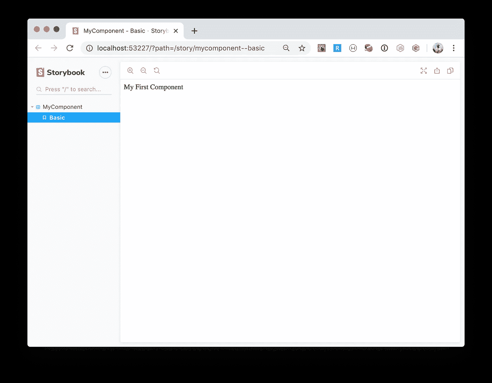

# 用类型脚本和故事书创建一个 React 组件库

> 原文：<https://levelup.gitconnected.com/create-a-react-component-library-with-typescript-and-storybook-ed28fc7511f2>


照片由[莎伦·麦卡琴](https://www.pexels.com/@mccutcheon?utm_content=attributionCopyText&utm_medium=referral&utm_source=pexels)从 [Pexels](https://www.pexels.com/photo/art-materials-art-supplies-blocks-blur-1148496/?utm_content=attributionCopyText&utm_medium=referral&utm_source=pexels) 拍摄

代码的可重用性很重要，而组件的可重用性在用户界面开发中非常重要。用户对用户界面的变化非常敏感。跨应用程序重用组件会给它们带来更好的整体体验。

您不一定需要 TypeScript 来创建 React 组件库，但是添加它将使您的库更加健壮，并且拥有类型定义肯定会提高可重用性因素和开发人员体验。此外，您的库用户将更容易将它集成到他们的应用程序中。

# 起始基地

组件库就像任何其他的 NPM 模块。我们可以从常规的打字稿 NPM 模块开始。(----------|----------|----------|----------|----------|-------------------|
All files | 100 | 100 | 100 | 100 | |
index.ts | 100 | 100 | 100 | 100 | |
----------|----------|----------|----------|----------|-------------------|
Test Suites: 1 passed, 1 total
Tests: 1 passed, 1 total
Snapshots: 0 total
Time: 1.787s
Ran all test suites.
✨ Done in 2.71s.

初始化 git repo 并添加一个`.gitignore`文件:

```
$ git init
$ echo 'node_modules/
coverage/' > .gitignore$ git status
On branch masterNo commits yetUntracked files:
 (use "git add <file>..." to include in what will be committed) .gitignore
    .prettierignore
    build/
    package.json
    rollup.config.js
    src/
    tsconfig.json
    yarn.locknothing added to commit but untracked files present (use "git add" to track)
```

# 转换为 ReactJS 模块

首先添加 ReactJS 作为对等依赖项。这将向您的模块用户表明这个包依赖于 ReactJS 的这个版本:

```
$ yarn add --peer **react@^16 react-dom@^16**
```

*首先添加对等依赖项，否则如果同一个包已经安装为开发依赖项，yarn 不会添加它们(*[*https://github.com/yarnpkg/yarn/issues/5287*](https://github.com/yarnpkg/yarn/issues/5287)*)*

添加反应堆开发依赖项+类型:

```
$ yarn add -dev **react react-dom** **@types/react @types/react-dom**
```

## 汇总设置

Rollup 需要一些更改来支持外部依赖项。因为我们不想将 react 库代码与我们自己的代码一起发布。

```
import typescript from 'rollup-plugin-typescript2'
import commonjs from 'rollup-plugin-commonjs'
import external from 'rollup-plugin-peer-deps-external'
import resolve from 'rollup-plugin-node-resolve'import pkg from './package.json'export default {
  input: 'src/index.ts',
  output: [
    {
      file: pkg.main,
      format: 'cjs',
      exports: 'named',
      sourcemap: true
    },
    {
      file: pkg.module,
      format: 'es',
      exports: 'named',
      sourcemap: true
    }
  ],
  plugins: [
    external(),
    resolve(),
    typescript({
      rollupCommonJSResolveHack: true,
      exclude: [
        '**/__tests__/**'
      ],
      clean: true
    }),
    commonjs({
      include: ['node_modules/**'],
      **namedExports: {
        'node_modules/react/react.js': [
          'Children',
          'Component',
          'PropTypes',
          'createElement'
        ],
        'node_modules/react-dom/index.js': ['render']
      }**
    })
  ]
}
```

## 添加第一个组件:

为组件创建一个文件夹:

```
$ mkdir src/components
```

这个组件代码:

src/components/MyComponent.tsx

让我们也修改一下`index.ts`文件，只导入/导出我们仅有的一个组件:

src/索引. ts

此时，我们可以构建我们的模块，并将组件(从`index.ts`导出)构建到`build`文件夹中，包括类型化。

```
$ yarn build
```

## 当然是测试。

为了测试 React 组件，我们将使用惊人的:`@react-testing`库:

```
$ yarn add --dev **@testing-library/react @testing-library/jest-dom**
```

更改`package.json`文件的几个设置:

```
{
  "name": "my-module",
  "version": "1.0.0",
  "description": "",
  "main": "build/index.js",
  "module": "build/index.es.js",
  "jsnext:main": "build/index.es.js",
  "scripts": {
    "build": "rollup -c",
    "lint": "standard",
    "format": "prettier-standard --format",
    "test": "jest --coverage"
  },
  "keywords": [],
  "author": "",
  "license": "ISC",
  "devDependencies": {
    "[@testing](http://twitter.com/testing)-library/jest-dom": "^4.2.4",
    "[@testing](http://twitter.com/testing)-library/react": "^9.4.0",
    "[@types/jest](http://twitter.com/types/jest)": "^24.0.24",
    "[@types/react](http://twitter.com/types/react)": "^16.9.17",
    "[@types/react-dom](http://twitter.com/types/react-dom)": "^16.9.4",
    "jest": "^24.9.0",
    "react": "^16.12.0",
    "react-dom": "^16.12.0",
    "rollup": "^1.27.13",
    "rollup-plugin-commonjs": "^10.1.0",
    "rollup-plugin-node-resolve": "^5.2.0",
    "rollup-plugin-peer-deps-external": "^2.2.0",
    "rollup-plugin-typescript2": "^0.25.3",
    "standard": "^14.3.1",
    "standard-prettier": "^1.0.1",
    "ts-jest": "^24.2.0",
    "typescript": "^3.7.3"
  },
  "peerDependencies": {
    "react": "^16",
    "react-dom": "^16"
  },
  "jest": {
    "preset": "ts-jest",
    **"testEnvironment": "jsdom",
    "testPathIgnorePatterns": [
      "build/"
    ]**
  },
  "standard": {
    "ignore": [
      "node_modules/",
      "build/"
    ],
    **"globals": [
      "describe",
      "it",
      "test",
      "expect",
      "afterAll",
      "jest"
    ]**
  }
}
```

这里最重要的是:

*   jsdom 是一个类似浏览器的测试环境
*   `testPathIgnorePatterns=[build/]`:因此`build`文件夹在测试中被忽略
*   标准的`globals`:这些是我们测试中使用的全局词，所以林挺标准不会抱怨它们。

还有对我们`MyComponent`的一个考验:

src/components/_ _ tests _ _/my component . spec . tsx

*删除包含旧测试的旧* `*src/__tests__*` *文件夹，因为我们不再拥有旧模块功能。*

```
$ yarn test
yarn run v1.17.3
$ jest --coverage
 PASS  src/components/__tests__/MyComponent.spec.tsx
  ✓ Renders (55ms)------------------|----------|----------|----------|----------|-------------------|
File              |  % Stmts | % Branch |  % Funcs |  % Lines | Uncovered Line #s |
------------------|----------|----------|----------|----------|-------------------|
All files         |      100 |      100 |      100 |      100 |                   |
 src              |      100 |      100 |      100 |      100 |                   |
  index.ts        |      100 |      100 |      100 |      100 |                   |
 src/components   |      100 |      100 |      100 |      100 |                   |
  MyComponent.tsx |      100 |      100 |      100 |      100 |                   |
------------------|----------|----------|----------|----------|-------------------|
Test Suites: 1 passed, 1 total
Tests:       1 passed, 1 total
Snapshots:   0 total
Time:        1.297s, estimated 2s
Ran all test suites.
✨  Done in 2.01s.
```

# 故事书

Storybook 是一个为 React([https://storybook.js.org/](https://storybook.js.org/))开发独立 UI 组件的开源工具

在开发组件库时，拥有一个可以用不同的属性集和上下文实例化和可视化组件的工作台是非常有用的。此外，完成后，您还可以记录组件的使用情况。

```
$ yarn add --dev **babel-loader @babel/core @storybook/react awesome-typescript-loader**
```

在根文件夹上创建一个. storybook 文件夹来保存配置。

```
$ mkdir .storybook
```

创建以下文件:

。故事书/config.js

。storybook/webpack.config.js

第一个故事:

src/components/my components . stories . tsx

```
$ yarn storybook
```

将自动打开:



故事书

# 结论

*   从常规的 NPM 模块开始，添加 ReactJS 依赖项
*   总是添加测试。使用`@testing-library`会有所帮助。
*   添加故事书是可选的，但完全推荐。

黑客快乐…

更新:你可以重用这个帖子的代码:[https://github.com/outsrc/my-components](https://github.com/outsrc/my-components)(设置为模板回购更容易重用)