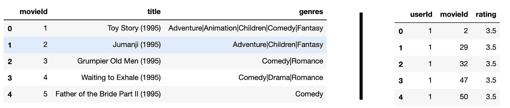
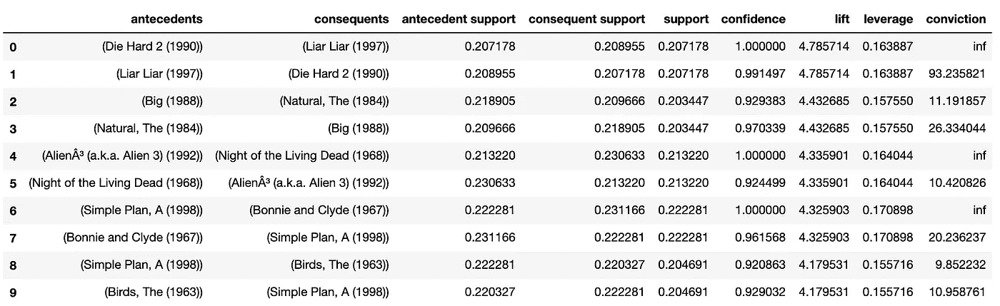

# 用 Python 创建推荐系统

> 原文：<https://levelup.gitconnected.com/create-a-recommendation-system-in-python-d7a95b2837ab>

## ARM 简介，后面是一个编码示例

## 使用关联规则挖掘来揭示模式

## 什么是关联规则挖掘(ARM)？

这是一种无监督的机器学习方法，旨在揭示数据集中有趣的模式和关系。例如，我们可以尝试识别哪些产品通常是顾客在杂货店一起购买的。这可以帮助我们安排商店中的产品，推荐产品，或创造出有高概率被顾客挑选的新产品。单个产品称为 ***项目*** 、而一组项目一起购买称为 ***交易*** 。一组事务被称为一个 ***数据库*** 。项目的子集称为一个 ***项目集*** 。

## 它是如何工作的？

顾名思义，我们试图根据交易的历史找到类似于`{Milk} -> {Bread}`或`{Screwdriver, Screws} -> {Butter}`的规则。左手边(LHS)称为 ***前件*** ，右手边(RHS)称为 ***后件*** 。这个规则隐含着*而不是*的因果关系。**

## **我们如何衡量趣味性？**

**有几个有趣的衡量标准。我们将基于该数据库来解释它们，其中每行代表一个事务:**

**# 1:{牛奶，面包，糖果}
# 2:{牛奶，黄油}
# 3:{面包，糖果}
# 4:{牛奶，面包}
# 5:{牛奶，面包}**

**我们试图测量这个规则`X -> Y`的有趣性，这里 X 和 Y 是项目的集合。**

*   ****Support:** 它是 union 项集(X U Y)的出现次数除以数据库中的事务总数。它表明*该项目集在数据库中的传播程度。*
    **
*   ****置信度:**用联合项集出现的次数除以 LHS 出现的次数来度量。换句话说，它是联合项集的支持度，除以 LHS 集的支持度。它衡量规则被发现为真的频率。
    `Conf({Milk} -> {Bread})= Supp({Milk, Bread})/Supp({Milk} = 0.6/0.8 = 0.75`**
*   ****Lift:** 它是用联合项目集的支持度除以 X 和 y 各自的支持度的乘积来度量的。它度量的是*这两个集合相互依赖的程度。提升值 1 表示独立，提升值> 1 给出它们一起出现的程度，提升值< 1 给出它们否定彼此存在的程度。* `Lift({Milk} -> {Bread})
    = Supp({Milk, Bread})/ ( Supp({Milk}) * Supp({Bread}) )
    = 0.6/(0.8 * 0.8) = 0.9375`**
*   ****杠杆:**其测量方法与**提升**相同，但不是除以两个单独支撑值的乘积，而是从其联合集的*支撑*中减去它们的乘积。该指示与**提升**相同，但它相对于零而不是一。
    `Leverage({Milk} -> {Bread})
    = Supp({Milk, Bread} — ( Supp({Milk} * Supp({Bread}) )
    = 0.6 — (0.8 * 0.8) = -0.04`**
*   ****定罪:**用 RHS 的缺席`1-Supp(Y)`除以规则被发现为假的频率
    `1-Conf(X->Y)`来衡量。这个衡量*如何*如何*频繁的规则会给出一个错误的预测。* `Conv({Milk} -> {Bread})
    = (1-Supp({Bread})) / (1-Conf(X->Y))
    = 0.8 / 0.75 = 1.066`**

## **它有哪些可能的用例？**

*   **你可以解开模式，共现和行为模式。**
*   **向顾客推荐商品。比如:
    基于观看历史的电影。
    基于订单历史的产品。基于技能和经验的工作。**
*   **找到新的物品分类方法的能力。**

## **整件事怎么做？**

**幸运的是，有些算法会替你尝试规则的所有项目集组合。他们试图通过选择支持的最小阈值或项目的数量来尽可能优化它。Apriori 算法是执行 ARM 的算法的一个例子。还有其他算法也可以做到这一点(FP-growth 算法，OPUS Search)，但我们将使用 Apriori 进行演示。你可以在这里详细了解它[。](https://www.youtube.com/watch?v=WGlMlS_Yydk)**

# **一个使用电影数据集的例子！**

**本例将使用一个由不同用户评分的电影数据集，评分范围为 1-5，5 表示最积极。我们试图达到的目的是根据人们喜欢的电影向他们推荐电影。我们将进行一对一的挖掘(一个项目在 LHS，一个项目在 RHS)。**

## **要求:**

*   **数据集表格；从[这里](https://drive.google.com/drive/folders/15mWLJIcwlS7Rb2MLtsUvvx5ORJ4XpKDF?usp=sharing)下载。
    一个文件有关于电影的一般数据。
    另一个文件具有关于电影的分级数据。**
*   **一个 Python 环境，带有:
    `pandas==1.0.1` `mlxtend==0.17.1`
    它可能与那些包的其他版本一起工作。**

## **编码:**

**第一步是导入熊猫并加载两个表。然后，我们将创建电影 Id 和标题之间的映射。当我们用数字代替字符串时，映射将使挖掘更有效。**

**每个表看起来是这样的:**

****

**电影(左)和分级(右)**

**现在，就像以前一样，我们想要创建事务(项集)。以前，我们将产品作为单一交易一起购买。在本例中，单个事务是同一用户喜欢的一组电影，因此，在本例中，每个事务将代表一个用户。此外，因为我们希望获得他们喜欢的电影，但不是他们观看的所有电影，所以我们将保留评级为 4 或 5 的电影。**

**我们预处理的最后一步是将事务转换成二进制表示(类似于一次性编码)。如果一个项目出现在交易中，那么它被标记为 1，否则，它被标记为 0。为此，我们使用来自`mlextend.preprocessing`的`TransactionEncoder`:**

**最后，我们将使用`apriori`算法来最优地找到项目集的支持值，并使用`association_rules`来计算有趣的规则。可以增加`min_support`有更可靠的发现。您可以增加`max_len`,使每个项目集包含 1 个以上的项目。此外，您可以将该指标的`metric`和`min_threshold`更改为您认为符合需求的任何值。**

**`rules`是一个数据框架，我们可以按`metric`(在本例中为`lift`)对其进行排序，并显示前 10 个结果。**

****

**正如你所看到的，我们的发现(可以调整)表明，你可以向喜欢**、【虎胆龙威 2】、**的人推荐**、【骗子骗子】、**，反之亦然。这是基本的，可以通过更深入地研究指标、阈值和确保事情不是偶然发生的来进一步改进。**

## **那都是乡亲们！**