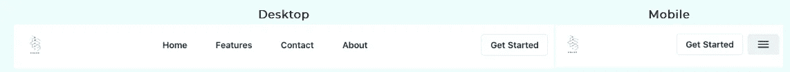
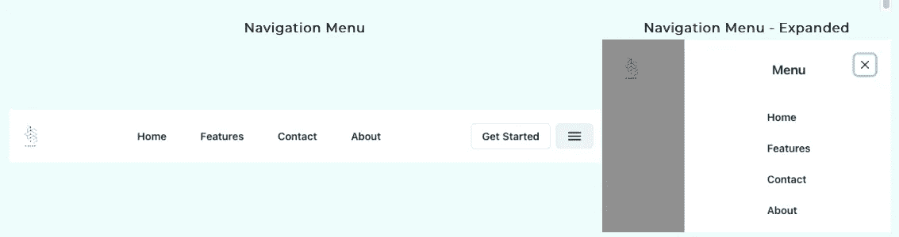
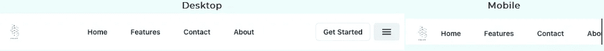
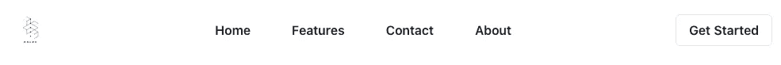
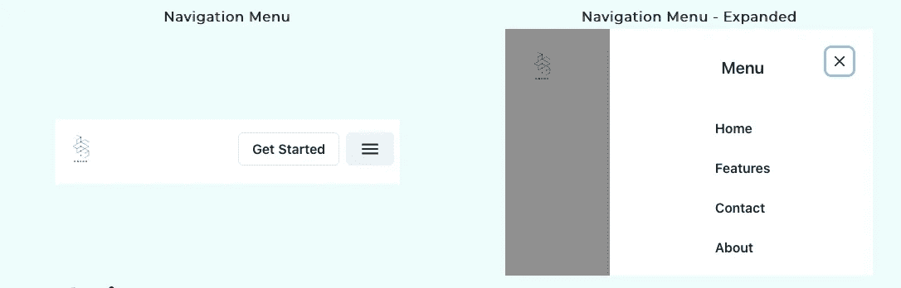

# 使用 ChakraUI 创建响应式导航条

> 原文：<https://levelup.gitconnected.com/create-a-responsive-navigation-bar-using-chakraui-6489473e933>


# 介绍

我们都知道导航栏对于网站来说有多重要。但是大多数网站都没有一个好的。为什么？因为导航条的响应式设计并不容易。

# 导航栏有什么不同？

通常，当我们使用 ChakraUI 构建[响应式布局](https://chakra-ui.com/docs/layout/stack#responsive-direction)时，常见的方法是对于较大的设备将组件水平堆叠，对于较小的设备将组件垂直堆叠。这种方法不适用于导航栏。典型的导航栏包含以下组件:

*   标志；徽标
*   导航菜单
*   行动号召按钮



根据设备类型，我们需要重新排列项目。我们将通过 3 个步骤来了解如何构建上面的导航栏:

1.  构建桌面版本
2.  构建移动版本
3.  让它有反应

# 构建桌面版本

桌面版本很容易理解。用属性值为“空格”的`justify`将所有元素包装在一个`Flex`中。为了在导航栏项目之间获得均匀的间距，我们将在一个`HStack`组件中列出它们。

```
import {  Image, Flex, Button,  HStack , chakra } from '[@chakra](http://twitter.com/chakra)-ui/react';
import Logo from '../public/logo.svg';
import {Link} from 'react-scroll'
import data from './header.data';
import React from "react";const CTA = "Get Started"export default function Header() {
  return (
    <chakra.header id="header">
      <Flex
        w="100%"
        px="6"
        py="5"
        align="center"
        justify="space-between"
      >
       // Logo
        <Image src={Logo.src} h="50px" />

  // Nav Items
        <HStack as="nav" spacing="5">
          {data.map((item, i) => (
            <Link key={i}>
              <Button variant="nav"> {item.label} </Button>
            </Link>
          ))}
        </HStack>// Call to action items
        <HStack>
          <Button>
            {CTA}
          </Button>
        </HStack>

      </Flex>
    </chakra.header>
  );
}
```

# 构建移动版本

1.  ChakraUI 提供了[抽屉组件](https://chakra-ui.com/docs/overlay/drawer)，这是一个从屏幕边缘滑出的面板。对于移动版本，我们可以将所有导航项目放在抽屉的主体内。

```
import React from 'react';
import { Drawer, DrawerBody, DrawerFooter, DrawerHeader, DrawerOverlay, DrawerContent,
  DrawerCloseButton, Flex, Text
} from "[@chakra](http://twitter.com/chakra)-ui/react";export default function DrawerExample({
const p = 15;
  placement = "right",
  width,
  isOpen,
  children,
  onClose,
  btnRef,
  title = "Menu",
  footer,
}) {
  return (
    <Flex w={width}>
      <Drawer
        isOpen={isOpen}
        placement={placement}
        onClose={onClose}
        finalFocusRef={btnRef}
      >
        <DrawerOverlay />
        <DrawerContent alignItems="center">
          <DrawerCloseButton alignSelf="end" mx={p} my={p} />
          <DrawerHeader my={p}>
            <Text as="p"> {title} </Text>
          </DrawerHeader>
          <DrawerBody>{children}</DrawerBody>
          <DrawerFooter>{footer}</DrawerFooter>
        </DrawerContent>
      </Drawer>
    </Flex>
  );
}
```

2.我们将使用 useRef react 钩子在菜单图标和抽屉之间进行通信。如果你不知道这个钩子或者需要刷新你的记忆，那么看看 Dmitri Pavlutin 的 React useRef 指南。

```
import { useDisclosure, Flex, Box, Button,  VStack, Icon, HStack, Link as ChakraLink } from "[@chakra](http://twitter.com/chakra)-ui/react";
import Drawer from './drawer';
import {  IoMdMenu } from 'react-icons/io';
import { Link } from 'react-scroll';
import data from './header.data';
import React from "react";export default function MobileDrawer() {
    const { isOpen, onOpen, onClose } = useDisclosure();
    const btnRef = React.useRef();return (
    <Flex >
  // Menu Button
      <Button ref={btnRef} onClick={onOpen}>
        <IoMdMenu size="26px" />
      </Button>

      // Drawer Component
      <Drawer
        isOpen={isOpen}
        onClose={onClose}
        finalFocusRef={btnRef}
      >
        <VStack alignItems="left">
          {data.map((item, i) => (
            <Link key={i}>
              <Button variant='text' > {item.label} </Button>
            </Link>
          ))}
        </VStack>
      </Drawer>
    </Flex>
  );
};
```

3.最后，我们可以在`header.js`文件中的 CTA 按钮旁边添加`MobileDrawer`组件。

```
// Call to action items
        <HStack>
          <Button aria-label={CTA} variant="outline">
            {CTA}
          </Button>
          <MobileDrawer />
        </HStack>
```



# 让它有反应



所有困难的部分都过去了。现在我们只需要根据屏幕大小隐藏某些组件。多亏了 ChakraUI，使用`display`属性变得前所未有的简单。

1.  通过将`display={{ base: "flex", md: "none" }}`添加到桌面版本中的`Flex`组件中，隐藏桌面版本中的`MobileDrawer`组件。
2.  通过添加`display={{ base: "none", md: "flex" }}`隐藏移动版本中`HStack`组件内列出的导航项目。

# 最终桌面版本:



# 最终移动版本:



# 结论

导航条是那些开始看起来很吓人的东西之一，但是一旦你找到一个好的例子，它就不会那么难构建了。希望这篇文章对你有用。更多此类帖子，请通过 [Twitter](https://twitter.com/6aravind) 关注/DM 我

# 类似文章

[使用查克拉伊制造感应卡](https://www.raravind.com/blog/web-development/create-responsive-cards)

【https://www.raravind.com】最初发表于[](https://www.raravind.com/blog/web-development/responsive-navigation-bar-using-chakraui)**。**