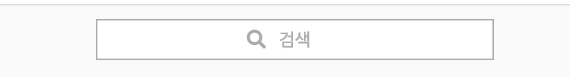

# 使用 Vanilla JS 创建搜索栏

> 原文：<https://levelup.gitconnected.com/create-a-search-bar-using-vanilla-js-af56c80c949a>


我正在使用 Vanilla JS 做一个 Instagram 克隆项目，这篇文章是关于创建一个搜索栏的。Instagram 有一个搜索栏，点击时会移动其占位符和图标，并在搜索框右侧生成一个取消(X)图标。此处提供了图片:



默认


点击时

应该有许多其他可能更有效的方法，但我主要侧重于熟悉 JS 中的主要方法。

```
const searchIcon = document.getElementById(“search-icon”);
const searchInput = document.getElementById(“search-input”);
const cancelIcon = document.getElementById(“cancel-icon”);searchInput.addEventListener(“click”, moveSearchBarElements);function moveSearchBarElements() {
searchIcon.id = “search-icon-moved”;
searchInput.id = “search-placeholder-moved”;
cancelIcon.id = “cancel-icon-enabled”;document.addEventListener(
“click”,function (e) {
  const isClickedInside = searchInput.contains(e.target);
  *if* (!isClickedInside) {
      searchIcon.id = “search-icon”;
      searchInput.id = “search-input”;
      cancelIcon.id = “cancel-icon”;
      searchInput.value = “”;
       }
   });
}
```

1.  首先，我必须为 HTML 元素设置变量——搜索图标、搜索输入和取消图标。在这里，我有`id`属性，但是`class`可能更好，有多个元素共享同一个类。
2.  所以，我们正在改变搜索栏“点击”时的外观。因此，我们需要执行带有`"click"`的`addEventListener()`和下面的功能`moveSearchBarElements`。
3.  点击后，执行`moveSearchBarElements`功能。首先，我更改了三个变量的`id`，更改后的`id` s — `search-icon-moved`、`search-placeholder-moved`和`cancel-icon-enabled`都在 css 文件中设置了它们的 css 属性。通过将它们更改为这些 id，将应用它们的位置、显示等。
4.  然后，我添加了另一个`addEventListener`来删除搜索输入中的搜索值，并使搜索栏元素(图标、占位符)在搜索输入之外被单击后回到它们的初始位置。这个函数有一个参数`e`或`event`，因为我们需要检查事件(点击)的`target`是否在搜索输入中。然后，我添加了`if`语句，说明如果没有在输入中单击它，元素的`id`将返回到输入被单击之前的状态，并且`searchInput.value`将被设置为空。