# 创建一个没有代码的自助式客户支持聊天机器人

> 原文：<https://levelup.gitconnected.com/create-a-self-service-customer-support-chatbot-without-code-9991c193b3f0>


[亚历山大·奈特](https://unsplash.com/@agk42?utm_source=unsplash&utm_medium=referral&utm_content=creditCopyText)在 [Unsplash](https://unsplash.com/?utm_source=unsplash&utm_medium=referral&utm_content=creditCopyText) 上拍照

## 咖啡店里的编码

## 如何使用来自 Infobip Answers 等平台的低代码和无代码聊天机器人解决方案

帮助用户自助是客户支持团队能够取得的最大胜利之一。当这种情况发生时，支持的票证更少，用户可以快速获得他们的答案。事实上，美国运通在[进行的一项研究发现，超过 60%的消费者表示，他们进行简单查询的“首选渠道”是数字自助服务解决方案(在线聊天、语音回复、网站或手机应用程序)。](https://www.businesswire.com/news/home/20171215005416/en/)

考虑到这一点，聊天机器人是大规模提供自助服务的理想工具。然而，对于门外汉来说，构建聊天机器人可能会令人生畏。这是 Infobip 的[回答](https://www.infobip.com/docs/answers)平台寻求解决的问题。有了答案，您可以创建基于关键字的智能聊天机器人，从而提高客户满意度并直接降低运营成本——并且您可以通过无代码的 web GUI 来实现这一切。

在本文中，我们将帮助您构建您的第一个聊天机器人，它可以通过使用 WhatsApp 与最终用户交流来解决现实世界中的客户问题。如果你不用 WhatsApp 做支持，也不用担心。Answers 支持多种[其他通信渠道](https://www.infobip.com/docs/answers#available-channels)，包括短信和实时聊天。

# 如何不用代码创建一个 WhatsApp 自助客服聊天机器人

在我们的例子中，我们将创建一个聊天机器人来帮助难以找到的餐馆的顾客。他们有很棒的食物，每个人都知道他们的 WhatsApp 联系电话，但人们就是找不到餐厅的位置。有时，给餐馆发信息的人也想要一份菜单和关于他们奖励计划的信息。

在我们进行的过程中，您可以随意用自己的工作流替换我们特定的餐厅用例。重要的是，你对设计带有答案的聊天机器人与人对话有了一种感觉。

## 先决条件

要遵循本教程并创建您的第一个工作聊天机器人，您需要的只是一个 Infobip [试用帐户](https://www.infobip.com/signup)。你甚至可以免费试用 [WhatsApp 频道](https://www.infobip.com/docs/whatsapp)，这样你就可以用手机测试你的聊天机器人了。

虽然这不是必须的，但我们建议仔细阅读[对话设计](https://www.infobip.com/docs/answers/conversation-design-and-how-to-approach-it)，以帮助你从答案中获得最大收益。

# 步骤 1:定义用户痛点

在你开始创建一个自助聊天机器人之前，清楚地定义你想要解决的用户痛点是很重要的。在我们的案例中，我们有这些棘手问题:

1.  用户想去我们的餐厅，但不知道地址
2.  用户想要一个菜单，但不知道在哪里可以找到它
3.  用户希望获得奖励，但不知道在哪里注册

请注意，对于这些棘手问题中的每一个，一条信息就可以帮助用户解决他们的问题。这就是为什么他们是我们第一个自助聊天机器人的绝佳候选人。如果您刚刚开始使用自助聊天机器人，请寻找像这样定义明确且简单的痛点。然后，在学习的过程中处理更复杂的案例。

# 第二步:为你的机器人创建一个答案大纲

一旦你对棘手问题有了一个清晰的定义，就可以勾勒出你的聊天机器人如何解决这些问题。

因为我们一直在手动回复这些 WhatsApp 的消息，所以我们非常清楚我们的用户需要什么样的答案。

我们的机器人将:

1.  向想知道方向的用户提供餐馆的地址和谷歌地图链接。
2.  向需要菜单的用户提供链接。
3.  向想要注册奖励的用户提供注册页面链接。

鉴于我们手动回答这些问题的经验，我们知道提供这些链接将直接解决用户的痛点。

# 步骤 3:登录并创建聊天机器人

现在，我们可以开始设计我们的聊天机器人。

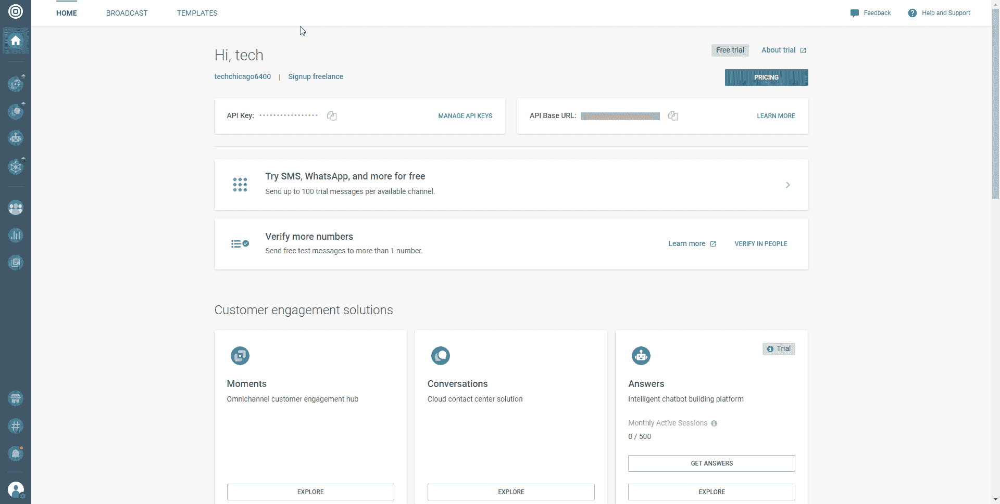

1.  登录 [Infobip 门户](https://portal.infobip.com/login/)。
2.  点击左侧菜单中的**答案**。
3.  点击**新建聊天机器人**按钮。
4.  填写**配置您的聊天机器人**弹出窗口中的字段(确保在**频道**下拉菜单中选择 *WhatsApp* )，然后点击**创建聊天机器人**。

# 第四步:创建你的关键词

现在，我们将创建[关键词](https://www.infobip.com/docs/numbers/keywords-and-actions#:~:text=Keywords%20are%20words%20in%20the,based%20on%20pre%2Ddefined%20keywords.)，这将帮助我们的机器人正确地转移对话。

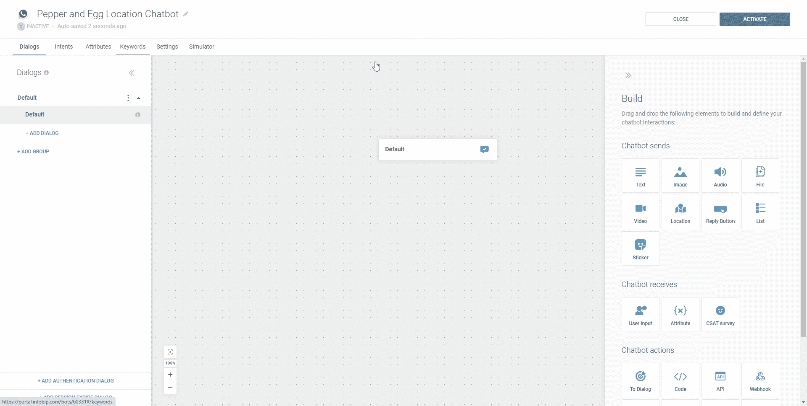

1.  点击**关键字**选项卡。
2.  点击**添加关键字。**
3.  键入一个**关键字**。对于我们的例子，我们将使用*位置*。
4.  为关键字键入至少一个**同义词**。同义词将触发与关键字相同的逻辑。在每个同义词后按 enter 键，并在完成后单击检查图标。对于我们的*位置*关键字，我们将使*方向*和*地址*成为同义词。
5.  对您计划使用的每个关键字重复第二步到第五步。在我们的例子中，我们知道我们计划提示用户输入 1 表示“是”或 2 表示“否”。我们还需要关键字来知道何时向用户发送我们的菜单或奖励计划的链接，因此我们的最终列表如下所示:

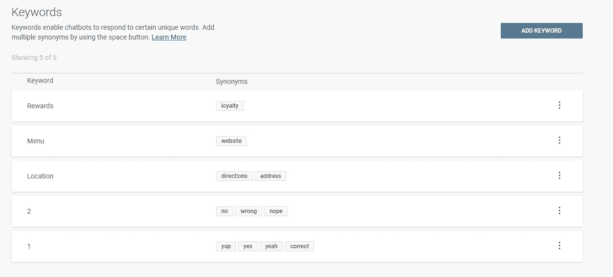

# 第五步:创建你的对话

现在，我们可以开始创建与用户交互的对话框。在这一步，我们将使用我们的难点及其相应的答案来开始设计我们的对话。

我们的例子将由这六个对话框组成。下面是对每一个的简要描述:

```
+======================+===========================================+
|   Our dialog name    |              Description                  |
+======================+===========================================+
| Default              | The default dialog when a user sends a    |
|                      | message. We’ll modify it to greet the     |
|                      | user and forward them to “Send location", |
|                      | “Send menu”, or “Send rewards info" based |
|                      | on user input.                            |
+----------------------+-------------------------------------------+
| Send location        | Sends the user a Google Maps link and     |
|                      | address, then proceeds to the “Ask to end |
|                      | chat” dialog.                             |
+----------------------+-------------------------------------------+
| Send menu            | Sends the user a link to an online menu,  |
|                      | then proceeds to the “Ask to end chat”    |
|                      | dialog.                                   |
+----------------------+-------------------------------------------+
| Send rewards info    | Sends the user a link to create a rewards |
|                      | account, then proceeds to the “Ask to end |
|                      | chat” dialog.                             |
+----------------------+-------------------------------------------+
| Ask to end chat      | Asks the user if they need anything else, |
|                      | then ends chat or forwards to “User wants |
|                      | more info” based on user input.           |
+----------------------+-------------------------------------------+
| User wants more info | Asks the user “How else can I help?” then |
|                      | forwards them to “Send location”, “Send   |
|                      | menu”, or “Send rewards info” based on    |
|                      | user input.                               |
+----------------------+-------------------------------------------+
```

**默认**对话框已经存在，所以开始时，我们将创建另外五个:

1.  点击**对话框**标签。
2.  点击**+添加对话框。**
3.  点击铅笔图标编辑对话框名称，添加一个对话框名称(如*发送位置*，然后点击检查图标。
4.  对剩余的对话框名称重复第二步和第三步。完成后，列表应该如下所示:

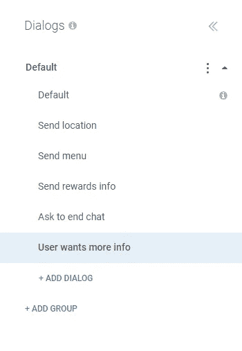

# 步骤 6:配置对话框

现在我们已经创建了对话框，我们将配置每个对话框来匹配我们想要的对话流。

## 配置默认对话框

根据我们的基本聊天机器人逻辑，**默认**对话框将会欢迎任何给我们聊天机器人发消息的人。我们会给用户三个选项供选择，如果我们的聊天机器人不理解用户，我们会退回到转移到代理。要设置此默认消息，请按照下列步骤操作:

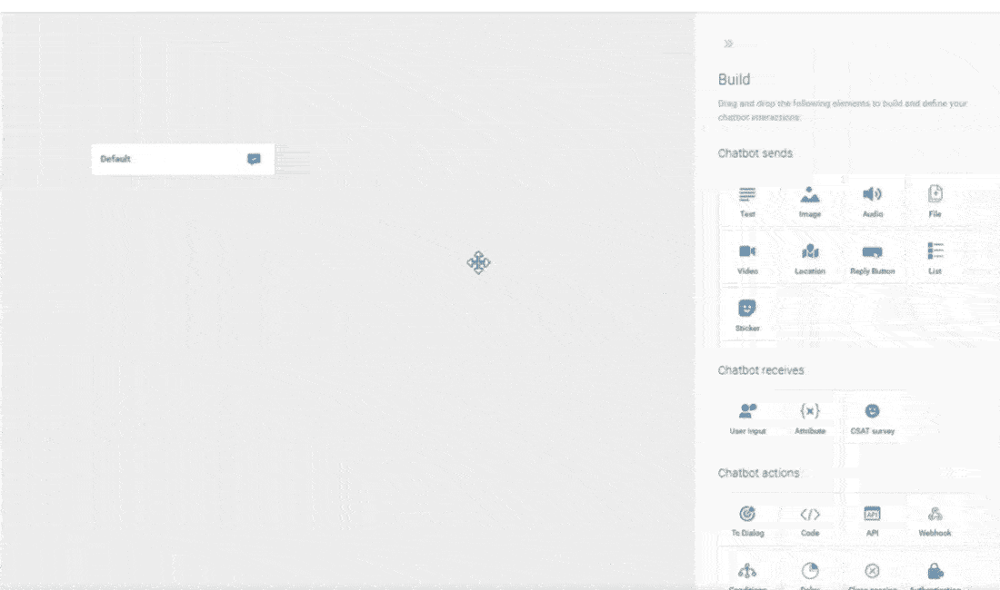

1.点击左侧菜单中的*默认*对话框。

2.将一个**文本**元素拖到画布上。

3.在**消息 1** 框中输入欢迎消息。对于我们的示例，我们将使用以下文本:

```
Hello!

I'm but a simple bot, but I'm here to help! 

What can I do for you?

Type the name of an option:

* "Location"-  Our address and directions
* "Menu"- Get our menu
* "Rewards" - Sign up for our rewards club
```

4.将**用户输入**元素滑动到画布上。

5.点击**+添加关键字映射**，选择*位置*。注意:如果之前没有创建关键字，现在可以通过点击 **+新建关键字**来创建。

6.重复上一步添加*菜单*和*奖励*关键字。

7.将一个**拖到三个用户输入块下的对话框**元素中。

8.单击画布中的**用户输入**元素。然后，在右边的构建面板中，向下滚动到**重复**部分。将**重复计数**设置为 *1* 。然后，在**重复消息(可选)**文本框中键入一条消息，以便机器人在不理解用户输入时发送。在我们的例子中，我们将使用:

```
Sorry, I misunderstood.
Type one of the options in quotes and I'll do my best to help!
* "Location"-  Our address and directions
* "Menu"- Get our menu
* "Rewards" - Sign up for our rewards club
```

9.*📝注意:Answers 与 Infobip*[*Conversations*](https://www.infobip.com/docs/conversations)*集成，用于升级到 info bip 云联系中心。如果你不打算使用对话，你可以绕过这个步骤或者配置一个不同的* ***回退动作*** *。*

向下滚动到构建面板中的**回退操作**，并将下拉菜单更改为*与代理*连接。如果我们的聊天机器人在对**重复消息**做出响应后无法理解用户输入，这个动作会将他们连接到一个人工代理。在**回退消息(可选)**文本框中键入一条消息，供 bot 在进行传输之前发送。在我们的例子中，我们将使用:

```
Sorry, but I still don't understand.
Let me get you transferred to a human.
```

10.单击*位置*下的**转到对话框**元素，并将**转到**下拉列表设置为*发送位置*对话框。

11.点击*菜单*下的**转到对话框**元素，将**转到**下拉菜单设置为*发送菜单*对话框。

12.点击*奖励*下的**转到对话框**元素，将**转到**下拉菜单设置为*发送奖励信息*对话框。完成后，画布应该是这样的:

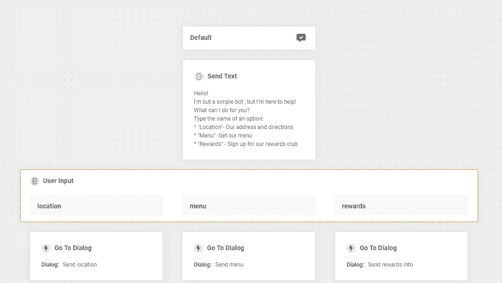

## 配置“发送位置”对话框

接下来，我们将制作我们的*发送位置*工作流。在这种情况下，我们知道用户来到这里是因为机器人认为他们想知道我们餐馆的地址。因此，我们只需要给他们指路，看看他们还需要什么。

**💡专业提示:如果你一次发送多条信息，信息之间至少要有两秒钟的延迟。这将使你的信息更有条理，提高 UX，并给用户一点时间来消化你发送的信息。**

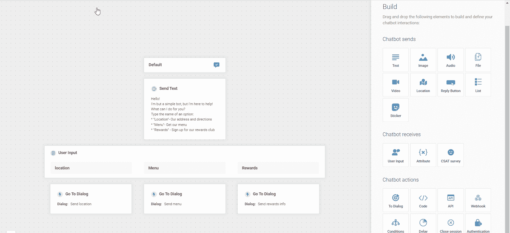

1.  点击左侧菜单中的*发送位置*对话框
2.  将**延迟**元素滑动到画布上*发送位置*的正下方，并将延迟时间更改为两秒。
3.  将**位置**元件滑动到**延迟**元件下方。
4.  在**位置地址中键入并选择一个地址，或者在**发送位置**构建面板的地图**字段中选择。这将发送给用户一个谷歌地图的位置。
5.  在*发送位置* 元素下添加另一个两秒**延迟**元素。
6.  在第二个**延迟**元素下面添加一个**文本**元素。
7.  在**消息 1** 框中输入消息，确认用户的地址。在我们的例子中，我们将使用:`We're on 35th Street! That's the Maps link.`
8.  将**滑动到**发送文本**元素下的对话框**元素。
9.  在构建面板的**转到**下拉菜单中选择*要求结束聊天*。

完成后的对话框应该类似于以下内容:

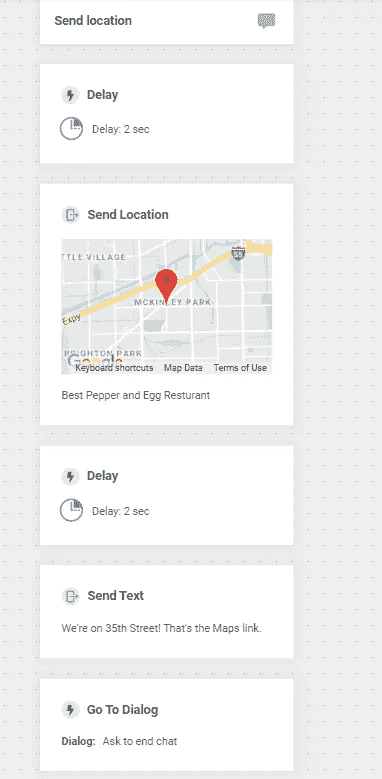

## 配置“发送菜单”对话框

既然我们已经完成了*发送位置*对话框，那么*发送菜单*对话框应该感觉类似。在这种情况下，我们将简单地发送一个指向菜单的链接，而不是一个位置。

完成后，完成的对话框应该如下所示:

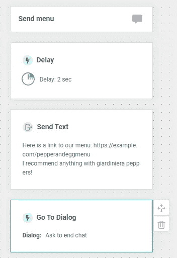

## 配置“发送奖励信息”对话框

从概念上来说，*发送奖励信息*对话框与*发送菜单*对话框是一样的，除了我们的聊天机器人会发送一个链接来帮助用户创建奖励账户。

完成后，完成的对话框应该如下所示:

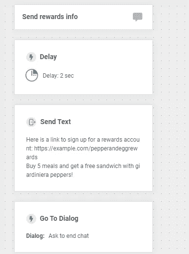

## 配置“要求结束聊天”对话框

记住对话式设计，*要求结束聊天*对话框是我们的聊天机器人给用户一些信息时的流程。现在该问他们是否还需要什么，如果不需要，就结束聊天。

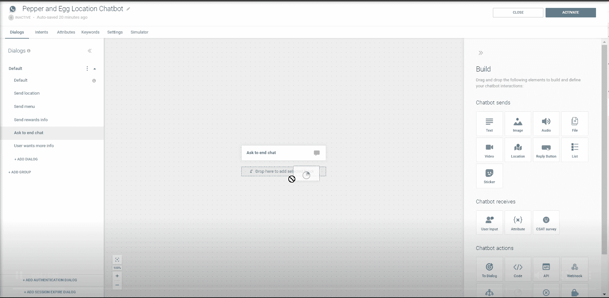

1.点击左侧菜单中的*询问结束聊天*对话框

2.在画布上的*请求结束聊天*元素下拖动一个**延迟**元素，并将延迟设置为两秒。

3.在**延迟**元素下拖动一个**文本**元素。

4.在**消息 1** 框中输入一条包含“菜单”链接的消息。在我们的例子中，我们将使用:

```
Is there anything else I can help you with?

1- Yes, I need some more information.
2- No, that's all.
```

5.将**用户输入**元素拖到**发送文本**元素下的画布上。

6.点击**用户输入**对话框，然后点击**+添加关键字映射**，选择 *1* 。然后再次点击**+添加关键字映射**，选择 *2。*

7.向下滚动到构建面板中的**回退动作**，并将下拉列表更改为*与代理*连接。如果我们的聊天机器人无法理解用户的输入，我们会将他们连接到一个人工代理。在**回退消息(可选)**文本框中键入一条消息，供机器人在进行传输之前发送。在我们的例子中，我们将使用:

```
Sorry, I’m having a little trouble.
Let me get you transferred to a human.
```

8.将**滑动到**用户输入** *1* 下的对话框**元素，并将**转到**下拉菜单设置为*用户想要更多信息*。

9.滑动**用户输入** *2* 下的**文本**元素，在**消息 1** 框中输入再见消息。对于我们的例子，我们将使用:`Thank you! Have a great day!`

10.将一个**关闭会话**元素滑动到您在上一步中创建的最后一个**文本**元素下。

完成后的对话框应该类似于以下内容:

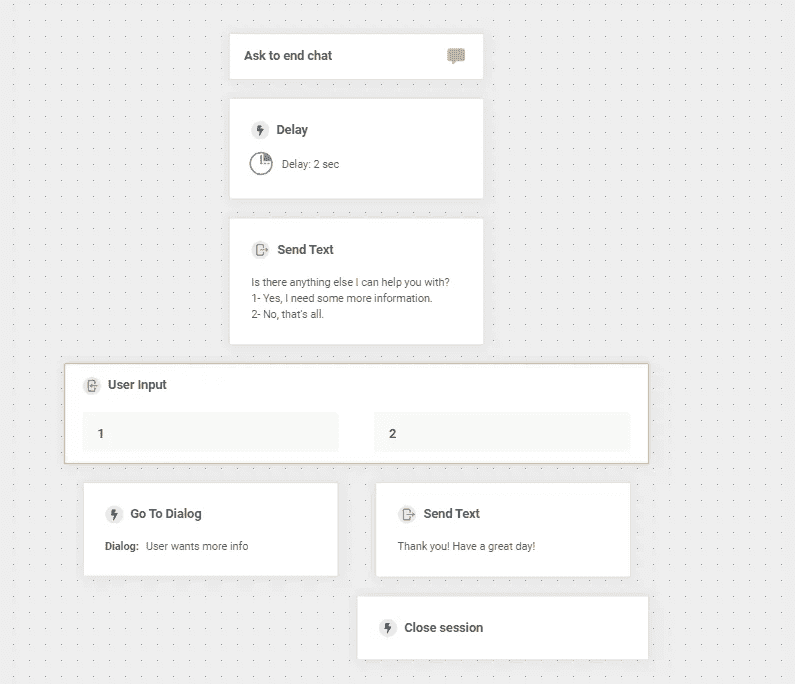

# 配置“用户需要更多信息”对话框

最后，我们需要配置*用户想要更多信息*对话框，以防用户有更多问题。这个对话框基本上与我们之前的默认对话框相同，只是稍微修改了问候语，所以我们不会重复所有的步骤。

💡专业提示:一旦你掌握了创建对话框的窍门，使用复制功能来节省时间。你可能会注意到*用户想要更多信息*对话框有效地实现了与我们的*默认*对话框相同的目的。我们也可以复制*默认*对话框并编辑它，而不是从头开始创建。

完成后的对话框应该类似于以下内容:

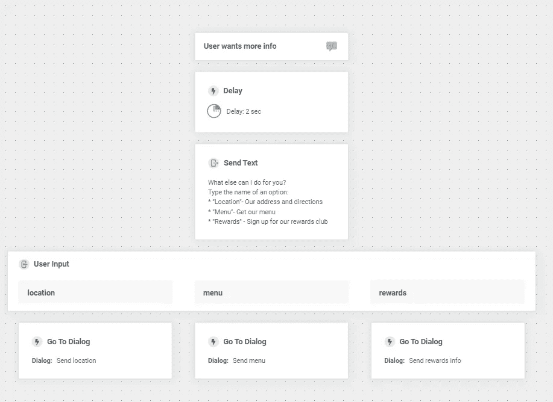

# 第七步:测试你的聊天机器人

现在我们已经配置了所有的对话框，我们可以使用 Infobip [模拟器](https://www.infobip.com/docs/answers/simulate-the-conversation)来测试我们的聊天机器人。

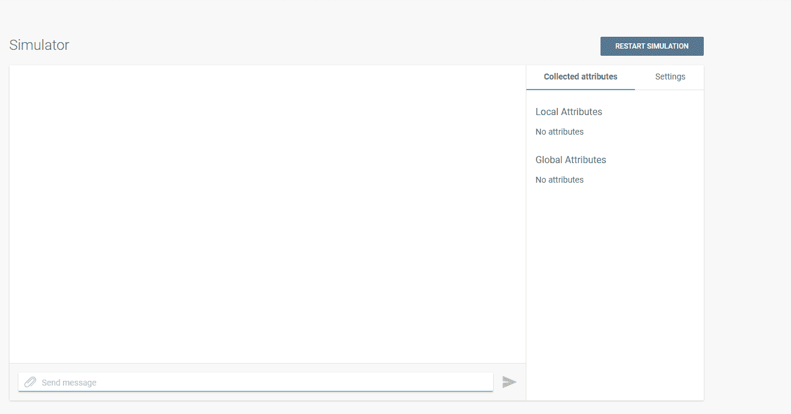

1.  点击**模拟器**选项卡。
2.  点击**开始模拟**按钮。
3.  在**发送消息**框中输入消息，看看你的机器人如何响应。
4.  根据测试结果调整你的聊天机器人。您可以使用模拟器中的按钮来帮助调试。例如，在下面的截图中，我们可以看到我们的**到对话框**的逻辑触发了**对话框开始**，它在**延迟**后打开，然后执行**发送文本**动作。
5.  一旦您对您的测试感到满意，继续下一部分来激活它。

# 步骤 8:激活您的自助客户支持聊天机器人

现在，您可以通过点击屏幕右上角的**激活**按钮来激活您的聊天机器人。

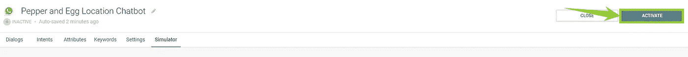

您的聊天机器人将被列在您位于 https://portal.infobip.com/bots/[的 Infobip 门户网站上。您可以通过 WhatsApp 向其发送信息，号码列在**号码/页码**栏。](https://portal.infobip.com/bots/)

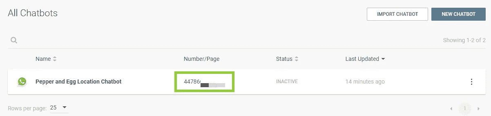

# 聊天机器人的下一步

现在你有一个聊天机器人可以处理基本的客户服务工作流程。然而，我们只是触及了你的聊天机器人潜力的表面。一旦你熟悉了基础知识，你就可以加入智能和更复杂的工作流程来加强你的客户服务工作。

以下是您接下来可以探讨的一些主题:

*   [**意图**](https://www.infobip.com/glossary/intent) :通过配置自定义意图，您可以帮助您的聊天机器人更好地了解您的客户想要什么，并提供更高质量的响应。
*   [**自然语言处理(NLP)**](https://www.infobip.com/glossary/nlp):Answers 平台支持 NLP，使你的聊天机器人能够做出“推论”，提高回复的质量，即使用户并不完全匹配某个关键词或同义词。
*   [**属性**](https://www.infobip.com/docs/answers/chatbot-structure) :我们在这里没有把我们的消息个性化，但是属性可以帮助你的聊天机器人更好地学习和理解你的用户，提高 UX。