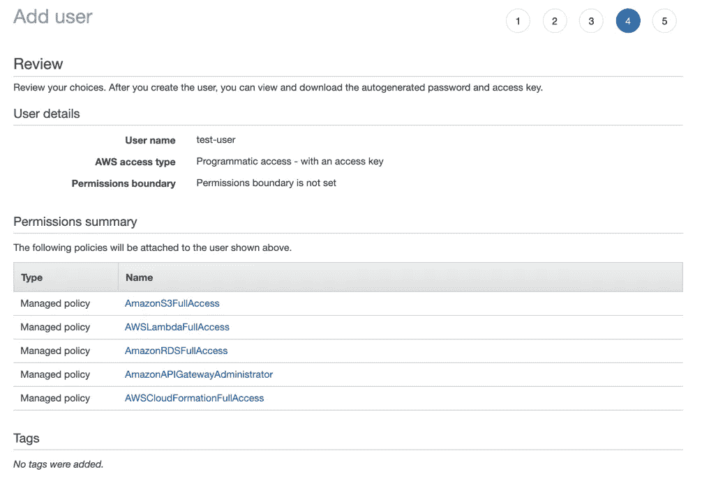
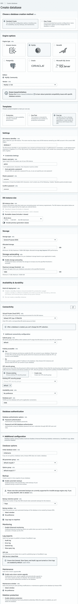
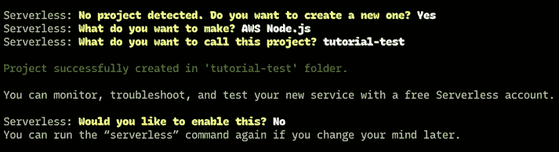

# 用 AWS Lambda、AWS API Gateway 和 MySQL 创建一个无服务器 API

> 原文：<https://levelup.gitconnected.com/create-a-serverless-api-with-aws-lambda-aws-api-gateway-and-mysql-3ef01bc78af1>

## **本文将指导您使用 MySQL 数据库在 AWS 中设置 API**

> 如果你想使用 PostgreSQL，可以看看这篇文章:[用 Node.js、AWS Lambda、API Gateway、RDS 和 PostgreSQL 部署无服务器 REST API。](https://medium.com/swlh/creating-a-serverless-rest-api-with-node-js-aws-lambda-api-gateway-rds-and-postgresql-303b0baac834)

因为我们使用 AWS，你需要确保你有一个 AWS 控制台的[账户。此外，检查您的本地节点和 npm 版本。您需要节点版本 6 或更高版本。](https://portal.aws.amazon.com/billing/signup?nc2=h_ct&src=header_signup&redirect_url=https%3A%2F%2Faws.amazon.com%2Fregistration-confirmation&language=de_de#/start)

# 创建权限

首先添加创建数据库条目和部署我们的功能的权限。

在您的 AWS 帐户中，请导航至**服务> IAM** 并选择**用户**。建议为此 API 系统创建一个新的 IAM 用户。

插入用户名(如无服务器)，并确保选择**“编程访问”**。在下一步中，从现有策略中选择并选择

*   AmazonS3FullAccess(用于存储压缩代码)
*   AWSLambdaFullAccess(用于执行 lambda 函数)
*   AmazonRDSFullAccess(用于访问数据库)
*   AmazonAPIGatewayAdministrator(用于通过 API 网关管理端点)
*   AWSCloudFormationFullAccess(用于部署和创建代码堆栈)

完成这个步骤，提交用户，不要忘记存储您的访问密钥 ID 和访问密码。



# 创建数据库

然后转到**服务> RDS** 并点击按钮**“创建数据库”**。对于这个简短的教程，在自由层模板中选择 MySQL。添加一个数据库标识符和一个带密码的主用户。接下来，选择最小的可用实例大小。如果您已经知道您将存储大量数据，那么您应该选择另一个选项。

现在，选择您的数据库公开可用。在这个主题中，我不会涉及 AWS 的安全组，如果您不想公开它，您将需要它。接下来，您应该展开**“附加配置”**部分。这就是我在第一次尝试中错过的。在这里，您可以为您的数据库取一个实际的名称，以便以后更容易连接到它。所有其他选项都可以保持默认值。然后，创建数据库。



现在，您可以将数据库工具(如 Sequel Pro)连接到数据库。

为了完成教程，创建一个名为“函数”的表，并添加一个字段“ID”和“name”。用虚拟内容填充它。

# 本地安装无服务器

*先决条件:您的机器*上已经安装了 Node ( > v6)和 npm

运行`npm install -g serverless`。

这会将无服务器 CLI 全局安装到您的计算机上。稍后，您将需要这些命令。导航到您的项目文件夹并运行`serverless`。该框架将指导您完成安装。对于无服务器，您还需要以前添加的 IAM 用户。CLI 会要求您添加凭据以自动部署无服务器应用程序。



接下来，将无服务器离线软件包安装到您的本地文件夹:`npm install serverless-offline`。这使得无需在每次更改后都部署到 AWS 就可以对 API 进行本地测试。

在新创建的文件夹中，您会看到一个文件 *serverless.yml* 。该工具在其中生成了代码，还有一些有用的注释。现在，您已经准备好设置一些路径。

通过添加您的 AWS 区域，开始更改您的 *serverless.yml* 。

> 在我的例子中，API 和 Lambda 函数应该在 eu-central-1(法兰克福)中运行。

此外，将以下内容添加到文件的末尾，以使脱机软件包实际可用:

```
plugins:
  - serverless-offline
```

# 添加端点和函数

您已经准备好创建您的端点和函数调用。首先，创建“函数”属性。之后添加一个端点。

模式如下:

```
functions:
  myTestFunction:
    handler: folder/javascript-file.myTestFunction
    events:
      - http:
          path: /path
          method: get
          cors: true
```

这意味着通过 HTTP 调用`/path`，GET 执行函数“`myTestFunction`”。该函数位于 *javascript-file.js* 中。

在您的 *javascript-file.js* 中声明函数为 async:

```
myTestFunction: async (event, context, callback) => { }
```

# 连接到数据库

下一步是准备 JavaScript，以便能够连接到数据库。创建一个 *db-config.js* ，并确保将其添加到*中。gitignore* 。只需将以下结构添加到该文件中:

```
module.exports = {
    database: 'databasename',
    host: 'hostname',
    port: 'portnumber',
    user: 'db-user',
    password: 'db-password',
};
```

运行`npm i serverless-mysql`在无服务器应用中启用 MySQL 调用。添加一个名为 *db-connect.js* 的新文件，并使用以下代码连接到数据库:

```
const dbConfig = require('./db-config');
const mysql = require('serverless-mysql')({
    config: dbConfig
});module.exports = mysql;
```

这将建立数据库连接。将其导入到创建的 *javascript-file.js* 中。在第一行粘贴中:

```
const db = require('../db_connect');
```

之后，您就可以执行类似于`db.query()`的 SQL 查询了。像这样的函数是异步的，必须等待。

# 调用数据库并返回值

回到您的`myTestFunction`，简单地添加一些类似如下的代码:

```
myTestFunction: async (event, context, callback) => {
    context.callbackWaitsForEmptyEventLoop = false; const functions = await db.query('SELECT * FROM functions'); await db.end(); if (functions) {
        callback(null, {
            statusCode: 200,
            headers: {
                'Access-Control-Allow-Origin': '*',
                'Access-Control-Allow-Credentials': true,
            },
            body: JSON.stringify(functions),
        })
    } else {
        callback('error', {
            statusCode: 400,
             headers: {
                'Access-Control-Allow-Origin': '*',
                'Access-Control-Allow-Credentials': true,
            },
            body: {
                message: 'No functions found.'
            },
        })
    }
},
```

这将从函数表中获取所有内容。如您所见，代码等待查询函数和数据库连接的结束。这确保了它获取了所有结果。然后，它检查结果是否不为 null 或 false，并返回回调。对于主体，它提供字符串化的结果。

> 由于从我的机器到 AWS 的 CORS，我必须将这些头添加到每个响应中。

# 部署应用程序

你快完成了。回到你的控制台，运行`serverless deploy`。如果您之前正确地为无服务器设置了 AWS 连接，它应该会为您完成剩下的所有工作。命令成功运行后，使用您选择的 REST-service 尝试您的 API。您应该会看到类似的响应，如下所示:

```
[
     {
          id: 1,
          name: "funnyFunctionName"
     }, {
          id: 2,
          name: "boringFunctionName"
     },]
```

# 恭喜你，你做到了！🥳