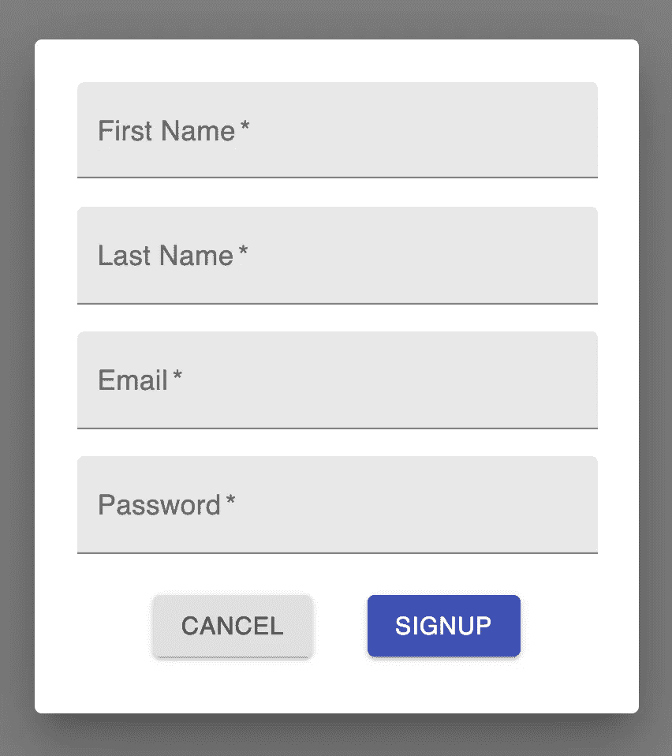
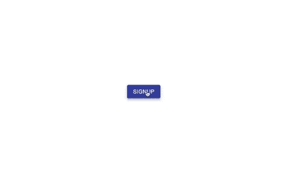

# 用 React 和 Material-UI 创建一个注册页面

> 原文：<https://levelup.gitconnected.com/create-a-signup-page-with-react-and-material-ui-9b203d18cf3f>

## 了解如何为您的下一个网站创建一个对话框和表单


由[奥斯汀·迪斯特尔](https://unsplash.com/@austindistel?utm_source=medium&utm_medium=referral)在 [Unsplash](https://unsplash.com?utm_source=medium&utm_medium=referral) 上拍摄的照片

表单是任何网站的重要组成部分。你在网站上看到的最流行的形式之一是注册页面。

在本文中，我们将使用 React 和 Material-UI 创建一个基本的注册页面。我们的应用程序将有一个按钮，它将打开一个显示表单的模态。这将是你可能在很多网站上看到的一种形式。它将有一个名字，姓氏，电子邮件和密码的输入，以及取消和提交按钮。

让我们直接开始吧！

# 入门指南

对于我们的例子，我们将使用一个`create-react-app`模板。在清理了一些不用的文件后，我们将剩下我们的`index.js` `App.js`和`index.css`文件。在 CSS 文件中，我将添加一些基本的样式，如下图所示，使我们的按钮居中。这只是我的偏好，让我们的应用程序更好一点。

```
.App {
  height: 100vh;
  display: flex;
  align-items: center;
  justify-content: center;
}
```

现在让我们开始吧。首先，在项目中安装 [Material-UI](https://material-ui.com/) 核心库。如果你不熟悉 Material-UI，它是遵循材质设计的最好的 React 组件库之一。

如果你刚刚开始使用 Material-UI，可以看看下面的文章。

[](https://medium.com/swlh/create-a-customized-color-theme-in-material-ui-7205163e541f) [## 在材质界面中创建自定义的颜色主题

### 为下一个 React 项目定制颜色主题很容易

medium.com](https://medium.com/swlh/create-a-customized-color-theme-in-material-ui-7205163e541f) 

在我们应用程序的第一步，我们将显示一个按钮。我们将使用 Material-UI 中的按钮组件，并呈现以下内容。这个按钮有一个`onClick`功能，可以打开我们将在下一步创建的对话框。

```
<div className="App">
  <Button variant="contained" color="primary" onClick={handleOpen}>
    Signup
  </Button>
</div>
```


我们的按钮看起来像这样

# 创建对话框

Material-UI 为我们提供了一个对话框组件。

> [对话框](https://material.io/design/components/dialogs.html)是一种模式窗口，出现在应用程序内容的前面，提供关键信息或要求做出决定。对话框出现时会禁用所有应用程序功能，并一直显示在屏幕上，直到确认、取消或采取了所需的操作。”

我们将用它来创建一个当我们点击按钮时出现的模态窗口。

首先，我们将在项目中创建一个新文件，并将其命名为`ModalDialog.js`。当我们点击按钮时，这个组件将弹出覆盖我们的屏幕。对话框组件将使用两个道具，`open`和`onClose`。

`open`变量和`handleClose`函数将作为道具从`App`组件传递下来。我们可以将这些设置为我们的`Dialog`组件上的道具。

在我们的`App.js`文件中，我们将声明一个状态变量`open`。该状态将控制对话框是否打开。我们还将创建两个函数来处理对话框的打开和关闭。

在我们的按钮下面，我们可以渲染`ModalDialog`组件并传递`open`和`handleClose`道具。

# 创建表单

接下来，我们将创建表单。让我们首先在我们的项目中创建一个名为`Form.js`的新文件。

这个组件将返回一个`form`，我们将使用 Material-UI 中的`TextField`和`Button`组件。

我们将从`ModalDialog`组件中传递`handleClose`属性，用于取消按钮。

在一个表单标签中，创建 4 个`TextField`组件和 2 个`Button`组件。文本字段将用于名字、姓氏、电子邮件和密码输入。这两个按钮将用于取消和注册。

在 Material-UI 的`TextField`组件中，传递以下道具。如果你不熟悉在 Material-UI 中使用文本字段组件，你可以在这里查看他们的文档。

```
<form className={classes.root}>
  <TextField label="First Name" variant="filled" required />
  <TextField label="Last Name" variant="filled" required />
  <TextField label="Email" variant="filled" type="email" required />
  <TextField label="Password" variant="filled" type="password" required />
</form>
```

Material-UI 中的`TextField`组件也可以像上面看到的那样使用类型属性，就像普通的 HTML 输入标签一样。我们在电子邮件输入中添加了一种电子邮件，在密码输入中添加了一种密码，以帮助验证。

接下来，我们将把这两个按钮添加到表单内部的一个`div`中。每个按钮都会有以下道具。

```
<div>
  <Button variant="contained">
    Cancel
  </Button>
  <Button type="submit" variant="contained" color="primary">
    Signup
  </Button>
</div>
```

最后，我们将使用 Material-UI 中的`makeStyles`函数为表单添加一些样式。

```
const useStyles = makeStyles(*theme* => ({
  root: {
    display: 'flex',
    flexDirection: 'column',
    justifyContent: 'center',
    alignItems: 'center',
    padding: theme.spacing(2),'& .MuiTextField-root': {
      margin: theme.spacing(1),
      width: '300px',
    },'& .MuiButtonBase-root': {
      margin: theme.spacing(2),
    },
  },
}));
```

当你点击这个按钮时，你应该会看到一个模态出现在我们的表单中，就像这样。



表单的用户界面

# 处理数据

UI 已经完成，但是我们的表单仍然没有任何功能。

为了处理数据，我们将为每个输入创建一个受控组件。这样，可以在 React 中处理数据。为此，我们将为每个输入值声明一个状态变量。我们可以使用 React 中的`useState`钩子来实现。

```
const [firstName, setFirstName] = useState('');
const [lastName, setLastName] = useState('');
const [email, setEmail] = useState('');
const [password, setPassword] = useState('');
```

然后，对于每个输入，我们将添加一个设置为状态变量的`value`属性，以及一个用于更新状态值的`onChange`监听器。

它看起来会像这样。

```
<TextField
  label="First Name"
  variant="filled"
  required
  value={firstName}
  onChange={*e* => setFirstName(e.target.value)}
/>
```

最后，我们将创建一个函数来处理表单提交。对于我们的示例，我们将只把这些数据记录到控制台。

```
const handleSubmit = *e* => {
  e.preventDefault();
  console.log(firstName, lastName, email, password);
  handleClose();
};
```

像任何表单一样，我们可以添加一个`onSubmit`事件处理程序。我们将传递刚刚创建的`handleSubmit`函数。因为我们的 submit 按钮有一个 submit 类型，点击 enter 按钮或单击 Submit 按钮将导致我们的表单提交数据并记录到控制台。在取消按钮上，我们可以添加一个调用`handleClose`函数的`onClick`道具。通过点击这个，它将关闭我们的模态。

最终的`Form.js`文件将如下所示。

现在我们已经创建了表单，让我们把它们放在一起。在我们的`ModalDialog.js`文件中，我们将导入我们创建的表单组件。让我们在对话框中显示这个表单。

# 包扎



如果您尝试几个例子，您还可以看到我们有一些客户端验证。记住，我们为每个输入添加了一个必需的属性。因此，如果我们将任何字段留空，我们将得到一个警告。此外，我们向我们的电子邮件输入添加了一个类型，所以它也检查电子邮件输入是否真的是一封电子邮件。

当我们提交表单时，我们将看到数据出现在控制台中。

感谢阅读！我希望这篇文章对你创建自己的注册表单有所帮助。

如果你想了解更多关于 Material-UI 和它是如何工作的，看看下面的文章。

[](https://medium.com/geekculture/what-really-happens-when-you-use-the-textfield-component-in-material-ui-1e62652196f) [## 在 Material-UI 中使用 TextField 组件时，实际会发生什么？

### 让我们更深入地调查一下

medium.com](https://medium.com/geekculture/what-really-happens-when-you-use-the-textfield-component-in-material-ui-1e62652196f)