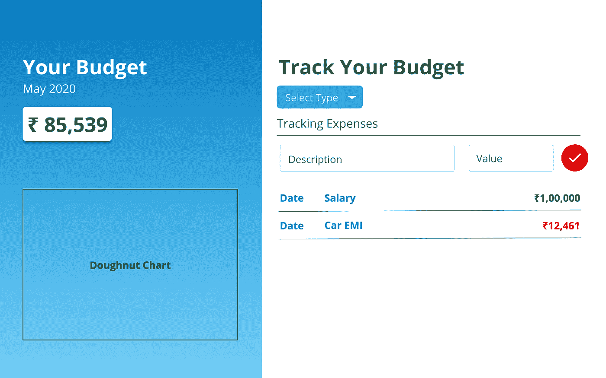
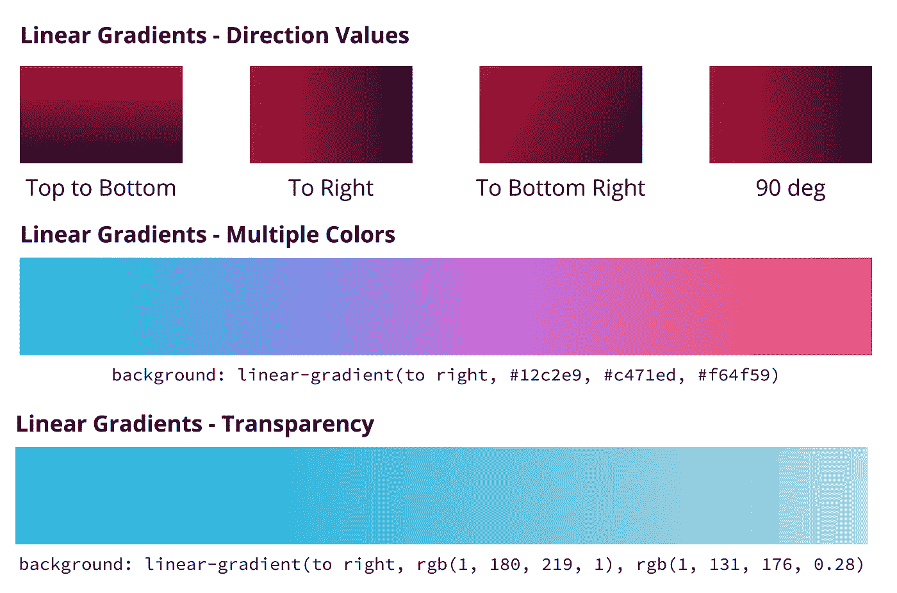
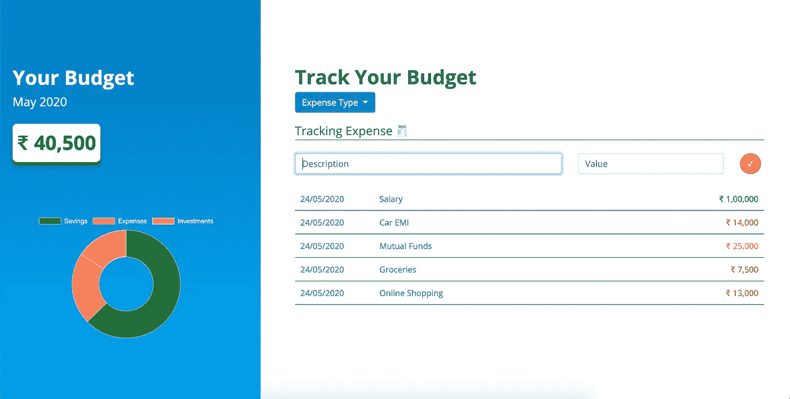

# 用 JavaScript 创建一个简单的费用管理器

> 原文：<https://levelup.gitconnected.com/create-a-simple-expense-manager-with-javascript-4e2cf2097fba>

构建费用管理器可能是最好的 JavaScript 入门项目之一。

除非你建立了自己的东西，否则你永远不会真正学会一门语言。

那么，我们开始吧。本文假设您对 HTML、CSS、Bootstrap 4 和 JavaScript 有基本的了解。如果你需要的话，可以在本文末尾找到一些有用的参考资料。

我们将在本教程中使用的所有代码都在 Github 上。我强烈建议您完成本教程，并在此之前使用最终代码作为参考。

## 介绍

见见约翰。约翰在全国最大的汽车修理连锁店之一当汽车修理工，收入颇丰。但他最终会把每月收入花在他无法记录的事情上。

约翰希望我们帮助他跟踪自己的财务状况，了解他最终将多少工资用于储蓄、投资和消费。

## 设计

我们需要做的第一件事是为我们的预算经理确定一个设计方案。我通常尝试创造我的设计，或者如果没有成功，去 [Dribbble](https://bit.ly/3geLhOe) 或 [Behance](https://bit.ly/2LOlMoI) 从各种设计中寻找灵感。我用 Figma 为我的项目创建设计，你可以在网上找到很多很棒的教程。

我总是从设计开始的原因是它使编写代码更简单。选择一个设计有助于你以一种结构化的方式来思考，从而导致更快的开发。



我们预算经理的设计。

## HTML

让我们从在项目文件夹中创建一个`index.html`开始。

按照这里的步骤[将 bootstrap 包含在您的项目中。为了让我们的设计看起来更好，我们使用了](https://getbootstrap.com/docs/4.0/getting-started/introduction/) [Open Sans](https://fonts.google.com/?query=open+sans) 字体。这是完全可选的。

现在我们的脚本已经准备好了，让我们开始分析我们的设计。首先，我们需要两个容器，左边的蓝色容器占屏幕的 40%,右边的容器占屏幕的其余部分。感谢上帝的自举网格！

让我们从蓝色的左边容器开始。

将下面块中的代码插入到您的`body`标签中。这将创建以下内容:

1.  一个叫做`left-container`的集装箱，里面装着`month-container`
2.  该容器将显示该月的`title`、`current month`和实际`budget`。`(Default : 0)`

哦，还有，请使用当地货币。机械师约翰想在这个例子中使用`Indian Rupee (INR)`。😃

太好了！现在让我们继续，约翰将添加他的储蓄或开支来创建一个列表。

该容器将包含一个标题、一个用于选择费用类型的下拉列表、几个用于 John 记录其费用的输入字段以及一个显示条目和日期的列表。在`left-container.`下面添加这段代码

这就是我们的 HTML！我们刚刚完成了预算经理所需的 3 份文件中的 1 份。干得漂亮。接下来，我们将赋予我们的 HTML 一些风格。看到上面`<head>`里我们进口的那个`style.css`了吗？让我们来设计一个简单而优雅的 HTML。

*Psst，友情提示:我看到你已经关注了 15-20 分钟了。喝杯水保持水分怎么样？*

## CSS

当我们使用 Bootstrap 时，大部分 CSS 的东西都会被我们处理掉。Bootstrap 处理大量的定位和设计工作，因此除了处理边距、字体大小、颜色、外观和感觉之外，实际上没有太多工作要做。

虽然 CSS 的一个有趣的属性是创建渐变背景，当你需要在你的项目中加入一些颜色时，它真的很方便。

检查一下`left-container`的 CSS，背景属性可以接受一个`liner-gradient`函数，该函数接受一个方向，以及你想要渐变使用的颜色。

```
background: linear-gradient(*direction*, *colour-1*, *colour-2, …*);
```

方向的默认值为`top-to-bottom`。



你可以设置一个方向，使用多种颜色，并使用 RGBA 自定义你需要的梯度！渐变灵感来自 [uiGradients](https://uigradients.com/)

有时候，线性梯度并不完全是你想要的。CSS 也允许一个`radial-gradient`，一个很好的参考可以在 [W3Schools](https://www.w3schools.com/cssref/func_radial-gradient.asp) 上找到。

好了，我们现在已经完成了费用管理器的大部分 HTML & CSS 部分。接下来，我们将设置我们的`app.js`来向我们的项目添加交互和功能！

## JS

JavaScript 是这个项目最重要的部分。HTML CSS 定义了我们的费用管理器的外观，但是现在我们需要在逻辑中工作。所有神奇的事情都发生在这里！

在我们开始之前，花点时间想想我们需要在`app.js`中添加什么功能。目前，当我们选择费用类型或添加描述和费用值并单击按钮时，什么都不会发生。是的，你猜对了，我们需要加上`eventListeners`。我们还需要显示当前月份。

我们将编写不同的函数，这些函数只负责处理 UI 和计算当月预算的逻辑。让我们称他们为`controllers`。

我们的项目将有 3 个控制器。

1.  **主控制器**:控制费用管理器的初始化和整体交互
2.  **用户界面控制器**:控制用户界面，如改变字体颜色、创建列表条目等。
3.  **费用控制器**:控制计算部分，取用户值，计算当月预算。

创建一个`app.js`文件，在关闭`body`标签之前，将脚本标签添加到`index.html`的底部。

```
<script src="app.js"></script>
```

在开始编写控制器之前，让我们回顾一下 JavaScript 函数的一个重要概念。

***立即调用函数表达式(life)***

函数是 JavaScript 中的函数，一旦被定义就运行。当您的脚本文件运行时，它们会被“立即调用”。因此，它们不需要另一个函数来调用它们。

ES6 之前:

```
(function(){
    console.log('Welcome, this is an IIFE!');
})();
```

ES6:

```
(() => {
    console.log('Welcome, this is an IIFE!')
})();
```

厉害！我们现在准备好为我们设计良好、外观华丽的费用管理器项目添加魔力了。

让我们直接开始为项目创建控制器。

*主控制器*将负责以下事项:

1.  项目的初始化
2.  设置点击监听器
3.  UI 和费用控制器之间的通信

*UI 控制器*将关注:

1.  添加列表项
2.  设置当前月份
3.  设置输入类型(费用、储蓄、投资)
4.  获取用户输入
5.  呈现圆环图

*费用控制员*将关注:

1.  计算储蓄、费用和投资的总额
2.  计算当月的总体总预算

创建如下所示的三个控制器。主控制器接受两个参数，UI 控制器和费用控制器。这将有助于主控制器控制它们之间的数据流。

`HTMLStrings`函数是一个跟踪 HTML 文件中使用的类名和元素 id 的对象。我这样做是因为它使得在项目中引用 HTML 元素变得容易，并且减少了为查找拼写错误而花费的潜在调试时间。

## 主控制器

现在，让我们设置`eventListeners`。列出需要 *click* 事件监听器的元素。*费用类型下拉菜单*选项和*提交*按钮。

此外，我们还将创建当 eventListener 被触发时将被调用的函数。

让我们更深入地研究一下每个函数。

`setupEventListeners`函数选择下拉元素和提交按钮，为它们添加一个点击监听器。当你点击它们时，这些监听器被激活。每个 click 监听器执行一个特定的任务，比如设置费用类型或指示其他两个控制器执行一些任务。

`addExpense`函数要求 UI 控制器从 HTML 获取输入，验证输入是否有效(不是`null`或`0`)，并要求 UI 控制器添加一个具有正确输入的新列表项。它还要求费用控制器根据新输入重新计算值。然后，它要求 UI 控制器更新该月的总费用。

您可能想知道，我们可以直接让 UI 和费用控制器相互对话，是的，我们可以，但这可能不是一个好的做法。除了主控制器之外，控制器应该保持相互独立。这使得开发人员更容易理解和调试流程。

太好了，主控制器到此为止。

## 用户界面控制器

UI 控制器是三个中最大的，因为它与 HTML 和 CSS 类一起为我们的项目提供正确的外观。

让我们来看看所有的功能:

1.  `numberFormat`:此功能有助于根据您的语言环境格式化您的数字输入。
2.  `showCurrentMonth`:一个简单的函数，从当前日期获取月份，显示当前月份。
3.  `setExpenseType`:这个函数适用于 CSS 类。根据费用的类型，它在 submit-expense 按钮中删除和添加正确的类。*红色*表示费用，*黄色*表示投资，*绿色*表示储蓄。
4.  `addListItem`:该函数根据费用类型为列表项创建 HTML，并为记录的费用插入新行。`insertAdjacentHTML`接收一个相对于其父节点的位置，以及要插入该位置的 HTML 文本。我们希望在插入新行，因此我们使用`beforeEnd`(在父元素的末尾之前)。关于`insertAdjacentHTML`的更多信息，请参见下面的参考资料部分。
5.  `updateOverallTotal`:此功能更新当月总预算。如果你这个月负债累累，文本会变成红色，否则你就在绿色区域！呜哇！

## 费用控制员

费用控制器有一个简单的任务。它维护四个值:*储蓄、投资、开支和每月总预算。*

就是这样！您已经完成了费用管理器的基本功能。现在，你应该能够在储蓄、投资和费用类型中记录多个条目，并且你的预算应该被相应地计算。干得好！

现在，该是我们的奖金部分了！

## 甜甜圈图！🍩

迈克尔总是准备好吃甜甜圈！🍩来源:[吉菲](https://media.giphy.com/media/tlGD7PDy1w8fK/giphy.gif)

有很多库可以帮助你创建漂亮的图表。库可以帮助您快速实现目标，并且总是比重新编写相同的功能更好的选择。

我们将使用 [Chart.js](https://www.chartjs.org/) 库，它对于设计者和开发者来说是一个简单而灵活的库。该库使用 HTML `<canvas>`元素来呈现您的图表。

插入一个新的`div`，它将把我们的图表固定在`left-container`的底部。

```
<div class="chart-container">
    <canvas id="expense-chart"></canvas>
</div>
```

每当有新记录插入到我们的费用管理器中时，我们需要链接我们的控制器来更新图表。

在主控制器的`addExpense`函数中，添加一个新的函数调用，它将指示 UI 控制器用新值更新图表。

```
UIController.displayChart(ExpenseController.getSavingsData(), ExpenseController.getExpensesData(),
    ExpenseController.getInvestmentData());
```

UI 控制器方法中的`displayChart`将创建一个新图表。我们需要传递图表的类型、数据(标签和数据集)以及一些选项，以防我们需要定制图表。

厉害！现在试着在系统中输入一些值，看看你漂亮的甜甜圈图！

这就是我们的费用管理器最终的样子。



最终输出！

该项目的完整代码可以在 [Github](https://github.com/joshvarun/expense-manager) 上找到。

谢谢你们坚持看完两部的结尾！我希望这篇文章对您的编程之旅有所帮助！

编码快乐！😃

# 资源

1.  [引导程序 4 备忘单](https://hackerthemes.com/bootstrap-cheatsheet/)
2.  [HTML5 备忘单](https://www.hostingreviewbox.com/wp-content/uploads/2016/02/html5-cheat-sheet-1.png)
3.  [CSS3 备忘单](https://cloud.netlifyusercontent.com/assets/344dbf88-fdf9-42bb-adb4-46f01eedd629/d7fb67af-5180-463d-b58a-bfd4a220d5d0/css3-cheat-sheet.pdf)
4.  [Figma YouTube 频道](https://bit.ly/2ZostWH)
5.  [自举网格](https://getbootstrap.com/docs/4.1/layout/grid/)
6.  [ui gradients——美丽的彩色渐变](https://uigradients.com/)
7.  [生活— MDN](https://developer.mozilla.org/en-US/docs/Glossary/IIFE)
8.  [JavaScript 箭头函数](https://developer.mozilla.org/en-US/docs/Web/JavaScript/Reference/Functions/Arrow_functions)
9.  [国际。数字格式](https://developer.mozilla.org/en-US/docs/Web/JavaScript/Reference/Global_Objects/Intl/NumberFormat)
10.  [element . insertadjacenthtml()](https://developer.mozilla.org/en-US/docs/Web/API/Element/insertAdjacentHTML)