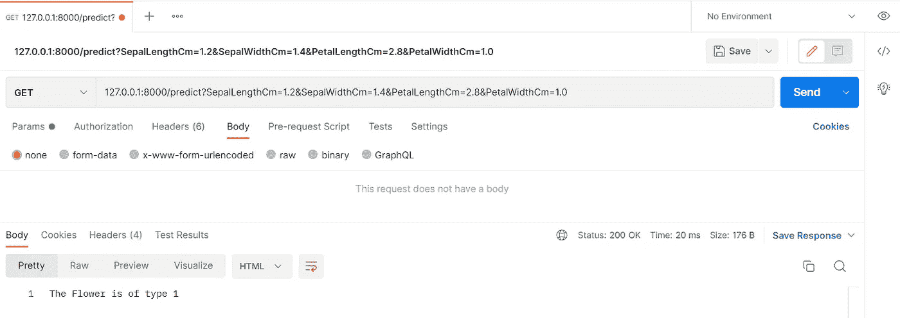
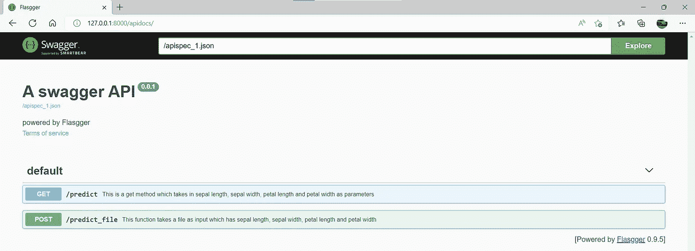
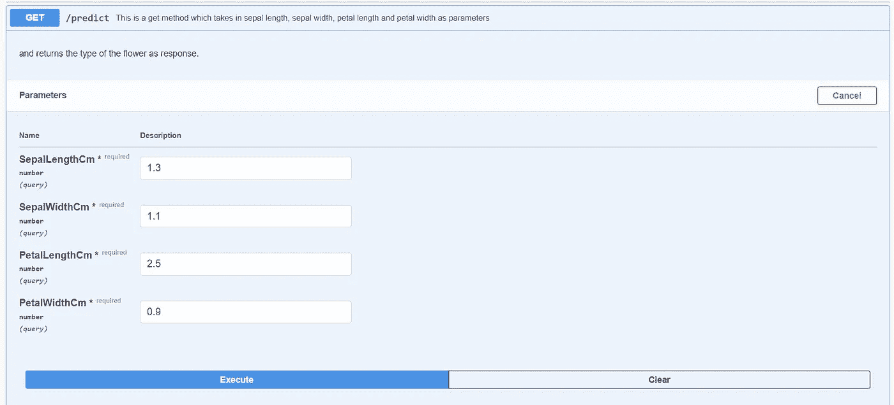
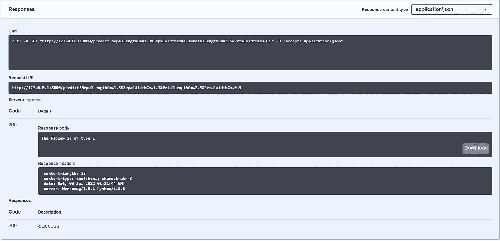

# 用 Flasgger 为你的机器学习应用创建一个简单的前端

> 原文：<https://levelup.gitconnected.com/create-a-simple-frontend-for-your-machine-learning-application-with-flasgger-7d20f15f3517>

假设您已经收集了数据，执行了特性工程，并为您的酷边项目建立了模型。当涉及到与您的朋友和社区共享模型时，您将模型公开为 API。如果没有清晰的文档和 UI，用户可能会对 API 的功能和参数感到困惑。我们可以使用[触发器](https://github.com/flasgger/flasgger)来解决这个具体问题。

在本文中，我们将创建 2 个机器学习 API，Flask 作为后端。然后我们将使用 Flasgger 来标准化 API 并与之交互。最后，我们将对设置进行 dockerize，并将其作为容器运行。在本文中，[虹膜数据集](https://www.kaggle.com/datasets/uciml/iris)已用于演示目的。

照片由[费伦茨·阿尔马西](https://unsplash.com/@flowforfrank?utm_source=medium&utm_medium=referral)在 [Unsplash](https://unsplash.com?utm_source=medium&utm_medium=referral) 拍摄

## **模型构建**

IRIS 数据集具有 Id、SepalLengthCm、SepalWidthCm、PetalLengthCm、PetalWidthCm 和 Species 作为特征。问题陈述是鉴别花是属于 Setosa，Virginica 还是 Versicolor 种。ID 列可以删除，因为它与问题无关。因为物种特征具有分类变量，所以我们执行标签编码来将它们转换成数字。

在这之后，我们执行通常的训练测试分割，并用分类器训练模型。在这种情况下，我使用了随机森林。训练完模型后，我们将它打包成一个 pickle 文件并保存。因为本文是对 Flasgger 的演示，所以我们不打算深入特性选择、模型选择和准确性的细节。你可以在这里找到完整的代码。

## **模型推断**

在我们训练好模型之后，下一步就是将它作为 API 公开。为此，我们用 2 个 API 创建了一个 Flask 应用程序。一个是 GET 方法，将特性作为参数，另一个是 POST 方法，将 CSV 文件作为输入。这些方法将处理数据，并将来自模型的推断作为响应返回。

到目前为止，我们的机器学习应用程序的逻辑不包含任何 UI。我们只需通过 Postman 发送请求，然后得到响应。这对于测试来说很好，但是我们不希望 ML 应用程序的用户继续使用 Postman 进行推理。无意冒犯邮差，我只是针对缺乏简单的 UI 提出一个观点。

按作者排序的图像—典型的 GET 请求

由于缺少一个简单的用户界面，我们在两条战线上失败了。第一个是当我们输入不可接受的值时没有提示。第二个问题是缺少可用 API 的文档。提示是一个很好的特性，可以在数据类型不匹配或缺少特定特性时警告我们。类似地，用户需要知道可用的 API 和每个 API 的功能，以便做出明智的请求。因此，正如在开始时提到的，我们将创建一个带有 Flasgger 的前端，并将其与我们的 flashpowered ML 应用程序相链接。

> 是一个 Flask 扩展，用于从 API 中注册的所有 Flask 视图中提取 OpenAPI 规范。Flasgger 还附带了嵌入的 SwaggerUI，这样您就可以访问[http://localhost:5000/API docs](http://localhost:5000/apidocs)，可视化您的 API 资源并与之交互。

尽管 Flasgger 有多种用途，但在本例中，我们将它用作 ML 应用程序的前端。Flasgger 有 3 个主要组件描述、参数和响应。

**描述**

顾名思义，这部分包含了 API 的描述。我们可以在这一节中包括一些细节，比如预期的输入参数和特定 API 的功能。

**参数**

此部分包含名称、输入、类型和必需的标签。该名称将是所用参数的名称。“In”可以是我们在 UI 中输入的查询，也可以是我们上传的文件 formData。“类型”标签可用于标准化参数的数据类型。可以是数字，文件等等。最后，我们有“required”标签，它表示是否必须为特定参数提供值。

**回应**

本节处理响应代码和我们希望与响应代码一起显示的描述。

只需两个简单的步骤就可以看到 UI 的运行。第一步是运行 Flask 应用程序。第二步是在浏览器中输入 127.0.0.1:8000/apidocs。8000 是我们在 Flask 应用程序中指定的端口号，apidocs 将把我们带到 swagger 部分。正如我们所看到的，Flasgger 提供了 Flask 应用程序中可用方法的相关信息及其描述。

作者提供的图片 Flasgger 概述

在 API 部分，每个参数都有“required”标志。如果该值未填充或输入了不可接受的数据类型，将会显示一个带有详细错误消息的提示。因为所有的参数在 UI 中都是现成的，所以我们不必担心在请求中给出错误的参数。

按作者分类的图像—用于输入推理数据的用户界面

在执行 GET 方法之后，我们到达响应部分。这里我们有请求的 URL、Curl、响应正文以及响应代码。我们将为我们的 POST 方法获得相同的 UI，在这里我们可以上传一个 CSV 文件用于批量预测。

作者提供的图像 Flasgger 的响应部分

## **让我们回顾一下**

> 我们有
> 
> 从 Kaggle 下载了虹膜数据集。
> 
> 执行特征工程和模型训练。
> 
> 将训练好的模型保存为 pickle 文件。
> 
> 创建了一个 Flask 应用程序，将我们的模型作为 API 公开
> 
> 与我们的 Flask 应用程序集成在一起。

## **让我们来整理一下**

恭喜你，现在你拥有了一个不止是机器学习的模型。现在是时候分享给你的朋友和同事了。您可以打包代码、依赖文件和数据文件，并创建 docker 映像。这个 docker 映像可以在任何机器上共享和运行，没有任何依赖性问题。

为了学习 docker 的安装和部署，你可以看看这个[惊人的资源](https://www.youtube.com/watch?v=hTacGMfL8lc&list=PLZoTAELRMXVNKtpy0U_Mx9N26w8n0hIbs)。创建 docker 映像的第一步是创建 docker 文件。这个文件包含了将我们的应用程序作为容器运行所需的所有信息。它包含有关基本映像、端口号和依赖关系的信息。安装完成后，您可以运行下面的命令来启动您的容器。

docker build -t 虹膜图像。

docker run-name iris _ container-p 8000:8000 iris _ image

## **结论**

Flasgger 可用于标准化机器学习 API，这有助于开发人员和最终用户保持一致。Flasgger 还通过将传入数据与底层模式进行比较来验证传入数据。此外，它还可以用作我们 ML 应用程序的简单前端。

## **资源**

1.  [Docker 教程 1-为什么和什么是 Docker，Docker 容器，机器学习中的虚拟化-YouTube](https://www.youtube.com/watch?v=hTacGMfL8lc&list=PLZoTAELRMXVNKtpy0U_Mx9N26w8n0hIbs)
2.  [(7079) Docker 初学者教程——什么是 Docker？容器介绍— YouTube](https://www.youtube.com/watch?v=17Bl31rlnRM&t=3s)

## **想要连接？**

如果你喜欢这篇文章，请在 Medium 上关注我，了解更多关于机器学习和计算机科学的故事。

linked In—[Prithivee Ramalingam | LinkedIn](https://www.linkedin.com/in/prithivee-ramalingam-032b42110/)

# 分级编码

感谢您成为我们社区的一员！更多内容请参见[升级编码出版物](https://levelup.gitconnected.com/)。
跟随:[推特](https://twitter.com/gitconnected)，[领英](https://www.linkedin.com/company/gitconnected)，[通迅](https://newsletter.levelup.dev/)
**升一级正在改造理工大招聘➡️** [**加入我们的人才集体**](https://jobs.levelup.dev/talent/welcome?referral=true)