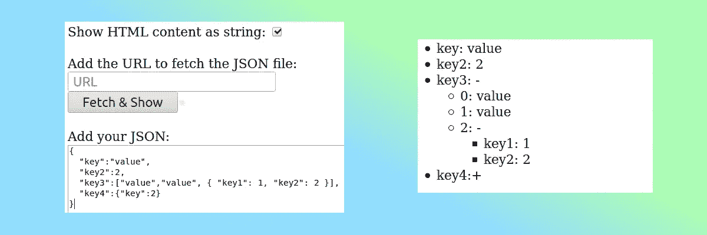

# 为您的 Web 应用程序创建一个简单的 JSON 浏览器

> 原文：<https://levelup.gitconnected.com/create-a-simple-json-viewer-for-your-web-application-222c2891ea60>

我需要向 web 应用程序的用户显示存储在数据库中的 JSON 文件的内容，所以我创建了这个简单的可视化工具，它可以扩展和收缩 JSON 文件的内容，还可以选择将 JSON 文件中的 HTML 内容显示为字符串还是 HTML。

因为它很小，所以我将所有代码都保存在 index.js 中:

然后我还创建了一个 HTML 文档来测试它(在第 47 和 49 行，你可以看到我正在调用 index.js 中的函数):