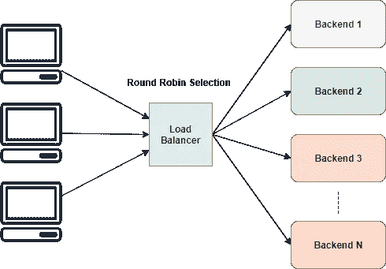
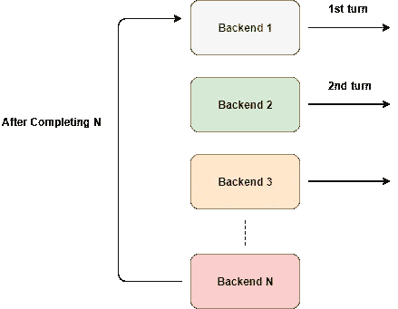
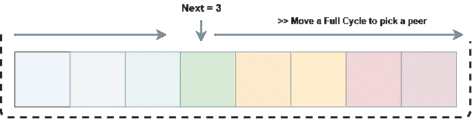

# 让我们用 Go 创建一个简单的负载平衡器

> 原文：<https://levelup.gitconnected.com/create-a-simple-load-balancer-with-go-4b474460bab2>


让我们用 Go 创建一个简单的负载平衡器

> 注:你也可以在这里阅读来自[的文章。](https://kasvith.github.io/posts/lets-create-a-simple-lb-go)

负载平衡器通过将负载分配给一组后端服务器，在 web 体系结构中起着关键作用。这使得服务更具可扩展性和可靠性。此外，由于配置了多个后端，该服务变得高度可用，因为负载平衡器可以在出现故障时修复正在工作的服务器。

在玩了像 [NGINX](https://www.nginx.com/) 这样的专业负载平衡器之后，我试着用 [Golang](https://golang.org/) 创建了一个简单的负载平衡器。

Go 是一种现代语言，作为一等公民支持并发。Go 有一个丰富的标准库，允许用更少的代码行编写高性能的应用程序。它还生成一个静态链接的单个二进制文件，以便于分发。

# 我们的简单负载平衡器是如何工作的

负载平衡器有不同的策略在一组后端之间分配负载。

举个例子，

*   **循环调度** —平均分配负载，假设所有后端具有相同的处理能力
*   **加权循环法** —考虑到后端的处理能力，可以给出额外的权重
*   **最少连接** —负载被分配给具有最少活动连接的服务器

对于我们简单的负载均衡器，我们将使用这些方法中最简单的一个来实现，**循环调度**。



循环负载平衡器

# 循环选择

循环赛很简单。它为工人轮流执行任务提供了平等的机会。



传入请求的循环选择

如图所示，这种情况循环发生。但是我们不能直接使用它，不是吗？

**如果后端宕机了怎么办？我们可能不想在那里安排交通。所以这个不能直接用，除非我们给它加上一些条件。我们需要**只将流量路由到已经启动并运行的后端**。**

# 让我们定义一些结构

修改计划后，我们知道现在我们需要一种方法来跟踪后端的所有细节。我们需要跟踪它是活的还是死的，还要跟踪 URL。

我们可以简单地定义一个这样的结构来保存我们的后端。

```
type Backend struct {
   URL          *url.URL
   Alive        bool
   mux          sync.RWMutex
   ReverseProxy *httputil.ReverseProxy
}
```

别担心，我会对`Backend`中的字段进行推理。

现在我们需要一种方法来跟踪负载平衡器中的所有后端，因为我们可以简单地使用一个片和一个计数器变量。我们可以定义为`**ServerPool**` **:**

```
// ServerPool holds information about reachable backends
type ServerPool struct {
   backends []*Backend
   current  uint64
}
```

# 反向 Proxy 的使用

正如我们已经指出的，负载平衡器的唯一目的是将流量路由到不同的后端，并将结果返回给原始客户端。

根据 Go 的文档:

> *ReverseProxy 是一个 HTTP 处理程序，它接收一个传入的请求并将其发送到另一个服务器，将响应代理回客户端。*

这正是我们想要的。没有必要重新发明轮子。我们可以简单地通过`ReverseProxy`传递我们最初的请求。

```
u, _ := url.Parse("http://localhost:8080")
rp := httputil.NewSingleHostReverseProxy(u)
*// initialize your server and add this as handler* http.HandlerFunc(rp.ServeHTTP)
```

使用`httputil.NewSingleHostReverseProxy(url)`,我们可以初始化一个反向代理，它将请求转发给被传递的`url`。在上面的例子中，所有的请求现在都被传递到 localhost:8080，结果被发送回原来的客户机。

如果我们看一下`ServeHTTP`方法签名，它具有与 HTTP 处理程序相同的签名，这就是为什么我们可以将它传递给`http`中的`HandlerFunc`。

您可以在[文档](https://golang.org/pkg/net/http/httputil/#ReverseProxy)中找到更多示例。

对于我们简单的负载平衡器，我们可以用`Backend`中相关联的`URL`来启动`ReverseProxy`，这样`ReverseProxy`就会将我们的请求路由到`URL`。

# 选拔过程

我们需要在下一次挑选时跳过死胡同。但是做任何事情我们都需要一种计数的方法。

多个客户端将连接到负载均衡器，当每个客户端请求下一个对等端传递流量时，可能会出现竞争情况。为了防止这种情况，我们可以用`mutex`锁定`ServerPool`。但是这可能有点过了，而且我们根本不想锁定服务器池。我们只想把计数器加 1

为了满足这一要求，理想的解决方案是以原子方式进行这一增量。Go 通过`atomic`包支持该井。

```
// NextIndex atomically increase the counter and return an index
func (s *ServerPool) NextIndex() int {
   return int(atomic.AddUint64(&s.current, uint64(1)) % uint64(len(s.backends)))
}
```

在这里，我们将当前值自动增加 1，并通过修改切片的长度来返回索引。这意味着该值将始终介于 0 和切片长度之间。最后，我们感兴趣的是特定的索引，而不是总计数。

# 挑选一个活的后端

我们已经知道，我们的请求在每个后端的循环中被路由。我们只需要跳过死的，就这样。

`GetNext()`总是返回一个限制在 0 和切片长度之间的值。在任何时候，我们都会得到下一个对等体，如果它不存在，我们将不得不在一个循环中搜索整个切片。



循环遍历切片

如上图所示，我们想从下到上遍历整个列表，只需遍历`next + length`即可。要选择一个索引，我们希望它位于切片长度之间。这很容易通过修改操作来完成。

在我们通过搜索找到一个工作的后端之后，我们将它标记为当前的后端。

下面你可以看到上面操作的代码:

获取下一个对等点

# 避免后端结构中的竞争情况

我们需要考虑一个严肃的问题。我们的`Backend`结构有一个可以被不同的 goroutines 同时修改或访问的变量。

我们知道会有更多的 goroutines 从这里读取而不是写入。所以我们选择了`RWMutex`来序列化对`Alive`的访问。

用互斥体保护数据

# 让负载平衡请求

有了我们创建的所有背景，我们可以制定以下简单的方法来负载平衡我们的请求。只有当我们的所有后端都离线时，它才会失败。

简单地分配负载

这个方法可以简单地作为一个`HandlerFunc`传递给 HTTP 服务器。

```
server := http.Server{
  Addr:    fmt.Sprintf(":%d", port),
  Handler: http.HandlerFunc(lb),
}
```

# 仅将流量路由到健康的后端

我们当前的`lb`有一个严重的问题。我们不知道后端是否健康。为了知道这一点，我们必须尝试一个后端，并检查它是否是活的。

我们可以用两种方式做到这一点，

*   **Active** :在执行当前请求时，我们发现所选后端没有响应，将其标记为 down。
*   **被动**:我们可以以固定的时间间隔 ping 后端并检查状态

# 主动检查健康的后端

`ReverseProxy`触发回调函数，`ErrorHandler`出现任何错误。我们可以用它来检测任何故障。下面是实现。

错误处理程序的实现

在这里，我们利用闭包的**功能来设计这个错误处理程序。它允许我们在方法中捕获外部变量，比如服务器 URL。它将检查现有的重试计数，如果它小于 3，我们再次发送相同的请求到相同的后端。**

这背后的原因是由于临时错误，服务器可能会拒绝您的请求，它可能会在短暂的延迟后可用(可能是服务器耗尽了套接字以接受更多的客户端)。因此，我们设置了一个计时器来延迟重试大约 10 毫秒。*我们会根据每个请求增加重试次数*。

在**每次重试失败**后，我们**将该后端标记为关闭**。

下一件我们想做的事情是尝试使用一个新的具有相同请求的后端。我们通过使用上下文包对尝试进行计数来做到这一点。在增加了尝试计数之后，我们将它传递回`lb`以选择一个新的对等点来处理请求。

现在我们不能无限期地这样做，因此我们需要从`lb`开始检查在进一步处理请求之前是否已经达到了最大尝试次数。

我们可以简单地从请求中获取尝试计数，如果它超过了最大计数，就删除请求。

最终负载平衡法

这种实现是递归的。

# 上下文的使用

`context`包允许你在一个 HTTP 请求中存储有用的数据。我们充分利用这一点来跟踪特定于请求的数据，如尝试次数和重试次数。

```
const (
  Attempts int = iota
  Retry
)
```

首先，我们需要为上下文指定键。建议使用不冲突的整数键，而不是字符串。Go 提供了`iota`关键字来增量实现常数，每个常数包含一个惟一的值。这是定义整数键的完美解决方案。

```
// GetAttemptsFromContext returns the attempts for request
func GetRetryFromContext(r *http.Request) int {
  if retry, ok := r.Context().Value(Retry).(int); ok {
    return retry
  }
  return 0
}
```

然后我们就可以像通常使用散列表一样获取值，如下所示。默认返回值可能取决于用例。

# 被动健康检查

被动健康检查允许恢复死的后端或识别它们。我们以固定的时间间隔 ping 后端以检查它们的状态。

要 ping，我们尝试建立一个 TCP 连接。如果后端有响应，我们将它标记为活动的。如果你愿意，这个方法可以被修改来调用一个特定的端点，比如`/status`。确保连接建立后立即关闭，以减少服务器的额外负载。否则，它将试图保持连接，最终会耗尽资源。

检查后端是否活动

现在我们可以迭代服务器并标记它们的状态，如下所示，

执行健康检查

为了定期运行，我们可以在 Go 中启动一个计时器。一旦创建了计时器，它就允许您使用通道监听事件。

在上面的代码片段中，`<-t.C` channel 将每 20 秒返回一个值。`select`允许检测该事件。`select`如果没有`default` case，等待至少一个 case 语句被执行。

最后，在单独的 goroutine 中运行这个程序。

# 结论

我们在这篇文章中讨论了很多东西。

*   循环选择
*   从标准库中反转 Proxy
*   互斥体
*   原子操作
*   关闭
*   复试
*   选择操作

我们可以做很多事情来改进我们的小型负载平衡器。

举个例子，

*   使用堆来挑选活动后端以减少搜索面
*   统计数据
*   实施加权循环/最少连接
*   添加对配置文件的支持

等等。

你可以在这里找到库[的源代码。](https://github.com/kasvith/simplelb/)

感谢您阅读这篇文章😄

*原载于 2019 年 11 月 8 日*[*https://kas vith . github . io*](https://kasvith.github.io/posts/lets-create-a-simple-lb-go/)*。*