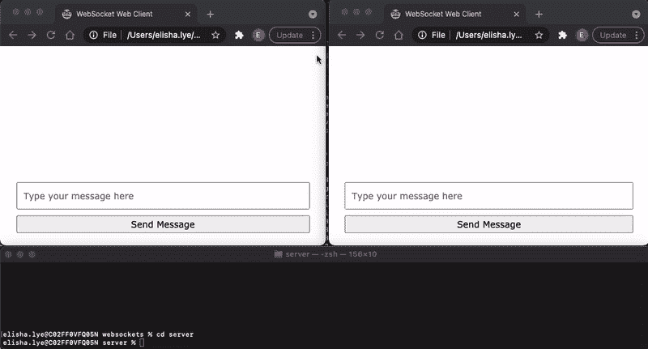

# 用 WebSocket 创建一个简单的本地 Web 聊天应用程序

> 原文：<https://levelup.gitconnected.com/create-a-simple-local-web-chat-application-with-websocket-f92130619ab7>

## 学习软件开发

## 使用 node.js 和 html5 中不到 50 行的脚本，创建一个简单的聊天应用程序


照片由[普里西拉·杜·普里兹](https://unsplash.com/@priscilladupreez?utm_source=medium&utm_medium=referral)在 [Unsplash](https://unsplash.com?utm_source=medium&utm_medium=referral) 上拍摄

这不是什么新鲜事，WebSocket。但只是为了自己的学习，在网上看了一些教程，只用 Node.js 和 HTML5 创建了下面这个简单的聊天。



你可以从下面得到代码。

[](https://github.com/elye/demo_nodejs_websocket) [## GitHub-elye/Demo _ nodejs _ websocket:带有 web socket 的 Demo Node.js 允许多个 web 客户端…

### 带有 websocket 的 Demo Node.js 允许多个 web 客户端进行通信

github.com](https://github.com/elye/demo_nodejs_websocket) 

## 运行它

在*服务器的*文件夹中运行并安装`npm install`，下载所有的包。

之后，只需运行`node index.js`来本地启动服务器(使用端口`localhost:8082`

> 要了解 Node.js 的所有信息，您可以查看下面的。

[](/setup-deployable-node-js-framework-58abdaab232f) [## 设置可部署的 Node.js 框架

### 了解除了学习 node.js 之外还需要什么

levelup.gitconnected.com](/setup-deployable-node-js-framework-58abdaab232f) 

然后作为客户端在两个不同的浏览器页面上启动*index.html*(在 *webclient* 文件夹中)。然后，您可以开始两个客户端之间的通信，如上面的演示所示。

# 后面的解释

[WebSocket](https://stackoverflow.blog/2019/12/18/websockets-for-fun-and-profit) 是 2008 年推出的新协议，允许两种通信方式(客户端到服务器和服务器到客户端)。默认情况下在 [HTML5](https://www.tutorialspoint.com/html5/html5_websocket.htm) 中支持。

让我们检查一下它是如何设置的。

## 在服务器上

这里我们用 node.js。

node.js 的【WebSocket 包很多，最常用的是 [ws](https://github.com/websockets/ws) 。只需使用`npm install ws`安装即可

在代码中只需使用

```
const WebSocket = require("ws");
const wss = new WebSocket.Server({ port: 8082 });
```

检查连接是否已经建立

```
wss.on("connection", ws => {
   // Do something with ws
}
```

请注意`ws`是个人客户端连接。

向除发送客户端之外的所有其他客户端发送消息

```
ws.onmessage = ({data}) => {
  wss.clients.forEach(function each(client) {
  if (client !== ws && client.readyState === WebSocket.OPEN) {
    client.send(`${data}`);
  }
});
```

我们还可以使用以下方法检测到特定客户端关闭了连接(即页面被关闭)

```
ws.onclose = function() {
  console.log(`Client ${ws.id} has disconnected!`);
};
```

## 在 web 客户端上

这里我们只用普通的 html5。

在脚本部分，为了谨慎起见，最好检查一下浏览器是否支持 WebSocker。如果它可用，那么我们可以实例化它。

```
if ("WebSocket" in window) { 
  let ws = new WebSocket("ws://localhost:8082");
  // Then only do something with ws
}
```

然后，我们可以检测它是否已连接

```
ws.onopen = function() {
  console.log("Connected to Server");
};
```

我们可以向服务器发送消息

```
ws.send(messageBox.value);
```

我们可以查看是否收到任何消息

```
ws.onmessage = function ({data}) {
  showMessage(`YOU: ${data}`);
};
```

而且我们可以检测到服务器已经关闭了连接

```
ws.onclose = function() {
   // Do something on close
};
```

就是这样。相对简单。

# 移动基准

如果您对 iOS 和 Android 客户端实现感兴趣，请参阅

[](https://medium.com/mobile-app-development-publication/making-simple-android-chat-app-6b44b11e7339) [## 打造简单的安卓聊天应用

### 使用 WebSocket 帮助制作一个聊天应用程序非常简单

medium.com](https://medium.com/mobile-app-development-publication/making-simple-android-chat-app-6b44b11e7339) [](https://medium.com/mobile-app-development-publication/simple-ios-chat-app-in-50-lines-of-code-66064ae50466) [## 简单的 iOS 聊天应用，50 行代码

### 完成我的收藏简单聊天跨 iOS，Android 和网络通过 WebSocket

medium.com](https://medium.com/mobile-app-development-publication/simple-ios-chat-app-in-50-lines-of-code-66064ae50466) 

# 参考

特别感谢以下参考资料

*   [https://www.youtube.com/watch?v=FduLSXEHLng&t = 60s](https://www.youtube.com/watch?v=FduLSXEHLng&t=60s)
*   [https://karlhadwen . media . com/node-js-web socket-tutorial-实时-聊天室-使用多个客户端-44a8e26a953e](https://karlhadwen.medium.com/node-js-websocket-tutorial-real-time-chat-room-using-multiple-clients-44a8e26a953e)
*   [https://stackoverflow . com/questions/13364243/WebSocket server-node-js-如何区分客户](https://stackoverflow.com/questions/13364243/websocketserver-node-js-how-to-differentiate-clients)
*   [https://media . com/@ nerdplusdog/web socket-同时-双向-客户端-服务器-通信-e7948203054b](https://medium.com/@nerdplusdog/websocket-simultaneous-bi-directional-client-server-communication-e7948203054b)