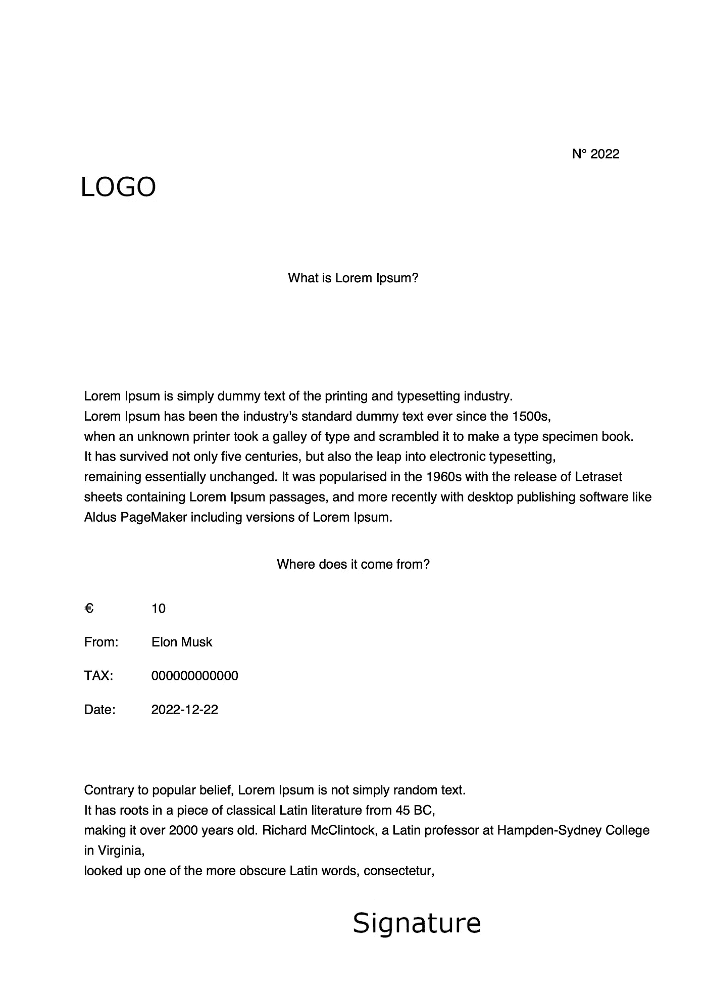

# 使用 python 创建简单的 pdf

> 原文：<https://levelup.gitconnected.com/create-a-simple-pdf-using-python-fa7a7664ad43>


图片由 [dlxmedia.hu](https://unsplash.com/@dlxmedia?utm_source=medium&utm_medium=referral) 在 [Unsplash](https://unsplash.com?utm_source=medium&utm_medium=referral) 上拍摄

在本文中，我们将看到如何创建一个包含**图像**和**文本**的 **pdf** 。

我用的 python 的库是[**ReportLab**](https://docs.reportlab.com)3 . 6 . 11。

我给出的例子包括具有固定文本的段落和用变量中的值构建的“动态”部分。

您可以定义段落、设定字体大小、对齐方式、颜色等等。

```
self.style_mid=ParagraphStyle('style_mid',
  backColor='',
  alignment=TA_LEFT,
  fontSize=11,
  borderColor='',
  borderWidth=0,
  borderPadding=(),
  leading=17,
)

self.mid_body = Paragraph('''
        Lorem Ipsum is simply dummy text of the printing and typesetting industry. <BR/>
        Lorem Ipsum has been the industry's standard dummy text ever since the 1500s, <BR/>
        when an unknown printer took a galley of type and scrambled it to make a type specimen book. <BR/>
        It has survived not only five centuries, but also the leap into electronic typesetting, <BR/>
        remaining essentially unchanged. It was popularised in the 1960s with the release of Letraset <BR/>
        sheets containing Lorem Ipsum passages, and more recently with desktop publishing software like <BR/>
        Aldus PageMaker including versions of Lorem Ipsum.
        ''', self.style_mid)
```

要定位在 pdf 中定义为段落的文本，您必须从工作表的左下角开始定义 pdf 中的段落大小以及 X 和 Y 位置。

```
#paragraph size
self.mid_body.wrapOn(c, 170*mm, 100*mm)
#position X & Y from the lower left corner of the sheet
self.mid_body.drawOn(c, 25*mm, 140*mm)
```

要写几个单词，您可以使用以下命令:

```
c.drawString(25*mm , 105*mm, 'From:')
```

定义 pdf 中的位置，然后定义您想要放置的文字。

您也可以使用此命令在 pdf 中添加图像:

```
c.drawImage('logo.jpg', 20 * mm, 220 * mm, height=104, width=89)
```

这是一个为自愿协会生成收据的示例:



作者图片

这是生成上述 PDF 的脚本。

如果你有任何问题或者你已经用其他方式解决了它们，不要犹豫，在评论中写下它们！

感谢阅读！

为了获得无限的故事，你也可以考虑只花 5 美元注册成为媒体会员。如果你用我的 [*链接*](https://pietrocolombo.medium.com/membership) *注册，我会收到一小笔佣金。*