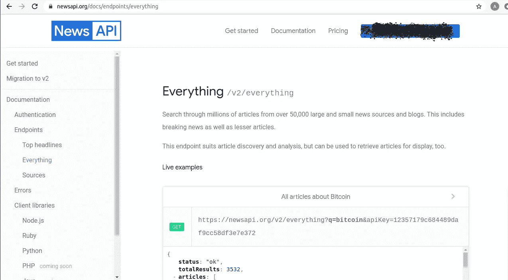

# 在 10 分钟内创建一个电报新闻机器人

> 原文：<https://levelup.gitconnected.com/create-a-telegram-news-bot-in-less-than-10-minutes-e558e3fd1db6>

## 一个使用电报机器人 API 的简单设置，由[NewsAPI.org](https://newsapi.org/)提供支持

由[克里斯蒂安·威迪格](https://unsplash.com/@christianw?utm_source=unsplash&utm_medium=referral&utm_content=creditCopyText)在 [Unsplash](https://unsplash.com/s/photos/telegram?utm_source=unsplash&utm_medium=referral&utm_content=creditCopyText) 上拍摄的照片

Telegram 是一种俄罗斯基于云的即时通讯、网络电话、视频电话软件服务。Telegram 客户端应用可在所有主要平台上使用，API 可供独立开发者使用。我们将在这里使用 Bot API。

# 用机器人父亲创建一个机器人

安装并打开**电报**并搜索**僵尸工具。**输入 **/newbot** 然后给它起个名字。你会得到一个令牌，暂时把它保存在一个安全的地方。

## Bot API 请求

您可以通过简单的 get 方法获取消息，只需确保使用 token 编写 bot。例如，如果您的令牌是**234563:37 FH h48 fhsnbahfe**，那么它将作为[**https://api.telegram.org/bot**](https://api.telegram.org/bot959342943:AAE20yYuip5BBY4p7HmpdlSJJ1mhUPswo3w/getupdates)**234563:37 FH h48 fhsnbahfe**[**/get updates**](https://api.telegram.org/bot959342943:AAE20yYuip5BBY4p7HmpdlSJJ1mhUPswo3w/getupdates)

最近的消息可以用带偏移量的更新 ID****234563:37 fhh 48 fhsnbahfe**[**/get updates**](https://api.telegram.org/bot959342943:AAE20yYuip5BBY4p7HmpdlSJJ1mhUPswo3w/getupdates)**？offset=UpdateID****

# **设置新闻 API**

**去[**https://NewsAPI.org**](https://NewsAPI.org)**那里创建一个账户。这是一项面向开发者的免费服务。****

****将生成一个密钥，该密钥可以在 URL 中或标头中发送。****

********

# ******现在编码部分******

****完整的代码可以在我的库[https://github.com/abhinav1321/news_bot_with_telegram](https://github.com/abhinav1321/news_bot_with_telegram)的 GitHub 上找到****

********

## ******代码******

****分享 GitHub 要点如下，或者你可以去这里【https://github.com/abhinav1321/news_bot_with_telegram ****

# ****让我们运行这个看看****

********

> ****感谢您阅读本文。我希望你觉得有用，并喜欢它。****

# ****再见！！！！祝你有美好的一天****