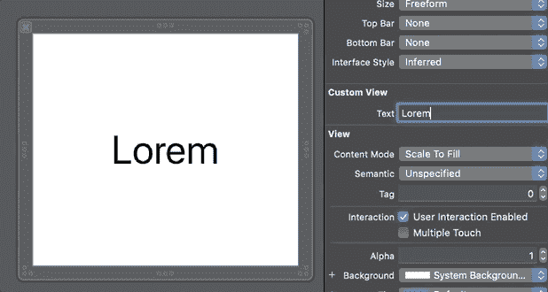

# 在 Swift 5 中创建具有动态字体大小的 UILabel

> 原文：<https://levelup.gitconnected.com/create-a-uilabel-with-dynamic-font-size-in-swift-5-f49ccc26dc5f>

## 调整字体大小以适合可用宽度

照片由 [Marcin Nowak](https://unsplash.com/@marcin?utm_source=medium&utm_medium=referral) 在 [Unsplash](https://unsplash.com?utm_source=medium&utm_medium=referral) 上拍摄

在这个简短的教程中，我们将学习如何轻松创建一个具有动态字体大小的`UILabel`。

源代码可以在文章的底部找到。

# 我们开始吧

让我们创建一个简单的`UIView`子类，中间包含一个`UILabel`:

我们将其标记为“`@IBDesinable`，以便在`.xib`文件中轻松调试。如果不熟悉，可以在我的[文章](https://medium.com/better-programming/what-are-ibdesignable-and-ibinspectable-in-swift-1e3440797d9)里快速了解一下。

为了使标签的字体大小动态，我们需要以下东西:

*   左右约束
*   将标签的`adjustsFontSizeToFitWidth`属性设置为`true`。

让我们先添加约束条件:

我们看到，我们将标签限制在左侧和右侧，偏移量为 10。

现在，让我们设置`adjustsFontSizeToFitWidth`属性(注意，我们还添加了`text`属性，以便于观察字体大小如何实时变化):

现在，如果我们测试实现，我们将看到 UILabel 调整到可用的宽度:

# 资源

从 GitHub 下载源代码:

 [## zafarivaev/DynamicFontSize

### 此时您不能执行该操作。您已使用另一个标签页或窗口登录。您已在另一个选项卡中注销，或者…

github.com](https://github.com/zafarivaev/DynamicFontSize) 

# 包扎

想了解更多关于 Swift 的信息吗？请随意查看我的其他相关文章:

*   [斯威夫特:使用粒子发射器创建一个美丽的恒星轨迹](https://medium.com/better-programming/swift-create-a-beautiful-star-trail-using-a-particle-emitter-6bafc5112e41)
*   [Swift 中有哪些物业观察员？](/what-are-property-observers-in-swift-4bda0945973)
*   [Swift 中的 In-Out 参数是什么？](/what-are-in-out-parameters-in-swift-f96c659fae2c)

感谢阅读！