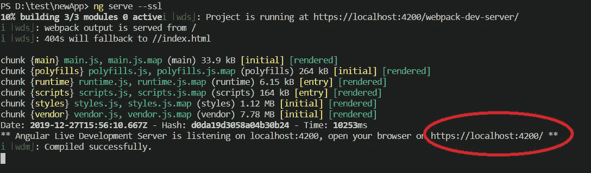
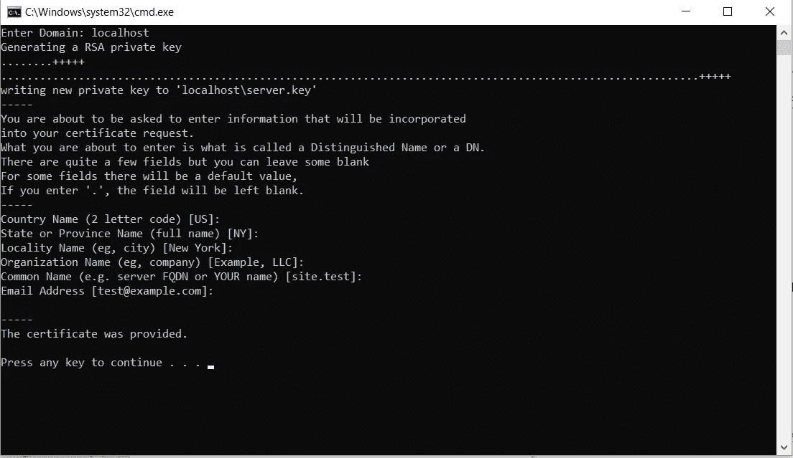
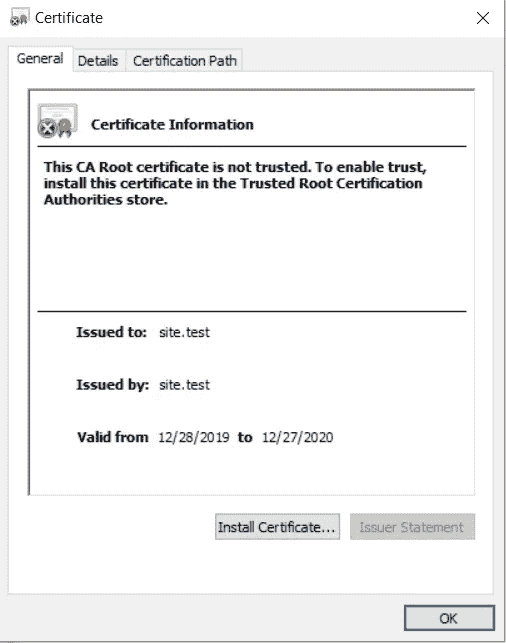
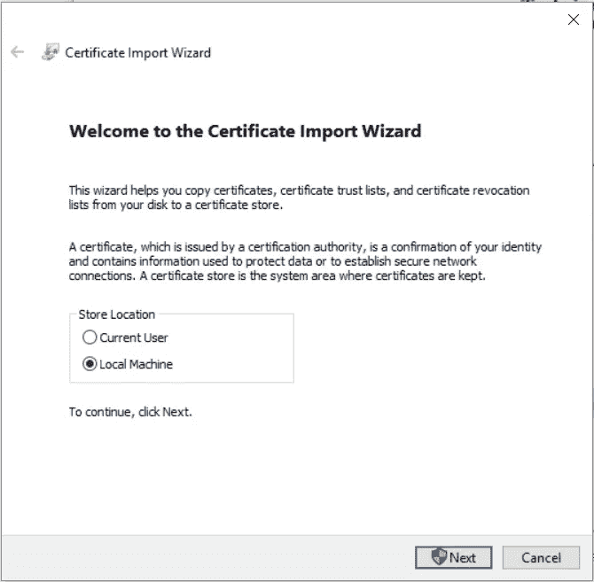
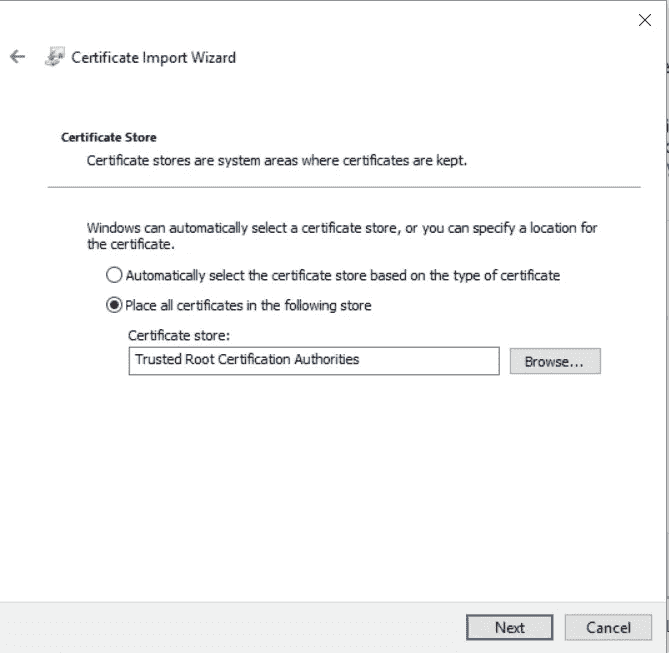
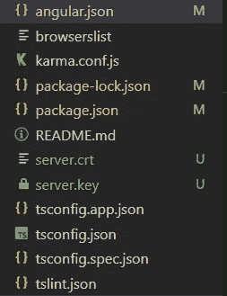
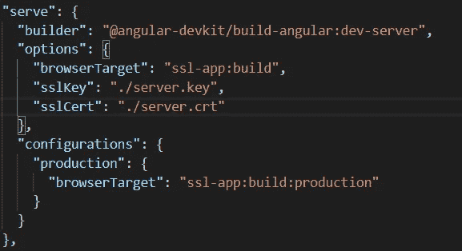
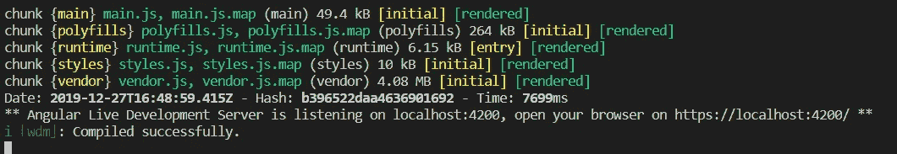
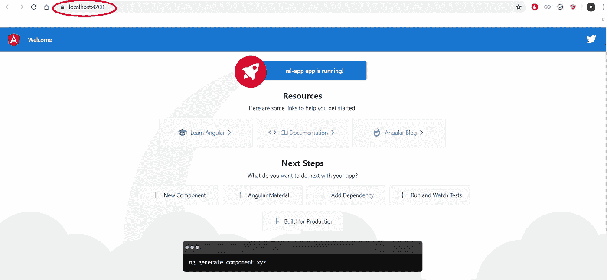

# 在本地主机中为 Angular 应用程序创建一个有效的 SSL

> 原文：<https://levelup.gitconnected.com/create-a-valid-ssl-in-localhost-for-angular-applications-ed05054ec2e7>

## 使用 https 在本地环境中服务您的 Angular 应用程序



https://本地主机:4200

几天前，我在本地环境中尝试处理 Angular 应用程序的脸书登录时发现了一个问题。脸书的一些方法不能再从 http 调用，需要 https。所以我试图通过在本地环境中创建一个有效的 SSL 来解决这个问题，以便应用程序可以使用 https。

下面是在本地机器上为 Angular 应用程序安装有效 SSL 的分步指南。确保你已经先安装了 [**XAMPP**](https://www.apachefriends.org/download.html) 。

# 创建一个新文件夹并添加这两个文件

首先，我们需要导航到`apache`文件夹，并在其中创建一个`cert`文件夹。这里是我的文件夹路径 **D:\xampp\apache\cert** 。接下来，我们需要添加这两个文件:

*   [cert.conf](https://gist.github.com/turtlepod/3b8d8d0eef29de019951aa9d9dcba546)
*   [make-cert.bat](https://gist.github.com/turtlepod/e94928cddbfc46cfbaf8c3e5856577d0)

在`cert.conf`文件中，我们需要使用我们想要使用的域来更改`{{DOMAIN}}`文本。在这种情况下，将其更改为 **localhost** 并保存。

# **运行 make-cert.bat**

双击`make-cert.bat`，出现提示时输入域名 **localhost** 。因为我们已经从`cert.conf`设置了默认值，所以只需输入其他问题。



运行 make-cert.bat

# 安装证书

我们将看到一个 **localhost** 文件夹被创建。在那个文件夹中，我们有两个文件— `server.crt`和`server.key`。双击`server.crt`进行安装。



安装 server.crt

点击安装证书并选择**本地机器**作为存储位置。



选择本地机器

选择“将所有证书放入以下存储”并浏览至**可信根证书颁发机构**。



然后，单击下一步并完成。

# 创建角度应用程序

使用以下命令创建一个新的角度应用程序:

```
ng new ssl-app
```

将 **server.crt** 和 **server.key** 文件放入应用程序中。



文件夹结构

更新我们的 **angular.json** 如下:



使用以下命令运行我们的 SSL 应用程序:

```
ng serve --ssl
```

这是结果。



# 结论

在本文中，我们学习了如何在 localhost 中使用 XAMPP 为 Angular 应用程序创建有效的 ssl。

如果你认为这篇文章是有帮助的，不要忘记与你的朋友分享。

# 资源

1.  [https://shellcreeper . com/how-to-create-valid-SSL-in-localhost-for-xampp/](https://shellcreeper.com/how-to-create-valid-ssl-in-localhost-for-xampp/)