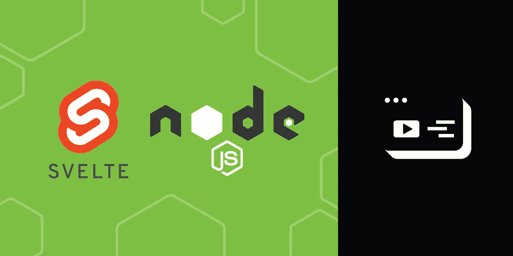

# 用 Node.js 和 Svelte 创建视频帮助聊天

> 原文：<https://levelup.gitconnected.com/create-a-video-help-chat-with-node-js-and-svelte-8bccf566751e>

像视频帮助聊天这样的网站用例是前端框架的一个很好的论据。也许网站的其余部分与视频聊天无关，或者也许您想在多个地方或多种配置下使用聊天。出于各种原因，这是您可能希望在组件中构建的那种东西。

在前端框架谱的较新一端，Svelte 可能是一个更容易接近的选择。如果你还没有致力于一个框架，那么以如此熟悉的方式开始使用 HTML、CSS 和 JavaScript 可能会更快。由于制作视频需要各种各样的片段，所以对于这个例子来说，学习更少是一个有用的特性。

# 先决条件

为了开始一个新的苗条项目，[建议](https://svelte.dev/blog/the-easiest-way-to-get-started)使用 [degit](https://github.com/Rich-Harris/degit) ，这是一个方便的工具，可以平稳地下载和解压缩应用程序模板。您可以使用`npx`启动一个新的苗条项目:

一旦有了副本，运行`npm install`来安装依赖项。

现在你可以导航到`video-help-chat`目录，你会看到一个新的苗条项目的脚手架。在进入代码本身之前，您需要一些东西来使视频聊天工作:

*   一个 [Vonage 视频 API 开发者账户](https://tokbox.com/account/#/)
*   快速管理视频会话
*   同时运行快速和苗条
*   Dotenv 以便您可以将您的凭证保存在一个`.env`文件中

如果你没有 Vonage 视频 API 账户，你需要先[注册试用](https://tokbox.com/account/user/signup)。创建视频服务器的工具都可以从 npm 安装:

# 苗条和快速，一起

并发允许你从你的`package.json`中的一个`script`一次执行多个命令。你可以用它来启动你的 Express 服务器，同时运行 Rollup 来重建 Svelte。因为在`scripts`中已经有了处理 Svelte 的命令，所以可以对 npm 脚本进行分层，添加一个运行现有脚本的新脚本:

# 设置您的凭据

立即为您的 API 密匙和秘密创建一个安全的家是一个很好的实践。创建一个`.env`文件来存储这些和任何其他敏感数据。在提交代码之前，确保将文件添加到`.gitignore`中，这样它就不会被意外签入。如果你以后宿主这段代码，你的宿主可能会有一个安全的方法让你在那里重新填充`.env`文件。

现在，你只需要`.env`中的两个属性:你的 Vonage 视频 API key 和 secret。两者都应该用引号括起来，没有空格:

# 计算机网络服务器

您的服务器将使用您提供的凭据来创建 Vonage 视频 API 客户端。

> Vonage 视频 API 以前被称为 OpenTok。这个名字仍然在一些代码中使用，我们将在这里继续使用它，这样代码看起来更像我们以前的教程。

首先导入 Express 并创建 Express 应用程序。然后你可以为`/chat`创建一条路线。您经常看到在 Express 服务器的顶部附近处理静态页面，但是在这里您将在最后处理它们。这是为了限制我们将多少责任交还给应用程序的瘦端，所以它不会试图处理我们的服务器端点。最后，您可以告诉服务器监听端口 5000。

`/chat`终点是有趣的事情发生的地方。该函数将返回在前端创建视频聊天所需的凭证。它还以一种非常基本的方式管理视频聊天会话，返回现有的会话，或者创建一个新的会话(如果没有的话)。

> 要开始将这个例子集成到一个真实的站点中，上面的`sessionId`变量是你的入口点。您总是可以从`/chat`端点创建一个新的会话，并将 id 添加到一个堆栈中，而不是单个变量。然后，负责回复视频聊天的团队可以访问这些会话 id 来加入等待的呼叫。

# 客户

您的模板应用程序应该在`/public/src`下包含一个填充的`App.svelte`文件。现在应该可以通过在您的终端上键入以下命令来运行和测试它:

如果你打开浏览器，进入“localhost:5000”，你应该会看到一个简洁的 hello world 页面。

当您打开`App.svelte`时，继续添加对我们接下来将创建的组件的引用。首先，导入组件，我们称之为`Chat.svelte`:

在页面底部的`<style>`标签上方，添加组件本身:

## 聊天组件

您正在运行的应用程序现在可能会有一些抱怨，所以赶紧将`Chat.svelte`文件添加到`/public/src`中。同时，你也可以添加`ChatButton.svelte`和`VideoChat.svelte`文件。

聊天组件只是聊天的一个容器，有两种状态。最初，用户会看到一个链接来启动聊天。一旦他们点击链接，他们将进入视频聊天本身。聊天组件管理两者之间的切换，这将被封装在它们自己的组件中。

如果你没有使用过很多细长的组件，这是一个很好的最小组件。你可以看到它只是 JavaScript、HTML 和 CSS。它看起来很像一个静态的 HTML 页面，只是没有内容和元信息:

因为它只是状态的容器，所以组件只有一个属性`collapsed`是有意义的。它导入另外两个组件，并使用标记中的条件结构确定显示哪个组件。最后，有些 CSS 把容器贴在右下角。如果聊天是打开的，一个条件 CSS 类将拉伸容器。

## 聊天按钮功能

ChatButton 组件的大部分是装饰性的 CSS，使它看起来像一个小的语音气球。然而，这也是 Svelte 如何处理事件和组件间通信的一个例子。

该组件只导出一个属性`showButton`。这不是在组件中使用，而是在它的父组件中使用。它被绑定到聊天标记中聊天组件的`collapsed`属性:

当点击按钮时，调用`openChat`函数，将`showButton`的值翻转为 false，从而将父节点中的`collapsed`设置为 false。这将打开聊天界面。

## 视频聊天

我们把好东西(当然是 JavaScript)留到了最后。视频聊天组件中没有多少 HTML 和 CSS。有发布者和订阅者的占位符(您和您聊天的人的视图)，还有容器的更多语音气球样式。剩下的就是 JS 了。

要创建视频聊天，您需要做几件事:

*   从服务器获取会话(新创建的或正在进行的，客户端不关心)
*   初始化它
*   收听要创建的流，然后订阅它
*   倾听会话被断开
*   初始化发布(发送视频和音频)
*   连接到会话并向其发布

大部分工作将发生在一个名为`initSession`的函数中，一旦客户机成功地从服务器获得一个会话，就会调用这个函数。去掉了`initSession`的肉，组件并不太复杂。它使用`fetch`来获取会话，并定义一个错误处理程序。然后，它为视频聊天定义标记占位符，并使用 CSS 对其进行布局:

`initSession`的内容多为回调。首先为`streamCreated`创建一个监听器，并在其中定义一个选项对象，用它来调用`session.subscribe()`。您还可以为`sessionDisconnected`创建一个监听器。目前，这个组件不会向其父组件提供反馈，但是如果它在聊天结束时发出信号，将会更加健壮。`sessionDisconnected`处理程序将是一个实现这一点的地方。

您可以创建看起来像您的`subscriberOptions`一样的`publisherOptions`，并指示视频元素应该以 100%的高度和宽度附加到其容器中。然后，您可以初始化发布者。

最后，准备好您的发布者，用`session.connect()`连接到会话。成功连接后，您可以使用`session.publish()`开始发布。

# 尝试一下

如果您的服务器一直在运行，您应该能够在打开的浏览器选项卡中看到部分或全部代码。不过，您可能需要重启服务器。在您的终端中，按 Ctrl+C 关闭程序，然后使用`npm run serve`再次启动 Express 和 Svelte。

在浏览器中打开或返回`localhost:5000`。尝试聊天的最简单方法是打开另一个浏览器，然后进入`localhost:5000`。这不是很复杂，但是你听到的回声应该可以让你确认聊天正在进行。

# 后续步骤

现在你有了一个基本的聊天，你可以用 [Vonage 视频 API](https://tokbox.com/developer/) 做更多的事情。或者，您可以选择暂时保留这些功能，并对服务器提供会话的方式进行一些更改，以便用户可以从这个界面“提问”,内部用户可以从另一个界面“回答”。

他们出色的教程[展示了你可以做的更多事情。如果你想在聊天中加入更多功能，比如收集用户的姓名或电子邮件，这些工具会非常方便。](https://svelte.dev/tutorial)

*原载于*[*https://learn . vonage . com/blog/2020/12/16/create-a-video-help-chat-with-node-js-and-svelte*](https://learn.vonage.com/blog/2020/12/16/create-a-video-help-chat-with-node-js-and-svelte)