# 使用 Node.js 创建一个 Web 服务器来服务简单的 HTML

> 原文：<https://levelup.gitconnected.com/create-a-web-server-node-js-to-serve-simple-html-5d064133fcce>

## 通过从头开始构建一个 web 服务器来理解它是如何工作的。

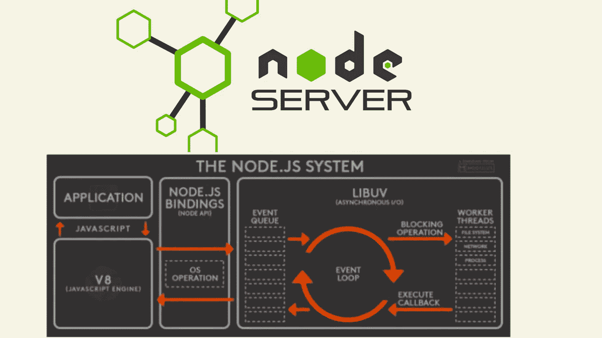

来源:[https://level up . git connected . com/introduction-to-nodejs-fb9 a6f 540 be 9](/introduction-to-nodejs-fb9a6f540be9)

Node.js 是什么？

*   Node.js 是一个开源的 web 服务器环境
*   它可以在浏览器之外运行 JavaScript。

在这篇文章中，让我们使用 Node.js 编写一个 web 服务器来服务简单的 HTML 文件。

## 要求:安装 Node.js

推荐 LTS 版本。

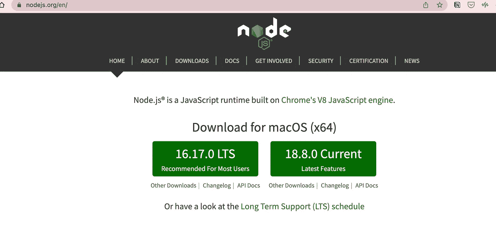

# 方法 1:使用内置的“http”模块创建服务器

## 步骤 1:创建要服务的 index.html

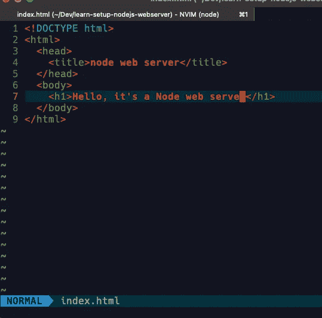

## 步骤 2:使用 http 模块编写服务器代码

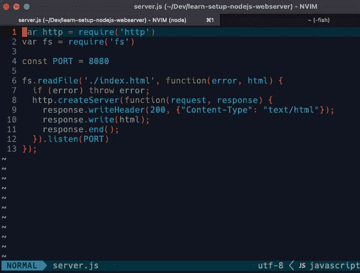

## 步骤 3:运行服务器

```
$ node server.js
```

然后您的`index.html`页面将在 URL:[http://localhost:8080](http://localhost:8080/)上可用

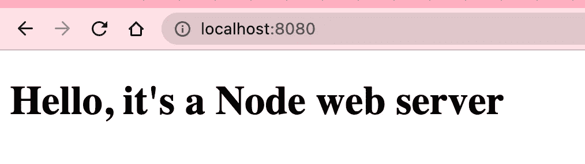

我们的节点服务器可以根据不同的 HTTP 请求提供不同的 HTML 内容。所以我们可以这样写我们的服务器:

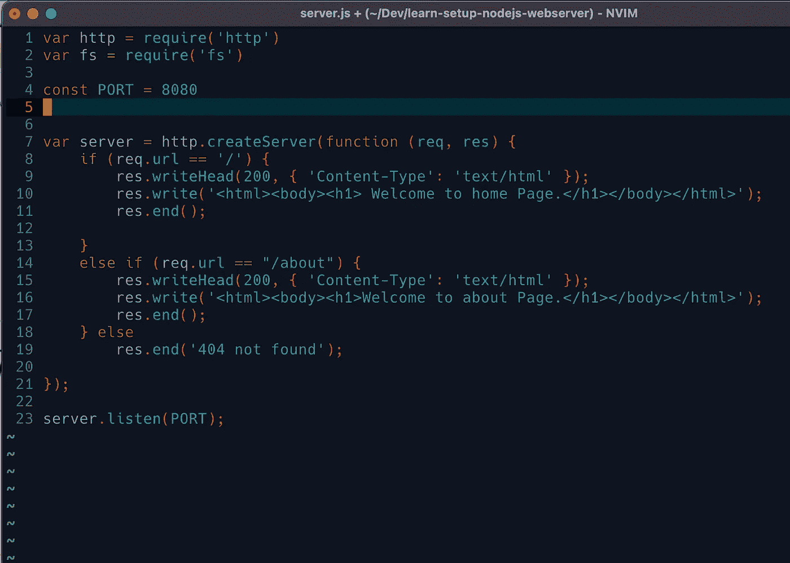

结果如下:


本地主机:8080/


本地主机:8080/关于

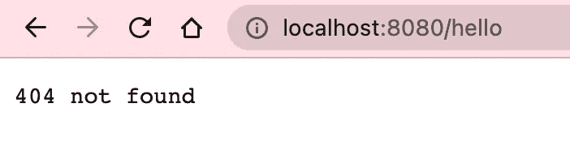

未处理的 http 请求

# 方法 2:使用现有的服务器(http-server)

## 第一步:安装`http-server`

```
$ sudo npm install http-server$ cd node_modules/
```

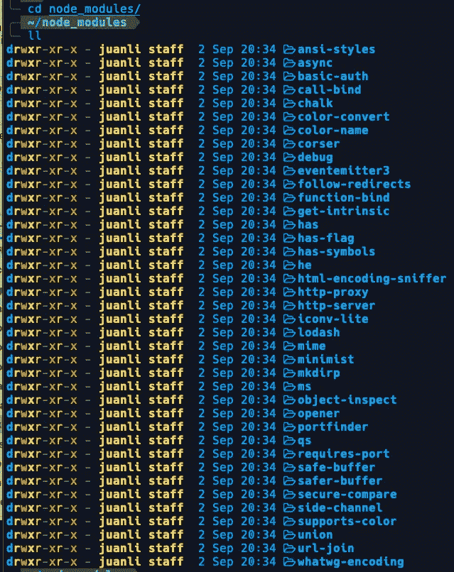

$ CD http-服务器

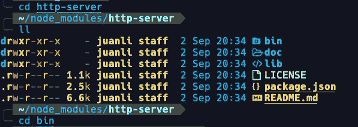

## 步骤 2:在目录:`node_modules/http-server/bin`下创建一个 HTML 文件

```
$ cd bin
$ vim index.html 
```

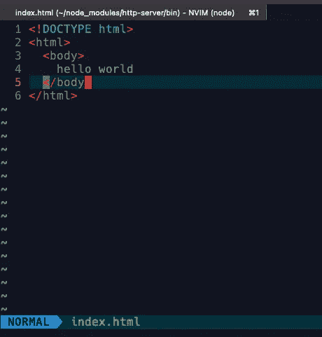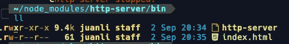

## 步骤 3:运行服务器

```
$ node http-server . /* run server in current directory*/
```

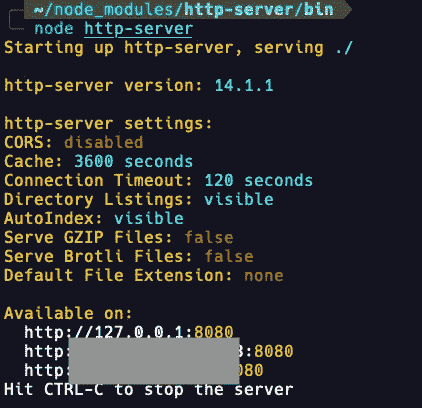

你可以通过以上三个地址访问 HTML 文件。例如:

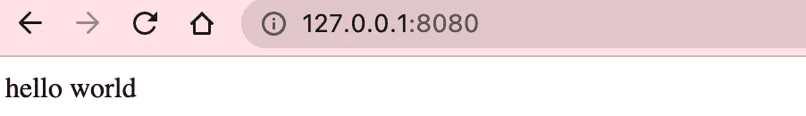

此外，您的计算机名作为主机名。就我而言:

```
$ hostname
```

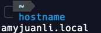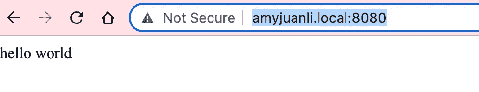

# 摘要

除了 html 文件，节点 web 服务器还可以提供 JavaScript 代码。