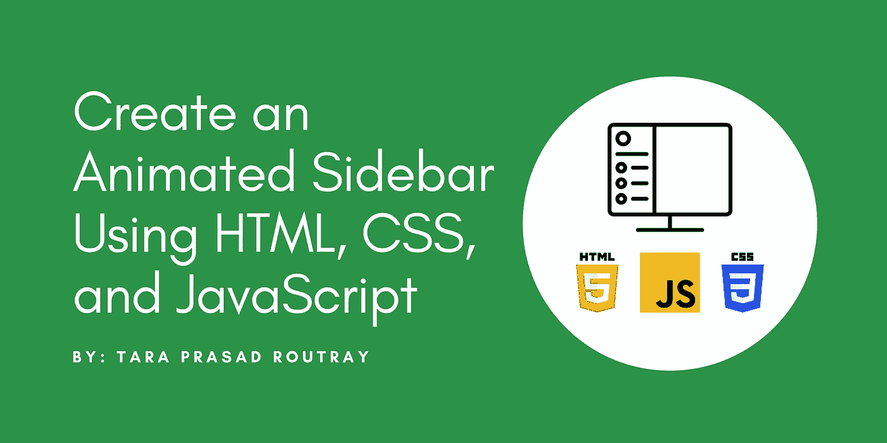
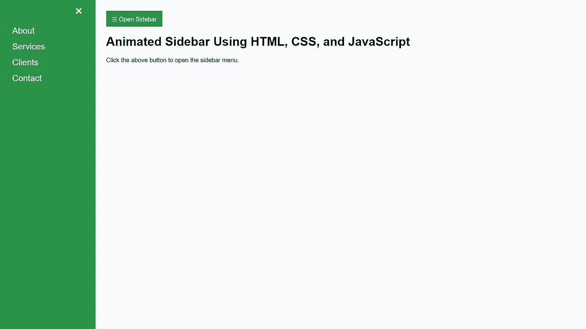

# 使用 HTML、CSS 和 JavaScript 创建动画侧边栏

> 原文：<https://levelup.gitconnected.com/create-an-animated-sidebar-using-html-css-and-javascript-758a7070a9da>

## 学习使用 web 技术从零开始构建带有切换功能的自定义侧边栏。



在本文中，我将一步一步地为您介绍如何为您的 web 应用程序实现平滑的动画侧边栏。默认情况下，侧边栏是可见的，您可以使用按钮切换它，并折叠或展开右视图部分。

# 创建自定义侧栏的 3 个步骤

1.  为侧栏添加 HTML
2.  为侧边栏添加 CSS 样式
3.  添加 JavaScript 来展开或折叠侧边栏

# 步骤 1:为侧边栏添加 HTML

在您喜欢的文本编辑器中打开您的项目，并将下面的代码片段添加到`body`元素中。请注意，在下面的代码片段中有两个 HTML 块。一个有名为`mySidebar`的 ID，另一个有名为`main`的 ID。侧边栏的内容将驻留在 ID 为`mySidebar`的元素中。然而，ID 为`main`的元素将存储显示在视图页面右侧的内容。

# 步骤 2:为侧边栏添加 CSS 样式

现在，向应用程序添加一个 CSS 样式表，它将向侧边栏添加视觉效果或动画。创建一个名为`sidebar.css`的文件，并根据您的项目结构将其放在一个目录中，并将其链接到您的应用程序的`head`部分。

```
<link rel="stylesheet" href="sidebar.css">
```

将下面的代码片段添加到`sidebar.css`文件中，并保存它。

# 步骤 3:添加 JavaScript 来展开或折叠侧边栏

现在，向应用程序添加一个 JavaScript 文件，该文件将使该特性能够显示或隐藏侧边栏。创建一个名为`sidebar.js`的文件，并根据您的项目结构将其放在一个目录中，并将其链接到您的应用程序的`head`部分。

```
<script src="sidebar.js"></script>
```

将下面的代码片段添加到`sidebar.js`文件中，并保存它。

# 结果



太棒了。您已经完成了如何使用 web 技术构建自定义可折叠侧栏的学习。继续创建令人惊叹的侧边栏，根据您的需要定制它们，并在评论部分发布截图。

> 如果你喜欢阅读这篇文章，并发现它对你有用，那么请鼓掌，与你的朋友分享，并关注我以获得我即将发布的文章的更新。你可以在 [LinkedIn](https://www.linkedin.com/in/tararoutray/) 上联系我。